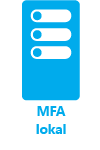
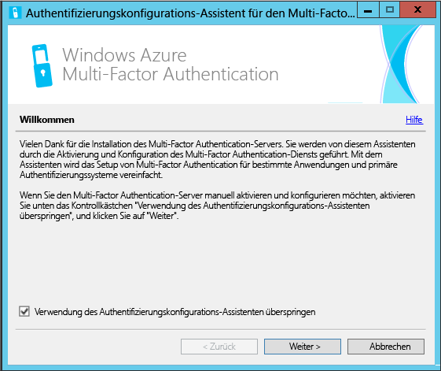
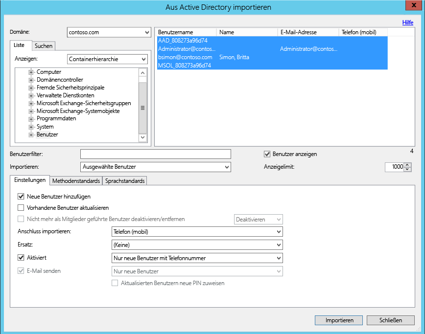
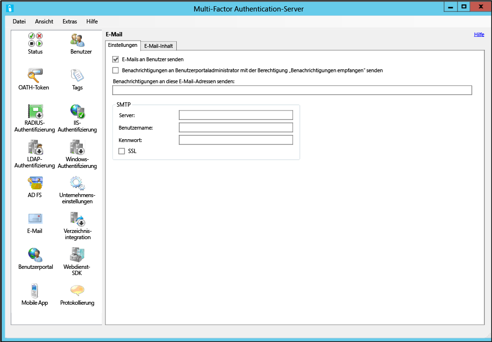
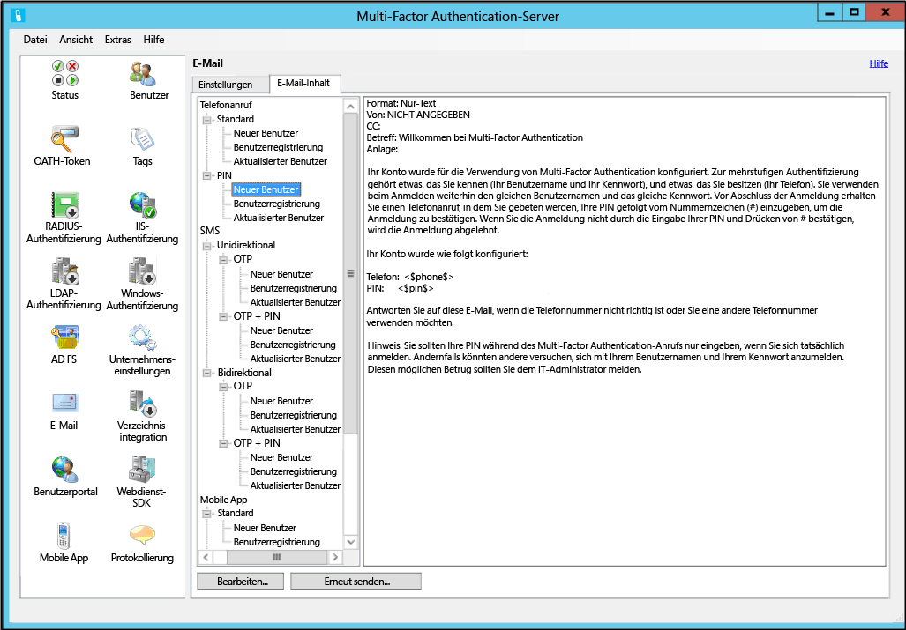

<properties 
	pageTitle="Erste Schritte mit Azure Multi-Factor Authentication-Server"
	description="Auf dieser Seite zur Azure Multi-Factor Authentication werden die ersten Schritte mit dem Azure MFA-Server beschrieben."
	services="multi-factor-authentication"
	documentationCenter=""
	authors="billmath"
	manager="stevenpo"
	editor="curtand"/>

<tags 
	ms.service="multi-factor-authentication"
	ms.workload="identity"
	ms.tgt_pltfrm="na"
	ms.devlang="na"
	ms.topic="get-started-article"
	ms.date="08/24/2015"
	ms.author="billmath"/>

# Erste Schritte mit Azure Multi-Factor Authentication-Server

Nachdem Sie nun geklärt haben, ob Sie die lokale Multi-Factor Authentication verwenden möchten, können Sie mit der Einrichtung fortfahren. Auf dieser Seite werden eine Neuinstallation des Servers und das Setup mit einem lokalen Active Directory behandelt. Wenn Sie den PhoneFactor-Server bereits installiert haben und eine Anleitung für dieses Verfahren suchen, finden Sie weitere Informationen unter "Aktualisieren von Azure Multi-Factor-Server". Wenn Sie wissen möchten, wie Sie nur den Webdienst installieren, finden Sie weitere Informationen unter "Bereitstellen des Webdiensts der mobilen App-für Azure Multi-Factor Authentication-Server".

## Herunterladen des Azure Multi-Factor Authentication-Servers

Es gibt zwei Möglichkeiten, den Azure Multi-Factor Authentication-Server herunterzuladen. Bei beiden wird das Azure-Portal verwendet. Die erste besteht darin, den Multi-Factor Authentication-Anbieter direkt zu verwalten. Die zweite erfolgt über die Diensteinstellungen. Für die zweite Option ist entweder ein Multi-Factor Authentication-Anbieter oder eine Azure AD Premium-Lizenz erforderlich.

### So laden Sie den Azure Multi-Factor Authentication-Server im Azure-Portal herunter
--------------------------------------------------------------------------------

1. Melden Sie sich beim Azure-Portal als Administrator an.
2. Wählen Sie im linken Bereich "Active Directory" aus.
3. Klicken Sie oben auf der Seite "Active Directory" auf **Anbieter für mehrstufige Authentifizierung**.
4. Klicken Sie unten auf **Verwalten**.
5. Dadurch wird eine neue Seite geöffnet. Klicken Sie auf **Downloads**. 
6. Klicken Sie über **Anmeldeinformationen für Aktivierung generieren** auf **Herunterladen**. 
7. Speichern Sie den Download.

### So laden Sie den Azure Multi-Factor Authentication-Server über die Diensteinstellungen herunter

1. Melden Sie sich beim Azure-Portal als Administrator an.
2. Wählen Sie im linken Bereich "Active Directory" aus.
3. Doppelklicken Sie auf Ihre Instanz von Azure AD.
4. Klicken Sie oben auf **Konfigurieren**. 
5. Wählen Sie unter "Multi-Factor Authentication" die Option **Diensteinstellungen verwalten** aus.
6. Klicken Sie auf der Seite "Diensteinstellungen" am unteren Rand des Bildschirms auf **Portal aufrufen**. 
7. Dadurch wird eine neue Seite geöffnet. Klicken Sie auf **Downloads**.
8. Klicken Sie über **Anmeldeinformationen für Aktivierung generieren** auf **Herunterladen**.
9. Speichern Sie den Download.

## Installieren und Konfigurieren des Azure Multi-Factor Authentication-Servers
Nachdem Sie den Server heruntergeladen haben, können Sie ihn installieren und konfigurieren. Achten Sie darauf, dass der Server, den Sie installieren möchten, die folgenden Anforderungen erfüllt:

Anforderungen an den Azure Multi-Factor Authentication-Server|Beschreibung|
:------------- | :------------- | 
Hardware|<li>200 MB freier Festplattenspeicherplatz</li><li>x32- oder x64-Prozessor</li><li>Mindestens 1 GB RAM</li>
Software|<li>Windows Server 2003 oder höher, wenn der Host über ein Serverbetriebssystem verfügt</li><li>Windows Vista oder höher, wenn der Host über ein Clientbetriebssystem verfügt</li><li>Microsoft .NET Framework 2.0</li><li>IIS 6.0 oder höher, wenn das Benutzerportal oder das Webdienst-SDK installiert wird</li>

### Anforderungen an die Azure Multi-Factor Authentication-Server-Firewall
--------------------------------------------------------------------------------
Für jeden MFA-Server muss die Kommunikation über den ausgehenden Port 443 zu folgenden Adressbereichen möglich sein:

- https://pfd.phonefactor.net
- https://pfd2.phonefactor.net
- https://css.phonefactor.net

Wenn Firewalls auf den ausgehenden Port 443 eingeschränkt sind, müssen die folgenden IP-Adressbereiche geöffnet werden:

IP-Subnetz|Netzmaske|IP-Bereich
:------------- | :------------- | :------------- |
134\.170.116.0/25|255\.255.255.128|134\.170.116.1–134.170.116.126
134\.170.165.0/25|255\.255.255.128|134\.170.165.1–134.170.165.126
70\.37.154.128/25|255\.255.255.128|70\.37.154.129–70.37.154.254

Wenn Sie die Ereignisbestätigungsfunktionen von Azure Multi-Factor Authentication nicht verwenden und Benutzer sich nicht mit den mobilen Apps für Multi-Factor Authentication von Geräten aus authentifizieren, die sich im Firmennetzwerk befinden, sind nur die folgenden IP-Adressbereiche erforderlich:

IP-Subnetz|Netzmaske|IP-Bereich
:------------- | :------------- | :------------- |
134\.170.116.72/29|255\.255.255.248|134\.170.116.72–134.170.116.79
134\.170.165.72/29|255\.255.255.248|134\.170.165.72–134.170.165.79
70\.37.154.200/29|255\.255.255.248|70\.37.154.201–70.37.154.206

### So installieren und konfigurieren Sie den Azure Multi-Factor Authentication-Server
--------------------------------------------------------------------------------

1. Doppelklicken Sie auf die ausführbare Datei. Dadurch wird die Installation gestartet.
2. Vergewissern Sie sich, dass im Bildschirm "Installationsordner auswählen" der richtige Ordner ausgewählt ist, und klicken Sie auf "Weiter".
3. Klicken Sie nach Abschluss der Installation auf "Fertig stellen". Dadurch wird der Konfigurations-Assistent gestartet.
4. Aktivieren Sie auf der Willkommensseite des Konfigurations-Assistenten das Kontrollkästchen **Verwendung des Authentifizierungskonfigurations-Assistenten überspringen**, und klicken Sie auf **Weiter**. Damit wird der Assistent geschlossen und der Server gestartet. 

5. Wechseln Sie zurück zu der Seite, von der Sie den Server heruntergeladen haben, und klicken Sie auf die Schaltfläche **Anmeldeinformationen für Aktivierung generieren**. Kopieren Sie diese Informationen auf dem Azure MFA-Server in die angezeigten Felder, und klicken Sie auf **Aktivieren**.

Die Schritte oben beschreiben ein Express-Setup mit dem Konfigurations-Assistenten. Sie können den Authentifizierungs-Assistenten erneut ausführen, indem Sie im Menü "Extras" auf dem Server die entsprechende Option auswählen.

##Importieren von Benutzern aus Active Directory

Nachdem Sie den Server installiert und konfiguriert haben, können Sie Benutzer schnell in den Azure MFA-Server importieren.

### So importieren Sie Benutzer aus Active Directory
--------------------------------------------------------------------------------

1. Wählen Sie auf dem Azure MFA-Server auf der linken Seite **Benutzer** aus.
2. Wählen Sie unten **Aus Active Directory importieren** aus.
3. Sie können jetzt entweder nach einzelnen Benutzern suchen oder im AD-Verzeichnis nach Organisationseinheiten suchen, die die gewünschten Benutzer enthalten. In diesem Beispiel wird die Benutzer-Organisationseinheit angeben.
4. Markieren Sie alle Benutzer auf der rechten Seite, und klicken Sie auf **Importieren**. Es wird ein Popupfenster angezeigt, wenn der Vorgang erfolgreich ausgeführt wurde. Schließen Sie das Fenster "Importieren".

## Senden Sie Benutzern eine E-Mail.
Nun, da Sie Ihre Benutzer in den Multi-Factor Authentication-Server importiert haben, wird empfohlen, dass Sie Ihre Benutzer per E-Mail darüber informieren, dass sie für die mehrstufige Authentifizierung registriert wurden.

Mit dem Azure Multi-Factor Authentication-Server gibt es verschiedene Möglichkeiten, Ihre Benutzer für die mehrstufige Authentifizierung zu konfigurieren. Wenn Sie z. B. die Telefonnummern der Benutzer kennen oder die Telefonnummern in den Azure Multi-Factor Authentication-Server aus dem Verzeichnis des Unternehmens importieren konnten, werden die Benutzer per E-Mail-Nachricht informiert, dass sie für die Nutzung von Azure Multi-Factor Authentication konfiguriert wurden. Sie erhalten außerdem einige Anweisungen zur Verwendung von Multi-Factor Authentication und werden über die Telefonnummer informiert, über die sie ihre Authentifizierungen erhalten.

Der Inhalt der E-Mail variiert, abhängig von der Authentifizierungsmethode, die für den Benutzer festgelegt wurde (z. B. Telefonanruf, SMS, mobile App). Wenn z. B. der Benutzer bei der Authentifizierung eine PIN verwenden muss, wird er per E-Mail informiert, wie seine anfängliche PIN festgelegt wurde. Benutzer müssen in der Regel beim ersten Authentifizieren ihre PIN ändern.

Wenn die Telefonnummern der Benutzer nicht konfiguriert oder in den Azure Multi-Factor Authentication-Server importiert wurden, oder Benutzer so vorkonfiguriert sind, dass sie die mobile App für die Authentifizierung verwenden, können Sie eine E-Mail mit der Information senden, dass sie für die Verwendung von Multi-Factor Authentication konfiguriert wurden, und sie anweisen, ihre Kontoregistrierung über das Azure Multi-Factor Authentication-Benutzerportal abzuschließen. Ein Hyperlink wird berücksichtigt, auf den der Benutzer klickt, um auf das Benutzerportal zuzugreifen. Klickt der Benutzer auf den Hyperlink, wird sein Webbrowser geöffnet und er wird auf das Azure Multi-Factor Authentication-Benutzerportal seines Unternehmens weitergeleitet.

### Konfigurieren von E-Mails und E-Mail-Vorlagen

Durch Klicken auf das E-Mail-Symbol auf der linken Seite können Sie die Einstellungen für das Senden dieser E-Mails einrichten. Hier können Sie die SMTP-Informationen Ihres E-Mail-Servers eingeben und Sie haben die Möglichkeit, eine pauschale weite E-Mail zu versenden, indem Sie das Kontrollkästchen "E-Mails an Benutzer senden" aktivieren.

Auf der Registerkarte "E-Mail-Inhalt" werden alle verschiedenen E-Mail-Vorlagen angezeigt, die Sie zur Auswahl haben. Je nachdem, wie Sie Ihre Benutzer für die mehrstufige Authentifizierung konfiguriert haben, wählen Sie die am besten geeignete Vorlage aus.

## Erweiterte Azure Multi-Factor Authentication Server-Konfigurationen
Weitere Informationen zu erweiterten Einstellungen und Konfigurationsinformationen finden Sie in der folgenden Tabelle.

Methode|Beschreibung
:------------- | :------------- | 
[Benutzerportal](multi-factor-authentication-get-started-portal.md)| Informationen zum Einrichten und Konfigurieren des Benutzerportals einschließlich der Bereitstellung und Benutzer-Self-Service.
[Active Directory-Verbunddienste](multi-factor-authentication-get-started-adfs.md)|Informationen zum Einrichten von Multi-Factor Authentication mit AD FS.
[RADIUS-Authentifizierung](multi-factor-authentication-get-started-server-radius.md)| Informationen über Einrichtung und Konfiguration des Azure MFA-Servers mit RADIUS.
[IIS-Authentifizierung](multi-factor-authentication-get-started-server-iis.md)|Informationen über Einrichtung und Konfiguration des Azure MFA-Servers mit IIS.
[Windows-Authentifizierung](multi-factor-authentication-get-started-server-windows.md)| Informationen über Einrichtung und Konfiguration des Azure MFA-Servers mit Windows-Authentifizierung.
[LDAP-Authentifizierung](multi-factor-authentication-get-started-server-ldap.md)|Informationen über Einrichtung und Konfiguration des Azure MFA-Servers mit LDAP-Authentifizierung.
[Remotedesktop-Gateway und Azure Multi-Factor Authentication-Server mithilfe von RADIUS](multi-factor-authentication-get-started-server-rdg.md)| Informationen zum Einrichten und Konfigurieren des Azure MFA-Servers mit Remotedesktop-Gateway unter Verwendung von RADIUS.
[Synchronisieren mit Windows Server Active Directory](multi-factor-authentication-get-started-server-dirint.md)|Informationen zum Einrichten und Konfigurieren der Synchronisierung zwischen Active Directory und dem Azure MFA-Server.
[Bereitstellen des mobilen App-Webdienstes für den Azure Multi-Factor Authentication-Server](multi-factor-authentication-get-started-server-webservice.md)|Informationen über das Einrichten und Konfigurieren des Azure MFA-Server-Webdienstes.

<!---HONumber=August15_HO9-->