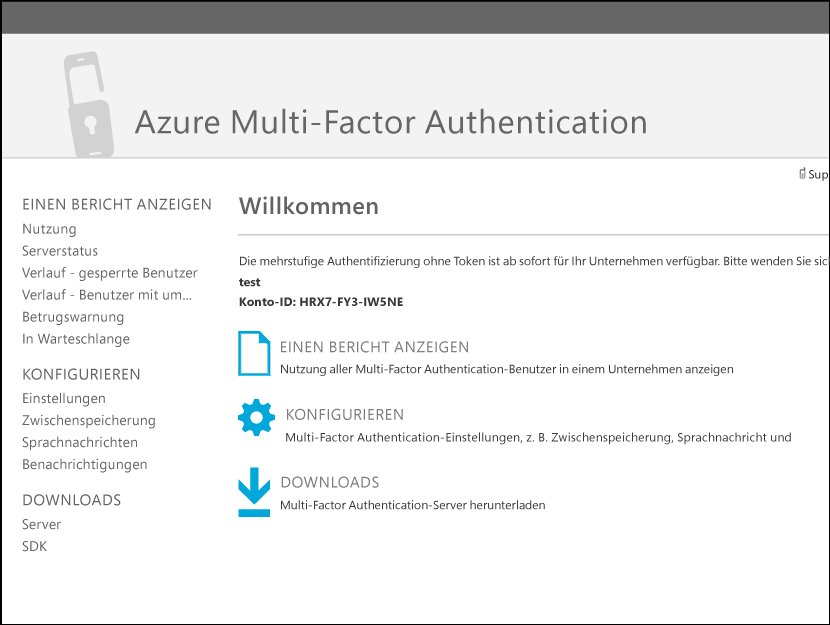
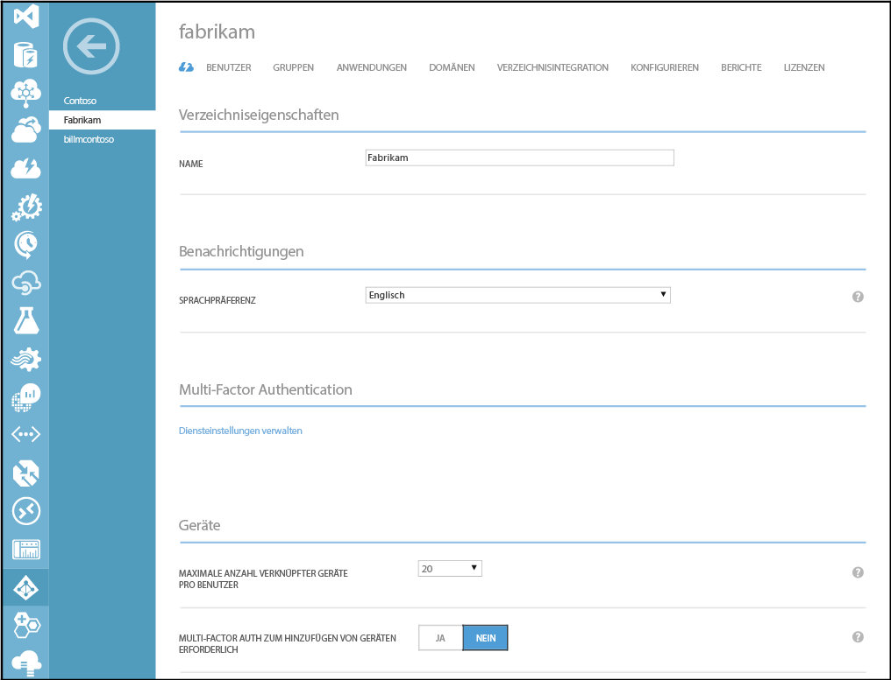
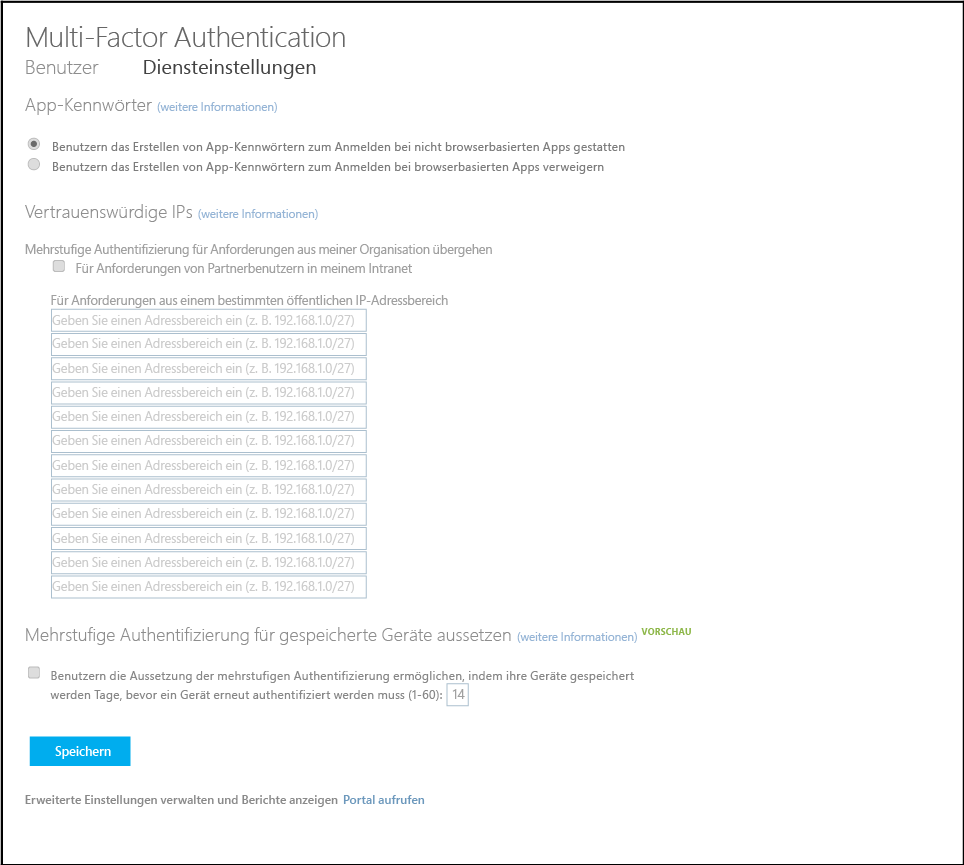

<properties 
	pageTitle="Integrieren Sie Ihre lokalen Identitäten in Azure Active Directory." 
	description="Nachfolgend finden Sie einen Überblick über Azure AD Connect sowie eine Beschreibung des Einsatzes dieser Technologie." 
	services="multi-factor-authentication" 
	documentationCenter="" 
	authors="billmath" 
	manager="stevenpo" 
	editor="curtand"/>

<tags 
	ms.service="multi-factor-authentication" 
	ms.workload="identity" 
	ms.tgt_pltfrm="na" 
	ms.devlang="na" 
	ms.topic="article" 
	ms.date="11/17/2015" 
	ms.author="billmath"/>

# Erstellen von Multi-Factor Authentication in benutzerdefinierten Apps (SDK)

Mit dem Software Development Kit (SDK) von Azure Multi-Factor Authentication können Sie die Überprüfung per Telefonanruf und SMS-Nachricht direkt in den Anmelde- oder Transaktionsprozessen von Anwendungen in Ihrem Azure AD-Mandanten erstellen.

Das Multi-Factor Authentication-SDK ist für C#, Visual Basic (.NET), Java, Perl, PHP und Ruby verfügbar. Das SDK bietet einen einfachen Wrapper für die mehrstufige Authentifizierung. Es enthält alles, was Sie zum Schreiben des Codes benötigen, einschließlich kommentierter Quellcodedateien, Beispieldateien und einer detaillierten Infodatei. Jedes SDK enthält auch ein Zertifikat und den privaten Schlüssel zum Verschlüsseln von Transaktionen, der für Ihren Multi-Factor Authentication-Anbieter eindeutig ist. Solange Sie einen Anbieter haben, können Sie das SDK in so vielen Sprachen und Formaten herunterladen, wie Sie benötigen.

Die Struktur der APIs im Multi-Factor Authentication-SDK ist recht einfach. Sie führen einen einzelnen Funktionsaufruf an eine API mit den mehrstufigen Optionsparametern durch, z. B. den Überprüfungsmodus, und den Benutzerdaten, z. B. der Telefonnummer für den Anruf oder die PIN-Nummer zur Überprüfung. Die APIs übersetzen den Funktionsaufruf in Webdiensteanforderungen an den cloudbasierten Azure Multi-Factor Authentication-Dienst. Alle Aufrufe müssen einen Verweis auf das private Zertifikat enthalten, das in jedem SDK enthalten ist.

Da die APIs keinen Zugriff auf in Azure Active Directory registrierte Benutzer haben, müssen Sie Benutzerinformationen wie Telefonnummern und PIN-Codes in einer Datei oder Datenbank bereitstellen. Darüber hinaus bieten die APIs keine Registrierungs- oder Benutzerverwaltungsfunktionen, weshalb Sie diese Prozesse in Ihre Anwendung integrieren müssen.

## Herunterladen des Azure Multi-Factor Authentication-SDK 

Es gibt zwei Möglichkeiten, das Azure Multi-Factor Authentication-SDK herunterzuladen. Bei beiden wird das Azure-Portal verwendet. Die erste besteht darin, den Multi-Factor Authentication-Anbieter direkt zu verwalten. Die zweite erfolgt über die Diensteinstellungen. Für die zweite Option ist entweder ein Multi-Factor Authentication-Anbieter oder eine Azure AD Premium-Lizenz erforderlich.

### So laden Sie das Azure Multi-Factor Authentication-SDK aus dem Azure-Portal herunter

1. Melden Sie sich beim Azure-Portal als Administrator an.
2. Wählen Sie im linken Bereich "Active Directory" aus.
3. Klicken Sie auf der Seite "Active Directory" oben auf **Anbieter für mehrstufige Authentifizierung**.
4. Klicken Sie unten auf **Verwalten**.
5. Dadurch wird eine neue Seite geöffnet. Klicken Sie auf der linken Seite unten auf "SDK".

6. Wählen Sie die gewünschte Sprache und klicken Sie auf einen der zugehörigen Downloadlinks.
7. Speichern Sie den Download.

### So laden Sie das Azure Multi-Factor Authentication-SDK über die Diensteinstellungen herunter

1. Melden Sie sich beim Azure-Portal als Administrator an.
2. Wählen Sie im linken Bereich "Active Directory" aus.
3. Doppelklicken Sie auf Ihre Instanz von Azure AD.
4. Klicken Sie oben auf **Konfigurieren**.
5. Wählen Sie unter Multi-Factor Authentication die Option **Diensteinstellungen verwalten** aus 
6. Klicken Sie auf der Seite "Diensteinstellungen" am unteren Rand des Bildschirms auf **Portal aufrufen**.
7. Dadurch wird eine neue Seite geöffnet. Klicken Sie auf der linken Seite unten auf "SDK".
8. Wählen Sie die gewünschte Sprache und klicken Sie auf einen der zugehörigen Downloadlinks.
9. Speichern Sie den Download.

## Inhalt des Azure Multi-Factor Authentication-SDK
Das SDK enthält die folgenden Elemente:

- **README**. Erläutert, wie die Multi-Factor Authentication-APIs in einer neuen oder vorhandenen Anwendung verwendet werden.
- **Quelldatei(en)** für Multi-Factor Authentication.
- **Clientzertifikat** für die Kommunikation mit dem Multi-Factor Authentication-Dienst.
- **Privater Schlüssel** für das Zertifikat.
- **Aurufergebnisse.** Eine Liste mit Aurufergebniscodes. Um diese Datei zu öffnen, verwenden Sie eine Anwendung mit Textformatierung wie WordPad. Verwenden Sie die Aufrufergebniscodes, um die Implementierung der Multi-Factor Authentication in Ihrer Anwendung zu testen und Probleme zu behandeln. Dies sind keine Authentifizierungsstatuscodes.
- **Beispiele.** Beispielcode für eine grundlegende, funktionsfähige Implementierung von Multi-Factor Authentication.

>[AZURE.WARNING]Das Client-Zertifikat ist ein eindeutiges, privates Zertifikat, das speziell für Sie generiert wurde. Geben Sie diese Datei nicht frei und verlieren Sie sie nicht. Sie ist der Schlüssel zum Gewährleisten der Sicherheit der Kommunikation mit dem Multi-Factor Authentication-Dienst.

## Codebeispiel: Telefonüberprüfung im Standardmodus

Dieses Codebeispiel veranschaulicht, wie in Ihrer Anwendung mithilfe der APIs im Azure Multi-Factor Authentication-SDK ein Sprachanruf im Standardmodus zur Überprüfung hinzugefügt werden kann. Der Standardmodus besteht aus einem Telefonanruf, auf den der Benutzer durch Drücken der #-Taste reagiert.

Dieses Beispiel verwendet das C# .NET 2.0 Multi-Factor Authentication-SDK in einer einfachen ASP.NET-Anwendung mit C#-serverseitiger Logik, aber der Prozess ist für einfache Implementierungen in anderen Sprachen sehr ähnlich. Da das SDK Quelldateien und keine ausführbaren Dateien enthält, können Sie die Dateien direkt in der Anwendung erstellen, darauf verweisen oder sie dort einbinden.

>[AZURE.NOTE]Wenn Multi-Factor Authentication implementiert wird, verwenden Sie die zusätzlichen Faktoren als sekundäre oder tertiäre Überprüfung, um Ihre primäre Authentifizierungsmethode zu ergänzen. Diese Methoden sind nicht dazu da, als primäre Authentifizierungsmethoden verwendet zu werden.

### Übersicht über das Codebeispiel
Dieser Beispielcode für eine sehr einfache Webdemoanwendung verwendet einen Telefonanruf mit einer #-Tastenantwort, um die Authentifizierung des Benutzers durchzuführen. Dieser Telefonanruffaktor wird in Multi-Factor Authentication Standardmodus genannt.

Der clientseitige Code enthält keine Elemente, die für Multi-Factor Authentication spezifisch sind. Da die zusätzlichen Authentifizierungsfaktoren nicht von der primären Authentifizierung abhängen, können Sie sie ohne Änderung der vorhandenen Anmeldeschnittstelle hinzufügen. Mit den APIs im Multi-Factor SDK können Sie die Benutzererfahrung anpassen. Möglicherweise müssen Sie dafür gar nichts ändern.

Der serverseitige Code fügt den Standard-Authentifizierungsmodus in Schritt 2 hinzu. Er erstellt ein PfAuthParams-Objekt mit den Parametern, die für die Überprüfung im Standardmodus erforderlich sind: Benutzername, Telefonnummer, Modus und Pfad zum Clientzertifikat (CertFilePath), der bei jedem Aufruf erforderlich ist. Eine Demonstration aller Parameter in PfAuthParams finden Sie in der Beispieldatei im SDK.

Als Nächstes übergibt der Code das PfAuthParams-Objekt an die pf\_authenticate()-Funktion. Der Rückgabewert gibt den Erfolg oder Misserfolg der Authentifizierung an. Die Ausgangsparameter "callStatus" und "errorID" enthalten zusätzliche Informationen zu den Anrufergebnissen. Die Anrufergebniscodes sind in der Anrufergebnisdatei im SDK dokumentiert.

Diese minimale Implementierung kann in einige wenige Zeilen geschrieben werden. Der Produktionscode enthält jedoch normalerweise eine komplexere Fehlerbehandlung, zusätzlichen Datenbankcode und ein optimiertes Bedienungserlebnis.

### Webclientcode

Es folgt Webclientcode für eine Demoseite.

	
	<%@ Page Language="C#" AutoEventWireup="true" CodeFile="Default.aspx.cs" Inherits="_Default" %>
	
	<!DOCTYPE html>
	
	<html xmlns="http://www.w3.org/1999/xhtml">
	<head runat="server">
	<title>Multi-Factor Authentication Demo</title>
	</head>
	<body>
	<h1>Azure Multi-Factor Authentication Demo</h1>
	<form id="form1" runat="server">
	
	

	Username:&nbsp; 
	Password:&nbsp; 
	

	
	<div">
	<asp:TextBox id="username" runat="server" width="100px"/> 
	<asp:Textbox id="password" runat="server" width="100px" TextMode="password" /> 
	

	
	<asp:Button id="btnSubmit" runat="server" Text="Log in" onClick="btnSubmit_Click"/>
	
	
<asp:Label ID="lblResult" runat="server"></asp:Label>

	
	</form>
	</body>
	</html>

### Serverseitiger Code

Im folgenden serverseitigen Code wird Multi-Factor Authentication in Schritt 2 konfiguriert und ausgeführt. Der Standardmodus (MODE\_STANDARD) besteht aus einem Telefonanruf, auf den der Benutzer durch Drücken der #-Taste reagiert.

	using System;
	using System.Collections.Generic;
	using System.Linq;
	using System.Web;
	using System.Web.UI;
	using System.Web.UI.WebControls;
	
	public partial class _Default : System.Web.UI.Page
	{
	    protected void Page_Load(object sender, EventArgs e)
	    {
	    }
	
	    protected void btnSubmit_Click(object sender, EventArgs e)
	    {
	        // Step 1: Validate the username and password
	        if (username.Text != "Contoso" || password.Text != "password")
	        {
	            lblResult.ForeColor = System.Drawing.Color.Red;
	            lblResult.Text = "Username or password incorrect.";
	        }
	        else
	        {
	            // Step 2: Perform multi-factor authentication
	
	            // Add call details from the user database.
	            PfAuthParams pfAuthParams = new PfAuthParams();
	            pfAuthParams.Username = username.Text;
	            pfAuthParams.Phone = "9134884271";
	            pfAuthParams.Mode = pf_auth.MODE_STANDARD;
	            
	            // Specify a client certificate 
	            // NOTE: This file contains the private key for the client
	            // certificate. It must be stored with appropriate file 
	            // permissions.
	            pfAuthParams.CertFilePath = "c:\\cert_key.p12";
	
	            // Perform phone-based authentication
	            int callStatus;
	            int errorId;
	
	            if(pf_auth.pf_authenticate(pfAuthParams, out callStatus, out errorId))
	            {
	                lblResult.ForeColor = System.Drawing.Color.Green;
	                lblResult.Text = "Multi-Factor Authentication succeeded.";
	            }
	            else
	            {
	                lblResult.ForeColor = System.Drawing.Color.Red;
	                lblResult.Text = " Multi-Factor Authentication failed.";
	            }
	        }
	
	    }
	}

<!---HONumber=Nov15_HO4-->