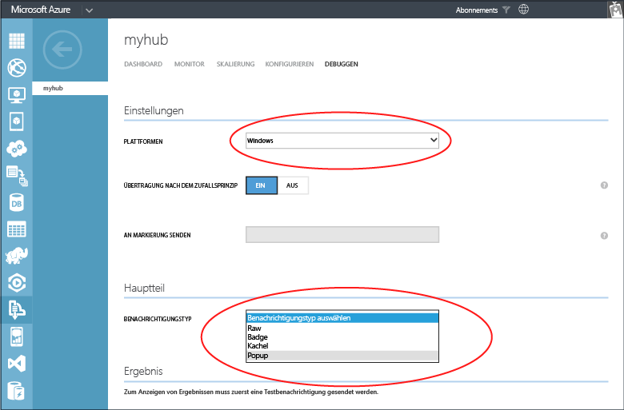
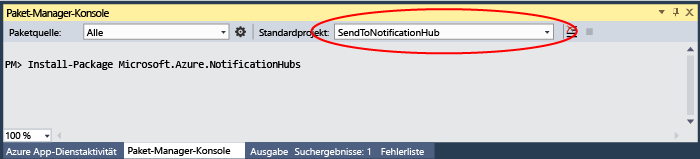

<properties
	pageTitle="Erste Schritte mit Azure Notification Hubs mit Baidu | Microsoft Azure"
	description="In diesem Lernprogramm erfahren Sie, wie Sie mithilfe von Azure Notification Hubs mit Baidu Pushbenachrichtigungen an Android-Geräte senden."
	services="notification-hubs"
	documentationCenter="android"
	authors="wesmc7777"
	manager="dwrede"
	editor=""/>

<tags
	ms.service="notification-hubs"
	ms.devlang="java"
	ms.topic="hero-article"
	ms.tgt_pltfrm="mobile-baidu"
	ms.workload="mobile"
	ms.date="10/19/2015"
	ms.author="wesmc"/>

# Erste Schritte mit Notification Hubs mit Baidu

[AZURE.INCLUDE [Notification-Hubs-Auswahl-Erste-Schritte](../../includes/notification-hubs-selector-get-started.md)]

##Übersicht

Baidu Cloud Push ist ein chinesischer Clouddienst, mit dem Sie Pushbenachrichtigungen an mobile Geräte senden können. Dieser Dienst ist besonders nützlich in China, da hier aufgrund der Existenz von verschiedenen App-Stores und Pushdiensten neben Android-Geräten, die in der Regel nicht mit GCM (Google Cloud Messaging) verbunden sind, die Übermittlung von Pushbenachrichtigungen an Android recht komplex ist.

##Voraussetzungen

Für dieses Lernprogramm ist Folgendes erforderlich:

+ Android SDK (es wird davon ausgegangen, dass Sie Eclipse verwenden), das Sie von der <a href="http://go.microsoft.com/fwlink/?LinkId=389797">Android-Website</a> herunterladen können
+ [Mobile Services Android SDK]
+ [Baidu Push Android SDK]

>[AZURE.NOTE]Sie benötigen ein aktives Azure-Konto, um dieses Lernprogramm abzuschließen. Wenn Sie noch kein Konto haben, können Sie in nur wenigen Minuten ein kostenloses Testkonto erstellen. Ausführliche Informationen finden Sie unter [Einen Monat kostenlos testen](http://azure.microsoft.com/pricing/free-trial/?WT.mc_id=A0E0E5C02&amp;returnurl=http%3A%2F%2Fazure.microsoft.com%2Fde-DE%2Fdocumentation%2Farticles%2Fnotification-hubs-baidu-get-started%2F).

##Erstellen eines Baidu-Kontos

Zum Verwenden von Baidu müssen Sie über ein Baidu-Konto verfügen. Wenn Sie bereits ein Konto haben, melden Sie sich beim [Baidu-Portal] an, und fahren Sie mit dem nächsten Schritt fort. Andernfalls finden Sie nachfolgend die entsprechenden Anweisungen zum Erstellen eines Baidu-Kontos.

1. Wechseln Sie zum [Baidu-Portal], und klicken Sie auf den Link **登录** (**Anmelden**). Klicken Sie auf **立即注册**, um den Registrierungsprozess für ein Konto zu starten.

   	![][1]

2. Geben Sie die erforderlichen Details (Telefon, E-Mail-Adresse, Kennwort und Überprüfungscode) ein, und klicken Sie auf die Anmeldeschaltfläche.

   	![][2]

3. Sie erhalten eine E-Mail an die eingegebene E-Mail-Adresse mit einem Link zur Aktivierung Ihres Baidu-Kontos.

   	![][3]

4. Melden Sie sich bei Ihrem E-Mail-Konto an, öffnen Sie die Baidu-Aktivierungsmail, und klicken Sie auf den Aktivierungslink, um Ihr Baidu-Konto zu aktivieren.

   	![][4]

Nachdem Sie Ihr Baidu-Konto aktiviert haben, melden Sie sich beim [Baidu-Portal] an.

##Registrieren als Baidu-Entwickler

1. Nachdem Sie sich beim [Baidu-Portal] angemeldet haben, klicken Sie auf **更多>>** (**Mehr**).

  	![][5]

2. Scrollen Sie im Abschnitt **站长与开发者服务 (Webmaster- und Entwicklerdienste)** nach unten, und klicken Sie auf **百度开放云平台** (**Offene Baidu-Cloud-Plattform**).

  	![][6]

3. Klicken Sie auf der nächsten Seite in der rechten oberen Ecke auf **开发者服务** (**Entwicklerdienste**).

  	![][7]

4. Klicken Sie auf der nächsten Seite im Menü oben rechts auf **注册开发者** (**Registrierte Entwickler**).

  	![][8]

5. Geben Sie Ihren Namen, eine Beschreibung und Ihre Mobiltelefonnummer für den Empfang einer Überprüfungsnachricht an, und klicken Sie dann auf **送验证码** (**Überprüfungscode senden**). Beachten Sie, dass Sie bei internationalen Telefonnummern die Landeskennzahl in Klammern setzen müssen, z. B. **(1) 1234567890** bei einer Telefonnummer in den USA.

  	![][9]

6. Sie sollten dann eine Textnachricht mit einer Überprüfungsnummer erhalten, wie im folgenden Beispiel gezeigt:

  	![][10]

7. Geben Sie die Überprüfungsnummer aus der Nachricht in **验证码** (**Bestätigungscode**) ein.

8. Schließen Sie die Registrierung als Entwickler ab, indem Sie der Baidu-Vereinbarung zustimmen und auf **提交** (**Senden**) klicken. Bei erfolgreicher Registrierung wird die folgende Seite angezeigt:

  	![][11]

##Erstellen eines Baidu-Cloud-Push-Projekts

Wenn Sie ein Baidu-Cloud-Push-Projekt erstellen, erhalten Sie Ihre App-ID, einen API-Schlüssel und einen geheimen Schlüssel.

1. Nachdem Sie sich beim [Baidu-Portal] angemeldet haben, klicken Sie auf **更多>>** (**Mehr**).

  	![][5]

2. Scrollen Sie im Abschnitt **站长与开发者服务** (**Webmaster- und Entwicklerdienste**) nach unten, und klicken Sie auf **百度开放云平台** (**Offene Baidu-Cloud-Plattform**).

  	![][6]

3. Klicken Sie auf der nächsten Seite in der rechten oberen Ecke auf **开发者服务** (**Entwicklerdienste**).

  	![][7]

4. Klicken Sie auf der nächsten Seite im Abschnitt **云服务** (**Cloud-Dienste**) auf **云推送** (**Cloud-Push**).

  	![][12]

5. Wenn Sie ein registrierter Entwickler sind, wird im Hauptmenü die Option **管理控制台** (**Verwaltungskonsole**) angezeigt. Klicken Sie auf **开发者服务管理** (**Entwicklerdienst-Verwaltung**).

  	![][13]

6. Klicken Sie auf der nächsten Seite auf **创建工程** (**Projekt erstellen**).

  	![][14]

7. Geben Sie einen Anwendungsnamen ein, und klicken Sie auf **创建** (**Erstellen**).

  	![][15]

8. Nach erfolgreicher Erstellung eines Baidu-Cloud-Pushprojekts wird eine Seite mit der **App-ID**, dem **API-Schlüssel** und dem **geheimen Schlüssel** angezeigt. Notieren Sie den API-Schlüssel und den geheimen Schlüssel, die später verwendet werden.

  	![][16]

9. Konfigurieren Sie das Projekt für Pushbenachrichtigungen, indem Sie im linken Bereich auf **云推送** (**Cloud-Push**) klicken.

  	![][31]

10. Klicken Sie auf der nächsten Seite auf die Schaltfläche **推送设置** (**Push-Einstellungen**).

	![][32]

11. Geben Sie auf der Konfigurationsseite den Paketnamen, den Sie im Android-Projekt verwenden möchten, im Feld **应用包名** (**Anwendungspaket**) ein, und klicken Sie dann auf **保存设置** (**Speichern**).

	![][33]

Die Nachricht **保存成功！** (**Erfolgreich gespeichert!**) wird angezeigt.

##Konfigurieren Ihres Notification Hub

1. Melden Sie sich beim [Azure-Portal] an, und klicken Sie im unteren Teil des Bildschirms auf **+NEW**.

2. Klicken Sie auf **App Services**, auf **Service Bus**, auf **Notification Hub** und anschließend auf **Schnellerfassung**.

3. Geben Sie einen Namen für Ihren **Notification Hub** ein, wählen Sie die **Region** und den **Namespace** aus, in dem dieser Notification Hub erstellt wird, und klicken Sie dann auf **Neuen Benachrichtigungs-Hub erstellen**.

  	![][17]

4. Klicken Sie auf den Namespace, in dem Sie den Notification Hub erstellt haben, und klicken Sie dann oben auf **Notification Hubs**.

  	![][18]

5. Wählen Sie den erstellten Notification Hub aus, und klicken Sie im Hauptmenü auf **Konfigurieren**.

  	![][19]

6. Scrollen Sie nach unten zum Abschnitt **Baidu-Benachrichtigungseinstellungen**, und geben Sie den API-Schlüssel und den geheimen Schlüssel ein, die Sie zuvor über die Baidu-Konsole für Ihr Baidu-Cloud-Pushprojekt erhalten haben. Klicken Sie auf **Speichern**.

  	![][20]

7. Klicken Sie oben auf die Registerkarte **Dashboard** für den Notification Hub und dann auf **Verbindungszeichenfolge anzeigen**.

  	![][21]

8. Notieren Sie sich die Werte für **DefaultListenSharedAccessSignature** und **DefaultFullSharedAccessSignature** im Fenster **Verbindungsinformationen aufrufen**.

    ![][22]

##Verbinden Ihrer App mit dem Notification Hub

1. Erstellen Sie in Eclipse ADT ein neues Android-Projekt (**File** > **New** > **Android Application Project**).

    ![][23]

2. Geben Sie unter **Application Name** einen Anwendungsnamen ein, und stellen Sie sicher, dass die SDK-Version unter **Minimum Required SDK** auf **API 16: Android 4.1** festgelegt ist.

    ![][24]

3. Klicken Sie auf **Next**, und befolgen Sie die Anweisungen des Assistenten, bis das Fenster **Create Activity** angezeigt wird. Stellen Sie sicher, dass **Blank Activity** ausgewählt ist, und wählen Sie abschließend **Finish** aus, um eine neue Android-Anwendung zu erstellen.

    ![][25]

4. Stellen Sie sicher, dass **Project Build Target** richtig festgelegt ist.

    ![][26]

5. Laden Sie das [Mobile Services Android SDK] herunter, und entpacken Sie es. Öffnen Sie den Ordner **notificationhubs**, kopieren Sie die Datei **notification-hubs-x.y.jar** in den Ordner **libs** Ihres Eclipse-Projekts, und aktualisieren Sie den Ordner *libs*.

6. Laden Sie das [Baidu Push Android SDK] herunter, und entpacken Sie es. Öffnen Sie den Ordner **libs**, und kopieren Sie die JAR-Datei **pushservice-x.y.z** und die Ordner **armeabi** und **mips** in den Ordner **libs** Ihrer Android-Anwendung.

7. Öffnen Sie die Datei **AndroidManifest.xml** Ihres Android-Projekts, und fügen Sie die Berechtigungen hinzu, die für das Baidu SDK erforderlich sind.

	    <uses-permission android:name="android.permission.INTERNET" />
	    <uses-permission android:name="android.permission.READ_PHONE_STATE" />
	    <uses-permission android:name="android.permission.ACCESS_NETWORK_STATE" />
	    <uses-permission android:name="android.permission.RECEIVE_BOOT_COMPLETED" />
	    <uses-permission android:name="android.permission.WRITE_SETTINGS" />
	    <uses-permission android:name="android.permission.VIBRATE" />
	    <uses-permission android:name="android.permission.WRITE_EXTERNAL_STORAGE" />
	    <uses-permission android:name="android.permission.DISABLE_KEYGUARD" />
	    <uses-permission android:name="android.permission.ACCESS_COARSE_LOCATION" />
	    <uses-permission android:name="android.permission.ACCESS_WIFI_STATE" />
	    <uses-permission android:name="android.permission.ACCESS_DOWNLOAD_MANAGER" />
	    <uses-permission android:name="android.permission.DOWNLOAD_WITHOUT_NOTIFICATION" />

8. Fügen Sie dem **application**-Element in der Datei **AndroidManifest.xml** die Eigenschaft **android:name** hinzu, und ersetzen Sie dabei *yourprojectname* durch Ihren Projektnamen (z. B. **com.example.BaiduTest**). Stellen Sie sicher, dass dieser Projektname mit dem Namen übereinstimmt, den Sie in der Baidu-Konsole konfiguriert haben.

		<application android:name="yourprojectname.DemoApplication"

9. Fügen Sie innerhalb des Anwendungselements nach dem Aktivitätselement **.MainActivity** die folgende Konfiguration hinzu, und ersetzen Sie dabei *yourprojectname* durch Ihren Projektnamen (z. B. **com.example.BaiduTest**):

		<receiver android:name="yourprojectname.MyPushMessageReceiver">
		    <intent-filter>
		        <action android:name="com.baidu.android.pushservice.action.MESSAGE" />
		        <action android:name="com.baidu.android.pushservice.action.RECEIVE" />
		        <action android:name="com.baidu.android.pushservice.action.notification.CLICK" />
		    </intent-filter>
		</receiver>

		<receiver android:name="com.baidu.android.pushservice.PushServiceReceiver"
		    android:process=":bdservice_v1">
		    <intent-filter>
		        <action android:name="android.intent.action.BOOT_COMPLETED" />
		        <action android:name="android.net.conn.CONNECTIVITY_CHANGE" />
				<action android:name="com.baidu.android.pushservice.action.notification.SHOW" />
		    </intent-filter>
		</receiver>

        <receiver android:name="com.baidu.android.pushservice.RegistrationReceiver"
            android:process=":bdservice_v1">
            <intent-filter>
                <action android:name="com.baidu.android.pushservice.action.METHOD" />
                <action android:name="com.baidu.android.pushservice.action.BIND_SYNC" />
            </intent-filter>
            <intent-filter>
                <action android:name="android.intent.action.PACKAGE_REMOVED"/>
                <data android:scheme="package" />
            </intent-filter>
        </receiver>

        <service
            android:name="com.baidu.android.pushservice.PushService"
            android:exported="true"
            android:process=":bdservice_v1"  >
            <intent-filter>
                <action android:name="com.baidu.android.pushservice.action.PUSH_SERVICE" />
            </intent-filter>
        </service>

9. Fügen Sie dem Projekt eine neue Klasse mit dem Namen **ConfigurationSettings.java** hinzu.

    ![][28]

    ![][29]

10. Fügen Sie der Klasse folgenden Code hinzu:

		public class ConfigurationSettings {
		        public static String API_KEY = "...";
				public static String NotificationHubName = "...";
				public static String NotificationHubConnectionString = "...";
			}

	Legen Sie für den Wert von **API\_KEY** den Wert fest, den Sie zuvor aus dem Baidu-Cloud-Projekt abgerufen haben, für **NotificationHubName** Ihren Notification Hub-Namen aus dem Azure-Portal und für **NotificationHubConnectionString** die DefaultListenSharedAccessSignature aus dem Azure-Portal.

11. Fügen Sie eine neue Klasse namens **DemoApplication.java** mit dem folgenden Code hinzu:

		import com.baidu.frontia.FrontiaApplication;

		public class DemoApplication extends FrontiaApplication {
		    @Override
		    public void onCreate() {
		        super.onCreate();
		    }
		}

12. Fügen Sie eine weitere neue Klasse namens **MyPushMessageReceiver.java** mit dem folgenden Code hinzu. Dies ist die Klasse, die die vom Baidu-Push-Server empfangenen Pushbenachrichtigungen verarbeitet.

		import java.util.List;
		import android.content.Context;
		import android.os.AsyncTask;
		import android.util.Log;
		import com.baidu.frontia.api.FrontiaPushMessageReceiver;
		import com.microsoft.windowsazure.messaging.NotificationHub;

		public class MyPushMessageReceiver extends FrontiaPushMessageReceiver {
		    /** TAG to Log */
			public static NotificationHub hub = null;
			public static String mChannelId, mUserId;
		    public static final String TAG = MyPushMessageReceiver.class
		            .getSimpleName();

			@Override
		    public void onBind(Context context, int errorCode, String appid,
		            String userId, String channelId, String requestId) {
		        String responseString = "onBind errorCode=" + errorCode + " appid="
		                + appid + " userId=" + userId + " channelId=" + channelId
		                + " requestId=" + requestId;
		        Log.d(TAG, responseString);
		        mChannelId = channelId;
		        mUserId = userId;

		        try {
		       	 if (hub == null) {
		                hub = new NotificationHub(
		                		ConfigurationSettings.NotificationHubName,
		                		ConfigurationSettings.NotificationHubConnectionString,
		                		context);
		                Log.i(TAG, "Notification hub initialized");
		            }
		        } catch (Exception e) {
		           Log.e(TAG, e.getMessage());
		        }

		        registerWithNotificationHubs();
			}

		    private void registerWithNotificationHubs() {
		       new AsyncTask<Void, Void, Void>() {
		          @Override
		          protected Void doInBackground(Void... params) {
		             try {
		            	 hub.registerBaidu(mUserId, mChannelId);
		            	 Log.i(TAG, "Registered with Notification Hub - '"
		     	    			+ ConfigurationSettings.NotificationHubName + "'"
		     	    			+ " with UserId - '"
		     	    			+ mUserId + "' and Channel Id - '"
		     	    			+ mChannelId + "'");
		             } catch (Exception e) {
		            	 Log.e(TAG, e.getMessage());
		             }
		             return null;
		         }
		       }.execute(null, null, null);
		    }

		    @Override
		    public void onSetTags(Context context, int errorCode,
		            List<String> sucessTags, List<String> failTags, String requestId) {
		        String responseString = "onSetTags errorCode=" + errorCode
		                + " sucessTags=" + sucessTags + " failTags=" + failTags
		                + " requestId=" + requestId;
		        Log.d(TAG, responseString);
		    }

		    @Override
		    public void onDelTags(Context context, int errorCode,
		            List<String> sucessTags, List<String> failTags, String requestId) {
		        String responseString = "onDelTags errorCode=" + errorCode
		                + " sucessTags=" + sucessTags + " failTags=" + failTags
		                + " requestId=" + requestId;
		        Log.d(TAG, responseString);
		    }

		    @Override
		    public void onListTags(Context context, int errorCode, List<String> tags,
		            String requestId) {
		        String responseString = "onListTags errorCode=" + errorCode + " tags="
		                + tags;
		        Log.d(TAG, responseString);
		    }

		    @Override
		    public void onUnbind(Context context, int errorCode, String requestId) {
		        String responseString = "onUnbind errorCode=" + errorCode
		                + " requestId = " + requestId;
		        Log.d(TAG, responseString);
		    }

		    @Override
		    public void onNotificationClicked(Context context, String title,
		            String description, String customContentString) {
		        String notifyString = "title="" + title + "" description=""
		                + description + "" customContent=" + customContentString;
		        Log.d(TAG, notifyString);
		    }

		    @Override
		    public void onMessage(Context context, String message,
		            String customContentString) {
		        String messageString = "message="" + message + "" customContentString=" + customContentString;
		        Log.d(TAG, messageString);
		    }
		}

13. Öffnen Sie **MainActivity.java**, und fügen Sie der **OnCreate**-Methode Folgendes hinzu:

	        PushManager.startWork(getApplicationContext(),
	                PushConstants.LOGIN_TYPE_API_KEY, ConfigurationSettings.API_KEY);

14. Öffnen Sie am Anfang die folgenden import-Anweisungen:

			import com.baidu.android.pushservice.PushConstants;
			import com.baidu.android.pushservice.PushManager;

##Senden von Benachrichtigungen an Ihre App

Sie können den Empfang von Benachrichtigungen in Ihrer App testen, indem Sie wie im Bildschirm unten abgebildet Benachrichtigungen im Azure-Portal über die Registerkarte zum Debuggen im Notification Hub senden.

Pushbenachrichtigungen werden normalerweise in einem Back-End-Dienst wie z. B. Mobile Services oder ASP.NET mit einer kompatiblen Bibliothek gesendet. Sie können Benachrichtigungsmeldungen zudem direkt über die REST-API senden, wenn für Ihr Back-End keine Bibliothek verfügbar ist.

In diesem Lernprogramm gehen wir einfach vor und veranschaulichen nur das Testen der Client-App, indem wir Benachrichtigungen mit dem .NET SDK für Notification Hubs in einer Konsolenanwendung senden, anstatt über einen Back-End-Dienst. Es wird empfohlen, das Tutorial [Verwenden von Notification Hubs für Pushbenachrichtigungen an Benutzer](notification-hubs-aspnet-backend-windows-dotnet-notify-users.md) als nächsten Schritt zum Senden von Benachrichtigungen von einem ASP.NET-Back-End zu nutzen. Sie können aber die folgenden Vorgehensweisen zum Senden von Benachrichtigungen verwenden:

* **REST-Schnittstelle**: Sie können die Benachrichtigung auf allen Back-End-Plattformen unterstützen, indem Sie die [REST-Schnittstelle](http://msdn.microsoft.com/library/windowsazure/dn223264.aspx) verwenden.

* **Microsoft Azure Notification Hubs .NET SDK**: Führen Sie im Nuget-Paket-Manager für Visual Studio die Option [Install-Package Microsoft.Azure.NotificationHubs](https://www.nuget.org/packages/Microsoft.Azure.NotificationHubs/) aus.

* **Node.js** : [Verwenden von Notification Hubs mit Node.js](notification-hubs-nodejs-how-to-use-notification-hubs.md).

* **Azure Mobile Services**: Ein Beispiel zum Senden von Benachrichtigungen von einem mit Notification Hubs integrierten Azure Mobile Services-Back-End aus finden Sie unter „Erste Schritte mit Pushbenachrichtigungen in Mobile Services“ ([.NET-Back-End](../mobile-services/mobile-services-javascript-backend-windows-store-dotnet-get-started-push.md) | [JavaScript-Back-End](../mobile-services/mobile-services-javascript-backend-windows-store-dotnet-get-started-push.md)).

* **Java/PHP**: Ein Beispiel zum Senden von Benachrichtigungen über die REST-APIs finden Sie unter „Verwenden von Notification Hubs von Java/PHP“ ([Java](notification-hubs-java-backend-how-to.md) | [PHP](notification-hubs-php-backend-how-to.md)).

##(Optional) Senden von Benachrichtigungen aus einer .NET-Konsolenanwendung

In diesem Abschnitt zeigen wir das Senden einer Benachrichtigung über eine .NET-Konsolen-App.

1. Erstellen einer neuen Visual C#-Konsolenanwendung:

	![][30]

2. Legen Sie im Fenster der Paket-Manager-Konsole als **Standardprojekt** das neue Konsolenanwendungsprojekt fest, und führen Sie dann im Konsolenfenster den folgenden Befehl aus:

        Install-Package Microsoft.Azure.NotificationHubs

	Dies fügt mithilfe des <a href="http://www.nuget.org/packages/Microsoft.Azure.NotificationHubs/">Microsoft.Azure.NotificationHubs-NuGet-Pakets</a> einen Verweis auf das Azure Notification Hubs-SDK hinzu.

	

3. Öffnen Sie die Datei **Program.cs**, und fügen Sie die folgende „using“-Anweisung hinzu:

        using Microsoft.Azure.NotificationHubs;

4. Fügen Sie der `Program`-Klasse die folgende Methode hinzu, und ersetzen Sie dabei *DefaultFullSharedAccessSignatureSASConnectionString* und *NotificationHubName* durch die Ihnen vorliegenden Werte.

		private static async void SendNotificationAsync()
		{
			NotificationHubClient hub = NotificationHubClient.CreateClientFromConnectionString("DefaultFullSharedAccessSignatureSASConnectionString", "NotificationHubName");
			string message = "{"title":"((Notification title))","description":"Hello from Azure"}";
			var result = await hub.SendBaiduNativeNotificationAsync(message);
		}

5. Fügen Sie folgende Zeilen zur **Main**-Methode hinzu:

         SendNotificationAsync();
		 Console.ReadLine();

##Testen Ihrer App

Um die App mit einem Telefon zu testen, müssen Sie dieses über ein USB-Kabel mit Ihrem Computer verbinden. Dadurch wird die App auf das Telefon geladen.

Um die App mit dem Emulator zu testen, klicken Sie in der oberen Eclipse-Symbolleiste auf **Run**, und wählen Sie die App aus. Damit wird der Emulator gestartet und dann die App geladen und ausgeführt.

Die App ruft die "userId" und "channelId" vom Baidu-Pushbenachrichtigungsdienst ab und registriert sich beim Notification Hub.

Zum Senden einer Testbenachrichtigung können Sie die Registerkarte „Debuggen“ des Portals verwenden. Wenn Sie die .NET-Konsolenanwendung für Visual Studio entwickelt haben, drücken Sie einfach in Visual Studio die Taste F5, um die Anwendung auszuführen. Die Anwendung sendet eine Benachrichtigung, die im oberen Infobereich des Geräts oder Emulators angezeigt wird.

<!-- Images. -->
[1]: ./media/notification-hubs-baidu-get-started/BaiduRegistration.png
[2]: ./media/notification-hubs-baidu-get-started/BaiduRegistrationInput.png
[3]: ./media/notification-hubs-baidu-get-started/BaiduConfirmation.png
[4]: ./media/notification-hubs-baidu-get-started/BaiduActivationEmail.png
[5]: ./media/notification-hubs-baidu-get-started/BaiduRegistrationMore.png
[6]: ./media/notification-hubs-baidu-get-started/BaiduOpenCloudPlatform.png
[7]: ./media/notification-hubs-baidu-get-started/BaiduDeveloperServices.png
[8]: ./media/notification-hubs-baidu-get-started/BaiduDeveloperRegistration.png
[9]: ./media/notification-hubs-baidu-get-started/BaiduDevRegistrationInput.png
[10]: ./media/notification-hubs-baidu-get-started/BaiduDevRegistrationConfirmation.png
[11]: ./media/notification-hubs-baidu-get-started/BaiduDevConfirmationFinal.png
[12]: ./media/notification-hubs-baidu-get-started/BaiduCloudPush.png
[13]: ./media/notification-hubs-baidu-get-started/BaiduDevSvcMgmt.png
[14]: ./media/notification-hubs-baidu-get-started/BaiduCreateProject.png
[15]: ./media/notification-hubs-baidu-get-started/BaiduCreateProjectInput.png
[16]: ./media/notification-hubs-baidu-get-started/BaiduProjectKeys.png
[17]: ./media/notification-hubs-baidu-get-started/AzureNHCreation.png
[18]: ./media/notification-hubs-baidu-get-started/NotificationHubs.png
[19]: ./media/notification-hubs-baidu-get-started/NotificationHubsConfigure.png
[20]: ./media/notification-hubs-baidu-get-started/NotificationHubBaiduConfigure.png
[21]: ./media/notification-hubs-baidu-get-started/NotificationHubsConnectionStringView.png
[22]: ./media/notification-hubs-baidu-get-started/NotificationHubsConnectionString.png
[23]: ./media/notification-hubs-baidu-get-started/EclipseNewProject.png
[24]: ./media/notification-hubs-baidu-get-started/EclipseProjectCreation.png
[25]: ./media/notification-hubs-baidu-get-started/EclipseBlankActivity.png
[26]: ./media/notification-hubs-baidu-get-started/EclipseProjectBuildProperty.png
[27]: ./media/notification-hubs-baidu-get-started/EclipseBaiduReferences.png
[28]: ./media/notification-hubs-baidu-get-started/EclipseNewClass.png
[29]: ./media/notification-hubs-baidu-get-started/EclipseConfigSettingsClass.png
[30]: ./media/notification-hubs-baidu-get-started/ConsoleProject.png
[31]: ./media/notification-hubs-baidu-get-started/BaiduPushConfig1.png
[32]: ./media/notification-hubs-baidu-get-started/BaiduPushConfig2.png
[33]: ./media/notification-hubs-baidu-get-started/BaiduPushConfig3.png

<!-- URLs. -->
[Mobile Services Android SDK]: https://go.microsoft.com/fwLink/?LinkID=280126&clcid=0x409
[Baidu Push Android SDK]: http://developer.baidu.com/wiki/index.php?title=docs/cplat/push/sdk/clientsdk
[Azure-Portal]: https://manage.windowsazure.com/
[Baidu-Portal]: http://www.baidu.com/

<!---HONumber=Oct15_HO4-->