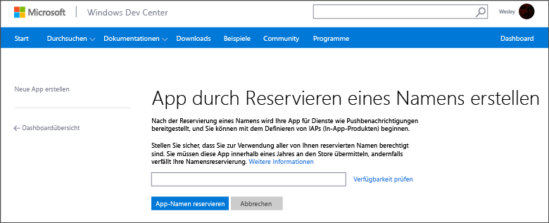
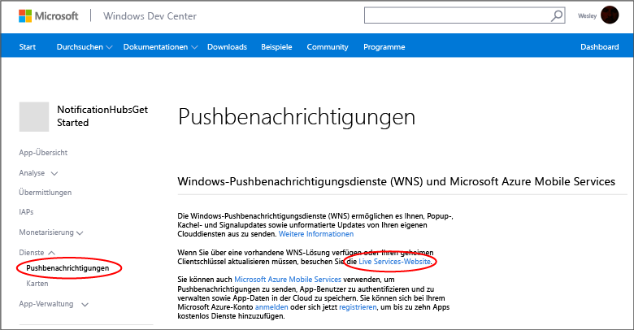

<properties
	pageTitle="Erste Schritte mit Azure Notification Hubs für Windows Store Apps | Microsoft Azure"
	description="In diesem Lernprogramm erfahren Sie, wie Sie mit Azure Notification Hubs Pushbenachrichtigungen an eine Windows Store oder Windows Phone 8.1 (nicht Silverlight)-Anwendung senden."
	services="notification-hubs"
	documentationCenter="windows"
	authors="wesmc7777"
	manager="dwrede"
	editor="dwrede"/>

<tags
	ms.service="notification-hubs"
	ms.workload="mobile"
	ms.tgt_pltfrm="mobile-windows"
	ms.devlang="dotnet"
	ms.topic="hero-article"
	ms.date="10/11/2015"
	ms.author="wesmc"/>

# Erste Schritte mit Notification Hubs für Windows Store-Apps

[AZURE.INCLUDE [Notification-Hubs-Auswahl-Erste-Schritte](../../includes/notification-hubs-selector-get-started.md)]

##Übersicht

In diesem Lernprogramm wird gezeigt, wie Sie mit Azure Notification Hubs Pushbenachrichtigungen an eine Windows Store- oder Windows Phone 8.1-Anwendung (kein Silverlight) senden. Wenn Ihr Ziel Windows Phone 8.1 Silverlight ist, konsultieren Sie den Abschnitt zur[Windows Phone](notification-hubs-windows-phone-get-started.md)-Version. In diesem Lernprogramm erstellen Sie eine leere Windows Store-App, die Pushbenachrichtigungen mithilfe des Windows-Pushbenachrichtigungsdiensts (WNS) empfängt. Sobald Sie dieses Lernprogramm abgeschlossen haben, können Sie über Ihren Notification Hub Pushbenachrichtigungen an alle Geräte senden, die Ihre App ausführen.

## Voraussetzungen

[AZURE.INCLUDE [notification-hubs-hero-slug](../../includes/notification-hubs-hero-slug.md)]

Den vollständigen Code für dieses Tutorial finden Sie [hier](https://github.com/Azure/azure-notificationhubs-samples/tree/master/dotnet/GetStartedWindowsUniversal) auf GitHub.

##Voraussetzungen

Für dieses Lernprogramm ist Folgendes erforderlich:

+ Microsoft Visual Studio Express 2013 für Windows with Update 2 Diese Visual Studio-Version ist zum Erstellen eines Projekts für eine universelle App erforderlich. Falls Sie lediglich eine Windows Store-App erstellen möchten, benötigen Sie Visual Studio 2012 Express für Windows 8.

+ Ein aktives Windows Store-Konto

+ Ein aktives Azure-Konto  Wenn Sie noch kein Konto haben, können Sie in nur wenigen Minuten ein kostenloses Testkonto erstellen. Einzelheiten finden Sie unter [Kostenlose Azure-Testversion](http://azure.microsoft.com/pricing/free-trial/?WT.mc_id=A0E0E5C02&amp;returnurl=http%3A%2F%2Fazure.microsoft.com%2Fde-DE%2Fdocumentation%2Farticles%2Fnotification-hubs-windows-store-dotnet-get-started%2F).

Das Abschließen dieses Lernprogramms ist eine Voraussetzung für alle anderen Notification Hub-Lernprogramme für Windows Store-Apps.

##Registrieren der App für den Windows Store

Sie müssen die App dem Windows Store zuordnen, um Pushbenachrichtigungen an Windows Store-Apps senden zu können. Sie müssen anschließend den Benachrichtigungshub zur Integration in den WNS konfigurieren.

1. Falls Sie Ihre Anwendung noch nicht registriert haben, navigieren Sie zum <a href="http://go.microsoft.com/fwlink/p/?LinkID=266582" target="_blank">Windows-Entwicklungscenter</a>, melden Sie sich dort mit Ihrem Microsoft-Konto an, und klicken Sie dann auf **Neue App erstellen**.

2. Geben Sie einen Namen für die App ein, und klicken Sie auf **App-Namen reservieren**.

   	

   	Auf diese Weise wird eine neue Windows Store-Registrierung für Ihre Anwendung erstellt.

3. Erstellen Sie in Visual Studio ein neues Visual C# Store-App-Projekt mit der Vorlage **Leere App**.

   	![][2]

4. Klicken Sie im Projektmappen-Explorer mit der rechten Maustaste auf das Windows Store-App-Projekt, klicken Sie auf **Store**, und klicken Sie dann auf **App mit Store verknüpfen**.

   	![][3]

   	Der Assistent zum Verknüpfen der App mit dem Windows Store wird angezeigt.

5. Klicken Sie im Assistenten auf **Anmelden**. Melden Sie sich dann mit Ihrem Microsoft-Konto an.

6. Klicken Sie auf die App, die Sie in Schritt 2 registriert haben. Klicken Sie auf **Weiter** und dann auf **Zuordnen**.

   	![][4]

   	Auf diese Weise werden die erforderlichen Windows Store-Registrierungsinformationen zum Anwendungsmanifest hinzugefügt.

7. (Optional) Wiederholen Sie die Schritte 4 bis 6 für das Windows Phone Store-App-Projekt.

8. Wechseln Sie wieder zur Seite des Windows-Entwicklungscenters für Ihre neue App. Klicken Sie auf **Services** und **Pushbenachrichtigungen**, und klicken Sie dann unter **Windows-Pushbenachrichtigungsdienste (WNS) und Microsoft Azure Mobile Services** auf **Live Services-Website**.

   	

9. Notieren Sie sich auf der Registerkarte **App-Einstellungen** die Werte von **Geheimer Clientschlüssel** und **Paket-Sicherheits-ID (SID)**.

   	![][6]

 	> [AZURE.WARNING]Der geheime Clientschlüssel und die Paket-SID sind wichtige Sicherheitsanmeldeinformationen. Geben Sie diese Werte nicht weiter, und verteilen Sie sie nicht mit Ihrer Anwendung.

##Konfigurieren Ihres Notification Hub

1. Melden Sie sich beim [Azure-Portal] an, und klicken Sie im unteren Teil des Bildschirms auf **NEU**.

2. Klicken Sie auf **App Services**, dann auf **Service Bus**, danach auf **Notification Hub** und anschließend auf **Schnellerfassung**.

   	![][7]

3. Geben Sie einen Namen für den Notification Hub ein. Wählen Sie die gewünschte Region, und klicken Sie dann auf **Neuen Notification Hub erstellen**.

   	![][8]

4. Klicken Sie auf den soeben erstellten Namespace (normalerweise ***Name des Notification Hub*-ns**) und anschließend oben auf die Registerkarte **Konfigurieren**.

   	![][9]

5. Wählen Sie oben die Registerkarte **Notification Hubs** aus, und klicken Sie dann auf den soeben erstellten Notification Hub.

   	![][10]

6. Wählen Sie oben die Registerkarte **Konfigurieren** aus. Geben Sie die Werte für **Geheimer Clientschlüssel** und **Paket-SID** ein, die Sie im vorigen Abschnitt vom WNS erhalten haben. Klicken Sie dann auf **Speichern**.

   	![][11]

7. Wählen Sie oben die Registerkarte **Dashboard** aus, und klicken Sie dann unten auf der Seite auf die Schaltfläche **Verbindungsinformationen**. Notieren Sie sich die beiden Verbindungszeichenfolgen.

   	![][12]

Der Benachrichtigungshub ist nun konfiguriert, um mit dem WNS arbeiten zu können. Außerdem besitzen Sie die Verbindungszeichenfolgen zum Registrieren der App und zum Senden von Benachrichtigungen.

##Verbinden Ihrer App mit dem Notification Hub

1. Klicken Sie in Visual Studio mit der rechten Maustaste auf die Projektmappe, und klicken Sie dann auf **NuGet-Pakete verwalten**.

	Daraufhin wird das Dialogfeld **NuGet-Pakete verwalten** angezeigt.

2. Suchen Sie nach `WindowsAzure.Messaging.Managed`, klicken Sie auf **Installieren**, wählen Sie alle Projekte in der Projektmappe aus, und akzeptieren Sie die Nutzungsbedingungen.

	![][20]

	Damit wird ein Verweis in allen Projekten auf die Azure Messaging-Bibliothek für Windows mit dem <a href="http://nuget.org/packages/WindowsAzure.Messaging.Managed/">WindowsAzure.Messaging.Managed-NuGet-Paket</a> heruntergeladen, installiert und hinzugefügt.

3. Öffnen Sie die Projektdatei "App.xaml.cs", und fügen Sie die folgenden `using`-Anweisungen hinzu. In einem universellen Projekt befindet sich diese Datei im Ordner `<project_name>.Shared`.

        using Windows.Networking.PushNotifications;
        using Microsoft.WindowsAzure.Messaging;
		using Windows.UI.Popups;

4. Fügen Sie auch in der Datei "App.xaml.cs" der **App**-Klasse folgende **InitNotificationsAsync**-Methodendefinition hinzu:

	    private async void InitNotificationsAsync()
        {
            var channel = await PushNotificationChannelManager.CreatePushNotificationChannelForApplicationAsync();

            var hub = new NotificationHub("<hub name>", "<connection string with listen access>");
			var result = await hub.RegisterNativeAsync(channel.Uri);

            // Displays the registration ID so you know it was successful
            if (result.RegistrationId != null)
            {
                var dialog = new MessageDialog("Registration successful: " + result.RegistrationId);
                dialog.Commands.Add(new UICommand("OK"));
                await dialog.ShowAsync();
            }

        }

    Dieser Code ruft den Kanal-URI für die App von WNS ab und registriert dann diesen Kanal-URI bei Ihrem Benachrichtigungshub.

    >[AZURE.NOTE]Stellen Sie sicher, dass Sie den Platzhalter "Hub-Name" durch den Namen des Benachrichtigungshubs ersetzen, der im Portal auf der Registerkarte **Benachrichtigungshubs** angezeigt wird (wie etwa **mynotificationhub2** im vorigen Beispiel). Ersetzen Sie außerdem den Platzhalter für die Verbindungszeichenfolge durch die Verbindungszeichenfolge **DefaultListenSharedAccessSignature**, die Sie im vorherigen Abschnitt erhalten haben.

5. Fügen Sie in der Datei "App.xaml.cs" am Anfang des **OnLaunched**-Ereignishandlers den folgenden Aufruf zu der neuen **InitNotificationsAsync**-Methode hinzu:

        InitNotificationsAsync();

    Dadurch wird gewährleistet, dass der Kanal-URI bei jedem Start der Anwendung im Notification Hub registriert wird.

6. Doppelklicken Sie im Projektmappen-Explorer auf die Datei **Package.appxmanifest** der Windows Store-App, und legen Sie dann unter **Benachrichtigungen** die Option **Toastfähig** auf **Ja** fest:

   	![][18]

   	Klicken Sie im Menü **Datei** auf **Alle speichern**.

7. (Optional) Wiederholen Sie den vorherigen Schritt für das Windows Phone Store-App-Projekt.

8. Drücken Sie **F5**, um die App auszuführen. Ein Dialogfenster mit dem Registrierungsschlüssel wird angezeigt.

   	![][19]

9. (Optional) Wiederholen Sie den vorherigen Schritt zum Ausführen des Windows Phone-Projekts, um die App auf einem Windows Phone-Gerät zu registrieren.

Ihre App kann jetzt Popupbenachrichtigungen empfangen.

##Senden von Benachrichtigungen 

Sie können den Empfang von Benachrichtigungen in Ihrer App testen, indem Sie wie im Bildschirm unten abgebildet Benachrichtigungen im Azure-Portal über die Registerkarte zum Debuggen im Notification Hub senden.

Pushbenachrichtigungen werden normalerweise in einem Back-End-Dienst wie z. B. Mobile Services oder ASP.NET mit einer kompatiblen Bibliothek gesendet. Sie können Benachrichtigungsmeldungen zudem direkt über die REST-API senden, wenn für Ihr Back-End keine Bibliothek verfügbar ist.

In diesem Lernprogramm gehen wir einfach vor und veranschaulichen nur das Testen der Client-App, indem wir Benachrichtigungen mit dem .NET SDK für Notification Hubs in einer Konsolenanwendung senden, anstatt über einen Back-End-Dienst. Es wird empfohlen, das Tutorial [Verwenden von Notification Hubs für Pushbenachrichtigungen an Benutzer] als nächsten Schritt zum Senden von Benachrichtigungen von einem ASP.NET-Back-End zu nutzen. Sie können aber die folgenden Vorgehensweisen zum Senden von Benachrichtigungen verwenden:

* **REST-Schnittstelle**: Sie können die Benachrichtigung auf allen Back-End-Plattformen unterstützen, indem Sie die [REST-Schnittstelle](http://msdn.microsoft.com/library/windowsazure/dn223264.aspx) verwenden.

* **Microsoft Azure Notification Hubs .NET SDK**: Führen Sie im Nuget-Paket-Manager für Visual Studio die Option [Install-Package Microsoft.Azure.NotificationHubs](https://www.nuget.org/packages/Microsoft.Azure.NotificationHubs/) aus.

* **Node.js** : [Verwenden von Notification Hubs mit Node.js](notification-hubs-nodejs-how-to-use-notification-hubs.md).

* **Azure Mobile Services**: Ein Beispiel zum Senden von Benachrichtigungen von einem mit Notification Hubs integrierten Azure Mobile Services-Back-End aus finden Sie unter "Erste Schritte mit Pushbenachrichtigungen in Mobile Services" ([.NET-Back-End](../mobile-services/mobile-services-javascript-backend-windows-store-dotnet-get-started-push.md) | [JavaScript-Back-End](../mobile-services/mobile-services-javascript-backend-windows-store-dotnet-get-started-push.md)).

* **Java/PHP**: Ein Beispiel zum Senden von Benachrichtigungen über die REST-APIs finden Sie unter "Verwenden von Notification Hubs von Java/PHP" ([Java](notification-hubs-java-backend-how-to.md) | [PHP](notification-hubs-php-backend-how-to.md)).

## (Optional) Senden von Benachrichtigungen aus einer Konsolenanwendung

Führen Sie die folgenden Schritte aus, um Benachrichtigungen mithilfe einer .NET-Konsolenanwendung zu senden.

1. Klicken Sie mit der rechten Maustaste auf die Projektmappe, wählen Sie **Hinzufügen** und **Neues Projekt...** aus, und klicken Sie dann unter **Visual C#** auf **Windows**, **Konsolenanwendung** und **OK**.

   	![][13]

	Damit wird der Projektmappe eine neue Visual C#-Konsolenanwendung hinzugefügt. Sie können dies auch in einer separaten Projektmappe durchführen.

4. Klicken Sie in Visual Studio auf **Extras**, auf **NuGet-Paket-Manager** und dann auf **Paket-Manager-Konsole**.

	Daraufhin wird in Visual Studio die Paket-Manager-Konsole angezeigt.

6. Legen Sie im Fenster der Paket-Manager-Konsole als **Standardprojekt** das neue Konsolenanwendungsprojekt fest, und führen Sie dann im Konsolenfenster den folgenden Befehl aus:

        Install-Package Microsoft.Azure.NotificationHubs

	Dies fügt mithilfe des <a href="http://www.nuget.org/packages/Microsoft.Azure.NotificationHubs/">Microsoft.Azure.Notification Hubs-NuGet-Pakets</a> einen Verweis auf das Azure Notification Hubs-SDK hinzu.

	

5. Öffnen Sie die Datei "Program.cs", und fügen Sie die folgende `using`-Anweisung hinzu:

        using Microsoft.Azure.NotificationHubs;

6. Fügen Sie in der Klasse **Program** folgende Methode hinzu:

        private static async void SendNotificationAsync()
        {
            NotificationHubClient hub = NotificationHubClient
				.CreateClientFromConnectionString("<connection string with full access>", "<hub name>");
            var toast = @"<toast><visual><binding template=""ToastText01""><text id=""1"">Hello from a .NET App!</text></binding></visual></toast>";
            await hub.SendWindowsNativeNotificationAsync(toast);
        }

   	Stellen Sie sicher, dass Sie den Platzhalter "hub name" durch den Namen des Notification Hub ersetzen, der im Portal auf der Registerkarte **Notification Hubs** angezeigt wird. Ersetzen Sie außerdem den Platzhalter für die Verbindungszeichenfolge durch die Verbindungszeichenfolge **DefaultFullSharedAccessSignature**, die Sie im Abschnitt "Konfigurieren Ihres Notification Hubs" erhalten haben.

	>[AZURE.NOTE]Stellen Sie sicher, dass Sie die Verbindungszeichenfolge mit Vollzugriff (**Full**) und nicht mit dem Zugriff (**Listen**) verwenden. Die Verbindungszeichenfolge mit Abhörzugriff verfügt nicht über die Berechtigungen zum Senden von Benachrichtigungen.

7. Fügen Sie die folgenden Zeilen zur **Main**-Methode hinzu:

         SendNotificationAsync();
		 Console.ReadLine();

8. Klicken Sie in Visual Studio mit der rechten Maustaste auf das Konsolenanwendungsprojekt, und klicken Sie auf **Als Startprojekt festlegen**, um es als Startprojekt festzulegen. Drücken Sie dann die Taste **F5**, um die Anwendung auszuführen.

   	![][14]

	Sie erhalten eine Popupbenachrichtigung auf allen registrierten Geräten. Durch Klicken oder Tippen auf das Popupbanner wird die App geladen.

Sie finden alle unterstützten Nutzlasten auf MSDN in den Themen [Toast-Katalog], [Kachelkatalog] und [Übersicht über Signale].

##Nächste Schritte

In diesem einfachen Beispiel haben Sie Übertragungsbenachrichtigungen mit dem Portal oder einer Konsolen-App an alle Ihre Windows-Geräte gesendet. Als nächster Schritt wird das Tutorial [Verwenden von Notification Hubs für Pushbenachrichtigungen an Benutzer] empfohlen. Darin wird beschrieben, wie Sie Benachrichtigungen von einem ASP.NET-Back-End für bestimmte Benutzer mithilfe von Tags senden.

Wenn Sie Ihre Benutzer nach Interessengruppen unterteilen möchten, lesen Sie [Verwenden von Benachrichtigungshubs zum Senden von neuesten Nachrichten].

Weitere allgemeine Informationen zu Notification Hubs finden Sie im [Notification Hubs-Leitfaden].

<!-- Images. -->
[2]: ./media/notification-hubs-windows-store-dotnet-get-started/notification-hub-create-windows-universal-app.png
[3]: ./media/notification-hubs-windows-store-dotnet-get-started/notification-hub-associate-win8-app.png
[4]: ./media/notification-hubs-windows-store-dotnet-get-started/mobile-services-select-app-name.png
[6]: ./media/notification-hubs-windows-store-dotnet-get-started/mobile-services-win8-app-push-auth.png
[7]: ./media/notification-hubs-windows-store-dotnet-get-started/notification-hub-create-from-portal.png
[8]: ./media/notification-hubs-windows-store-dotnet-get-started/notification-hub-create-from-portal2.png
[9]: ./media/notification-hubs-windows-store-dotnet-get-started/notification-hub-select-from-portal.png
[10]: ./media/notification-hubs-windows-store-dotnet-get-started/notification-hub-select-from-portal2.png
[11]: ./media/notification-hubs-windows-store-dotnet-get-started/notification-hub-configure-wns.png
[12]: ./media/notification-hubs-windows-store-dotnet-get-started/notification-hub-connection-strings.png
[13]: ./media/notification-hubs-windows-store-dotnet-get-started/notification-hub-create-console-app.png
[14]: ./media/notification-hubs-windows-store-dotnet-get-started/notification-hub-windows-toast.png
[15]: ./media/notification-hubs-windows-store-dotnet-get-started/notification-hub-scheduler1.png
[16]: ./media/notification-hubs-windows-store-dotnet-get-started/notification-hub-scheduler2.png
[18]: ./media/notification-hubs-windows-store-dotnet-get-started/notification-hub-win8-app-toast.png
[19]: ./media/notification-hubs-windows-store-dotnet-get-started/notification-hub-windows-reg.png
[20]: ./media/notification-hubs-windows-store-dotnet-get-started/notification-hub-windows-universal-app-install-package.png

<!-- URLs. -->
[Azure-Portal]: https://manage.windowsazure.com/
[Notification Hubs-Leitfaden]: http://msdn.microsoft.com/library/jj927170.aspx

[Verwenden von Notification Hubs für Pushbenachrichtigungen an Benutzer]: notification-hubs-aspnet-backend-windows-dotnet-notify-users.md
[Verwenden von Benachrichtigungshubs zum Senden von neuesten Nachrichten]: notification-hubs-windows-store-dotnet-send-breaking-news.md

[Toast-Katalog]: http://msdn.microsoft.com/library/windows/apps/hh761494.aspx
[Kachelkatalog]: http://msdn.microsoft.com/library/windows/apps/hh761491.aspx
[Übersicht über Signale]: http://msdn.microsoft.com/library/windows/apps/hh779719.aspx

<!---HONumber=Oct15_HO3-->