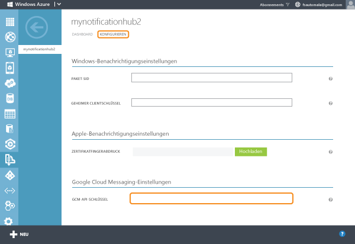

<properties
	pageTitle="Erste Schritte mit Notification Hubs für Xamarin.Android-Apps | Microsoft Azure"
	description="In diesem Lernprogramm erfahren Sie, wie Sie mithilfe von Azure Notification Hubs eine Pushbenachrichtigung an eine Xamarin.Android-App senden."
	authors="wesmc7777"
	manager="dwrede"
	editor=""
	services="notification-hubs"
	documentationCenter="xamarin"/>

<tags
	ms.service="notification-hubs"
	ms.workload="mobile"
	ms.tgt_pltfrm="mobile-xamarin-android"
	ms.devlang="dotnet"
	ms.topic="hero-article"
	ms.date="11/17/2015"
	ms.author="wesmc"/>

# Erste Schritte mit Notification Hubs mit Xamarin für Android

[AZURE.INCLUDE [Notification-Hubs-Auswahl-Erste-Schritte](../../includes/notification-hubs-selector-get-started.md)]

##Übersicht

In diesem Lernprogramm erfahren Sie, wie Sie mithilfe von Azure Notification Hubs eine Pushbenachrichtigung an eine Xamarin.Android-App senden. Sie erstellen eine leere Xamarin.Android-App, die Pushbenachrichtigungen mithilfe von Google Cloud Messaging (GCM) empfängt. Sobald Sie dieses Lernprogramm abgeschlossen haben, können Sie über Ihren Notification Hub Pushbenachrichtigungen an alle Geräte senden, die Ihre App ausführen. Der komplette Code ist verfügbar in der [NotificationHubs-Beispiel-App][GitHub].

Das Lernprogramm zeigt ein einfaches Übertragungsszenario mithilfe von Notification Hubs.

## Voraussetzungen

[AZURE.INCLUDE [notification-hubs-hero-slug](../../includes/notification-hubs-hero-slug.md)]

Den vollständigen Code für dieses Tutorial finden Sie [hier](https://github.com/Azure/azure-notificationhubs-samples/tree/master/dotnet/Xamarin/GetStartedXamarinAndroid) auf GitHub.

##Voraussetzungen

Für dieses Lernprogramm ist Folgendes erforderlich:

+ [Xamarin.Android]
+ Ein aktives Google-Konto
+ [Azure Mobile Services-Komponente]
+ [Azure Messaging-Komponente]
+ [Google Cloud Messaging Client-Komponente]

Das Abschließen dieses Lernprogramms ist eine Voraussetzung für alle anderen Notification Hubs-Lernprogramme für Xamarin.Android-Apps.

> [AZURE.IMPORTANT] Sie benötigen ein aktives Azure-Konto, um dieses Lernprogramm abzuschließen. Wenn Sie noch kein Konto haben, können Sie in nur wenigen Minuten ein kostenloses Testkonto erstellen. Weitere Informationen finden Sie unter [Kostenloses Azure-Testkonto](https://azure.microsoft.com/pricing/free-trial/?WT.mc_id=A9C9624B5&amp;returnurl=http%3A%2F%2Fazure.microsoft.com%2Fde-DE%2Fdocumentation%2Farticles%2Fpartner-xamarin-notification-hubs-android-get-started%2F).

##Aktivieren von Google Cloud Messaging

[AZURE.INCLUDE [mobile-services-enable-Google-cloud-messaging](../../includes/mobile-services-enable-google-cloud-messaging.md)]

##Konfigurieren Ihres Notification Hub

[AZURE.INCLUDE [notification-hubs-portal-create-new-hub](../../includes/notification-hubs-portal-create-new-hub.md)]

<ol start="7">
<li>
Klicken Sie auf die Registerkarte <b>Configure</b>, geben Sie den Wert <b>API Key</b> ein, den Sie im vorherigen Abschnitt erhalten haben, und klicken Sie auf <b>Save</b>.

</li>
</ol>
&emsp;&emsp;

Der Notification Hub ist jetzt für die Arbeit mit GCM konfiguriert, und Sie besitzen die Verbindungszeichenfolge, um die App für den Empfang von Benachrichtigungen zu registrieren und Pushbenachrichtigungen zu versenden.

##Verbinden Ihrer App mit dem Notification Hub

###Erstellen eines neuen Projekts

1. Klicken Sie in Xamarin Studio auf **New Solution**, dann auf **Android App** und danach auf **Next**.

   	

2. Füllen Sie **App Name** und **Identifier** aus. Klicken Sie auf die **Zielplattformen**, die Sie unterstützen möchten, und dann auf **Next** und **Create**.

   	

	Dadurch wird ein neues Android-Projekt erstellt.

2. Klicken Sie in der Lösungsansicht mit der rechten Maustaste auf Ihr neues Projekt, und wählen Sie **Options** aus, um die Projekteigenschaften zu öffnen. Wählen Sie das Element **Android Application** im Bereich **Build** aus.

	Ihr **Package name** muss mit einem Kleinbuchstaben beginnen.

	> [AZURE.IMPORTANT] Der erste Buchstabe im Paketnamen muss ein Kleinbuchstabe sein. Andernfalls erhalten Sie Anwendungsmanifestfehler, wenn Sie Ihre **BroadcastReceiver** und **IntentFilter** weiter unten für Pushbenachrichtigungen registrieren.

   	

3. Legen Sie optional die **Minimum Android version** auf einen anderen API Level fest.

4. Legen Sie optional die **Target Android version** auf Ihre gewünschte Zielversion der API fest (API Level 8 oder höher).

Klicken Sie auf **OK**, um das Dialogfeld „Project Options“ zu schließen.

###Hinzufügen der gewünschten Komponenten zum Projekt

Der im Xamarin Component Store erhältliche Google Cloud Messaging Client vereinfacht das Vorgehen bei der Bereitstellung von Pushbenachrichtigungen in Xamarin.Android.

1. Klicken Sie in der Xamarin.Android-App mit der rechten Maustaste auf den Ordner „Components“, und wählen Sie **Get More Components** aus.

2. Suchen Sie nach der Komponente **Azure Messaging**, und fügen Sie sie dem Projekt hinzu.

3. Suchen Sie nach der Komponente **Google Cloud Messaging Client**, und fügen Sie sie dem Projekt hinzu.

###Einrichten von Notification Hubs in Ihrem Projekt

1. Erfassen Sie für Ihre Android-App und den Notification Hub folgende Informationen:

	- **GoogleProjectNumber**: Rufen Sie den Wert dieser Projektnummer aus der Übersicht Ihrer App im Google Developer Portal ab. Sie haben diesen Wert bereits beim Erstellen der App im Portal notiert.
	- **Verbindungszeichenfolge für Überwachung**: Klicken Sie auf dem Dashboard im [klassischen Azure-Portal] auf **Verbindungszeichenfolgen anzeigen**. Kopieren Sie die Verbindungszeichenfolge *DefaultListenSharedAccessSignature* für diesen Wert.
	- **Hub-Name**: Dies ist der Name des Hubs aus dem [klassischen Azure-Portal]. Beispiel: *mynotificationhub2*.

	Erstellen Sie eine **Constants.cs**-Klasse für Ihr Xamarin-Projekt und definieren Sie die folgenden Konstantenwerte in der Klasse. Ersetzen Sie die Platzhalter durch Ihre Werte.

		public static class Constants
		{
			public const string SenderID = "<GoogleProjectNumber>"; // Google API Project Number
			public const string ListenConnectionString = "<Listen connection string>";
			public const string NotificationHubName = "<hub name>";
		}

2. Fügen Sie die folgenden using-Anweisungen zu **MainActivity.cs** hinzu:

		using Android.Util;
		using Gcm.Client;

3. Fügen Sie der `MainActivity`-Klasse eine Instanzvariable hinzu, die bei laufender App zum Anzeigen eines Warndialogfelds verwendet wird.

		public static MainActivity instance;

3. Fügen Sie der **MainActivity**-Klasse die folgende Methode hinzu:

		private void RegisterWithGCM()
		{
			// Check to ensure everything's set up right
			GcmClient.CheckDevice(this);
			GcmClient.CheckManifest(this);

			// Register for push notifications
			Log.Info("MainActivity", "Registering...");
			GcmClient.Register(this, Constants.SenderID);
		}

4. Initialisieren Sie in der `OnCreate`-Methode von **MainActivity.cs** die `instance`-Variable, und fügen Sie einen Aufruf von `RegisterWithGCM` hinzu:

		protected override void OnCreate (Bundle bundle)
		{
			instance = this;

			base.OnCreate (bundle);

			// Set your view from the "main" layout resource
			SetContentView (Resource.Layout.Main);

			// Get your button from the layout resource,
			// and attach an event to it
			Button button = FindViewById<Button> (Resource.Id.myButton);

			RegisterWithGCM();
		}

4. Erstellen Sie eine neue Klasse namens **MyBroadcastReceiver**.

	> [AZURE.NOTE] Die Erstellung einer **BroadcastReceivers**-Klasse wird nachstehend von Grund auf erläutert. Eine schnelle Alternative zur manuellen Erstellung von **MyBroadcastReceiver.cs** ist jedoch ein Verweis auf die Datei **GcmService.cs** im Xamarin.Android-Projektbeispiel in den [NotificationHubs-Beispielen][GitHub]. Sie können für den Anfang auch **GcmService.cs** duplizieren und die Klassennamen ändern.

5. Fügen Sie die folgenden „using“-Anweisungen in **MyBroadcastReceiver.cs** ein (mit Verweis auf die zuvor hinzugefügte Komponente und Assembly):

		using System.Collections.Generic;
		using System.Text;
		using Android.App;
		using Android.Content;
		using Android.Util;
		using Gcm.Client;
		using WindowsAzure.Messaging;

5. Fügen Sie **MyBroadcastReceiver.cs** die folgenden Berechtigungsanforderungen zwischen den **using**-Anweisungen und der **namespace**-Deklaration hinzu:

		[assembly: Permission(Name = "@PACKAGE_NAME@.permission.C2D_MESSAGE")]
		[assembly: UsesPermission(Name = "@PACKAGE_NAME@.permission.C2D_MESSAGE")]
		[assembly: UsesPermission(Name = "com.google.android.c2dm.permission.RECEIVE")]

		//GET_ACCOUNTS is needed only for Android versions 4.0.3 and below
		[assembly: UsesPermission(Name = "android.permission.GET_ACCOUNTS")]
		[assembly: UsesPermission(Name = "android.permission.INTERNET")]
		[assembly: UsesPermission(Name = "android.permission.WAKE_LOCK")]

6. Ändern Sie in **MyBroadcastReceiver.cs** die Methode **MyBroadcastReceiver** auf folgende Weise:

    	[BroadcastReceiver(Permission=Gcm.Client.Constants.PERMISSION_GCM_INTENTS)]
        [IntentFilter(new string[] { Gcm.Client.Constants.INTENT_FROM_GCM_MESSAGE },
			Categories = new string[] { "@PACKAGE_NAME@" })]
        [IntentFilter(new string[] { Gcm.Client.Constants.INTENT_FROM_GCM_REGISTRATION_CALLBACK },
			Categories = new string[] { "@PACKAGE_NAME@" })]
        [IntentFilter(new string[] { Gcm.Client.Constants.INTENT_FROM_GCM_LIBRARY_RETRY },
			Categories = new string[] { "@PACKAGE_NAME@" })]
        public class MyBroadcastReceiver : GcmBroadcastReceiverBase<PushHandlerService>
        {
            public static string[] SENDER_IDS = new string[] { Constants.SenderID };

            public const string TAG = "MyBroadcastReceiver-GCM";
        }

7. Fügen Sie in **MyBroadcastReceiver.cs** eine weitere Klasse mit dem Namen **PushHandlerService** hinzu, die von **GcmServiceBase** abgeleitet wird. Wenden Sie unbedingt das **Service**-Attribut auf die Klasse an:

    	[Service] // Must use the service tag
    	public class PushHandlerService : GcmServiceBase
    	{
        	public static string RegistrationID { get; private set; }
        	private NotificationHub Hub { get; set; }

        	public PushHandlerService() : base(Constants.SenderID)
       		{
            	Log.Info(MyBroadcastReceiver.TAG, "PushHandlerService() constructor");
        	}
    	}

8. **GcmServiceBase** implementiert die Methoden **OnRegistered()**, **OnUnRegistered()**, **OnMessage()**, **OnRecoverableError()** und **OnError()**. Unsere Implementierungsklasse **PushHandlerService** muss diese Methoden überschreiben, die als Reaktion auf die Interaktion mit dem Notification Hub aufgerufen werden.

9. Überschreiben Sie die **OnRegistered()**-Methode in **PushHandlerService** mithilfe des folgenden Codes:

		protected override void OnRegistered(Context context, string registrationId)
		{
			Log.Verbose(MyBroadcastReceiver.TAG, "GCM Registered: " + registrationId);
			RegistrationID = registrationId;

			createNotification("PushHandlerService-GCM Registered...",
								"The device has been Registered!");

			Hub = new NotificationHub(Constants.NotificationHubName, Constants.ListenConnectionString,
										context);
			try
			{
				Hub.UnregisterAll(registrationId);
			}
			catch (Exception ex)
			{
				Log.Error(MyBroadcastReceiver.TAG, ex.Message);
			}

			//var tags = new List<string>() { "falcons" }; // create tags if you want
			var tags = new List<string>() {};

			try
			{
				var hubRegistration = Hub.Register(registrationId, tags.ToArray());
			}
			catch (Exception ex)
			{
				Log.Error(MyBroadcastReceiver.TAG, ex.Message);
			}
		}

	> [AZURE.NOTE] Beachten Sie im obigen **OnRegistered()**-Code die Möglichkeit, Tags für bestimmte Nachrichtenkanäle zu registrieren.

10. Überschreiben Sie die **OnMessage**-Methode in **PushHandlerService** mithilfe des folgenden Codes:

		protected override void OnMessage(Context context, Intent intent)
		{
			Log.Info(MyBroadcastReceiver.TAG, "GCM Message Received!");

			var msg = new StringBuilder();

			if (intent != null && intent.Extras != null)
			{
				foreach (var key in intent.Extras.KeySet())
					msg.AppendLine(key + "=" + intent.Extras.Get(key).ToString());
			}

			string messageText = intent.Extras.GetString("message");
			if (!string.IsNullOrEmpty (messageText))
			{
				createNotification ("New hub message!", messageText);
			}
			else
			{
				createNotification ("Unknown message details", msg.ToString ());
			}
		}

11. Fügen Sie die folgenden Methoden **createNotification** und **dialogNotify** zu **PushHandlerService** hinzu, damit Benutzer über den Eingang einer Nachricht informiert werden.

	>[AZURE.NOTE] Benachrichtigen in Android Version 5.0 und höher unterscheiden sich in der Ausführung deutlich von früheren Versionen. Wenn Sie dies in Android 5.0 prüfen, muss die App ausgeführt werden, damit die Benachrichtigung empfangen werden kann. Weitere Informationen finden Sie unter [Android-Benachrichtigungen](http://go.microsoft.com/fwlink/?LinkId=615880).

        void createNotification(string title, string desc)
        {
            //Create notification
            var notificationManager = GetSystemService(Context.NotificationService) as NotificationManager;

            //Create an intent to show UI
            var uiIntent = new Intent(this, typeof(MainActivity));

            //Create the notification
            var notification = new Notification(Android.Resource.Drawable.SymActionEmail, title);

            //Auto-cancel will remove the notification once the user touches it
            notification.Flags = NotificationFlags.AutoCancel;

            //Set the notification info
            //we use the pending intent, passing our ui intent over, which will get called
            //when the notification is tapped.
            notification.SetLatestEventInfo(this, title, desc, PendingIntent.GetActivity(this, 0, uiIntent, 0));

            //Show the notification
            notificationManager.Notify(1, notification);
			dialogNotify (title, desc);
        }

		protected void dialogNotify(String title, String message)
		{

			MainActivity.instance.RunOnUiThread(() => {
				AlertDialog.Builder dlg = new AlertDialog.Builder(MainActivity.instance);
				AlertDialog alert = dlg.Create();
				alert.SetTitle(title);
				alert.SetButton("Ok", delegate {
					alert.Dismiss();
				});
				alert.SetMessage(message);
				alert.Show();
			});
		}

12. Überschreiben Sie die abstrakten Member **OnUnRegistered()**, **OnRecoverableError()** und **OnError()**, um Ihren Code kompilieren zu können:

		protected override void OnUnRegistered(Context context, string registrationId)
		{
			Log.Verbose(MyBroadcastReceiver.TAG, "GCM Unregistered: " + registrationId);

			createNotification("GCM Unregistered...", "The device has been unregistered!");
		}

		protected override bool OnRecoverableError(Context context, string errorId)
		{
			Log.Warn(MyBroadcastReceiver.TAG, "Recoverable Error: " + errorId);

			return base.OnRecoverableError (context, errorId);
		}

		protected override void OnError(Context context, string errorId)
		{
			Log.Error(MyBroadcastReceiver.TAG, "GCM Error: " + errorId);
		}

##Ausführen der App im Emulator

Stellen Sie beim Ausführen dieser App im Emulator sicher, dass Sie ein Android Virtual Device (AVD) verwenden, das Google-APIs unterstützt.

> [AZURE.IMPORTANT] Um Pushbenachrichtigungen zu erhalten, müssen Sie ein Google-Konto auf Ihrem Android Virtual Device einrichten. (Navigieren Sie im Emulator zu **Einstellungen** und klicken Sie auf **Konto hinzufügen**.) Überprüfen Sie zudem, dass der Emulator mit dem Internet verbunden ist.

>[AZURE.NOTE] Benachrichtigen in Android Version 5.0 und höher unterscheiden sich in der Ausführung deutlich von früheren Versionen. Weitere Informationen finden Sie unter [Android-Benachrichtigungen](http://go.microsoft.com/fwlink/?LinkId=615880).

1. Klicken Sie unter **Tools** auf **Open Android Emulator Manager**, wählen Sie Ihr Gerät aus, und klicken Sie auf **Edit**.

   	![][18]

2. Wählen Sie **Google APIs** in **Ziel** aus, und klicken Sie dann auf **OK**.

   	![][19]

3. Klicken Sie in der oberen Symbolleiste auf **Run**, und wählen Sie Ihre App aus. Daraufhin wird der Emulator gestartet und die App ausgeführt.

  Die App ruft die *registrationId* von GCM ab und registriert sich beim Notification Hub.

##Senden von Benachrichtigungen von Ihrem Back-End aus

Sie können den Empfang von Benachrichtigungen in Ihrer App testen, indem Sie wie im Bildschirm unten abgebildet Benachrichtigungen im [klassischen Azure-Portal] über die Registerkarte zum Debuggen im Notification Hub senden.

![][30]

Pushbenachrichtigungen werden normalerweise in einem Back-End-Dienst wie z. B. Mobile Services oder ASP.NET über eine kompatible Bibliothek gesendet. Sie können Benachrichtigungsmeldungen zudem direkt über die REST-API senden, wenn für Ihr Back-End keine Bibliothek verfügbar ist.

Es folgen einige andere Lernprogramme, die Informationen zum Senden von Benachrichtigungen enthalten:

- ASP.NET: Siehe [Verwenden von Notification Hubs für Pushbenachrichtigungen an Benutzer].
- Azure Notification Hubs Java-SDK: Informationen zum Senden von Benachrichtigungen über Java finden Sie unter [Verwenden von Notification Hubs von Java aus](notification-hubs-java-backend-how-to.md). Dies wurde für die Android-Entwicklung in Eclipse getestet.
- PHP: Siehe [Verwenden von Notification Hubs von PHP aus](notification-hubs-php-backend-how-to.md).

In den folgenden Unterabschnitten des Lernprogramms senden Sie Benachrichtigungen mit einer .NET-Konsolen-App und mit einem mobilen Dienst unter Verwendung eines Knotenskripts.

####(Optional) Senden von Benachrichtigungen mit einer .NET-App

In diesem Abschnitt senden Sie Benachrichtigungen mithilfe einer .NET-Konsolen-App.

1. Erstellen einer neuen Visual C#-Konsolenanwendung:

   	![][20]

2. Klicken Sie in Visual Studio auf **Extras**, auf **NuGet-Paket-Manager** und dann auf **Paket-Manager-Konsole**.

	Daraufhin wird in Visual Studio die Paket-Manager-Konsole angezeigt.

3. Legen Sie im Fenster der Paket-Manager-Konsole als **Standardprojekt** das neue Konsolenanwendungsprojekt fest, und führen Sie dann im Konsolenfenster den folgenden Befehl aus:

        Install-Package Microsoft.Azure.NotificationHubs

	Dies fügt mithilfe des <a href="http://www.nuget.org/packages/Microsoft.Azure.NotificationHubs/">Microsoft.Azure.NotificationHubs-NuGet-Pakets</a> einen Verweis auf das Azure Notification Hubs-SDK hinzu.

	

4. Öffnen Sie die Datei „Program.cs“, und fügen Sie die folgende `using`-Anweisung hinzu:

        using Microsoft.Azure.NotificationHubs;

5. Fügen Sie der `Program`-Klasse die folgende Methode hinzu: Aktualisieren Sie den Platzhaltertext mit der Verbindungszeichenfolge *DefaultFullSharedAccessSignature* und dem Hub-Namen aus dem [klassischen Azure-Portal].

        private static async void SendNotificationAsync()
        {
            NotificationHubClient hub = NotificationHubClient.CreateClientFromConnectionString("<connection string with full access>", "<hub name>");
            await hub.SendGcmNativeNotificationAsync("{ \"data\" : {\"message\":\"Hello from Azure!\"}}");
        }

6. Fügen Sie folgende Zeilen zur **Main**-Methode hinzu:

         SendNotificationAsync();
		 Console.ReadLine();

7. Drücken Sie die Taste F5, um die App auszuführen. Sie sollten in der App eine Benachrichtigung erhalten.

   	![][21]

####(Optional) Senden von Benachrichtigungen mit einem mobilen Service

1. Befolgen Sie die [Ersten Schritte mit Mobile Services].

1. Melden Sie sich beim [klassischen Azure-Portal] an, und wählen Sie Ihren mobilen Dienst aus.

2. Wählen Sie oben die Registerkarte **Scheduler** aus.

   	![][22]

3. Erstellen Sie einen neuen geplanten Auftrag. Fügen Sie einen Namen ein, und klicken Sie dann auf **On demand**.

   	![][23]

4. Wenn der Auftrag erstellt ist, klicken Sie auf den Auftragsnamen. Klicken Sie anschließend in der Kopfleiste auf die Registerkarte **Skript**.

5. Fügen Sie das folgende Skript in Ihre Scheduler-Funktion ein. Stellen Sie sicher, dass Sie die Platzhalter durch den Notification Hub-Namen und die Verbindungszeichenfolge für *DefaultFullSharedAccessSignature* ersetzen, die Sie zuvor erhalten haben. Klicken Sie auf **Speichern**.

        var azure = require('azure');
		var notificationHubService = azure.createNotificationHubService('<hub name>', '<connection string>');
		notificationHubService.gcm.send(null,'{"data":{"message" : "Hello from Mobile Services!"}}',
    	  function (error)
    	  {
        	if (!error) {
               console.warn("Notification successful");
            }
            else
            {
              console.warn("Notification failed" + error);
            }
          }
	    );

6. Klicken Sie in der unteren Leiste auf **Run Once**. Sie sollten dann eine Popupbenachrichtigung erhalten.

##Nächste Schritte

In diesem einfachen Beispiel haben Sie Benachrichtigungen an alle Android-Geräte versendet. Informationen zum Adressieren bestimmter Benutzer finden Sie in dem Lernprogramm [Benachrichtigen von Benutzern mit Benachrichtigungshubs]. Wenn Sie Ihre Benutzer in Interessengruppen einteilen möchten, finden Sie unter [Verwenden von Benachrichtigungshubs zum Übermitteln von Nachrichten] weitere Informationen. Mehr zur Verwendung von Notification Hubs erfahren Sie im [Notification Hubs-Leitfaden] und unter [Notification Hubs für Android].

<!-- Anchors. -->
[Enable Google Cloud Messaging]: #register
[Configure your Notification Hub]: #configure-hub
[Connecting your app to the Notification Hub]: #connecting-app
[Run your app with the emulator]: #run-app
[Send notifications from your back-end]: #send
[Next steps]: #next-steps

<!-- Images. -->

[11]: ./media/partner-xamarin-notification-hubs-android-get-started/notification-hub-configure-android.png

[13]: ./media/partner-xamarin-notification-hubs-android-get-started/notification-hub-create-xamarin-android-app1.png
[15]: ./media/partner-xamarin-notification-hubs-android-get-started/notification-hub-create-xamarin-android-app3.png

[18]: ./media/partner-xamarin-notification-hubs-android-get-started/notification-hub-create-android-app7.png
[19]: ./media/partner-xamarin-notification-hubs-android-get-started/notification-hub-create-android-app8.png

[20]: ./media/partner-xamarin-notification-hubs-android-get-started/notification-hub-create-console-app.png
[21]: ./media/partner-xamarin-notification-hubs-android-get-started/notification-hub-android-toast.png
[22]: ./media/partner-xamarin-notification-hubs-android-get-started/notification-hub-scheduler1.png
[23]: ./media/partner-xamarin-notification-hubs-android-get-started/notification-hub-scheduler2.png

[30]: ./media/partner-xamarin-notification-hubs-android-get-started/notification-hubs-debug-hub-gcm.png

<!-- URLs. -->
[Submit an app page]: http://go.microsoft.com/fwlink/p/?LinkID=266582
[My Applications]: http://go.microsoft.com/fwlink/p/?LinkId=262039
[Live SDK for Windows]: http://go.microsoft.com/fwlink/p/?LinkId=262253
[Ersten Schritte mit Mobile Services]: /develop/mobile/tutorials/get-started-xamarin-android/#create-new-service
[JavaScript and HTML]: /develop/mobile/tutorials/get-started-with-push-js

[klassischen Azure-Portal]: https://manage.windowsazure.com/
[wns object]: http://go.microsoft.com/fwlink/p/?LinkId=260591
[Notification Hubs-Leitfaden]: http://msdn.microsoft.com/library/jj927170.aspx
[Notification Hubs für Android]: http://msdn.microsoft.com/library/dn282661.aspx

[Benachrichtigen von Benutzern mit Benachrichtigungshubs]: /manage/services/notification-hubs/notify-users-aspnet
[Verwenden von Notification Hubs für Pushbenachrichtigungen an Benutzer]: /manage/services/notification-hubs/notify-users-aspnet
[Verwenden von Benachrichtigungshubs zum Übermitteln von Nachrichten]: /manage/services/notification-hubs/breaking-news-dotnet
[GCMClient Component page]: http://components.xamarin.com/view/GCMClient
[Xamarin.NotificationHub GitHub page]: https://github.com/SaschaDittmann/Xamarin.NotificationHub
[GitHub]: http://go.microsoft.com/fwlink/p/?LinkId=331329
[Xamarin.Android]: http://xamarin.com/download/
[Azure Mobile Services-Komponente]: http://components.xamarin.com/view/azure-mobile-services/
[Google Cloud Messaging Client-Komponente]: http://components.xamarin.com/view/GCMClient/
[Azure Messaging-Komponente]: http://components.xamarin.com/view/azure-messaging

<!---HONumber=AcomDC_0128_2016-->