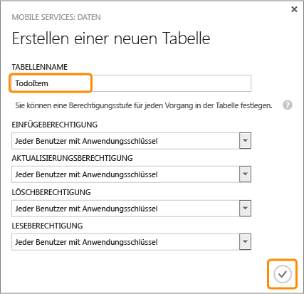

<properties linkid="develop-mobile-tutorials-get-started-with-data-xamarin-android" urlDisplayName="Get Started with Data" pageTitle="Get started with data (Xamarin.Android) - Azure Mobile Services" metaKeywords="Azure Xamarin.Android data, Azure mobile services data" description="Learn how to store and access data from your Azure Mobile Services Xamarin.Android app." metaCanonical="" disqusComments="1" umbracoNaviHide="1" title="Get started with data in Mobile Services" documentationCenter="Mobile" authors="" />

Erste Schritte mit Daten in Mobile Services
===========================================

[Windows Store C\#](/de-de/develop/mobile/tutorials/get-started-with-data-dotnet "Windows Store C#")[Windows Store JavaScript](/de-de/develop/mobile/tutorials/get-started-with-data-js "Windows Store JavaScript")[Windows Phone](/de-de/develop/mobile/tutorials/get-started-with-data-wp8 "Windows Phone")[iOS](/de-de/develop/mobile/tutorials/get-started-with-data-ios "iOS")[Android](/de-de/develop/mobile/tutorials/get-started-with-data-android "Android")[HTML](/de-de/develop/mobile/tutorials/get-started-with-data-html "HTML")[Xamarin.iOS](/de-de/develop/mobile/tutorials/get-started-with-data-xamarin-ios "Xamarin.iOS")[Xamarin.Android](/de-de/develop/mobile/tutorials/get-started-with-data-xamarin-android "Xamarin.Android")

Dieses Thema beschreibt den Einsatz von Azure Mobile Services für die Nutzung von Daten in Xamarin.Android-Apps. In diesem Lernprogramm laden Sie eine App herunter, die Daten im Speicher ablegt, einen neuen mobilen Dienst erstellt, den mobilen Dienst mit der App integriert und melden sich anschließend im Azure-Verwaltungsportal an, um die Änderungen an den Daten beim Ausführen der App anzuzeigen.

**Hinweis**

Dieses Lernprogramm vermittelt ein besseres Verständnis davon, wie Sie mit Mobile Services in Azure Daten aus einer Xamarin.Android-App speichern und abrufen können. Dieses Thema behandelt viele der Schritte, die Ihnen im Schnellstart für mobile Dienste abgenommen werden. Falls Sie noch keine Erfahrung mit mobilen Diensten haben, sollten Sie eventuell zuerst das Lernprogramm [Erste Schritte mit mobilen Diensten](/de-de/develop/mobile/tutorials/get-started-xamarin-android) abschließen.

In diesem Lernprogramm werden die folgenden grundlegenden Schritte behandelt:

1.  [Herunterladen des Xamarin.Android-App-Projekts](http://go.microsoft.com/fwlink/p/?LinkId=331302)
2.  [Erstellen des mobilen Diensts](#create-service)
3.  [Erstellen einer Datentabelle als Datenspeicher](#add-table)
4.  [Aktualisieren der App zur Verwendung von mobilen Diensten](#update-app)
5.  [Testen der App mit Mobile Services](#test-app)

**Hinweis**

Sie benötigen ein Azure-Konto, um dieses Lernprogramm auszuführen. Wenn Sie noch kein Konto haben, können Sie in nur wenigen Minuten ein kostenloses Testkonto erstellen. Einzelheiten finden Sie unter [Kostenlose Azure-Testversion](http://www.windowsazure.com/de-de/pricing/free-trial/?WT.mc_id=A9C9624B5).

Dieses Lernprogramm benötigt [Azure Mobile Services Component](http://components.xamarin.com/view/azure-mobile-services/), [Xamarin.Android] und das Android SDK 4.2 oder eine neuere Version.

**Hinweis**

Das heruntergeladene GetStartedWithData-Projekt benötigt Android 4.2 oder eine neuere Version als Ziel. Das SDK für mobile Dienste benötigt dagegen nur Android 2.2 oder eine neuere Version.

Herunterladen des ProjektsHerunterladen des GetStartedWithData-Projekts
-----------------------------------------------------------------------

Dieses Lernprogramm verwendet die Xamarin.Android-App [GetStartedWithData](http://go.microsoft.com/fwlink/p/?LinkId=331302). Die GUI dieser App ist identisch mit der App aus dem Schnellstart für mobile Dienste in Android, nur werden die hinzugefügten Elemente bei dieser App lokal im Speicher abgelegt.

1.  Laden Sie die `GetStartedWithData`-Beispielapp herunter und entpacken Sie die Dateien auf Ihrem Computer.

2.  Klicken Sie in Xamarin Studio auf **Datei** und danach auf **Öffnen**. Navigieren Sie zum GetStartedWithData-Beispielprojekt und wählen Sie **XamarinTodoQuickStart.Android.sln** zum Öffnen aus.

3.  Suchen und öffnen Sie die Klasse **TodoActivity**

   	Beachten Sie die `// TODO::` -Kommentare. Diese geben die von Ihnen durchzuführenden Schritte an, damit diese App mit dem mobilen Dienst funktionieren kann.

4.  Klicken Sie im Menü **Run** auf **Start Without Debugging**. Anschließend werden Sie aufgefordert, einen Emulator oder ein angeschlossenes Android-Gerät auszuwählen.

    **Hinweis**

    Sie können dieses Projekt entweder auf einem Android-Telefon oder im Android-Emulator ausführen. Für die Ausführung auf einem Android-Telefon müssen Sie einen telefonspezifischen USB-Treiber herunterladen.

    Um das Projekt im Android-Emulator auszuführen, müssen Sie mindestens ein virtuelles Android-Gerät (AVD) definieren. Verwenden Sie den AVD Manager, um diese Geräte zu erstellen und zu verwalten.

5.  Geben Sie in der App einen sinnvollen Text ein, beispielsweise *Lernprogramm beenden*, und klicken Sie dann auf **Hinzufügen**.

   	![][13]

   	Der gespeicherte Test wird in einer speicherinternen Sammlung gespeichert und in der folgenden Liste angezeigt.

Erstellen des mobilen DienstesErstellen eines neuen mobilen Dienstes im Verwaltungsportal
-----------------------------------------------------------------------------------------

[WACOM.INCLUDE [mobile-services-create-new-service-data](../includes/mobile-services-create-new-service-data.md)]

Erstellen einer neuen TabelleFügen Sie eine neue Tabelle zum mobilen Dienst hinzu
---------------------------------------------------------------------------------

Um App-Daten im neuen mobilen Dienst speichern zu können, müssen Sie zuerst eine neue Tabelle erstellen.

1.  Klicken Sie im Verwaltungsportal auf **Mobile Services** und anschließend auf den mobilen Dienst, den Sie gerade erstellt haben.

2.  Klicken Sie auf die Registerkarte **Daten** und anschließend auf **+Erstellen**.

   	![][5]

   	Daraufhin wird der Dialog **Neue Tabelle erstellen** geöffnet.

3.  Geben Sie unter **Tabellenname** den Namen *TodoItem* ein und klicken Sie auf das Kontrollkästchen.

   	

   	Daraufhin wird eine neue Speichertabelle **TodoItem** mit den Standardberechtigungen erstellt, d. h. jeder Benutzer der App kann Daten in der Tabelle abrufen und ändern.

    
 
    <b>Hinweis</b> 
    
Der Schnellstart für mobile Dienste verwendet dieselbe Tabelle. Jede Tabelle wird jedoch in einem Schema erstellt, das für einen bestimmten mobilen Dienst gilt. Auf diese Weise werden Datenkollisionen verhindert, wenn mehrere mobile Dienste dieselbe Datenbank verwenden.
 
    

1.  Klicken Sie auf die neue Tabelle **TodoItem** und überprüfen Sie, dass keine Datenzeilen vorhanden sind.

2.  Klicken Sie auf die Registerkarte **Columns** und vergewissern Sie sich, dass diese nur eine einzige **id**-Spalte enthält, die automatisch erstellt wurde.

  	Dies ist die Mindestanforderung für eine Tabelle in Mobile Services.

    
<b>Hinweis</b>
    
Wenn für Ihren mobilen Dienst das dynamische Schema aktiviert ist, werden neue Spalten immer dann automatisch erstellt, wenn JSON-Objekte über einen Einfüge- oder Aktualisierungsvorgang an den mobilen Dienst gesendet werden.

    

Sie können den neuen mobilen Dienst nun als Datenspeicher für die App verwenden.

Aktualisieren der AppAktualisieren der App für den Datenzugriff über mobile Dienste
-----------------------------------------------------------------------------------

Ihr mobiler Dienst ist nun bereit und Sie können die App aktualisieren, sodass diese Elemente im mobilen Dienst anstatt in einer lokalen Sammlung speichert.

1.  Falls Ihr Components-Ordner noch keinen **Azure Mobile Service** enthält, können Sie mit der rechten Maustaste auf **Components** klicken, **Get More Components** auswählen und nach **Azure Mobile Services** suchen.

  	Dadurch wird die Mobile Services SDK-Komponente zum Projekt hinzugefügt.

1.  Öffnen Sie die Datei **AndroidManifest.xml** und stellen Sie sicher, dass die folgende Berechtigungszeile vorhanden ist:

         <uses-permission android:name="android.permission.INTERNET" />

  	Dieser Code ermöglicht den Zugriff auf Mobile Services in Azure für die App.

1.  Öffnen Sie im **Solution**-Fenster die Klasse **TodoActivity** und entfernen Sie den Kommentar vor der folgenden Codezeile:

         using Microsoft.WindowsAzure.MobileServices;

2.  Wir werden die aktuell verwendete speicherinterne Liste entfernen und durch einen mobilen Dienst ersetzen. Kommentieren Sie in der Klasse **TodoActivity** die folgenden Codezeilen, in denen die **todoItemList**-Liste definiert wird.

         public List<TodoItem> todoItemList = new ArrayList<TodoItem>();

3.  Nach Abschluss dieses Schritts zeigt das Projekt Buildfehler an. Suchen Sie nach den verbleibenden drei Orten, an denen die Variable `todoItemList` verwendet wird und kommentieren Sie die entsprechenden Abschnitte aus.

4.  Wir werden nun den mobilen Dienst hinzufügen. Entfernen Sie die Kommentare in den folgenden Codezeilen:

         private MobileServiceClient client; // Mobile Service Client references
         private IMobileServiceTable<TodoItem> todoTable; // Mobile Service-Tabelle für den Datenzugriff   

5.  Klicken Sie im Verwaltungsportal auf **Mobile Dienste** und klicken Sie auf den zuvor erstellten mobilen Dienst.

6.  Klicken Sie die Registerkarte **Dashboard** und notieren Sie die **Site-URL**. Klicken Sie anschließend auf **Schlüssel verwalten** und notieren Sie den **Anwendungsschlüssel**.

   	![][8]

   	Sie brauchen diese Werte für den Zugriff auf den mobilen Dienst in Ihrem App-Code.

1.  Entfernen Sie die Kommentare der folgenden drei Mitgliedsvariablen in der Klasse **Constants**:

         public const string ApplicationURL = @"AppUrl";
         public const string ApplicationKey = @"AppKey";

2.  Ersetzen Sie **AppUrl** und **AppKey** in den obigen Variablen durch die Werte aus dem Verwaltungsportal (siehe oben).

3.  Entfernen Sie in der Methode **OnCreate** die Kommentare in den folgenden Codezeilen, in denen die **MobileServiceClient**-Variable definiert wird:

        // Erstellen der Mobile Service Client-Instanz mit
        // URL und Schlüssel des mobilen Dienstes
        client = new MobileServiceClient(
            Constants.ApplicationURL,
            Constants.ApplicationKey).WithFilter(filter);

        // Abrufen der zu verwendenden Mobile Service-Tabelle
        todoTable = client.GetTable<TodoItem>();    

   	Dieser Code erstellt eine neue MobileServiceClient-Instanz, die für den Zugriff auf Ihren mobilen Dienst verwendet wird. Außerdem wird die MobileServiceTable-Instanz für die Proxy-Datenspeicherung im mobilen Dienst erstellt.

1.  Suchen Sie die ProgressFilter-Klasse am Ende der Datei und entfernen Sie deren Kommentare ebenfalls. Diese Klasse zeigt einen Hinweis an, wenn der MobileServiceClient Netzwerkoperationen ausführt.

2.  Entfernen Sie die Kommentare in diesen Zeilen in der **CheckItem**-Methode:

        try {
            await todoTable.UpdateAsync(item);
            if (item.Complete)
                adapter.Remove(item);
        } catch (Exception e) {
            CreateAndShowDialog(e, "Error");
        }

   	Dieser Code schickt eine Elementaktualisierung an den mobilen Dienst und entfernt markierte Elemente aus dem Adapter.

1.  Entfernen Sie die Kommentare in diesen Zeilen in der **AddItem**-Methode:

        try 
        {
            // Neues Element einfügen
            await todoTable.InsertAsync(item);

            if (!item.Complete) 
                adapter.Add(item);          
        } 
        catch (Exception e) 
        {
            CreateAndShowDialog(e, "Error");
        }           

   	Dieser Code erstellt ein neues Element und fügt es in die Tabelle im mobilen Dienst ein.

1.  Entfernen Sie die Kommentare in diesen Zeilen in der **RefreshItemsFromTable**-Methode:

        try {
            // Elemente abrufen, die nicht als completed markiert waren, und im Adapter hinzufügen
            var list = await todoTable.Where(item => item.Complete == false).ToListAsync ();

            adapter.Clear();

            foreach (TodoItem current in list)
                adapter.Add(current);
        } 
        catch (Exception e) 
        {
            CreateAndShowDialog(e, "Error");
        }

    Dieser Code fragt den mobilen Dienst ab und gibt alle Elemente zurück, die nicht als abgeschlossen markiert sind. Die Elemente werden für die Bindung zum Adapter hinzugefügt.

Nachdem nun die App für die Verwendung von Mobile Services als Back-End-Speicher aktualisiert ist, können Sie die App mit Mobile Services testen.

Testen der AppTesten der App mit Ihrem neuen mobilen Dienst
-----------------------------------------------------------

1.  Klicken Sie im Menü **Run** auf **Start Without Debugging**, um das Projekt zu starten. Sie werden aufgefordert, ein existierendes Emulator-Image oder ein angeschlossenes Android-Gerät auszuwählen.

    Dadurch wird Ihre mit dem Xamarin.Android erstellte App ausgeführt, die mithilfe der Clientbibliothek Elemente aus Ihrem mobilen Dienst abfragt.

2.  Geben Sie wie zuvor einen lesbaren Text ein und klicken Sie auf **Hinzufügen**.

	Dieser Code schickt ein neues einzufügendes Element an den mobilen Dienst.

3.  Klicken Sie im [Verwaltungsportal](https://manage.windowsazure.com/) auf **Mobile Dienste** und dann auf Ihren mobilen Dienst.

4.  Klicken Sie auf die Registerkarte **Daten** und dann auf **Durchsuchen**.

   	![][9]
          
   	Die **TodoItem**-Tabelle enthält nun Daten, deren ID-Werte vom mobilen Dienst generiert wurden, und die entsprechenden Spalten für die TodoItem-Klasse in der App wurden automatisch in der Tabelle erstellt.

Damit ist das Lernprogramm **Erste Schritte mit Daten** für Xamarin.Android beendet.

Abgeschlossenes Beispiel abrufen
--------------------------------

Laden Sie das [abgeschlossene Beispielprojekt](http://go.microsoft.com/fwlink/p/?LinkId=331302) herunter. Stellen Sie sicher, dass Sie die Variablen **applicationURL** und **applicationKey** mit Ihren eigenen Azure-Einstellungen aktualisieren.

Nächste Schritte
----------------

In diesem Lernprogramm wurden die Grundlagen für die Integration von Daten in Xamarin.Android-Apps in Mobile Services behandelt.

Als Nächstes können Sie eines der folgenden Lernprogramme ausführen, das auf der GetStartedWithData-App aufbaut, die Sie in diesem Lernprogramm erstellt haben:

-   [Prüfen und Ändern von Daten mit Skripten](/de-de/develop/mobile/tutorials/validate-modify-and-augment-data-xamarin-android)
   Informationen zur Verwendung von Serverskripts in mobilen Diensten, um von Ihrer App gesendete Daten zu prüfen und zu ändern.

-   [Optimieren von Abfragen mittels Paging](/de-de/develop/mobile/tutorials/add-paging-to-data-xamarin-android)
   Informationen zur Verwendung von Paging in Abfragen, um die in einer einzelnen Anforderung behandelte Datenmenge zu steuern.

Wenn Sie die Datenreihe abgeschlossen haben, können Sie die folgenden weiteren Xamarin.Android-Lernprogramme ausprobieren:

-   [Erste Schritte mit der Authentifizierung](/de-de/develop/mobile/tutorials/get-started-with-users-xamarin-android)
   Informationen zur Authentifizierung von Benutzern Ihrer App.

-   [Erste Schritte mit Pushbenachrichtigungen](/de-de/develop/mobile/tutorials/get-started-with-push-xamarin-android)
   Verschicken Sie mithilfe Ihres mobilen Dienstes eine einfache Pushbenachrichtigung an Ihre App.

<!-- Images. -->

[5]: ./media/partner-xamarin-mobile-services-android-get-started-data/mobile-data-tab-empty.png
[6]: ./media/partner-xamarin-mobile-services-android-get-started-data/mobile-create-todoitem-table.png
[8]: ./media/partner-xamarin-mobile-services-android-get-started-data/mobile-dashboard-tab.png
[9]: ./media/partner-xamarin-mobile-services-android-get-started-data/mobile-todoitem-data-browse.png
[13]: ./media/partner-xamarin-mobile-services-android-get-started-data/mobile-quickstart-startup-android.png