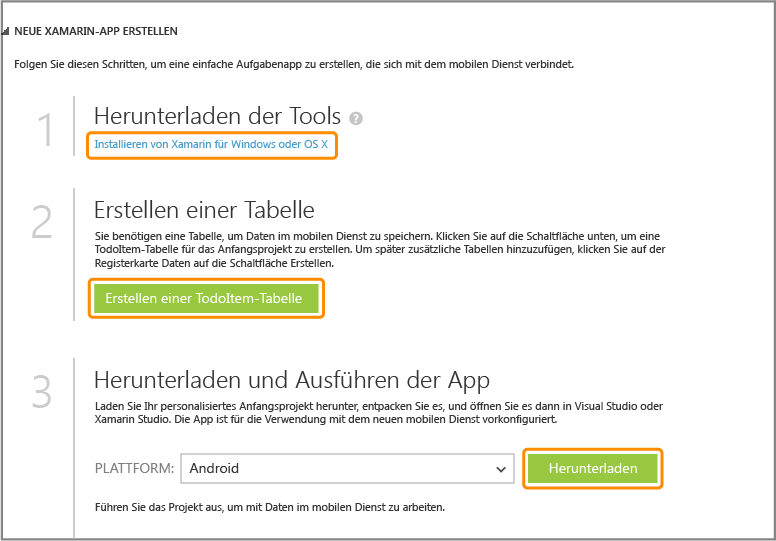
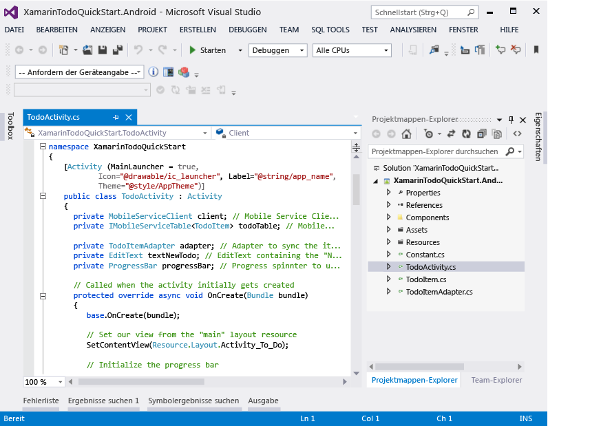

<properties pageTitle="Get Started with Mobile Services for Xamarin.Android" metaKeywords="Azure Xamarin.Android application, mobile service XamarinAndroid, getting started Azure Xamarin.Android" writer="craigd" description="Learn how to use Azure Mobile Services with your Xamarin.Android app." metaCanonical="" documentationCenter="Mobile" title="Get started with Mobile Services" />

Erste Schritte mit Mobile Services
==================================

[Windows Store](/en-us/documentation/articles/mobile-services-windows-store-get-started "Windows Store") [Windows Phone](/en-us/documentation/articles/mobile-services-windows-phone-get-started "Windows Phone") [iOS](/en-us/documentation/articles/mobile-services-ios-get-started "iOS") [Android](/en-us/documentation/articles/mobile-services-android-get-started "Android") [HTML](/en-us/documentation/articles/mobile-services-html-get-started "HTML") [Xamarin.iOS](/en-us/documentation/articles/partner-xamarin-mobile-services-ios-get-started "Xamarin.iOS") [Xamarin.Android](/en-us/documentation/articles/partner-xamarin-mobile-services-android-get-started "Xamarin.Android") [Sencha](/en-us/documentation/articles/partner-sencha-mobile-services-get-started/ "Sencha") [PhoneGap](/en-us/documentation/articles/mobile-services-javascript-backend-phonegap-get-started/ "PhoneGap")

In diesem Lernprogramm erfahren Sie, wie Sie mit den Azure Mobile Services einen cloudbasierten Back-End-Dienst zu einer Xamarin.Android-App hinzufügen können. In diesem Lernprogramm erstellen Sie einen neuen mobilen Dienst und eine einfache *To-Do-Listen*-App, die App-Daten im neuen mobilen Dienst speichert.

Unten finden Sie einen Screenshot aus der fertigen App:

[Lernprogramm ansehen](http://channel9.msdn.com/Series/Windows-Azure-Mobile-Services/Getting-Started-with-Xamarin-and-Windows-Azure-Mobile-Services) [Video abspielen](http://channel9.msdn.com/Series/Windows-Azure-Mobile-Services/Getting-Started-with-Xamarin-and-Windows-Azure-Mobile-Services) 10:05:00

Zum Abschließen dieses Lernprogramms ist [Xamarin.Android](http://xamarin.com/download) erforderlich, über welches Xamarin Studio und ein Visual Studio-Plug-in (unter Windows) sowie die neueste Android-Plattform installiert wird. Android 4.2 SDK oder eine höhere Version ist erforderlich.

Das heruntergeladene Schnellstart-Projekt enthält die Azure Mobile Services-Komponente für Xamarin.Android. Während dieses Projekt auf Android 4.2 oder eine höhere Version abzielt, benötigt das Mobile Services SDK lediglich Android 2.2 oder eine höhere Version.

**Hinweis**

Sie benötigen ein Azure-Konto, um dieses Lernprogramm auszuführen. Wenn Sie über kein Konto verfügen, können Sie in nur wenigen Minuten ein kostenloses Testkonto erstellen. Weitere Informationen finden Sie unter [Kostenloses Azure-Testkonto](http://www.windowsazure.com/en-us/pricing/free-trial/?WT.mc_id=A9C9624B5).

Erstellen eines neuen mobilen Diensts
-------------------------------------

[WACOM.INCLUDE [mobile-services-create-new-service](../includes/mobile-services-create-new-service.md)]

Erstellen einer neuen AppErstellen einer neuen Xamarin.Android-App
---------------------------------------------------------------------------------------------------

Sobald Sie den mobilen Dienst erstellt haben, können Sie einem einfachen Schnellstart im Verwaltungsportal folgen, um eine neue App zu erstellen oder eine vorhandene App für die Verbindung zum mobilen Dienst zu ändern.

In diesem Abschnitt erstellen Sie eine neue Xamarin.Android-App, die mit dem mobilen Dienst verbunden ist.

1.  Klicken Sie im Verwaltungsportal auf **Mobile Services** und dann auf den mobilen Dienst, den Sie gerade erstellt haben.

2.  Klicken Sie auf der Schnellstartregisterkarte unter **Plattform auswählen** auf **Xamarin.Android**, und erweitern Sie **Create a new Android app**.

	

	Dadurch werden drei einfache Schritte zum Erstellen einer Xamarin.Android-App angezeigt, die mit dem mobilen Dienst verbunden wird.

	

3.  Klicken Sie auf **TodoItem-Tabelle erstellen**, um eine Tabelle zum Speichern von App-Daten zu erstellen.

4.  Klicken Sie unter **App herunterladen und ausführen** auf **Herunterladen**.

    Das Projekt für die beispielhafte *To-Do-Listen*-Anwendung, die mit dem mobilen Dienst verbunden ist, wird heruntergeladen. Speichern Sie die komprimierte Projektdatei auf dem lokalen Computer und merken Sie sich, wo Sie sie gespeichert haben.

Ausführen Ihrer Android-App
---------------------------

Der letzte Schritt dieses Lernprogramms besteht im Erstellen und Ausführen der neuen App.

1.  Navigieren Sie zum Speicherort der komprimierten Projektdateien, und entpacken Sie die Dateien auf Ihrem Computer.

2.  Klicken Sie in Xamarin Studio oder Visual Studio auf **Datei** und danach auf **Öffnen**. Navigieren Sie zu den nicht komprimierten Beispieldateien, und wählen Sie **XamarinTodoQuickStart.Android.sln** zum Öffnen aus.

 	

	

1.  Klicken Sie auf die Schaltfläche **Ausführen**, um das Projekt zu erstellen und die App zu starten. Sie werden zur Auswahl eines Emulators oder eines angeschlossenen USB-Geräts aufgefordert.

    **Hinweis**

    Sie müssen mindestens ein Android Virtual Device (AVD) definieren, um das Projekt im Android-Emulator auszuführen. Verwenden Sie den AVD Manager, um diese Geräte zu erstellen und zu verwalten.

2.  Geben Sie in der App einen sinnvollen Text ein, beispielsweise *Lernprogramm beenden*, und klicken Sie dann auf **Hinzufügen**.

	

    Dadurch wird eine POST-Anforderung an den neuen, in Azure gehosteten mobilen Dienst gesendet. Daten von der Anforderung werden in die TodoItem-Tabelle eingefügt. In der Tabelle gespeicherte Einträge werden von dem mobilen Dienst zurückgegeben, und die Daten werden in der Liste angezeigt.

    > [WACOM.NOTE]
    > Sie können den Code überprüfen, der auf den mobilen Dienst zum Abfragen und Einfügen von Daten zugreift. Der Code befindet sich in der C\#-Datei "ToDoActivity.cs".

3.  Zurück im Verwaltungsportal klicken Sie auf die Registerkarte **Daten** und dann auf die Tabelle **TodoItem**.

    

    Nun können Sie die von der App in die Tabelle eingefügten Daten durchsuchen.

    

Nächste Schritte
----------------

Da Sie den Schnellstart jetzt abgeschlossen haben, erfahren Sie, wie zusätzliche wichtige Aufgaben in Mobile Services ausgeführt werden:

-   [Erste Schritte mit Daten](/en-us/develop/mobile/tutorials/get-started-with-data-xamarin-android)
    Informationen zum Speichern und Abfragen von Daten mit Mobile Services.

-   [Erste Schritte mit der Authentifizierung](/en-us/develop/mobile/tutorials/get-started-with-users-xamarin-android)
    Informationen zur Authentifizierung von Benutzern Ihrer App bei einem Identitätsanbieter.

-   [Erste Schritte mit Pushbenachrichtigungen](/en-us/develop/mobile/tutorials/get-started-with-push-xamarin-android)
    Informationen zum Senden einer einfachen Pushbenachrichtigung an Ihre App.

