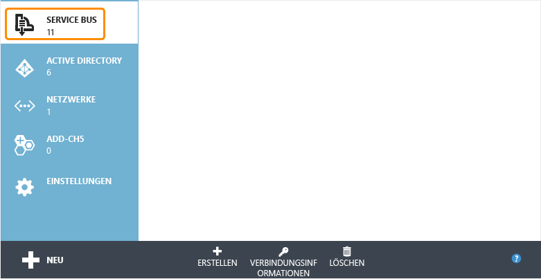
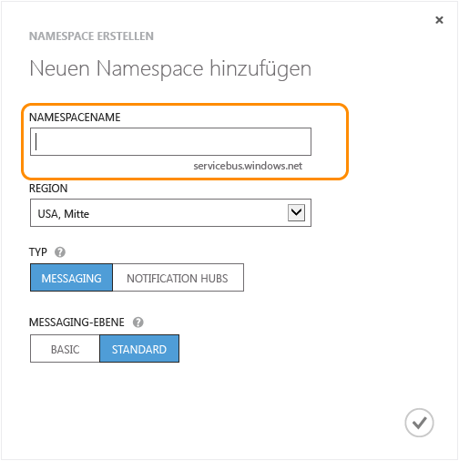
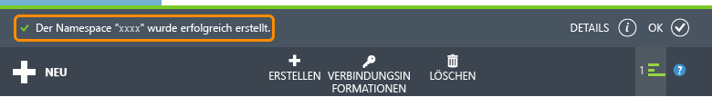

<properties 
	pageTitle="Verwenden von Service Bus Relay (.NET) – Azure" 
	description="Erfahren Sie mehr über die Verwendung des Azure Service Bus Relay-Diensts zum Herstellen einer Verbindung zwischen zwei Anwendungen, die an unterschiedlichen Standorten gehostet sind." 
	services="service-bus" 
	documentationCenter=".net" 
	authors="sethmanheim" 
	manager="timlt" 
	editor=""/>

<tags 
	ms.service="service-bus" 
	ms.workload="tbd" 
	ms.tgt_pltfrm="na" 
	ms.devlang="dotnet" 
	ms.topic="article" 
	ms.date="07/02/2015" 
	ms.author="sethm"/>

# Verwenden des Service Bus Relay-Diensts

In diesem Leitfaden wird die Verwendung des Service Bus Relay-Diensts beschrieben. Die Beispiele sind in C# geschrieben und nutzen die Windows Communication Foundation-API (WCF) mit den Erweiterungen, die in der Service Bus-Assembly enthalten sind. Diese ist Bestandteil des Microsoft Azure .NET-SDKs. Weitere Informationen zum Service Bus Relay-Dienst finden Sie im Abschnitt [Nächste Schritte](#Next-steps).

[AZURE.INCLUDE [create-account-note](../../includes/create-account-note.md)]

## Was ist Service Bus Relay?

Der Service Bus *Relay*-Dienst ermöglicht Ihnen die Erstellung von Hybridanwendungen, die sowohl in einem Azure-Rechenzentrum als auch in Ihrer eigenen lokalen Unternehmensumgebung ausgeführt werden. Der Service Bus Relay-Dienst erleichtert dies, indem er Ihnen die Möglichkeit bietet, WCF-Dienste (Windows Communication Foundation), die sich in einem Unternehmensnetzwerk befinden, sicher in der öffentlichen Cloud bereitzustellen, ohne dass eine Firewallverbindung geöffnet werden muss oder intrusive Änderungen an der unternehmensinternen Netzwerkinfrastruktur erforderlich werden.

Der Service Bus Relay-Dienst bietet Ihnen die Möglichkeit, WCF-Dienste in Ihrer bestehenden Unternehmensumgebung zu hosten. Sie können die Überwachung auf eingehende Sitzungen und Anforderungen für diese WCF-Dienste dann an den Service Bus-Dienst unter Azure delegieren. Auf diese Weise erhalten Sie die Möglichkeit, diese Dienste für Anwendungscode unter Azure, für mobile Mitarbeiter oder für Extranetpartnerumgebungen bereitzustellen. Mit Service Bus können Sie auf sichere Weise steuern, welche Personen auf welcher Optimierungsstufe Zugriff auf diese Dienste erhalten. Der Dienst stellt ein leistungsstarkes und sicheres Verfahren zur Verfügung, um Anwendungsfunktionen und Daten aus bestehenden Unternehmenslösungen bereitzustellen und in der Cloud davon zu profitieren.

In diesem Leitfaden wird gezeigt, wie mit dem Service Bus Relay-Dienst ein mithilfe der TCP-Channelbindung bereitgestellter WCF-Webdienst erstellt wird, der eine geschützte Unterhaltung zwischen zwei Parteien implementiert.

## Erstellen eines Dienstnamespaces

Wenn Sie mit der Verwendung des Service Bus Relays in Azure beginnen möchten, müssen Sie zuerst einen Dienstnamespace erstellen. Ein Namespace ist ein Bereichscontainer für die Adressierung von Service Bus-Ressourcen innerhalb Ihrer Anwendung.

So erstellen Sie einen Dienstnamespace:

1.  Melden Sie sich auf dem [Azure-Verwaltungsportal][] an.

2.  Klicken Sie im linken Navigationsbereich des Verwaltungsportals auf **Servicebus**.

3.  Klicken Sie im unteren Bereich des Verwaltungsportals auf **Erstellen**.

	

4.  Geben Sie im Dialogfeld **Add a new namespace** einen Namen für den Namespace ein. Das System überprüft sofort, ob dieser Name verfügbar ist.

	

5.  Wählen Sie nach der Bestätigung, dass der Name für den Namespace verfügbar ist, das Land oder die Region, wo dieser Namespace gehostet werden soll. (Stellen Sie sicher, dass dies dasselbe Land/dieselbe Region ist, in dem/der Sie Ihre Rechnerressourcen bereitstellen.)

	WICHTIG: Wählen Sie **dieselbe Region**, in der Sie auch Ihre Anwendung einsetzen möchten. Dies sorgt für die beste Leistung.

6.	Übernehmen Sie für die weiteren Felder im Dialogfeld die Standardwerte ("Messaging" und **Standardstufe**), und klicken Sie anschließend auf das Häkchen. Ihr Dienstnamespace wird nun erstellt und aktiviert. Ggf. müssen Sie einige Minuten warten, bis die Ressourcen für Ihr Konto durch das System bereitgestellt werden.

	

	Der erstellte Namespace wird anschließend im Verwaltungsportal angezeigt und in kurzer Zeit aktiviert. Fahren Sie erst fort, wenn der Status als **Aktiv** angezeigt wird.

## Abrufen der Standard-Anmeldeinformationen für den Namespace

Wenn Sie Verwaltungsvorgänge ausführen möchten, z. B. das Erstellen einer Relayverbindung für den neuen Namespace, müssen Sie die SAS-Autorisierungsregel (Shared Access Signature) für den Namespace konfigurieren. Weitere Informationen zu SAS finden Sie unter [SAS-Authentifizierung (Shared Access Signature) mit Service Bus][].

1.  Klicken Sie im linken Navigationsbereich auf den Knoten **Service Bus**, um die Liste verfügbarer Namespaces anzuzeigen: 

2.  Doppelklicken Sie in der angezeigten Liste auf den Namen des Namespaces, den Sie soeben erstellt haben: 

3.  Klicken Sie oben auf der Seite auf **Konfigurieren**.
 
4.  Wenn ein Service Bus-Namespace bereitgestellt wird, wird standardmäßig eine **SharedAccessAuthorizationRule** erstellt, in der **KeyName** auf **RootManageSharedAccessKey** festgelegt ist. Diese Seite zeigt den Schlüssel sowie die primären und sekundären Schlüssel für die Standardregel an.

## Abrufen des NuGet-Pakets "Service Bus"

Das Service Bus-Paket **NuGet** stellt die einfachste Möglichkeit dar, die Service Bus-API abzurufen und Ihre Anwendung mit allen Service Bus-Abhängigkeiten zu konfigurieren. Die NuGet Visual Studio-Erweiterung ermöglicht eine problemlose Installation und Aktualisierung von Bibliotheken und Tools in Visual Studio und Visual Studio Express. Das NuGet-Paket "Service Bus" stellt die einfachste Möglichkeit zum Abrufen der Service Bus-API und zum Konfigurieren der Anwendung mit allen Service Bus-Abhängigkeiten dar.

Gehen sie folgendermaßen vor, um das NuGet-Paket in der Anwendung zu installieren:

1.  Klicken Sie im Projektmappen-Explorer mit der rechten Maustaste auf **Verweise**, und klicken Sie dann auf **NuGet-Pakete verwalten**.
2.  Suchen Sie nach "Service Bus", und wählen Sie das Element **Microsoft Azure Service Bus** aus. Klicken Sie auf **Installieren**, um die Installation abzuschließen. Schließen Sie danach dieses Dialogfeld.

	
  

## Verwenden von Service Bus zum Bereitstellen und Nutzen eines SOAP-Webdiensts mit TCP

Um einen bestehenden WCF SOAP-Webdienst für die externe Nutzung bereitzustellen, müssen Sie Änderungen an den Dienstbindungen und Adressen vornehmen. Dies kann Änderungen an der Konfigurationsdatei oder Codeänderungen erforderlich machen, je nachdem, wie Ihre WCF-Dienste eingerichtet und konfiguriert sind. Beachten Sie, dass WCF Ihnen die Möglichkeit bietet, mehrere Netzwerkendpunkte über denselben Dienst zu verwalten, sodass Sie die bestehenden internen Endpunkte beibehalten können, während Sie gleichzeitig Service Bus-Endpunkte für den externen Zugriff hinzufügen.

Bei dieser Aufgabe erstellen Sie einen einfachen WCF-Dienst und fügen ihm einen Service Bus-Listener hinzu. Für diese Übung wird eine gewisse Vertrautheit mit Visual Studio vorausgesetzt. Es werden daher nicht alle Details der Projekterstellung erläutert. Stattdessen steht der Code im Vordergrund.

Bevor Sie die Schritte unten ausführen, richten Sie zunächst mit dem folgenden Verfahren Ihre Umgebung ein:

1.  Erstellen Sie in Visual Studio eine Konsolenanwendung, die die beiden Projekte "Client" und "Service" innerhalb der Lösung enthält.
2.  Fügen Sie das Paket **Microsoft Azure Service Bus** NuGet beiden Projekte hinzu. Damit werden den Projekten alle benötigten Assemblyverweise hinzugefügt.

### Erstellen des Diensts

Erstellen Sie zunächst den Dienst selbst. Ein WCF-Dienst besteht aus mindestens drei verschiedenen Teilen:

-   Definition eines Vertrags, der beschreibt, welche Nachrichten ausgetauscht werden und welche Operationen aufgerufen werden sollen 
-   Der Implementierung des genannten Vertrags.
-   Dem Host, der diesen WCF-Dienst hostet und eine Reihe von Endpunkten bereitstellt.

Die Codebeispiele in diesem Abschnitt beziehen sich auf jede dieser Komponenten.

Der Vertrag definiert einen einzelnen Vorgang (`AddNumbers`), der zwei Zahlen hinzufügt und das Ergebnis zurückgibt. Die Schnittstelle `IProblemSolverChannel` ermöglicht dem Client die einfachere Verwaltung der Proxylebensdauer. Das Erstellen einer solchen Schnittstelle wird als eine bewährte Methode betrachtet. Es ist sinnvoll, die Vertragsdefinition in einer separaten Datei abzulegen, sodass Sie von beiden Projekten aus ("Client" und "Service") auf diese Datei verweisen können. Sie können den Code aber auch in beide Projekte kopieren:

        using System.ServiceModel;
     
        [ServiceContract(Namespace = "urn:ps")]
        interface IProblemSolver
        {
            [OperationContract]
            int AddNumbers(int a, int b);
        }
     
        interface IProblemSolverChannel : IProblemSolver, IClientChannel {}

Nachdem der Vertrag etabliert wurde, ist die Implementierung ein Kinderspiel:

        class ProblemSolver : IProblemSolver
        {
            public int AddNumbers(int a, int b)
            {
                return a + b;
            }
        }

### Programmgesteuertes Konfigurieren eines Diensthosts

Nachdem der Vertrag erstellt und die Implementierung durchgeführt wurde, kann nun der Dienst gehostet werden. Das Hosting erfolgt innerhalb eines [System.ServiceModel.ServiceHost](https://msdn.microsoft.com/library/azure/system.servicemodel.servicehost.aspx)-Objekts, das die Verwaltung der Dienstinstanzen übernimmt und die Endpunkte hostet, die auf Nachrichten warten. Der folgende Code konfiguriert den Dienst sowohl mit einem regulären lokalen Endpunkt als auch mit einem Service Bus-Endpunkt, um die Darstellung interner und externer Endpunkte nebeneinander zu veranschaulichen. Ersetzen Sie die Zeichenfolge *namespace* durch Ihren Namespacenamen und *yourKey* durch den Ausstellerschlüssel, den Sie im obigen Setupschritt erhalten haben.

    ServiceHost sh = new ServiceHost(typeof(ProblemSolver));

    sh.AddServiceEndpoint(
       typeof (IProblemSolver), new NetTcpBinding(), 
       "net.tcp://localhost:9358/solver");

    sh.AddServiceEndpoint(
       typeof(IProblemSolver), new NetTcpRelayBinding(), 
       ServiceBusEnvironment.CreateServiceUri("sb", "namespace", "solver"))
        .Behaviors.Add(new TransportClientEndpointBehavior {
              TokenProvider = TokenProvider.CreateSharedAccessSignatureTokenProvider("RootManageSharedAccessKey", "yourKey")});

    sh.Open();

    Console.WriteLine("Press ENTER to close");
    Console.ReadLine();

    sh.Close();

In dem Beispiel erstellen Sie zwei Endpunkte für dieselbe Vertragsimplementierung. Einer ist lokal und einer wird über Service Bus projiziert. Die zentralen Unterschiede sind die Bindungen. [`NetTcpBinding`](https://msdn.microsoft.com/library/azure/system.servicemodel.nettcpbinding.aspx) für den lokalen Endpunkt und [NetTcpRelayBinding](https://msdn.microsoft.com/library/azure/microsoft.servicebus.nettcprelaybinding.aspx) für den Service Bus-Endpunkt und die Adressen. Der lokale Endpunkt verfügt über eine lokale Netzwerkadresse mit einem bestimmten Port. Der Service Bus-Endpunkt hat eine Endpunktadresse, die sich aus der Zeichenfolge "sb", Ihrem Namespacenamen und dem Pfad "solver" zusammensetzt. Das Ergebnis ist der URI "sb://[serviceNamespace].servicebus.windows.net/solver", der den Dienstendpunkt als Service Bus-TCP-Endpunkt mit einem vollqualifizierten externen DNS-Namen angibt. Wenn Sie Code, der gemäß der obigen Erläuterung die Platzhalter ersetzt, in die `Main`-Funktion der Anwendung "Service" einfügen, erhalten Sie einen funktionierenden Dienst. Wenn Ihr Dienst exklusiv für Service Bus lauschen soll, entfernen Sie die lokale Endpunktdeklaration.

### Konfigurieren eines Diensthosts in der Datei "App.config"

Sie können den Host auch mithilfe der Datei "App.config" konfigurieren. Der Diensthostingcode sieht in diesem Fall folgendermaßen aus:

    ServiceHost sh = new ServiceHost(typeof(ProblemSolver));
    sh.Open();
    Console.WriteLine("Press ENTER to close");
    Console.ReadLine();
    sh.Close();

Die Endpunktdefinitionen werden in die Datei "App.config" verschoben. Beachten Sie, dass das **NuGet**-Paket bereits eine Reihe von Definitionen zur "App.config"-Datei hinzugefügt hat, die die erforderlichen Konfigurationserweiterungen für Service Bus darstellen. Der folgende Codeausschnitt, der mit dem vorherigen Codeausschnitt identisch ist, sollte direkt unter dem **system.serviceModel**-Element angezeigt werden. In dem Codeausschnitt wird davon ausgegangen, dass der C#-Namespace des Projekts den Namen "Service" hat. Ersetzen Sie die Platzhalter durch den Namespace und den SAS-Schlüssel des Service Bus-Diensts.

    <services>
        <service name="Service.ProblemSolver">
            <endpoint contract="Service.IProblemSolver"
                      binding="netTcpBinding"
                      address="net.tcp://localhost:9358/solver"/>
            <endpoint contract="Service.IProblemSolver"
                      binding="netTcpRelayBinding"
                      address="sb://namespace.servicebus.windows.net/solver"
                      behaviorConfiguration="sbTokenProvider"/>
        </service>
    </services>
    <behaviors>
        <endpointBehaviors>
            <behavior name="sbTokenProvider">
                <transportClientEndpointBehavior>
                    <tokenProvider>
                        <sharedAccessSignature keyName="RootManageSharedAccessKey" key="yourKey" />
                    </tokenProvider>
                </transportClientEndpointBehavior>
            </behavior>
        </endpointBehaviors>
    </behaviors>

Nachdem Sie diese Änderungen vorgenommen haben, startet der Dienst wie zuvor, jedoch mit zwei aktiven Endpunkten: einem lokalen Endpunkt und einem, der in der Cloud lauscht.

### Erstellen des Clients

#### Programmgesteuertes Konfigurieren eines Clients

Um den Dienst zu nutzen, können Sie einen WCF-Client mit einem [`ChannelFactory`](https://msdn.microsoft.com/library/system.servicemodel.channelfactory.aspx)-Objekt. Service Bus verwendet ein Token-basiertes Sicherheitsmodell, das mit SAS implementiert wird. Die **TokenProvider**-Klasse stellt einen Sicherheitstokenanbieter mit integrierten Factory-Methoden dar, die einige bekannte Tokenanbieter zurückgeben. Das folgende Beispiel verwendet die [`CreateSharedAccessSignatureTokenProvider`](https://msdn.microsoft.com/library/azure/microsoft.servicebus.tokenprovider.createsharedaccesssignaturetokenprovider.aspx)-Methode, um die Übernahme des entsprechenden SAS-Tokens zu behandeln. Die Name und der Schlüssel wurden aus dem Portal abgerufen, wie im vorherigen Abschnitt beschrieben wurde.

Verweisen Sie zuerst auf den `IProblemSolver`-Vertragscode, oder kopieren Sie ihn aus dem Dienst in Ihr Clientprojekt.

Ersetzen Sie anschließend den Code in der `Main`-Methode des Clients, und ersetzen Sie dabei den Platzhaltertext erneut durch den Service Bus-Namespace und SAS-Schlüssel:

    var cf = new ChannelFactory<IProblemSolverChannel>(
        new NetTcpRelayBinding(), 
        new EndpointAddress(ServiceBusEnvironment.CreateServiceUri("sb", "namespace", "solver")));

    cf.Endpoint.Behaviors.Add(new TransportClientEndpointBehavior
                { TokenProvider = TokenProvider.CreateSharedAccessSignatureTokenProvider("RootManageSharedAccessKey","yourKey") });
     
    using (var ch = cf.CreateChannel())
    {
        Console.WriteLine(ch.AddNumbers(4, 5));
    }

Sie können jetzt den Client und den Dienst erstellen und ausführen (führen Sie zuerst den Dienst aus). Der Client ruft den Dienst auf und gibt "**9**" aus. Der Client und der Server können auf verschiedenen Computern ausgeführt werden (selbst über Netzwerke hinweg). Die Kommunikation funktioniert weiterhin. Der Clientcode kann ebenfalls in der Cloud oder lokal ausgeführt werden.

#### Konfigurieren eines Clients in der Datei "App.config"

Sie können den Client auch mithilfe der Datei "App.config" konfigurieren. Der Clientcode hierfür sieht folgendermaßen aus:

    var cf = new ChannelFactory<IProblemSolverChannel>("solver");
    using (var ch = cf.CreateChannel())
    {
        Console.WriteLine(ch.AddNumbers(4, 5));
    }

Die Endpunktdefinitionen werden in die Datei "App.config" verschoben. Der folgende Codeausschnitt, der mit dem vorherigen Code identisch ist, sollte direkt unter dem **system.serviceModel**-Element angezeigt werden. Wie zuvor müssen Sie auch hier die Platzhalter durch den Service Bus-Namespace und SAS-Schlüssel ersetzen.

    <client>
        <endpoint name="solver" contract="Service.IProblemSolver"
                  binding="netTcpRelayBinding"
                  address="sb://namespace.servicebus.windows.net/solver"
                  behaviorConfiguration="sbTokenProvider"/>
    </client>
    <behaviors>
        <endpointBehaviors>
            <behavior name="sbTokenProvider">
                <transportClientEndpointBehavior>
                    <tokenProvider>
                        <sharedAccessSignature keyName="RootManageSharedAccessKey" key="yourKey" />
                    </tokenProvider>
                </transportClientEndpointBehavior>
            </behavior>
        </endpointBehaviors>
    </behaviors>

## Nächste Schritte

Nachdem Sie nun mit den Grundlagen des Service Bus **Relay**-Diensts vertraut sind, finden Sie unter diesen Links weitere Informationen.

-   Erstellen eines Diensts: [Erstellen eines Diensts für Service Bus][].
-   Erstellen des Clients: [Erstellen einer Service Bus-Clientanwendung][].
-   Service Bus-Beispiele: Laden Sie sie aus den [Azure-Beispielen][] herunter, oder sehen Sie sich die Übersicht auf [MSDN][] an.

  [Create a Service Namespace]: #create_namespace
  [Obtain the Default Management Credentials for the Namespace]: #obtain_credentials
  [Get the Service Bus NuGet Package]: #get_nuget_package
  [How to: Use Service Bus to Expose and Consume a SOAP Web Service  with TCP]: #how_soap
  [Azure-Verwaltungsportal]: http://manage.windowsazure.com
  [SAS-Authentifizierung (Shared Access Signature) mit Service Bus]: http://msdn.microsoft.com/library/azure/dn170477.aspx
  [Erstellen eines Diensts für Service Bus]: http://msdn.microsoft.com/library/azure/ee173564.aspx
  [Erstellen einer Service Bus-Clientanwendung]: http://msdn.microsoft.com/library/azure/ee173543.aspx
  [Azure-Beispielen]: https://code.msdn.microsoft.com/windowsazure/site/search?query=service%20bus&f%5B0%5D.Value=service%20bus&f%5B0%5D.Type=SearchText&ac=2
  [MSDN]: https://msdn.microsoft.com/de-de/library/azure/dn194201.aspx
 

<!---HONumber=July15_HO4-->