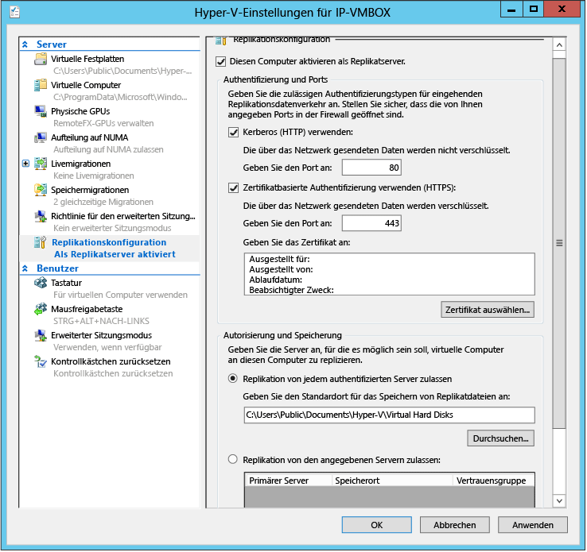

<properties
	pageTitle="Planen der Kapazität für die Replikation virtueller Hyper-V-Maschinen"
	description="Dieser Artikel enthält Informationen zur Verwendung des Tools Capacity Planner für Azure Site Recovery."
	services="site-recovery"
	documentationCenter="na"
	authors="rayne-wiselman"
	manager="jwhit"
	editor="" />
<tags
	ms.service="site-recovery"
	ms.devlang="na"
	ms.topic="get-started-article"
	ms.tgt_pltfrm="na"
	ms.workload="storage-backup-recovery"
	ms.date="12/01/2015"
	ms.author="raynew" />

# Planen der Kapazität für die Replikation virtueller Hyper-V-Maschinen

Für Azure Site Recovery werden Hyper-V-Replikate zum Replizieren von virtuellen Hyper-V-Maschinen von einem lokalen Standort zu Azure oder in ein sekundäres Rechenzentrum verwendet. Das Tool „Capacity Planner“ für Site Recovery dient Ihnen als Unterstützung beim Ermitteln der Replikations- und Bandbreitenanforderungen für die Replikation virtueller Hyper-V-Maschinen.

## Vorbereitung

Sie führen das Tool auf einem Hyper-V-Server- oder Clusterknoten an Ihrem primären Standort aus. Der Hyper-V-Hostserver benötigt zum Ausführen des Tools Folgendes:

- Betriebssystem: Windows Server® 2012 oder Windows Server® 2012 R2
- Arbeitsspeicher: 20 MB (Minimum)
- CPU: 5 % freie Auslastung (Minimum)
- Festplattenspeicher: 5 MB (Minimum)

Vor dem Ausführen des Tools müssen Sie den primären Standort vorbereiten. Wenn Sie die Replikation zwischen zwei lokalen Standorten durchführen und die Bandbreite überprüfen möchten, müssen Sie zusätzlich einen Replikatserver vorbereiten.

## Schritt 1: Vorbereiten des primären Standorts
1. Erstellen Sie am primären Standort eine Liste mit allen virtuellen Hyper-V-Maschinen, die Sie replizieren möchten, sowie mit den Hyper-V-Hosts/-Clustern, auf denen sich die Maschinen befinden. Das Tool kann jeweils für mehrere eigenständige Hosts oder für einen einzelnen Cluster ausgeführt werden, aber nicht für beides zusammen. Außerdem muss es für jedes Betriebssystem separat ausgeführt werden. Erfassen und notieren Sie Ihre Hyper-V-Server also wie folgt: 

  - Eigenständige Windows Server® 2012-Server
  - Windows Server® 2012-Cluster
  - Eigenständige Windows Server® 2012 R2-Server
  - Windows Server® 2012 R2-Cluster

3. Aktivieren Sie den Remotezugriff auf WMI auf allen Hyper-V-Hosts und -Clustern. Führen Sie diesen Befehl auf allen Servern/Clustern aus, um sicherzustellen, dass die Firewallregeln und Benutzerberechtigungen festgelegt sind:

        netsh firewall set service RemoteAdmin enable

5. Aktivieren Sie die Leistungsüberwachung auf Servern und Clustern wie folgt:

  - Öffnen Sie die Windows-Firewall mit dem Snap-In **Erweiterte Sicherheit**, und aktivieren Sie dann die folgenden eingehenden Regeln: **COM+-Netzwerkzugriff (DCOM-IN)** und alle Regeln in der **Gruppe „Remote-Ereignisprotokollverwaltung“**.

## Schritt 2: Vorbereiten eines Replikatservers (Replikation zwischen zwei lokalen Standorten)

Sie müssen diesen Schritt nicht ausführen, wenn Sie zu Azure replizieren.

Wir empfehlen Ihnen, einen zentralen Hyper-V-Host als Wiederherstellungsserver einzurichten, damit eine Dummy-VM auf diesen Server repliziert werden kann, um die Bandbreite zu überprüfen. Sie können diesen Schritt überspringen, aber Sie können die Bandbreite nur messen, wenn Sie ihn ausführen.

1. Wenn Sie einen Clusterknoten als Replikat verwenden möchten, müssen Sie den Hyper-V-Replikatbroker konfigurieren:

	- Öffnen Sie im **Server-Manager** den **Failovercluster-Manager**.
	- Stellen Sie eine Verbindung mit dem Cluster her, markieren Sie den Clusternamen, und klicken Sie auf **Aktionen** > **Rolle konfigurieren**, um den Assistenten für hohe Verfügbarkeit zu öffnen.
	- Klicken Sie unter **Rolle auswählen** auf **Hyper-V-Replikatbroker**. Geben Sie im Assistenten einen **NetBIOS-Namen** und eine **IP-Adresse** als Verbindungspunkt mit dem Cluster (als Clientzugriffspunkt bezeichnet) an. Der **Hyper-V-Replikatbroker** wird konfiguriert. Notieren Sie sich den Clientzugriffspunkt, der erstellt wird. 
	- Vergewissern Sie sich, dass die Rolle "Hyper-V-Replikatbroker" erfolgreich online geschaltet wird und ein Failover zwischen allen Knoten des Clusters ausführen kann. Klicken Sie dazu auf die Rolle, zeigen Sie auf **Verschieben**, und klicken Sie dann auf **Knoten auswählen**. Wählen Sie einen Knoten aus, und klicken Sie auf **OK**. 
	- Stellen Sie bei Verwendung der zertifikatbasierten Authentifizierung sicher, dass für jeden Clusterknoten und den Clientzugriffspunkt das Zertifikat installiert ist.
2.  Aktivieren eines Replikatservers:

	- Öffnen Sie den Failovercluster-Manager für einen Cluster, stellen Sie eine Verbindung mit dem Cluster her, und klicken Sie auf **Rollen** > Rolle auswählen > **Replikationseinstellungen** > **Diesen Cluster als Replikatserver aktivieren**. Beachten Sie Folgendes: Wenn Sie einen Cluster als Replikat verwenden, muss auch im Cluster am primären Standort die Rolle „Hyper-V-Replikatbroker“ vorhanden sein.
	- Öffnen Sie für einen eigenständigen Server den Hyper-V-Manager. Klicken Sie im Bereich **Aktionen** für den Server, den Sie aktivieren möchten, auf **Hyper-V-Einstellungen**. Klicken Sie dann unter **Replikationskonfiguration** auf **Diesen Computer als Replikatserver aktivieren**.
3. Einrichten der Authentifizierung:

	- Wählen Sie unter **Authentifizierung und Ports** die Authentifizierungsart für den primären Server und die Authentifizierungsports aus. Klicken Sie bei Verwendung eines Zertifikats auf **Zertifikat auswählen**, um ein Zertifikat auszuwählen. Verwenden Sie Kerberos, wenn sich der primäre Hyper-V-Host und Hyper-V-Wiederherstellungshost in derselben Domäne oder vertrauenswürdigen Domänen befinden. Verwenden Sie Zertifikate für unterschiedliche Domänen oder eine Arbeitsgruppenbereitstellung.
	- Lassen Sie im Bereich **Autorisierung und Speicherung** für **alle** authentifizierten (primären) Server das Senden von Replikationsdaten an diesen Replikatserver zu. Klicken Sie auf **OK** oder **Übernehmen**.

	

	- Führen Sie **netsh http show servicestate** aus, um zu überprüfen, ob der Listener für das von Ihnen angegebene Protokoll bzw. den Port ausgeführt wird:  
4. Einrichten von Firewalls: Bei der Hyper-V-Installation werden Firewallregeln erstellt, um den Datenverkehr über die Standardports zuzulassen (443 für HTTPS, 80 für Kerberos). Aktivieren Sie diese Regeln wie folgt:
	
		- Certificate authentication on cluster (443): **Get-ClusterNode | ForEach-Object {Invoke-command -computername \$\_.name -scriptblock {Enable-Netfirewallrule -displayname "Hyper-V Replica HTTPS Listener (TCP-In)"}}**
		- Kerberos authentication on cluster (80): **Get-ClusterNode | ForEach-Object {Invoke-command -computername \$\_.name -scriptblock {Enable-Netfirewallrule -displayname "Hyper-V Replica HTTP Listener (TCP-In)"}}**
		- Certificate authentication on standalone server: **Enable-Netfirewallrule -displayname "Hyper-V Replica HTTPS Listener (TCP-In)"**
		- Kerberos authentication on standalone server: **Enable-Netfirewallrule -displayname "Hyper-V Replica HTTP Listener (TCP-In)"**

## Schritt 3: Ausführen des Tools Capacity Planner

Nachdem Sie Ihren primären Standort vorbereitet und einen Wiederherstellungsserver eingerichtet haben, können Sie das Tool ausführen.

1. [Laden Sie das Tool aus dem Microsoft Download Center herunter](https://www.microsoft.com/download/details.aspx?id=39057).
2. Führen Sie das Tool auf einem der primären Server (oder in einem der Knoten des primären Clusters) aus. Klicken Sie mit der rechten Maustaste auf die EXE-Datei, und wählen Sie dann **Als Administrator ausführen** aus.
3. Geben Sie unter **Voraussetzungen** an, wie lange Daten gesammelt werden sollen. Es wird empfohlen, das Tool während des Produktionszeitraums auszuführen, um sicherzustellen, dass die Daten repräsentativ sind. Wenn Sie nur die Netzwerkverbindung überprüfen möchten, reicht für das Sammeln eine Minute aus.

	

4. Geben Sie unter **Details zum primären Standort** den Servernamen oder vollqualifizierten Domänennamen (FQDN) für einen eigenständigen Host an, oder geben Sie für einen Cluster den FQDN des Clientzugriffspunkts, den Clusternamen oder einen beliebigen Knoten im Cluster ein, und klicken Sie dann auf **Weiter**. Das Tool erkennt automatisch den Namen des Servers, auf dem es ausgeführt wird. Mit dem Tool werden die VMs ausgewählt, die für die angegebenen Server überwacht werden können.

	

5. Wählen Sie unter **Replikatstandortdetails** die Option **Tests für Replikatstandort überspringen**, wenn Sie zu Azure replizieren oder wenn Sie die Replikation in ein sekundäres Rechenzentrum durchführen und keinen Replikatserver eingerichtet haben. Wenn Sie in ein sekundäres Rechenzentrum replizieren und einen Replikattyp im FQDN des eigenständigen Servers oder im Clientzugriffspunkt für den Cluster eingerichtet haben, wählen Sie **Servername (oder) Hyper-V-Replikatbroker-CAP**.

	

6. Aktivieren Sie unter **Erweiterte Replikatdetails** die Option **Tests für Standort mit erweitertem Replikat überspringen**. Diese werden von Site Recovery nicht unterstützt.
7. Unter **VMs für Replikation auswählen** stellt das Tool eine Verbindung mit dem Server oder Cluster her und zeigt die VMs und Festplatten an, die auf dem primären Server ausgeführt werden. Dies erfolgt gemäß den Einstellungen, die Sie auf der Seite **Details zum primären Standort** angegeben haben. Beachten Sie, dass VMs, die bereits für die Replikation aktiviert sind oder die nicht ausgeführt werden, nicht angezeigt werden. Wählen Sie die VMs aus, für die Sie Metriken sammeln möchten. Beim Auswählen der VHDs werden auch automatisch Daten für die VMs erfasst.
9. Wenn Sie einen Replikatserver oder -cluster konfiguriert haben, geben Sie unter **Netzwerkinformationen** die ungefähre WAN-Bandbreite an, die zwischen dem primären und sekundären Standort voraussichtlich verwendet wird. Wählen Sie außerdem die Zertifikate aus, falls Sie die Zertifikatauthentifizierung konfiguriert haben.

	

10. Überprüfen Sie unter **Zusammenfassung** die Einstellungen, und klicken Sie auf **Weiter**, um mit dem Erfassen von Metriken zu beginnen. Der Fortschritt und Status des Tools wird auf der Seite **Kapazität berechnen** angezeigt. Klicken Sie nach Abschluss der Ausführung des Tools auf **Bericht anzeigen**, um sich die Ausgabe anzusehen. Berichte und Protokolle werden standardmäßig unter **%Systemlaufwerk%\\Benutzer\\Öffentlich\\Dokumente\\Capacity Planner** gespeichert.

	

## Schritt 4: Interpretieren der Ergebnisse
Hier werden die wichtigen Ergebnisse angegeben. Sie können Metriken ignorieren, die hier nicht aufgelistet sind. Sie sind für Site Recovery nicht relevant.

### Replikation zwischen zwei lokalen Standorten
  - Auswirkung der Replikation auf die Rechenkapazität und den Speicher des primären Hosts
  - Auswirkung der Replikation auf den Festplattenspeicherplatz des primären und Wiederherstellungshosts (IOPS)
  - Erforderliche Gesamtbandbreite für die Deltareplikation (MBit/s)
  - Aufgezeichnete Netzwerkbandbreite zwischen dem primären Host und dem Wiederherstellungshost (MBit/s)
  - Vorschlag für die ideale Anzahl der aktiven parallelen Übertragungen zwischen den beiden Hosts oder Clustern

### Replikation zwischen einem lokalen Standort und Azure
  - Auswirkung der Replikation auf die Rechenkapazität und den Speicher des primären Hosts
  - Auswirkung der Replikation auf den Speicherplatz des primären Hosts (IOPS)
  - Erforderliche Gesamtbandbreite für die Deltareplikation (MBit/s)

## Weitere Ressourcen

- Ausführliche Informationen zu diesem Tool finden Sie in dem Dokument, das dem Tool beigefügt ist.
- Sehen Sie sich eine exemplarische Vorgehensweise zum Tool im [TechNet-Blog](http://blogs.technet.com/b/keithmayer/archive/2014/02/27/guided-hands-on-lab-capacity-planner-for-windows-server-2012-hyper-v-replica.aspx) von Keith Mayer an.
- Sehen Sie sich die [Ergebnisse](http://blogs.technet.com/b/keithmayer/archive/2014/02/27/guided-hands-on-lab-capacity-planner-for-windows-server-2012-hyper-v-replica.aspx) unserer Leistungstests für die Hyper-V-Replikation zwischen zwei lokalen Standorten an.

## Nächste Schritte

- [Einrichten von Schutz zwischen einem lokalen VMM-Standort und Azure](site-recovery-vmm-to-azure.md)
- [Einrichten von Schutz zwischen einem lokalen Hyper-V-Standort und Azure](site-recovery-hyper-v-site-to-azure.md)
- [Einrichten von Schutz zwischen zwei lokalen VMM-Standorten](site-recovery-vmm-to-vmm.md)

<!---HONumber=AcomDC_1203_2015-->