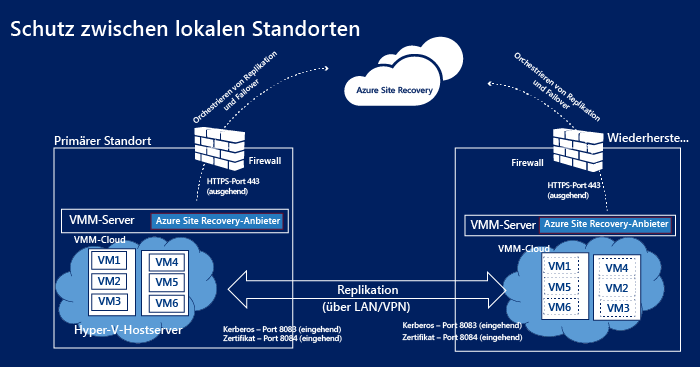
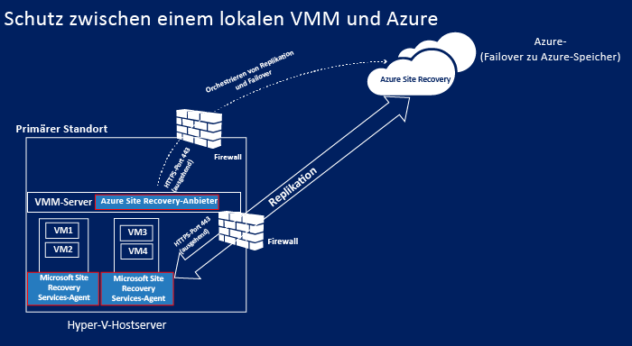
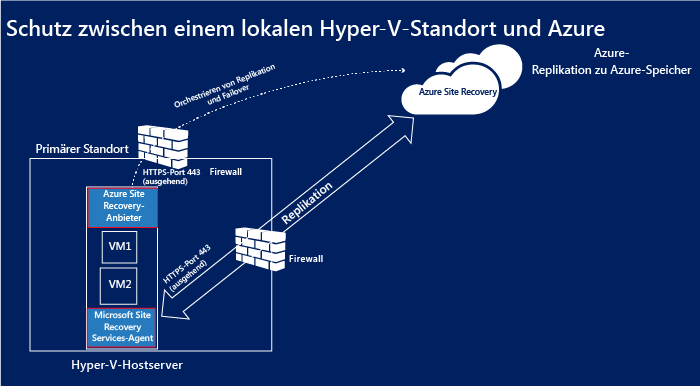
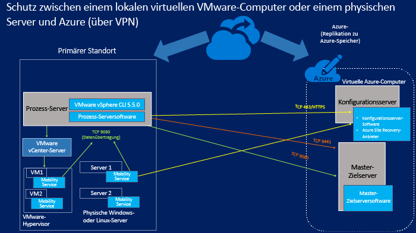
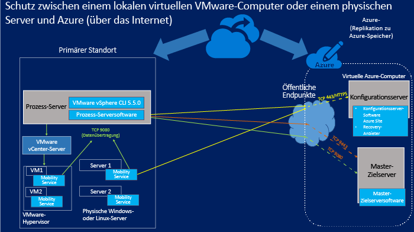

<properties
	pageTitle="Site Recovery-Komponenten"
	description="Dieser Artikel bietet einen Überblick über die Site Recovery-Komponenten und deren Verwaltung."
	services="site-recovery"
	documentationCenter=""
	authors="rayne-wiselman"
	manager="jwhit"
	editor=""/>

<tags
	ms.service="site-recovery"
	ms.workload="backup-recovery"
	ms.tgt_pltfrm="na"
	ms.devlang="na"
	ms.topic="get-started-article"
	ms.date="08/10/2015"
	ms.author="raynew"/>

# Site Recovery-Komponenten

Azure Site Recovery unterstützt Ihre Strategie für Geschäftskontinuität und Notfallwiederherstellung, indem Replikation, Failover und Wiederherstellung virtueller Computer und physischer Server aufeinander abgestimmt werden. Computer können in Azure oder in einem lokalen sekundären Rechenzentrum repliziert werden. [Lesen Sie eine Übersicht](site-recovery-overview.md).

Dieser Artikel bietet eine Zusammenfassung und Beschreibung der Site Recovery-Komponenten, die auf Servern und virtuellen Computern installiert sind.

Etwaige Fragen zu diesem Artikel können Sie im [Azure Recovery Services-Forum](https://social.msdn.microsoft.com/forums/azure/home?forum=hypervrecovmgr) stellen.

## Übersicht

Site Recovery-Komponenten variieren leicht je nach Schutzszenario.

### Schutz zwischen zwei Rechenzentren mit VMM

**Szenario** | **Beschreibung** | **Erforderliche Komponenten** | **Details**
--- | --- | --- | ---
Sie stellen Azure Site Recovery bereit, um virtuelle Computer zwischen zwei Rechenzentren zu replizieren. | 
Jedes Rechenzentrum verfügt über einen VMM-Server.

Jeder VMM-Server hat eine private Cloud, die eine oder mehrere Hyper-V-Hostserver mit virtuellen Computern enthält, die Sie schützen möchten
. | Der Azure Site Recovery-Anbieter wird auf beiden VMM-Servern installiert. | 
Keine Komponenten werden auf den Hyper-V-Hostservern oder den geschützten virtuellen Computern installiert.

Der Azure Site Recovery-Anbieter auf dem VMM-Server kommuniziert mit dem Site Recovery-Dienst über HTTPS 443, um den Schutz zu orchestrieren.

Replikation findet zwischen dem primären und dem sekundären Hyper-V-Hostserver über das Internet mithilfe von Kerberos und der zertifikatsbasierten Authentifizierung auf den Ports 8083 und 8084 statt.

### Schutz zwischen einem Rechenzentrum mit VMM und Azure

**Szenario** | **Beschreibung** | **Erforderliche Komponenten** | **Details**
--- | --- | --- | ---
Sie stellen Azure Site Recovery bereit, um virtuelle Computer zwischen einem Rechenzentrum und Azure zu replizieren. | 
Das lokale Rechenzentrum verfügt über einen VMM-Server mit einer privaten Cloud, die eine oder mehrere Hyper-V-Hostserver mit virtuellen Computern enthält, die Sie schützen möchten
. | 
Der Azure Site Recovery-Anbieter wird auf dem VMM-Server installiert.

Der Microsoft Recovery Services-Agent wird auf Hyper-V-Hostquellservern installiert.
 | 
Keine Komponenten werden auf geschützten virtuellen Computern installiert.

Der Azure Site Recovery-Anbieter auf dem VMM-Server kommuniziert mit dem Site Recovery-Dienst über HTTPS 443, um den Schutz zu orchestrieren.

Replikation findet zwischen dem Microsoft Recovery Services-Agent, der auf dem Hyper-V-Hostquellservern ausgeführt wird, und Azure über HTTPS 443 statt.

###  Schutz zwischen einem Hyper-V-Standort und Azure

**Szenario** | **Beschreibung** | **Erforderliche Komponenten** | **Details**
--- | --- | --- | ---
Sie stellen Azure Site Recovery bereit, um virtuelle Computer zwischen einem Rechenzentrum und Azure zu replizieren. | 
Das lokale Rechenzentrum hat einen oder mehrere Hyper-V-Hostservern mit virtuellen Computern, die Sie schützen möchten.

Während der Konfiguration definieren Sie einen Hyper-V-Standort, der einen oder mehrere dieser Hyper-V-Hostserver enthält.
 | 
Eine einzelne Komponenteninstallation wird ausgeführt, um den Azure Site Recovery-Anbieter und den Microsoft Recovery Services-Agent auf den Hyper-V-Hostservern zu installieren.
 | 
Kein VMM-Server in der Bereitstellung.

Keine Komponenten werden auf geschützten virtuellen Computern installiert.

Der Azure Site Recovery-Anbieter auf dem Hyper-V-Hostserver kommuniziert mit dem Site Recovery-Dienst über HTTPS 443, um den Schutz zu orchestrieren.

Replikation findet zwischen dem Microsoft Recovery Services-Agent, der auf dem Hyper-V-Hostserver ausgeführt wird, und Azure über HTTPS 443 statt.

### Schutz zwischen einem lokalen physischen Server oder virtuellen VMware-Computern und Azure

In diesem Szenario kann die Replikation auf zweierlei Weise geschehen:

- Über eine VPN-Verbindung (mit Azure ExpressRoute oder einer Standort-zu-Standort-VPN-Verbindung)
- Über eine sichere Internetverbindung

#### Über eine VPN-Standort-zu-Standort-Verbindung (oder ExpressRoute)

Kommunikation von lokalen Servern wird an interne Ports im virtuellen Azure-Netzwerk weitergeleitet, mit denen die virtuellen Konfigurations- und Masterzielcomputer verbunden sind.

#### Über das Internet

Die gesamte Kommunikation von lokalen Servern wird an zugeordnete öffentliche Endpunkte im Azure-Clouddienst für den virtuellen Konfigurationsserver und den virtuellen Masterzielserver weitergeleitet. Die Endpunkte werden dynamisch erstellt, wenn Sie die virtuellen Computer bereitstellen.

#### Ports

**Komponente** | **Port** | **Details**
--- | --- | --- | ---
**Prozessserver** |9080 | Geschützte Computer senden Daten für die Replikation an den Prozessserver über TCP 9080.
**Konfigurationsserver** | HTTPS/443 | Der Mobilitätsdienst auf geschützten Computern sendet Replikationsmetadaten zum Konfigurationsserver auf Port 443.
 | HTTPS/443 | Der Konfigurationsserver koordiniert und orchestriert den Computerschutz. Der Prozessserver kommuniziert mit dem Konfigurationsserver auf 443 oder dem zugeordneten öffentlichen Endpunkt, um Verwaltungs- und Steuerungsinformationen zu erhalten.
 | 9443 | In der Failbackrichtung fordert das vContinuum-Tool Steuerungs- und Metadaten vom Konfigurationsserver auf Port 9443 (nicht im Diagramm dargestellt) an.
 | 5986 | Remoteverwaltung mit PowerShell verwendet Port 5986 (nicht im Diagramm dargestellt).
 | 3389 | Die RDP-Verbindung zum Konfigurationsserver verwendet Port 3389 (nicht im Diagramm dargestellt).
**Masterzielserver** | 80 | Die Prozesswebsite sendet die Kommunikation über den Replikationsdatenverkehr über Port 9080 an den Masterzielserver.
 | HTTP/443 | Der Prozessserver repliziert die Daten an den Masterzielserver über HTTP oder 443 (VPN).
 | HTTP/443 | Der Prozessserver repliziert die Daten an den Masterzielserver über HTTP oder 443 (VPN).
**Firewallregeln** | | 
Damit die Pushinstallation des Mobilitätsdiensts ordnungsgemäß funktioniert, muss die Firewall auf geschützten Computern Datei- und Druckerfreigabe sowie Windows Management Instrumentation zulassen.

Firewallregeln auf Computern, die Sie schützen möchten, müssen das Erreichen des Konfigurationsservers zulassen.

Um nach einem Failover eine Verbindung zu virtuellen Azure-Computern über das Internet herzustellen, müssen die Firewallregeln auf den Computern Remotedesktopverbindungen über das Internet zulassen. Für eine Verbindung mit einem ausgefallenen Linux-Computer in Azure sollte der Secure Shell-Dienst auf den automatischen Start auf dem System festgelegt sein, und Firewallregeln müssen eine SSH-Verbindung zulassen.

## Site Recovery-Komponenten

**Komponente** | **Details** | **Installation** | **Bereitstellungsszenario**
--- | --- | --- | ---
**Azure Site Recovery-Anbieter für VMM** | Verarbeitet die Kommunikation zwischen dem VMM-Server und dem Site Recovery-Dienst. | Auf einem VMM-Server installiert | Verwendet, wenn Sie den Schutz zwischen zwei VMM-Standorten oder zwischen einem VMM-Standort und Azure einrichten
**Azure Site Recovery-Anbieter für Hyper-V** | Verarbeitet die Kommunikation zwischen den Hyper-V-Host und dem Site Recovery-Dienst, wenn VMM nicht bereitgestellt wird. | Auf einem Hyper-V-Hostserver installiert | Verwendet, wenn Sie den Schutz zwischen einem Hyper-V-Standort und Azure einrichten.
**Microsoft Recovery Services-Agent** | Verarbeitet die Kommunikation zwischen dem Hyper-V-Hostserver und dem Site Recovery-Dienst. | Auf dem Hyper-V-Hostserver installiert | 
Verwendet beim Einrichten des Schutzes zwischen einem Hyper-V-Standort und Azure.

Sie laden einen einzigen Anbieter herunter, der den Azure Site Recovery-Anbieter für Hyper-V und den Microsoft Recovery Services-Agent enthält.

**Prozessserver/Failbackprozessserver** | 
Optimiert Daten vom geschützten VMware-Computern oder physischen Windows-/Linux-Servern vor dem Senden an den Masterzielserver in Azure.

Führt die Pushinstallation des Mobilitätsdiensts auf virtuellen VMware-Computern oder physischen Servern durch.

Führt die automatische Ermittlung von virtuellen VMware-Computern durch.
 
Failbackprozessserver: Nur der erste Punkt zum Optimieren der Daten vor der Replikation gilt für den Failbackprozessserver.
 | 
Wird auf einem lokalen Server installiert, auf dem mindestens Windows Server 2012 R2 ausgeführt wird.

Failbackprozessserver: Wird auf einem virtuellen Azure-Computer der Standardgröße A4 ausgeführt.
 | 
Wird beim Einrichten des Schutzes zwischen einem lokalen physischen Server oder virtuellen VMware-Computern und Azure verwendet.

Failbackprozessserver: Wird für das Failback von Azure zu lokal verwendet.

**Mobilitätsdienst** | Zeichnet Änderungen auf geschützten Computern auf und leitet sie an den lokalen Prozessserver für die Replikation in Azure weiter. | Wird auf lokalen virtuellen VMware-Computern oder auf physischen Servern installiert, die Sie schützen möchten.| Wird beim Einrichten des Schutzes zwischen einem lokalen physischen Server oder virtuellen VMware-Computern und Azure verwendet.
**Masterzielserver/Failback-Masterzielserver** | 
Enthält replizierte Daten von Ihren geschützten Computern über die angefügten virtuellen Festplatten auf Blob-Speicher in Ihrem Azure-Speicherkonto.

Failback-Masterzielserver: Enthält Replikationsdaten von virtuellen Computern in Azure, für die ein Failover ausgeführt wurde. Daten werden in VMDKs gespeichert, die im Datenspeicher erstellt werden, der ausgewählt wird, wenn die umgekehrte Replikation für das Failback aktiviert wird.
 | 
Wird als virtueller Azure-Computer, als Windows-Server, der auf einem Windows Server 2012 R2-Galerie-Image basiert (zum Schutz von Windows-Computern) oder als Linux-Server installiert, der auf einem OpenLogic CentOS 6.6-Galerie-Image basiert (zum Schutz von Linux-Computern).

Zwei Größenoptionen sind verfügbar: Standard-A3 und Standard-D14.

Failback-Masterzielserver: Wird auf einem virtuellen VMware-Computer ausgeführt. Er wird auf demselben Host bereitgestellt, für den ein Failback des Computers ausgeführt wird.
| 
Wird beim Einrichten des Schutzes zwischen einem lokalen physischen Server oder virtuellen VMware-Computern und Azure verwendet.

Failback-Masterzielserver: Wird für das Failback von virtuellen Failover-Azure-Computern zurück auf lokale Computer verwendet.

**Konfigurationsserver** | 
Koordiniert die Kommunikation zwischen geschützten Computern, dem Prozessserver und den Masterzielservern in Azure.

Richtet die Replikation ein und koordiniert die Wiederherstellung in Azure, wenn ein Failover auftritt.
 | Wird auf einem virtuellen Standard-A3-Azure-Computer im gleichen Azure-Abonnement wie Site Recovery installiert. | Wird beim Einrichten des Schutzes zwischen einem lokalen physischen Server oder virtuellen VMware-Computern und Azure verwendet.

## Planen der Komponentenbereitstellung

### Azure Site Recovery-Anbieter

Der Anbieter wird auf Ihren VMM-Servern, Ihren Hyper-V-Hostservern, wenn Sie keinen VMM-Server in der Bereitstellung haben, oder auf einem Konfigurationsserver ausgeführt. Er stellt eine Verbindung mit dem Site Recovery-Dienst über das Internet mit einer verschlüsselten HTTPS-Verbindung her. Beachten Sie Folgendes:

- Sie müssen keine spezielle Firewallausnahme hinzufügen, um den Anbieter mit Site Recovery zu verbinden.
- Wenn der Server, auf dem der Anbieter ausgeführt wird, eine Verbindung mit dem Internet über einen Proxyserver herstellen soll, können Sie die vorhandenen Proxyeinstellungen verwenden oder einen benutzerdefinierten Proxy angeben.
- Der Proxy muss diese Adressen durch die Firewall zulassen:

	-  *.accesscontrol.windows.net
	-  .backup.windowsazure.com
	-  *.blob.core.windows.net
	-  *.store.core.windows.net

- Wenn Sie IP-Adressen basierende Regeln in der Firewall verwenden, stellen Sie sicher, dass die Kommunikation zwischen dem Konfigurationsserver und den in den [IP-Bereichen des Azure-Rechenzentrums](https://www.microsoft.com/download/details.aspx?id=41653) beschriebenen IP-Adressen sowie für HTTPS (443) zulässig ist. Sie müssen eine Positivliste der IP-Adressbereiche der Azure-Region, die Sie verwenden möchten, und für den Westen der USA erstellen.
- Wenn Sie Site Recovery mit VMM bereitstellen und einen benutzerdefinierten Proxy verwenden, wird automatisch ein VMM-RunAs-Konto (DRAProxyAccount) erstellt. Hierfür werden die Proxyanmeldeinformationen genutzt, die Sie im Site Recovery-Portal in den Einstellungen für den benutzerdefinierten Proxy angegeben haben. Sie müssen den Proxyserver so konfigurieren, dass für dieses Konto eine erfolgreiche Authentifizierung möglich ist.
- Bei Verwendung eines Proxys muss der Datenverkehr vom Anbieter, der auf einem Hyper-V-Hostserver installiert ist, zum Proxy über HTTP gesendet werden.

### Microsoft Recovery Services-Agent

Der Agent stellt eine Verbindung mit dem Site Recovery-Dienst über das Internet mit einer verschlüsselten HTTPS-Verbindung her. Spezielle Firewallausnahmen sind nicht erforderlich.

### Komponenten für VMware oder den Schutz physischer Server

#### Masterzielserver

- Der Masterzielservers kann einem virtuellen Computer mit dem Azure-Standard A4 oder D14 entsprechen.
- Bei einem Standard-A4-Masterzielserver können Sie jedem virtuellen Computer 16 Datenträger (maximal 1023 GB pro Datenträger) hinzufügen.
- Bei einem Standard-D14-Masterzielserver können Sie jedem virtuellen Computer 32 Datenträger (maximal 1023 GB pro Datenträger) hinzufügen.
- Ein standardmäßiger D14-Masterzielserver ist nur dann erforderlich, wenn Sie einen Server schützen möchten, an den mehr als 15 Datenträger angefügt sind. Für alle anderen Konfigurationen können Sie standardmäßige A4-Masterzielserver bereitstellen.
- Beachten Sie, dass eine mit dem Masterzielserver verbundene Festplatte als Beibehaltungslaufwerk reserviert ist. Mit Azure Site Recovery können Sie Beibehaltungszeitfenster definieren und geschützte Computer auf einen Wiederherstellungspunkt innerhalb dieser Zeitfenster wiederherstellen. Das Beibehaltungslaufwerk verwaltet ein Journal mit Datenträgeränderungen für die Dauer der Zeitfenster. Dadurch wird die maximale Datenträgeranzahl für die Replikation für einen A4 auf 15 und für einen D14 auf 31 reduziert.

#### Prozessserver

- Der Prozessserver verwendet einen datenträgerbasierten Cache. Stellen Sie sicher, dass auf C:/ genügend freier Speicherplatz für den Cache bereitsteht. Die Cachegröße wird von der Datenänderungsrate der geschützten Computer beeinflusst. In der Regel wird für mittelgroße Bereitstellungen eine Cacheverzeichnisgröße von 600 GB empfohlen.
- Wenn die Datenänderungsrate der geschützten Computer die Kapazität eines vorhandenen Prozessservers übersteigt, sollten Sie einen zusätzlichen Prozessserver bereitstellen.
- Zum Skalieren Ihrer Bereitstellung fügen Sie mehrere Prozessserver und Masterzielserver hinzu. Wenn auf einem vorhandenen Masterzielserver nicht genügend freie Datenträger verfügbar sind, sollten Sie einen zweiten Masterzielserver bereitstellen.
-  Beachten Sie, dass Prozessserver und Masterzielservern keine 1:1-Zuordnung erfordern. Sie können beispielsweise den ersten Prozessserver mit dem zweiten Masterzielserver bereitstellen.

#### Konfigurationsserver

- Der Konfigurationsserver ist ein virtueller Standard-A3-Computer basierend auf einem Azure Site Recovery Windows Server 2012 R2-Galerie-Image, das in Ihrem Abonnement für den Konfigurationsserver erstellt wird. Er wird als erste Instanz in einem neuen Clouddienst mit einer reservierten öffentlichen IP-Adresse erstellt.
- Der Installationspfad darf nur englische Zeichen enthalten.

#### Mobilitätsdienst

Installation auf virtuellen VMware-Computern oder physischen Servern. Computer und Server müssen die folgenden Anforderungen erfüllen:

- **Windows-Server**:
	-  64-Bit-Betriebssystem: Windows Server 2012 R2, Windows Server 2012 und Windows Server 2008 R2 mit SP1 oder höher.
	-  Hostname, Bereitstellungspunkte, Gerätenamen, Windows-Systempfad (z. B. C:\\Windows) dürfen nur englische Zeichen enthalten.
	-  Betriebssystem auf dem Laufwerk C:\\.
	-  Nur Basisdatenträger werden unterstützt. Dynamische Datenträger werden nicht unterstützt.

- **Linux-Server**:
	- Ein unterstütztes 64-Bit-Betriebssystem: Centos 6.4, 6.5, 6.6), Oracle Enterprise Linux 6.4, 6.5, auf dem entweder der Red Hat-kompatible Kernel oder UEK3 (Unbreakable Enterprise Kern Release 3) ausgeführt wird, SUSE Linux Enterprise Server 11 SP3.
	- "/etc/hosts"-Dateien auf geschützten Computern sollten Einträge enthalten, die den Namen des lokalen Hosts IP-Adressen zuordnen, die allen NICs zugeordnet sind.
	- Hostname, Bereitstellungspunkte, Gerätenamen und Linux-Systempfade und -Dateinamen (z. B. /etc/, /usr) dürfen nur englische Zeichen enthalten.
	-  Folgender Speicher wird unterstützt: Dateisystem: EXT3, ETX4, ReiserFS, XFS/Multipath-Softwaregeräte-Mapper (multipath)/Volume-Manager: LVM2. Physische Server mit HP CCISS-Controllerspeicher werden nicht unterstützt.

Ausführliche Planungsinformationen zu diesen Komponenten finden Sie im Abschnitt zur Kapazitätsplanung in [diesem Artikel](site-recovery-vmware-to-azure.md).

## Aktualisieren von Komponenten

**Komponente** | **Vorgehensweise beim Aktualisieren**
--- | ---

**Azure Site Recovery-Anbieter für VMM**

**Azure Recovery Services-Agent**
 | 

**Erstmalige Installation**: Laden Sie die neueste Version von der Seite "Schnellstart" herunter

**In Betrieb**: Sie können die neuesten (und vorherigen) Versionen aus dem Dashboard im Site Recovery herunterladen. Wenn Sie sich für Microsoft Updates entscheiden, wird die neueste Version des Anbieters und des Agents automatisch auf dem Server installiert.

**Prozessserver**

**Konfigurationsserver**

**Masterzielserver**
 | Suchen Sie im Site Recovery-Dashboard nach Updates.
**Mobilitätsdienst** | 
Stellen Sie sicher, dass die neuesten Updates des Mobilitätsdiensts auf jedem Computer, die Sie schützen möchten, vorhanden sind:

Sie können die neuesten Updates herunterladen:

[Windows](http://download.microsoft.com/download/7/C/7/7C70CA53-2D8E-4FE0-BD85-8F7A7A8FA163/Microsoft-ASR_UA_8.3.0.0_Windows_GA_03Jul2015_release.exe)

[RHELP6-64](http://download.microsoft.com/download/B/4/5/B45D1C8A-C287-4339-B60A-70F2C7EB6CFE/Microsoft-ASR_UA_8.3.0.0_RHEL6-64_GA_03Jul2015_release.tar.gz)

[OL6-64](http://download.microsoft.com/download/9/4/8/948A2D75-FC47-4DED-B2D7-DA4E28B9E339/Microsoft-ASR_UA_8.3.0.0_OL6-64_GA_03Jul2015_release.tar.gz)

[SLES11-SP3-64](http://download.microsoft.com/download/6/A/2/6A22BFCD-E978-41C5-957E-DACEBD43B353/Microsoft-ASR_UA_8.3.0.0_SLES11-SP3-64_GA_03Jul2015_release.tar.gz)

Nachdem Sie sichergestellt haben, dass der Prozessserver auf dem neuesten Stand ist, können Sie alternativ auch die neueste Version des Mobilitätsdiensts aus dem Ordner "C:\\pushinstallsvc\\repository" auf dem Prozessserver herunterladen
  

## Nächste Schritte

Starten Sie die Konfiguration der Komponenten für Ihr Bereitstellungsszenario. [Weitere Informationen](site-recovery-overview.md).

<!-----HONumber=Oct15_HO3-->