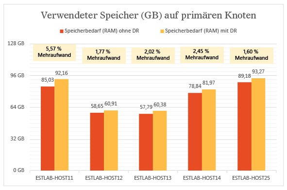
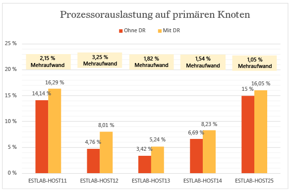
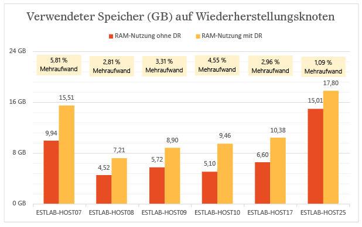
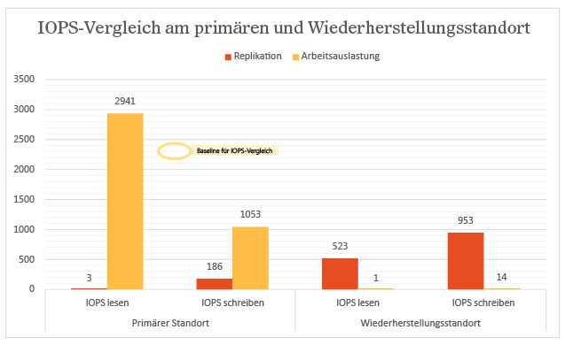
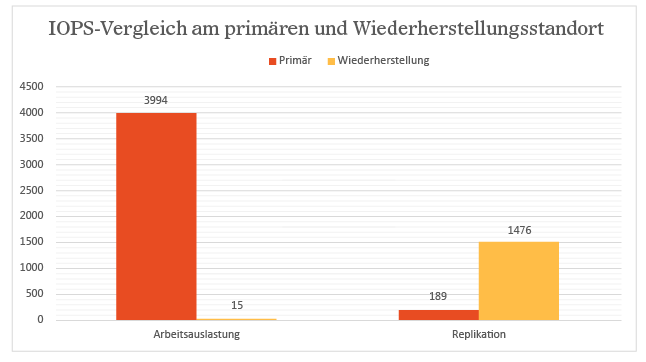
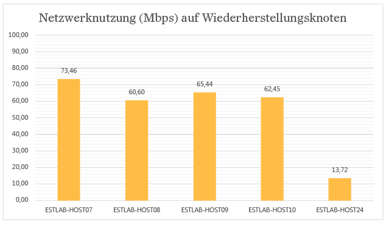
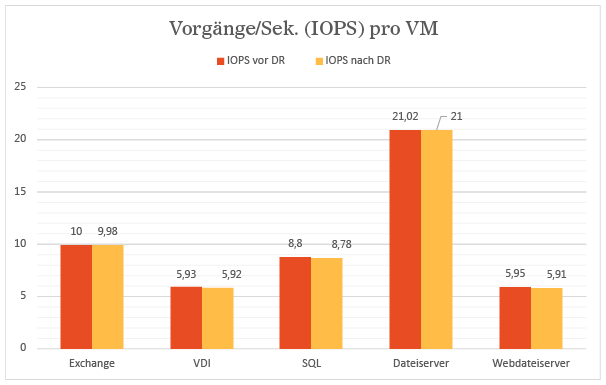
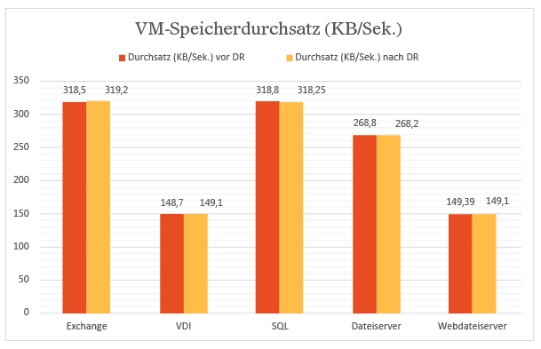
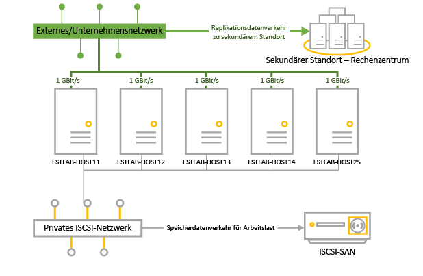

<properties
	pageTitle="Ergebnisse von Leistungs- und Skalierungstests für die Hyper-V-Replikation vom Typ „Lokal zu lokal“ mit Site Recovery | Microsoft Azure"
	description="Dieser Artikel bietet Informationen zu Leistungstests für die Replikation zwischen lokalen Standorten mithilfe von Azure Site Recovery."
	services="site-recovery"
	documentationCenter=""
	authors="rayne-wiselman"
	manager="jwhit"
	editor="tysonn"/>

<tags
	ms.service="site-recovery"
	ms.devlang="na"
	ms.topic="article"
	ms.tgt_pltfrm="na"
	ms.workload="storage-backup-recovery"
	ms.date="12/14/2015"
	ms.author="raynew"/>

# Ergebnisse von Leistungs- und Skalierungstests für die Hyper-V-Replikation vom Typ „Lokal zu lokal“ mit Site Recovery

Mit Microsoft Azure Site Recovery können Sie die Replikation virtueller Computer und physischer Server in Azure oder zu einem sekundären lokalen Standort orchestrieren. Dieser Artikel bietet die Ergebnisse unserer Leistungstests beim Replizieren virtueller Hyper-V-Computer zwischen zwei lokalen Datencentern.

## Übersicht

Mit diesem Test sollte die Leistung von Azure Site Recovery bei der Replikation im stabilen Zustand ermittelt werden. Die Replikation im stabilen Zustands tritt auf, wenn virtuelle Computer die erste Replikation abgeschlossen haben und Datenänderungen synchronisieren. Die Ermittlung der Leistung im stabilen Zustand ist wichtig, da sich die meisten virtuellen Computer in diesem Zustand befinden, solange es zu keinem unerwarteten Ausfall kommt.

Die Testbereitstellung bestand aus zwei lokalen Standorten mit je einem VMM-Server. Diese Testbereitstellung ist typisch für eine Bereitstellung mit Hauptsitz und Zweigstelle, bei der der Hauptsitz als primärer Standort und die Zweigstelle als sekundärer Standort (oder Wiederherstellungsstandort) fungiert.

### Unsere Schritte

Von uns in der Testphase erledigte Schritte:

1. Erstellung virtueller Computer mithilfe von VMM-Vorlagen

1. Start der virtuellen Computer und Erfassung von Baseline-Leistungsmetriken für einen Zeitraum von 12 Stunden

1. Erstellung von Clouds auf dem primären VMM-Server und auf dem VMM-Server für die Wiederherstellung

1. Konfiguration des Cloudschutzes in Azure Site Recovery (einschließlich Zuordnung der Quell- und Wiederherstellungsclouds)

1. Aktivierung des Schutzes für virtuelle Computer und Durchführung der ersten Replikation

1. Wartezeit von einigen Stunden bis zur Stabilisierung des Systems

1. Erfassung von Leistungsmetriken für einen Zeitraum von 12 Stunden und Sicherstellung, dass alle virtuellen Computer innerhalb dieses Zeitraums den erwarteten Replikationszustand besitzen

1. Ermittlung des Unterschieds zwischen den Baseline-Leistungsmetriken und den Leistungsmetriken der Replikation

## Ergebnisse der Testbereitstellung

### Leistung des primären Servers

- Hyper-V-Replikat erfasst Änderungen asynchron in einer Protokolldatei, wodurch auf dem primären Server nur sehr wenig zusätzlicher Speicherplatz beansprucht wird.

- Hyper-V-Replikat nutzt selbstverwalteten Speichercache, um den IOPS-Zusatzaufwand für die Erfassung zu minimieren. Es speichert VHDX-Schreibvorgänge im Arbeitsspeicher und fügt sie der Protokolldatei hinzu, bevor das Protokoll an den Wiederherstellungsstandort gesendet wird. Das Leeren auf Festplatte findet auch statt, wenn die Schreibvorgänge einen zuvor festgelegten Schwellenwert erreichen.

- Das folgende Diagramm zeigt den IOPS-Zusatzaufwand für die Replikation im stabilen Zustand. Wie Sie sehen, beträgt der replikationsbedingte IOPS-Zusatzaufwand gerade einmal etwa fünf Prozent.

Hyper-V-Replikat nutzt Arbeitsspeicher auf dem primären Server, um die Datenträgerleistung zu optimieren. Wie im folgenden Diagramm zu sehen, ist die zusätzliche Arbeitsspeicherauslastung auf allen Servern im primären Cluster marginal. Bei der hier gezeigten Arbeitsspeicherauslastung handelt es sich um den von der Replikation beanspruchten Prozentsatz des installierten Gesamtspeichers auf dem Hyper-V-Server.

Die zusätzliche CPU-Auslastung durch Hyper-V-Replikat ist minimal. Wie im Diagramm zu sehen, liegt der replikationsbedingte Zusatzaufwand zwischen zwei und drei Prozent.

### Leistung des sekundären Servers (Wiederherstellungsserver)

Hyper-V-Replikat verwendet einen kleinen Teil des Arbeitsspeichers auf dem Wiederherstellungsserver, um die Anzahl der Speichervorgänge zu optimieren. Das Diagramm fasst die Arbeitsspeicherauslastung auf dem Wiederherstellungsserver zusammen. Bei der hier gezeigten Arbeitsspeicherauslastung handelt es sich um den von der Replikation beanspruchten Prozentsatz des installierten Gesamtspeichers auf dem Hyper-V-Server.

Die Menge der E/A-Vorgänge am Wiederherstellungsstandort ist eine Funktion der Anzahl von Schreibvorgängen am primären Standort. Vergleichen wir die Gesamtmenge der E/A-Vorgänge am Wiederherstellungsstandort mit der Gesamtmenge der E/A- und Schreibvorgänge am primären Standort. Die Diagramme zeigen, dass die Gesamtmenge der IOPS am Wiederherstellungsstandort:

- etwa dem 1,5-fachen der Schreib-IOPS am primären Standort entspricht.

- etwa 37 Prozent der Gesamt-IOPS am primären Standort ausmacht.

### Auswirkung der Replikation auf die Netzwerkauslastung

Im Schnitt wurden bei aktivierter Komprimierung zwischen primärem Knoten und Wiederherstellungsknoten pro Sekunde etwa 275 MB der verfügbaren Netzwerkbandbreite von 5 GB/s beansprucht.

### Auswirkung der Replikation auf die Leistung virtueller Computer

Ein wichtiger Aspekt ist die Auswirkung der Replikation auf die Produktionsworkloads, die von den virtuellen Computern bewältigt werden. Bei ordnungsgemäßer Bereitstellung des primären Standorts werden die Workloads durch die Replikation in keiner Weise beeinträchtigt. Durch den einfachen Nachverfolgungsmechanismus von Hyper-V-Replikat wird sichergestellt, dass die Replikation im stabilen Zustand keine Auswirkungen auf die Workloads virtueller Computer hat. Dies wird durch die Diagramme weiter unten verdeutlicht.

Das folgende Diagramm zeigt die IOPS von virtuellen Computern mit verschiedenen Workloads vor und nach der Aktivierung der Replikation. Wie Sie sehen, gibt es hier keinerlei Unterschiede.

Das folgende Diagramm zeigt den Durchsatz virtueller Computer mit verschiedenen Workloads vor und nach der Aktivierung der Replikation. Auch hier ist zu sehen, dass die Replikation keine nennenswerten Auswirkungen hat.

### Zusammenfassung

Die Ergebnisse zeigen deutlich, dass Azure Site Recovery in Kombination mit Hyper-V-Replikat bestens und mit minimalem Zusatzaufwand für einen umfangreichen Cluster skaliert werden kann. Azure Site Recovery ermöglicht eine einfache Bereitstellung, Replikation, Verwaltung und Überwachung. Hyper-V-Replikat stellt die notwendige Infrastruktur für eine erfolgreiche Replikationsskalierung bereit. Laden Sie sich am besten den [Kapazitätsplaner für Hyper-V-Replikat](https://www.microsoft.com/download/details.aspx?id=39057) herunter, um Ihre Bereitstellung optimal zu planen.

## Testumgebungsdetails

### Primärer Standort

- Am primären Standort befindet sich ein Cluster mit fünf Hyper-V-Servern und 470 virtuellen Computern.

- Die virtuellen Computer führen verschiedene Workloads aus und sind alle durch Azure Site Recovery geschützt.

- Der Speicher für den Clusterknoten wird in Form eines iSCSI-SAN bereitgestellt. Modell: Hitachi HUS130.

- Jeder Clusterserver verfügt über vier Netzwerkkarten (NICs) mit jeweils einem GBit/s.

- Zwei der Netzwerkkarten sind mit einem privaten iSCSI-Netzwerk verbunden, zwei mit einem externen Unternehmensnetzwerk. Eines der externen Netzwerke ist für die Clusterkommunikation reserviert.

|Server|RAM|Modell|Prozessor|Anzahl der Prozessoren|NIC|Software|
|---|---|---|---|---|---|---|
|Hyper-V-Server im Cluster:  ESTLAB-HOST11 ESTLAB-HOST12 ESTLAB-HOST13 ESTLAB-HOST14 ESTLAB-HOST25|128 MB (ESTLAB-HOST25: 256 MB)|Dell™ PowerEdge™ R820|Intel(R) Xeon(R)-CPU E5-4620 0 (2,20 GHz)|4|1 GBit/s (4x)|Windows Server Datacenter 2012 R2 (x64) + Hyper-V-Rolle|
|VMM-Server|2|||2|1 GBit/s|Windows Server Datacenter 2012 R2 (x64) + VMM 2012 R2|

### Sekundärer Standort (Wiederherstellung)

- Der sekundäre Standort verfügt über einen Failovercluster mit sechs Knoten.

- Der Speicher für den Clusterknoten wird in Form eines iSCSI-SAN bereitgestellt. Modell: Hitachi HUS130.

|Server|RAM|Modell|Prozessor|Anzahl der Prozessoren|NIC|Software|
|---|---|---|---|---|---|---|
|Hyper-V-Server im Cluster:  ESTLAB-HOST07 ESTLAB-HOST08 ESTLAB-HOST09 ESTLAB-HOST10|96|Dell™ PowerEdge™ R720|Intel(R) Xeon(R)-CPU E5-2630 0 (2,30 GHz)|2|1 GBit/s (4x)|Windows Server Datacenter 2012 R2 (x64) + Hyper-V-Rolle|
|ESTLAB-HOST17|128|Dell™ PowerEdge™ R820|Intel(R) Xeon(R)-CPU E5-4620 0 (2,20 GHz)|4||Windows Server Datacenter 2012 R2 (x64) + Hyper-V-Rolle|
|ESTLAB-HOST24|256|Dell™ PowerEdge™ R820|Intel(R) Xeon(R)-CPU E5-4620 0 (2,20 GHz)|2||Windows Server Datacenter 2012 R2 (x64) + Hyper-V-Rolle|
|VMM-Server|2|||2|1 GBit/s|Windows Server Datacenter 2012 R2 (x64) + VMM 2012 R2|

### Serverworkloads

- Zu Testzwecken haben wir Workloads aus typischen Szenarien von Unternehmenskunden herausgesucht.

- Für die Simulation verwenden wir [IOMeter](http://www.iometer.org) mit den Workloads aus der folgenden Tabelle.

- Alle IOMeter-Profile schreiben zufällige Bytes und simulieren so Worst-Case-Schreibmuster für Workloads.

|Workload|E/A-Größe (KB)|Prozent (Zugriff)|Prozent (Lesen)|Ausstehende E/A-Vorgänge|E/A-Muster|
|---|---|---|---|---|---|
|Dateiserver|48163264|60 % 20 % 5 % 5 % 10 %|80 % 80 % 80 % 80 % 80 %|88888|Alle 100 % zufällig|
|SQL Server (Volume 1) SQL Server (Volume 2)|864|100 % 100 %|70 % 0 %|88|100 % zufällig 100 % sequenziell|
|Exchange|32|100 %|67 %|8|100 % zufällig|
|Arbeitsstation/VDI|464|66 % 34 %|70 % 95 %|11|Beides 100 % zufällig|
|Webdateiserver|4864|33 % 34 % 33 %|95 % 95 % 95 %|888|Alle 75 % zufällig|

### Konfiguration des virtuellen Computers

- 470 virtuelle Computer im primären Cluster.

- Alle virtuellen Computer mit VHDX-Datenträger.

- Virtuelle Computer mit Workloads aus der Tabelle. Alle auf der Grundlage von VMM-Vorlagen erstellt.

|Workload|Anzahl VMs|RAM – Mindestgröße (GB)|RAM – maximale Größe (GB)|Größe des logischen Datenträgers (GB) pro VM|Maximale IOPS-Anzahl|
|---|---|---|---|---|---|
|SQL Server|51|1|4|167|10|
|Exchange Server|71|1|4|552|10|
|Dateiserver|50|1|2|552|22|
|VDI|149|0,5|1|80|6|
|Webserver|149|0,5|1|80|6|
|GESAMT|470|||96,83 TB|4108|

### Einstellungen für Azure Site Recovery

- Azure Site Recovery wurde für den Schutz zwischen lokalen Standorten konfiguriert.

- Für den VMM-Server sind vier Clouds konfiguriert. Diese enthalten die Hyper-V-Clusterserver und deren virtuelle Computer.

|Primäre VMM-Cloud|Geschützte virtuelle Computer in der Cloud|Replikationshäufigkeit|Zusätzliche Wiederherstellungspunkte|
|---|---|---|---|
|PrimaryCloudRpo15m|142|15 Min.|Keine|
|PrimaryCloudRpo30s|47|30 Sek.|Keine|
|PrimaryCloudRpo30sArp1|47|30 Sek.|1|
|PrimaryCloudRpo5m|235|5 Min.|Keine|

### Leistungsmetriken

Der Tabelle fasst die Leistungsmetriken und -indikatoren zusammen, die für die Bereitstellung ermittelt wurden.

|Metrik|Indikator|
|---|---|
|CPU|\\Prozessor(\_Gesamt)\\% Prozessorzeit|
|Verfügbarer Speicher|\\Speicher\\Verfügbar MBytes|
|IOPS|\\PhysicalDisk(\_Total)\\Übertragungen/Sek.|
|VM-Lesevorgänge/Sek. (IOPS)|\\Hyper-V virtuelles Speichergerät(<VHD>)\\Lesevorgänge/Sek.|
|VM-Schreibvorgänge/Sek. (IOPS)|\\Hyper-V virtuelles Speichergerät(<VHD>)\\Schrebvorgänge/S|
|VM-Lesedurchsatz|\\Hyper-V virtuelles Speichergerät(<VHD>)\\Lesen Bytes/Sek.|
|VM-Scheibdurchsatz|\\Hyper-V virtuelles Speichergerät(<VHD>)\\Schreiben Bytes/Sek.|

## Nächste Schritte

- [Einrichten von Schutz zwischen zwei lokalen VMM-Standorten](site-recovery-vmm-to-vmm.md)

<!---HONumber=AcomDC_0218_2016-->