<properties
	pageTitle="Einrichten von Schutz zwischen einem lokalen VMM-Standort und Azure"
	description="Azure Site Recovery koordiniert Replikation, Failover und Wiederherstellung von virtuellen Hyper-V-Computern in lokalen VMM-Clouds nach Azure."
	services="site-recovery"
	documentationCenter=""
	authors="rayne-wiselman"
	manager="jwhit"
	editor="tysonn"/>

<tags
	ms.service="site-recovery"
	ms.workload="backup-recovery"
	ms.tgt_pltfrm="na"
	ms.devlang="na"
	ms.topic="hero-article"
	ms.date="08/05/2015"
	ms.author="raynew"/>

#  Einrichten von Schutz zwischen einem lokalen VMM-Standort und Azure

## Übersicht

Azure Site Recovery unterstützt Ihre Strategie für Geschäftskontinuität und Notfallwiederherstellung, indem Replikation, Failover und Wiederherstellung virtueller Computer in einer Vielzahl von Bereitstellungsszenarien aufeinander abgestimmt werden. Eine vollständige Liste der Bereitstellungsszenarien finden Sie unter [Übersicht über Azure Site Recovery](site-recovery-overview.md).

Dieser Szenarioleitfaden beschreibt die Bereitstellung von Site Recovery zum Organisieren und Automatisieren von Schutz für Arbeitsauslastungen auf virtuellen Computern auf Hyper-V-Hostservern, die sich in privaten VMM-Clouds befinden. In diesem Szenario werden virtuelle Computer von einem primären VMM-Standort mithilfe von Hyper-V-Replikaten in Azure repliziert.

Das Handbuch enthält Informationen zu Voraussetzungen für das Szenario und zeigt, wie Sie einen Site Recovery-Tresor einrichten, den Azure Site Recovery-Anbieter auf dem Quell-VMM-Server installieren, den Server im Tresor registrieren, Azure-Speicherkonten hinzufügen, den Azure Recovery Services Agent auf Hyper-V-Hostservern installieren, Schutzeinstellungen für VMM-Clouds konfigurieren, die auf alle geschützten virtuellen Computer angewendet werden, und den Schutz für diese virtuellen Computer aktivieren. Zum Schluss testen Sie das Failover, um sicherzustellen, dass alles wie erwartet funktioniert.

Sollten beim Einrichten dieses Szenarios Probleme auftreten, besuchen Sie das [Azure Recovery Services-Forum](http://go.microsoft.com/fwlink/?LinkId=313628).

## Vorbereitung

Stellen Sie sicher, dass diese Voraussetzungen erfüllt werden:
### Voraussetzungen für Azure

- Sie benötigen ein [Microsoft Azure](http://azure.microsoft.com/)-Konto. Beginnen Sie mit einer [kostenlosen Testversion](http://aka.ms/try-azure), falls Sie kein Konto haben. Darüber hinaus können Sie sich über die [Preisgestaltung für Azure Site Recovery-Manager](http://go.microsoft.com/fwlink/?LinkId=378268) informieren.
- Sie benötigen ein Azure-Speicherkonto, um in Azure replizierte Daten zu speichern. Für das Konto muss Georeplikation aktiviert sein. Es muss sich in der gleichen Region wie der Azure Site Recovery-Dienst befinden und dem gleichen Abonnement zugeordnet sein. Weitere Informationen zum Einrichten von Azure-Speicher finden Sie unter [Einführung in Microsoft Azure Storage](http://go.microsoft.com/fwlink/?LinkId=398704).
- Sie müssen sicherstellen, dass die virtuellen Computer, die Sie schützen möchten, den Azure-Anforderungen entsprechen. Informationen hierzu finden Sie unter [Unterstützung virtueller Computer](https://msdn.microsoft.com/library/azure/dn469078.aspx#BKMK_E2A).

### VMM-Voraussetzungen
- Sie benötigen einen VMM-Server, der unter System Center 2012 R2 ausgeführt wird.
- Auf allen VMM-Servern mit virtuellen Computern, die Sie schützen möchten, muss der Azure Site Recovery-Anbieter ausgeführt werden. Dieser wird bei der Bereitstellung von Azure Site Recovery installiert.
- Sie benötigen mindestens eine Cloud auf dem VMM-Server, den Sie schützen möchten. Die Cloud sollte Folgendes enthalten:
	- Eine oder mehrere VMM-Hostgruppen.
	- Einen oder mehrere Hyper-V-Hostserver oder Cluster in jeder Hostgruppe.
	- Einen oder mehrere virtuelle Computer auf dem Hyper-V-Quellserver. Es muss sich um virtuelle Computer der 1. Generation handeln.
- Erfahren Sie mehr über das Einrichten von VMM-Clouds:
	- Weitere Informationen über private VMM-Clouds erhalten Sie unter [Private Cloud-Neuerungen mit System Center 2012 R2 VMM](http://go.microsoft.com/fwlink/?LinkId=324952) und unter [VMM 2012 und die Clouds](http://go.microsoft.com/fwlink/?LinkId=324956).
	- Informationen zum [Konfigurieren der VMM-Cloudstruktur](https://msdn.microsoft.com/library/azure/dn469075.aspx#BKMK_Fabric)
	- Sobald Ihre Cloud-Strukturelemente eingerichtet sind, finden Sie Informationen zum Erstellen privater Clouds unter [Erstellen einer privaten Cloud in VMM](http://go.microsoft.com/fwlink/?LinkId=324953) und [Exemplarische Vorgehensweise: Erstellen von privaten Clouds mit System Center 2012 SP1 VMM](http://go.microsoft.com/fwlink/?LinkId=324954).

### Hyper-V-Voraussetzungen

- Auf den Hyper-V-Hostservern muss mindestens Windows Server 2012 R2 mit Hyper-V-Rolle ausgeführt werden, und die neuesten Updates müssen installiert sein.
- Wenn Sie Hyper-V in einem Cluster ausführen, wird der Clusterbroker nicht automatisch erstellt, wenn Sie einen Cluster mit statischen IP-Adressen verwenden. Sie müssen den Clusterbroker manuell konfigurieren. Anweisungen finden Sie unter [Hyper-V-Replikatbroker konfigurieren](http://go.microsoft.com/fwlink/?LinkId=403937).
- Alle Hyper-V-Hostserver oder Cluster, deren Schutz Sie verwalten möchten, müssen in einer VMM-Cloud enthalten sein.

Die folgende Abbildung zeigt die verschiedenen Kommunikationskanäle und Ports, die Azure Site Recovery für die Orchestrierung und Replikation verwendet.

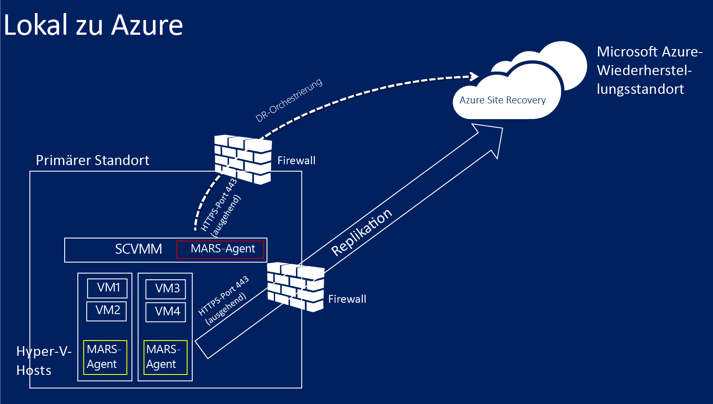

### Voraussetzungen für die Netzwerkzuordnung
Wenn Sie virtuelle Computer in Azure schützen, wird eine Netzwerkzuordnung zwischen VM-Netzwerken auf dem Quell-VMM-Server und den Azure-Zielnetzwerken erstellt, um Folgendes zu ermöglichen:

- Alle Computer, die ein Failover in demselben Netzwerk durchführen, können sich unabhängig vom jeweiligen Wiederherstellungsplan miteinander verbinden.
- Wenn ein Netzwerkgateway im Azure-Zielnetzwerk eingerichtet ist, können die virtuellen Computer eine Verbindung zu anderen lokalen virtuellen Computern herstellen.
- Wenn Sie keine Netzwerkzuordnung konfigurieren, können nur virtuelle Computer, für die ein Failover in demselben Wiederherstellungsplan erfolgt, nach einem Failover auf Azure eine Verbindung miteinander herstellen.

Wenn Sie eine Netzwerkzuordnung bereitstellen möchten, benötigen Sie Folgendes:

- Die virtuellen Computer, die Sie auf dem VMM-Quellserver schützen möchten, sollten mit einem VM-Netzwerk verbunden sein. Dieses Netzwerk sollte mit einem logischen Netzwerk verbunden sein, das der Cloud zugeordnet ist.
- Ein Azure-Netzwerk, mit dem replizierte virtuelle Computer nach einem Failover eine Verbindung herstellen können. Dieses Netzwerk wählen Sie zum Zeitpunkt des Failovers aus. Das Netzwerk sollte sich in derselben Region wie Ihr Azure Site Recovery-Abonnement befinden.
- Informationen zur Netzwerkzuordnung finden Sie unter:
	- [Konfigurieren von logischen Netzwerken in VMM](http://go.microsoft.com/fwlink/?LinkId=386307)
	- [Konfiguration von VM-Netzwerken und Gateways in VMM](http://go.microsoft.com/fwlink/?LinkId=386308)
	- [Konfigurieren und Überwachen virtueller Netzwerke in Azure](http://go.microsoft.com/fwlink/?LinkId=402555)

## Schritt 1: Erstellen eines Site Recovery-Tresors

1. Melden Sie sich über den VMM-Server, den Sie registrieren möchten, beim [Verwaltungsportal](https://portal.azure.com) an.

2. Erweitern Sie
3. *Data Services*, erweitern Sie *Recovery Services*, und klicken Sie auf den *Site Recovery-Tresor*. *
3. Klicken Sie auf *Neu erstellen* und anschließend auf *Schnellerfassung*.

4. Geben Sie unter *Name* einen Anzeigenamen ein, über den der Tresor identifiziert wird.

5. Wählen Sie unter *Region* die geografische Region für den Tresor aus. Zu den verfügbaren geografischen Regionen zählen Ostasien, Westeuropa, USA (Westen), USA (Osten), Nordeuropa und Südostasien.
6. Klicken Sie auf *Tresor erstellen*.

	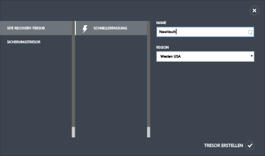

Überprüfen Sie auf der Statusleiste, ob der Tresor erfolgreich erstellt wurde. Der Tresor wird auf der Hauptseite von Recovery Services als *aktiv* aufgelistet.

## Schritt 2: Generieren eines Tresorregistrierungsschlüssels

Generieren Sie einen Registrierungsschlüssel im Tresor. Nachdem Sie den Azure Site Recovery-Anbieter heruntergeladen und auf dem VMM-Server installiert haben, verwenden Sie diesen Schlüssel, um den VMM-Server im Tresor zu registrieren.

1. Klicken Sie auf der Seite *Recovery Services* auf den Tresor, um die Seite „Schnellstart“ zu öffnen. Schnellstart kann auch jederzeit über das Symbol geöffnet werden.

	

2. Wählen Sie in der Dropdownliste den Eintrag **Zwischen einer lokalen Hyper-V-Site und Microsoft Azure** aus.
3. Klicken Sie unter **VMM-Server vorbereiten** auf **Registrierungsschlüssel erstellen**. Die Schlüsseldatei wird automatisch generiert und ist nach ihrer Erstellung für 5 Tage gültig. Wenn Sie nicht vom VMM-Server aus auf das Azure-Portal zugreifen, müssen Sie diese Datei auf den Server kopieren.

	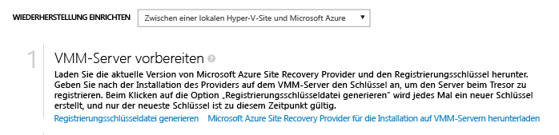

## Schritt 3: Installieren des Azure Site Recovery-Anbieters

4. Klicken Sie auf der Seite *Schnellstart* unter **VMM-Server vorbereiten** auf *Microsoft Azure Site Recovery-Anbieter für die Installation auf VMM-Servern herunterladen*, um die neueste Version der Anbieter-Installationsdatei herunterzuladen.

2. Führen Sie diese Datei auf dem VMM-Quellserver aus. Wenn VMM in einem Cluster bereitgestellt wird und Sie den Anbieter erstmals installieren, führen Sie die Installation auf einem aktiven Knoten durch und schließen Sie sie ab, um den VMM-Server im Tresor zu registrieren. Installieren Sie den Anbieter anschließend auf den anderen Knoten. Beachten Sie, dass Sie ein Upgrade des Anbieters auf allen Knoten durchführen müssen, da auf allen Knoten dieselbe Anbieterversion ausgeführt werden sollte.

3. Geben Sie unter **Voraussetzungsprüfung** an, dass der VMM-Dienst für die Anbietereinrichtung angehalten werden soll. Der Dienst wird angehalten und nach Abschluss der Einrichtung automatisch neu gestartet. Bei der Installation auf einem VMM-Cluster werden Sie aufgefordert, die Clusterrolle zu beenden.

	

4. Unter **Microsoft Update** können Sie Updates abonnieren. Mit dieser Einstellung werden Anbieterupdates gemäß Ihrer Microsoft Update-Richtlinie installiert.

	

Fahren Sie nach der Installation des Anbieters mit der Einrichtung fort, um den Server im Tresor zu registrieren.

5. Geben Sie auf der Seite **Internetverbindung** an, wie sich der Anbieter auf dem VMM-Server mit dem Internet verbinden soll. Wählen Sie *Proxyeinstellungen des Systems verwenden* aus, um die Standard-Internetverbindungseinstellungen auf dem Server zu verwenden.

	 – Wenn Sie einen benutzerdefinierten Proxy verwenden möchten, sollten Sie diesen vor der Installation des Anbieters einrichten. Wenn Sie benutzerdefinierte Proxyeinstellungen konfigurieren, wird ein Test ausgeführt, um die Proxyverbindung zu überprüfen. Wenn Sie einen benutzerdefinierten Proxy verwenden oder Ihr Standardproxy eine Authentifizierung verlangt, müssen Sie die Proxydetails einschließlich der Proxyadresse und des Ports eingeben. – Der VMM-Server und die Hyper-V-Hosts sollten auf die folgenden URLs Zugriff haben – *.hypervrecoverymanager.windowsazure.com – *.accesscontrol.windows.net – *.backup.windowsazure.com – *.blob.core.windows.net – *.store.core.windows.net – Erlauben Sie die IP-Adressen wie in [IP-Bereiche von Azure-Datencenter](http://go.microsoft.com/fwlink/?LinkId=511094) und HTTPS (443)-Protokoll beschrieben. Fügen Sie die IP-Adressbereiche der zu verwendenden Azure-Region sowie die IP-Adressbereiche der westlichen USA einer Positivliste hinzu.

	- Wenn Sie einen benutzerdefinierten Proxy verwenden, wird ein ausführendes VMM-Konto (DRAProxyAccount) automatisch mit den angegebenen Proxyanmeldeinformationen erstellt. Konfigurieren Sie den Proxyserver so, dass dieses Konto erfolgreich authentifiziert werden kann. In der VMM-Konsole können die Einstellungen des ausführenden VMM-Kontos geändert werden. Zu diesem Zweck öffnen Sie den Arbeitsbereich "Einstellungen", erweitern Sie "Sicherheit", klicken Sie auf "Ausführende Konten", und ändern Sie das Kennwort für DRAProxyAccount. Sie müssen den VMM-Dienst neu starten, damit diese Einstellung wirksam wird.

6. Wählen Sie unter **Registrierungsschlüssel** den Schlüssel aus, den Sie von Azure Site Recovery heruntergeladen und auf den VMM-Server kopiert haben.
7. Prüfen Sie unter **Tresorname** den Namen des Tresors, in dem der Server registriert wird.
8. Geben Sie unter **Servername** einen Anzeigenamen ein, um den VMM-Server im Tresor zu identifizieren. Geben Sie in einer Clusterkonfiguration den Rollennamen des VMM-Clusters an.

	

8. Wählen Sie unter **Erste Cloudmetadaten-Synchronisierung** aus, ob Sie Metadaten für alle Clouds auf dem VMM-Server mit dem Tresor synchronisieren möchten. Diese Aktion muss für jeden VMM-Server nur einmal ausgeführt werden. Falls Sie nicht alle Clouds synchronisieren möchten, können Sie diese Einstellung deaktivieren und die Clouds einzeln in den Cloud-Einstellungen in der VMM-Konsole synchronisieren.

9. Geben Sie unter **Datenverschlüsselung** einen Speicherort für ein SSL-Zertifikat an, das automatisch für die Datenverschlüsselung generiert wird. Dieses Zertifikat wird verwendet, wenn Sie Datenverschlüsselung für eine Cloud im Azure Site Recovery-Portal aktivieren. Bewahren Sie dieses Zertifikat sicher auf. Wenn Sie ein Failover in Azure ausführen, wählen Sie es aus, um verschlüsselte Daten zu entschlüsseln.

	

8. Klicken Sie auf *Registrieren*, um den Prozess abzuschließen. Nach der Registrierung werden die Metadaten vom VMM-Server von Azure Site Recovery abgerufen. Der Server wird auf der Ressourcen *Ressourcen* auf der Seite **Server** im Tresor angezeigt.

## Schritt 4: Erstellen eines Azure-Speicherkontos

Falls Sie noch kein Azure-Speicherkonto besitzen, klicken Sie auf **Azure-Speicherkonto hinzufügen**. Für das Konto muss Georeplikation aktiviert sein. Es muss sich in der gleichen Region wie der Azure Site Recovery-Dienst befinden und dem gleichen Abonnement zugeordnet sein.

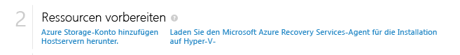

## Schritt 5: Installieren des Azure Recovery Services-Agent

Installieren Sie den Azure Recovery Services-Agent auf jedem Hyper-V-Hostserver in den VMM-Clouds, die Sie schützen möchten.

1. Klicken Sie auf der Seite „Schnellstart“ auf <b>Azure Site Recovery Services-Agent für die Installation auf Hosts</b> herunterladen, um die neueste Version der Agent-Installationsdatei zu erhalten.

	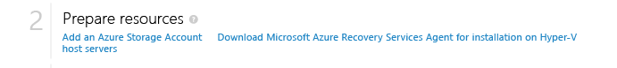

2. Führen Sie die Installationsdatei auf jedem Hyper-V-Hostserver in den VMM-Clouds aus, die Sie schützen möchten.
3. Klicken Sie auf der Seite **Voraussetzungsüberprüfung** auf <b>Weiter</b>. Alle fehlenden Komponenten, die Voraussetzung sind, werden automatisch installiert.

	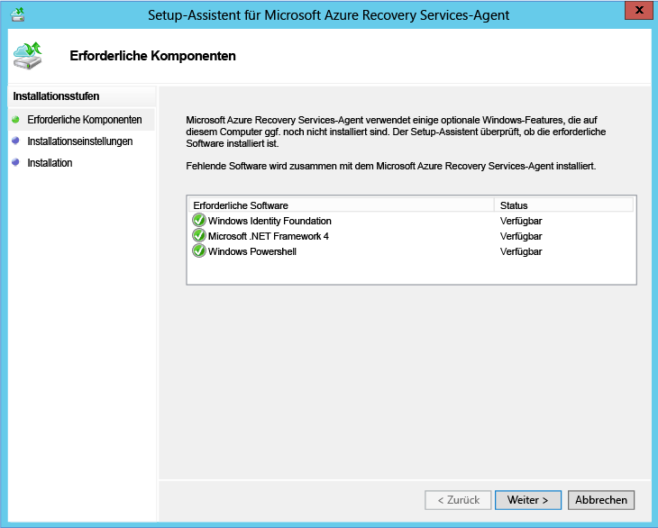

4. Geben Sie auf der Seite **Installationseinstellungen** an, wo Sie den Agent installieren möchten, und wählen Sie den Cachespeicherort aus, in dem die Sicherungsmetadaten installiert werden. Klicken Sie dann auf <b>Installieren</b>.

## Schritt 6: Konfigurieren der Cloudschutzeinstellungen

Nachdem Sie den VMM-Server registriert haben, können Sie Schutzeinstellungen für die Clouds konfigurieren. Sie haben bei der Installation des Anbieters die Option **Cloud-Daten mit Tresor synchronisieren** aktiviert. Deshalb werden alle Clouds auf dem VMM-Server im Tresor auf der Registerkarte <b>Geschützte Elemente</b> angezeigt.

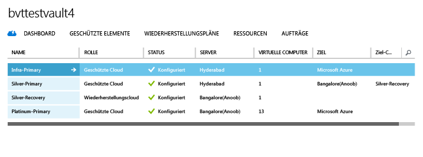

1. Klicken Sie auf der Seite „Schnellstart“ auf **Schutz für VMM-Clouds einrichten**.
2. Klicken Sie auf der Registerkarte **Geschützte Elemente** auf die Cloud, die Sie konfigurieren möchten, und gehen Sie zur Registerkarte **Konfiguration**.
3. Wählen Sie unter <b>Ziel</b> die Option <b>Microsoft Azure</b> aus.
4. Wählen Sie unter <b>Speicherkonto</b> das Azure-Speicherkonto aus, auf das Sie Ihre virtuellen Computer replizieren möchten.
5. Legen Sie <b>Gespeicherte Daten verschlüsseln</b> auf <b>Aus</b> fest. Diese Einstellung gibt an, dass die Daten beim Replizieren zwischen dem lokalen Standort und Azure verschlüsselt werden sollen.
6. Lassen Sie unter <b>Kopierhäufigkeit</b> die Standardeinstellung unverändert. Dieser Wert gibt an, wie oft die Daten zwischen dem Quell- und dem Zielspeicherort synchronisiert werden sollen.
7. Lassen Sie unter <b>Wiederherstellungspunkte beibehalten</b> die Standardeinstellung unverändert. Wenn die Standardeinstellung 0 (Null) aktiviert ist, wird nur der letzte Wiederherstellungspunkt für einen primären virtuellen Computer auf einem Replikathostserver gespeichert.
8. Lassen Sie unter <b>Häufigkeit von anwendungskonsistenten Momentaufnahmen</b> die Standardeinstellung unverändert. Dieser Wert gibt an, wie oft Momentaufnahmen erstellt werden. Momentaufnahmen verwenden VSS (Volume Shadow Copy Service, Volumenschattenkopie-Dienst), um sicherzustellen, dass Anwendungen zum Zeitpunkt der Momentaufnahme konsistent sind. Wenn Sie einen Wert festlegen möchten, stellen Sie sicher, dass er geringer als die Anzahl der konfigurierten zusätzlichen Wiederherstellungspunkte ist.
9. Geben Sie unter <b>Startzeit für Replikation</b> an, wann die erste Datenreplikation an Azure starten soll. Die Zeitzone auf dem Hyper-V-Hostserver wird verwendet. Es wird empfohlen, die erste Replikation außerhalb der Spitzenzeiten zu planen.

	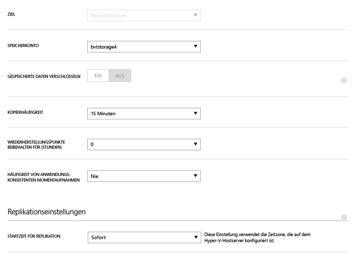

Nachdem Sie die Einstellungen gespeichert haben, wird ein Auftrag erstellt, der auf der Registerkarte <b>Aufträge</b> überwacht werden kann. Alle Hyper-V-Hostserver in der VMM-Quellcloud werden für die Replikation konfiguriert.

Nach dem Speichern können die Cloud-Einstellungen auf der Registerkarte <b>Konfigurieren</b> bearbeitet werden. Um den Zielspeicherort bzw. das Zielspeicherkonto zu ändern, müssen Sie die Cloudkonfiguration entfernen und dann die Cloud neu konfigurieren. Beachten Sie: Wenn Sie das Speicherkonto ändern, wird die Änderung nur für virtuelle Computer angewandt, für die der Schutz nach Änderung des Speicherkontos aktiviert wird. Vorhandene virtuelle Computer werden nicht an das neue Speicherkonto migriert.

## Schritt 7: Konfigurieren der Netzwerkzuordnung
Bevor Sie mit der Netzwerkzuordnung beginnen, stellen Sie sicher, dass virtuelle Computer auf dem VMM-Quellserver mit einem VM-Netzwerk verbunden sind. Erstellen Sie außerdem ein oder mehrere virtuelle Azure-Netzwerke. Beachten Sie, dass einem einzelnen Azure-Netzwerk mehrere VM-Netzwerke zugeordnet werden können.

1. Klicken Sie auf der Seite „Schnellstart“ auf **Netzwerke zuordnen**.
2. Wählen Sie auf der Registerkarte **Netzwerke** unter **Quellenspeicherort** den VMM-Quellserver aus. Wählen Sie „Azure“ unter **Zielspeicherort** aus.
3. Unter **Quelle** wird eine Liste der VM-Netzwerke angezeigt, die mit dem VMM-Server verbunden sind. Unter **Ziel** werden die dem Abonnement zugeordneten Azure-Netzwerke angezeigt.
4. Wählen Sie das VM-Quellnetzwerk aus, und klicken Sie auf **Zuordnen**.
5. Wählen Sie auf der Seite **Zielnetzwerk auswählen** das Azure-Zielnetzwerk aus, das Sie verwenden möchten.
6. Aktivieren Sie das Kontrollkästchen, um den Zuordnungsprozess abzuschließen.

	

Nachdem Sie die Einstellungen gespeichert haben, wird ein Auftrag zum Nachverfolgen des Zuordnungsvorgangs gestartet, der auf der Registerkarte "Aufträge" überwacht werden kann. Vorhandene virtuelle Replikatcomputer, die dem VM-Quellnetzwerk entsprechen, werden mit den Azure-Zielnetzwerken verbunden. Neue virtuelle Computer, die mit dem VM-Quellnetzwerk verbunden sind, werden nach der Replikation mit dem zugeordneten Azure-Netzwerk verbunden. Wenn Sie eine vorhandene Zuordnung mit einem neuen Netzwerk ändern, werden virtuelle Replikatcomputer anhand der neuen Einstellungen verbunden.

Wenn das Zielnetzwerk mehrere Subnetze enthält und eines dieser Subnetze denselben Namen besitzt wie das Subnetz des virtuellen Quellcomputers, dann wird der virtuelle Replikatcomputer nach einem Failover mit diesem Zielsubnetz verbunden. Gibt es kein Zielsubnetz mit einem übereinstimmenden Namen, wird der virtuelle Computer mit dem ersten Subnetz im Netzwerk verbunden.

## Schritt 8: Aktivieren des Schutzes für virtuelle Computer

Nach der korrekten Konfiguration von Servern, Clouds und Netzwerken können Sie den Schutz für die virtuellen Computer in der Cloud aktivieren. Beachten Sie Folgendes:

- Die virtuellen Computer müssen die Azure-Anforderungen erfüllen. Unter <a href="http://go.microsoft.com/fwlink/?LinkId=402602">Voraussetzungen und Support</a> im Planungshandbuch können Sie diese prüfen.
- Um den Schutz zu aktivieren, müssen die Eigenschaften "Betriebssystem" und "Betriebssystem-Datenträger" für den virtuellen Computer gesetzt sein. Sie können diese Eigenschaften setzen, wenn Sie den virtuellen Computer in VMM mithilfe einer Vorlage für virtuelle Maschinen erstellen. Außerdem können Sie diese Eigenschaften für vorhandene virtuelle Computer auf den Registerkarten **Allgemein** und **Hardwarekonfiguration** in den Eigenschaften der virtuellen Computer festlegen. Falls diese Eigenschaften in VMM nicht angezeigt werden, sollten Sie sie dennoch im Azure Site Recovery-Portal konfigurieren können.

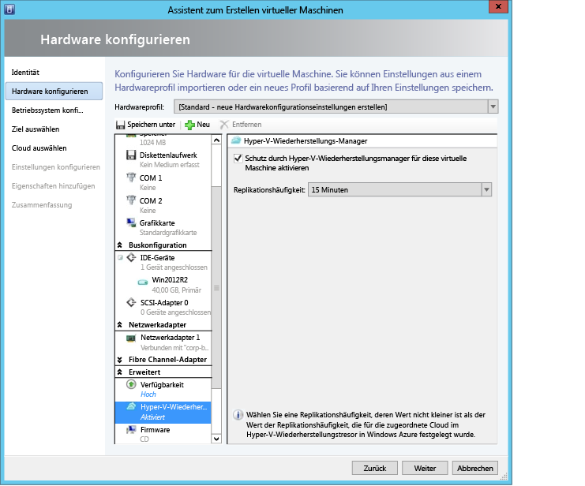

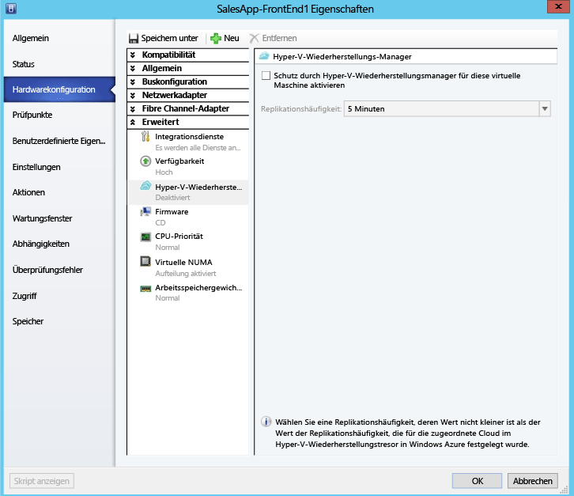

1. Klicken Sie zum Aktivieren von Schutz auf der Registerkarte <b>Virtuelle Computer</b> in der Cloud, in der sich der virtuelle Computer befindet, auf <b>Schutz aktivieren</b>, und wählen Sie dann <b>Virtuelle Computer hinzufügen</b> aus.
2. Wählen Sie aus der Liste der virtuellen Computer in der Cloud denjenigen aus, den Sie schützen möchten.

	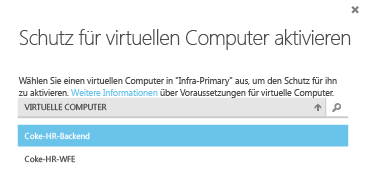

	Auf der Registerkarte **Aufträge** können Sie den Fortschritt der Schutzaktivierung und der ersten Replikation verfolgen. Nachdem der Auftrag zum Abschließen des Schutzes ausgeführt wurde, ist der virtuelle Computer bereit für das Failover. Nach dem Aktivieren des Schutzes und der Replikation der virtuellen Computer können Sie die virtuellen Computer in Azure sehen.

	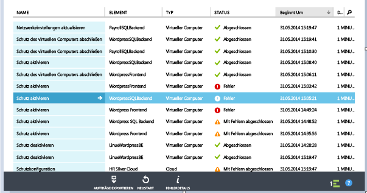

3. Überprüfen Sie den virtuellen Computer und nehmen Sie ggf. Änderungen vor.

	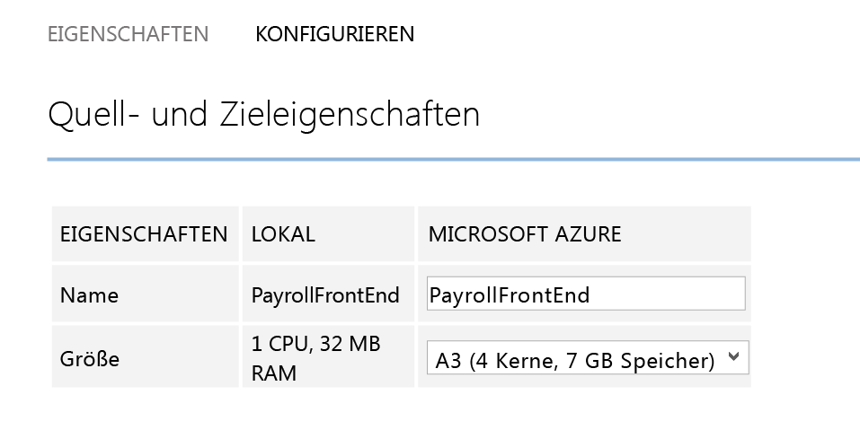

4. In der Registerkarte "Konfigurieren" unter den Eigenschaften des virtuellen Computers können folgende Netzwerkeigenschaften geändert werden.

    1. Anzahl der Netzwerkadapter des virtuellen Ziel-Computers – Die Anzahl der Netzwerkadapter auf dem virtuellen Zielcomputer hängt von der Größe des gewählten virtuellen Computers ab. Die Anzahl der Netzwerkadapter der virtuellen Zielcomputer entspricht mindestens der Anzahl der Netzwerkadapter auf virtuellen Quellcomputern und der maximalen Anzahl der Netzwerkadapter, die nach der unterstützten Größe des virtuellen Computers ausgewählt werden.  

	1. Netzwerk des virtuellen Zielcomputers – Das Netzwerk, zu dem die virtuelle Maschine eine Verbindung herstellt, wird durch die Netzwerkzuordnung des Netzwerks vom virtuellen Quellcomputer bestimmt. Falls der virtuellen Quellcomputer über mehrere Netzwerkadapter verfügt und Quellnetzwerke verschiedenen Netzwerken im Ziel zugeordnet sind, muss der Benutzer zwischen den Zielnetzwerken wählen.

	1. Subnetz der einzelnen Netzwerkadapter – Der Benutzer kann für jeden Netzwerkadapter das Subnetz auswählen, zu dem der virtuelle Computer, auf dem ein Failover ausgeführt wird, eine Verbindung herstellt.

	1. Ziel-IP – Wenn der Netzwerkadapter des virtuellen Quellcomputers konfiguriert ist, statische IP-Adressen zu verwenden, kann der Benutzer die IP-Adresse für den virtuellen Zielcomputer bereitstellen. Der Benutzer kann diese Funktion verwenden, um die IP-Adresse des virtuellen Quellcomputers nach einem Failover beizubehalten. Wenn keine IP-Adresse angegeben wird, erhält der Netzwerkadapter eine beliebige verfügbare IP-Adresse zum Zeitpunkt des Failovers. Für den Fall, dass die vom Benutzer bereitgestellte Ziel-IP-Adresse bereits von einem anderen virtuellen Computer verwendet wird, der in Azure ausgeführt wird, schlägt der Failover fehl.

		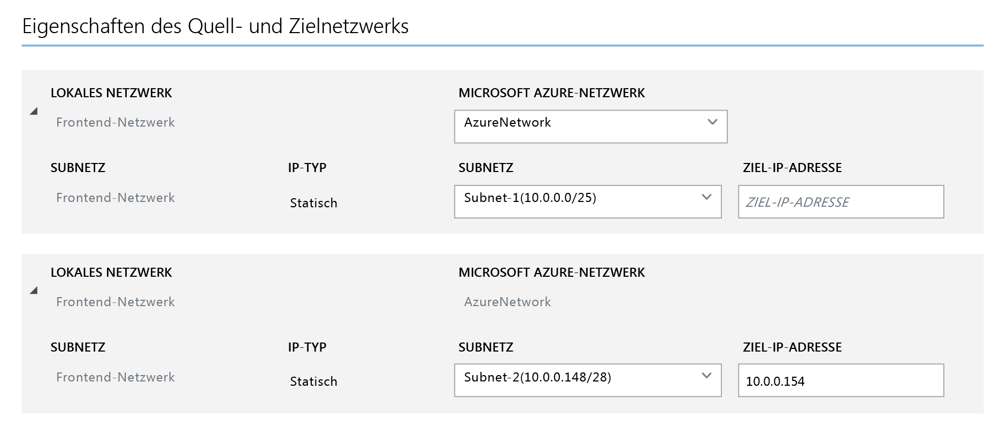

## Testen der Bereitstellung
Um Ihre Bereitstellung zu testen, können Sie ein Testfailover für einen einzelnen virtuellen Computer durchführen oder einen Wiederherstellungsplan erstellen, der mehrere virtuelle Computer umfasst, und ein Testfailover für diesen Plan durchführen. Das Test-Failover simuliert Ihre Failover- und Wiederherstellungsmechanismen in einem isolierten Netzwerk. Beachten Sie Folgendes:

- Wenn Sie nach dem Failover eine Verbindung mit dem virtuellen Computer in Azure über Remote Desktop herstellen möchten, aktivieren Sie die Remote Desktop-Verbindung auf dem virtuellen Computer, bevor Sie das Test-Failover ausführen.
- Nach dem Failover verwenden Sie eine öffentliche IP-Adresse, um eine Verbindung zum virtuellen Computer in Azure über Remote Desktop herzustellen. Wenn Sie dies möchten, stellen Sie sicher, dass keine Domänenrichtlinien vorhanden sind, die das Verbinden zu einem virtuellen Computer über eine öffentliche Adresse verhindern.

### Erstellen eines Wiederherstellungsplans

1. Fügen Sie auf der Registerkarte **Wiederherstellungspläne** einen neuen Plan hinzu. Geben Sie einen Namen an, **VMM** in **Quelltyp** und den VMM-Quellserver in **Quelle**. Das Ziel ist Azure.

	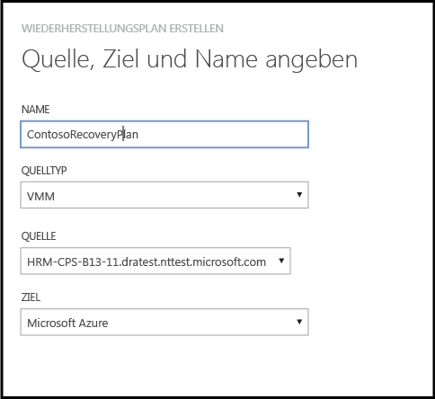

2. Wahlen Sie auf der Seite **Virtuelle Computer auswählen** die virtuellen Computer aus, die dem Wiederherstellungsplan hinzugefügt werden sollen. Diese virtuellen Computer werden der Standardgruppe des Wiederherstellungsplans (Gruppe 1) hinzugefügt. Maximal 100 virtuelle Computer wurden in einem einzelnen Wiederherstellungsplan getestet.

	- Wenn Sie die Eigenschaften der virtuellen Computer überprüfen möchten, bevor Sie sie dem Plan hinzufügen, klicken Sie auf den virtuellen Computer auf der Eigenschaftenseite der Cloud, in der er sich befindet. Sie können auch die Eigenschaften des virtuellen Computers in der VMM-Konsole konfigurieren.
	- Für alle angezeigten virtuellen Computer wurde die Schutzfunktion aktiviert. Die Liste enthält sowohl virtuelle Computer, die für den Schutz aktiviert wurden und deren erste Replikation abgeschlossen ist, als auch solche, die für den Schutz aktiviert wurden, deren erste Replikation jedoch noch aussteht. Nur virtuelle Computer, deren erste Replikation abgeschlossen ist, können im Rahmen eines Wiederherstellungsplans ein Failover durchführen. Überprüfen Sie daher den Status der ersten Replikation virtueller Computer im Plan, bevor Sie das Failover eines Wiederherstellungsplans starten.

	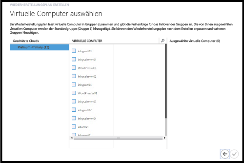

Nachdem ein Wiederherstellungsplan erstellt wurde, wird er auf der Registerkarte **Wiederherstellungspläne** angezeigt. Sie können auch [Azure Automation-Runbooks](site-recovery-runbook-automation.md) zum Wiederherstellungsplan hinzufügen, um Failover-Zeiten zu automatisieren.

### Durchführen eines Test-Failovers

Es gibt zwei Möglichkeiten, ein Testfailover in Azure auszuführen.

- Testfailover ohne Azure-Netzwerk – Bei dieser Art von Testfailover wird überprüft, dass der virtuelle Computer in Azure ordnungsgemäß hochgefahren wird. Der virtuelle Computer wird nach einem Failover mit keinem Azure-Netzwerk verbunden.
- Testfailover mit Azure-Netzwerk – Bei dieser Art von Failover wird überprüft, ob die gesamte Replikationsumgebung wie erwartet hochgefahren wird und die betreffenden virtuellen Computer mit dem angegebenen Azure-Zielnetzwerk verbunden werden. Bei der Subnetzverarbeitung wird für das Testfailover das Subnetz des virtuellen Testcomputers basierend auf dem Subnetz des virtuellen Replikatcomputers festgelegt. Dies unterscheidet sich von der regulären Replikation, bei der das Subnetz des virtuellen Replikatcomputers auf dem Subnetz des virtuellen Quellcomputers basiert.

Wenn Sie ein Testfailover für einen virtuellen Computer, der für den Schutz in Azure aktiviert ist, ohne Angabe eines Azure-Zielnetzwerks durchführen möchten, müssen Sie nichts vorbereiten. Für ein Testfailover mit einem Azure-Zielnetzwerk müssen Sie ein neues Azure-Netzwerk erstellen, das von Ihrem Azure-Produktionsnetzwerk isoliert ist (Standardverhalten bei der Erstellung eines neuen Netzwerks in Azure), und die Infrastruktur einrichten, damit der replizierte virtuelle Computer erwartungsgemäß funktioniert. So kann beispielsweise ein virtueller Computer mit Domänencontroller und DNS mithilfe von Azure Site Recovery zu Azure repliziert und mittels Testfailover im Testnetzwerk erstellt werden. Gehen Sie wie folgt vor, um ein Testfailover durchzuführen:

1. Führen Sie ein Testfailover des virtuellen Computers mit Domänencontroller und DNS in dem Netzwerk durch, das Sie auch für das eigentliche Testfailover des lokalen virtuellen Computers verwenden möchten.
2. Notieren Sie sich die IP-Adresse, die dem virtuellen DNS-Computer nach dem Failover zugeordnet wurde.
3. Fügen Sie dem virtuellen Azure-Netzwerk, das für das Failover verwendet wird, die IP-Adresse als DNS-Serveradresse hinzu.
4. Führen Sie das Testfailover der lokalen virtuellen Quellcomputer durch, und geben Sie dabei das Azure-Testnetzwerk an.
5. Vergewissern Sie sich, dass das Testfailover erwartungsgemäß funktioniert hat. Markieren Sie das Testfailover als abgeschlossen – zuerst für den Wiederherstellungsplan und anschließend für die virtuellen Computer mit Domänencontroller und DNS.

Gehen Sie folgendermaßen vor, um ein Testfailover durchzuführen:

1. Wählen Sie auf der Registerkarte **Wiederherstellungspläne** den gewünschten Wiederherstellungsplan aus, und klicken Sie auf **Testfailover**.
1. Wählen Sie auf der Seite **Testfailover bestätigen** den Eintrag **Kein** oder ein bestimmtes Azure-Netzwerk aus. Beachten Sie, dass ein Testfailover bei Auswahl von "Kein" prüft, ob der virtuelle Computer ordnungsgemäß nach Azure repliziert wurde. Es wird jedoch nicht die Konfiguration des Replikationsnetzwerks geprüft.

	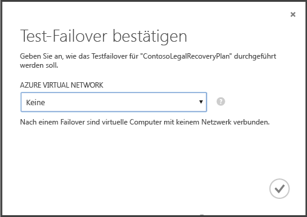

1. Wenn für die Cloud eine Datenverschlüsselung aktiviert ist, wählen Sie unter **Verschlüsselungsschlüssel** das Zertifikat aus, das während der Installation des Anbieters auf dem VMM-Server ausgestellt wurde, als Sie die Option zum Aktivieren der Datenverschlüsselung für eine Cloud aktiviert haben.
1. Auf der Registerkarte **Aufträge** können Sie den Fortschritt des Failovers verfolgen. Außerdem wird Ihnen das Testreplikat des virtuellen Computers im Azure-Portal angezeigt. Wenn Sie den Zugriff auf virtuelle Computer aus Ihrem lokalen Netzwerk eingerichtet haben, können Sie eine Remotedesktopverbindung mit dem virtuellen Computer herstellen.
1. Klicken Sie auf **Test abschließen**, wenn das Failover die Endphase des Tests erreicht. Auf der Registerkarte **Auftrag** können Sie den Failoverfortschritt und -status detailliert nachverfolgen und etwaige erforderliche Aufgaben ausführen.
1. Nach dem Failover können Sie das Testreplikat des virtuellen Computers im Azure-Portal sehen. Wenn Sie den Zugriff auf virtuelle Computer aus Ihrem lokalen Netzwerk eingerichtet haben, können Sie eine Remotedesktopverbindung mit dem virtuellen Computer herstellen. Beachten Sie Folgendes:

    1. Prüfen Sie, ob die virtuellen Computer erfolgreich starten.
    1. Wenn Sie nach dem Failover eine Verbindung mit dem virtuellen Computer in Azure über Remote Desktop herstellen möchten, aktivieren Sie die Remote Desktop-Verbindung auf dem virtuellen Computer, bevor Sie das Test-Failover ausführen. Außerdem müssen Sie dem virtuellen Computer einen RDP-Endpunkt hinzufügen. Hierzu können Sie ein Azure Automation-Runbook verwenden.
    1. Falls Sie nach dem Failover über eine öffentliche IP-Adresse eine Remotedesktopverbindung mit dem virtuellen Computer in Azure herstellen, achten Sie darauf, dass keine Domänenrichtlinien vorhanden sind, die dies verhindern.

1.  Gehen Sie nach dem Test wie folgt vor:
	- Klicken Sie auf **Das Testfailover ist abgeschlossen**. Bereinigen Sie die Testumgebung, um die virtuellen Testcomputer automatisch auszuschalten und zu löschen.
	- Klicken Sie auf **Notizen**, um alle Beobachtungen im Zusammenhang mit dem Test-Failover aufzuzeichnen und zu speichern.

##  Überwachen der Aktivität

Verwenden Sie die Registerkarte *Jobs* und das *Dashboard*, um die wichtigsten Aufträge anzuzeigen und zu überwachen, die vom Azure Site Recovery-Tresor durchgeführt werden. Dazu zählen das Konfigurieren von Schutz für eine Cloud, Aktivieren und Deaktivieren von Schutz für einen virtuellen Computer, Ausführen eines Failovers (geplant, ungeplant oder Test) und Übernehmen eines ungeplanten Failovers.

Auf der Registerkarte *Jobs* können Sie Aufträge anzeigen, ein Drill-Down zu den Auftragsdetails und -fehlern durchführen, Auftragsabfragen ausführen, um Aufträge abzurufen, die bestimmte Kriterien erfüllen, Aufträge nach Excel exportieren und fehlgeschlagene Aufträge neu starten.

Über das *Dashboard* können Sie die neuesten Versionen der Anbieter- und Agent-Installationsdateien herunterladen, Konfigurationsinformationen für den Tresor erhalten, die Anzahl der virtuellen Computer anzeigen, deren Schutz vom Tresor verwaltet wird, kürzlich ausgeführte Aufträge anzeigen und virtuelle Computer neu synchronisieren.

Weitere Informationen über Interaktionen mit Aufträgen und dem Dashboard finden Sie im <a href="http://go.microsoft.com/fwlink/?LinkId=398534">Betriebs- und Überwachungshandbuch</a>.

##Nächste Schritte
<UL>
<LI>Informationen zur Planung und Bereitstellung von Azure Site Recovery in einer realen Produktionsumgebung finden Sie im <a href="http://go.microsoft.com/fwlink/?LinkId=321294">Planungshandbuch für Azure Site Recovery</a> und im <a href="http://go.microsoft.com/fwlink/?LinkId=321295">Bereitstellungshandbuch für Azure Site Recovery</a>.</LI>

<LI>Wenn Sie Fragen haben, besuchen Sie das<a href="http://go.microsoft.com/fwlink/?LinkId=313628"> Azure Recovery Services-Forum</a>.</LI></UL>
 

<!---HONumber=August15_HO7-->