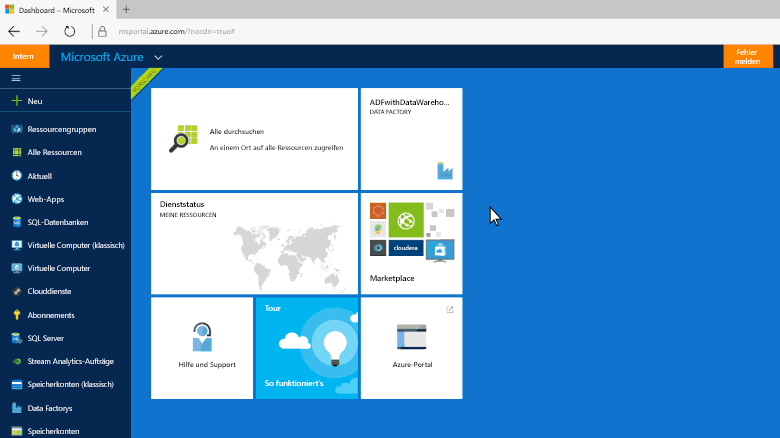
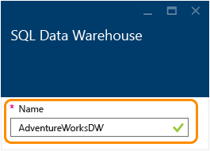
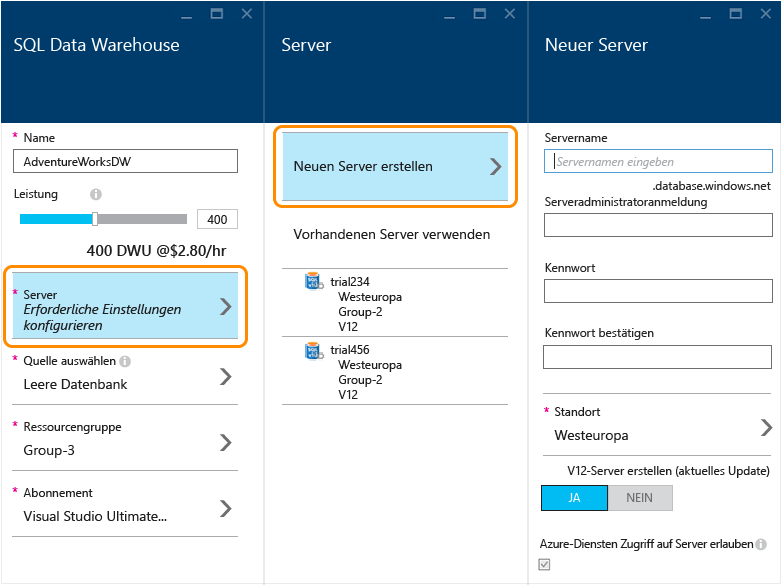
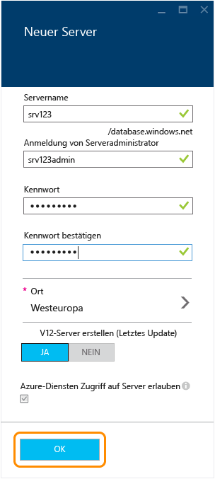
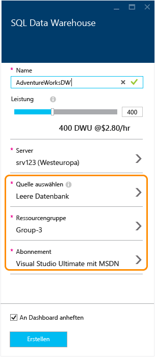
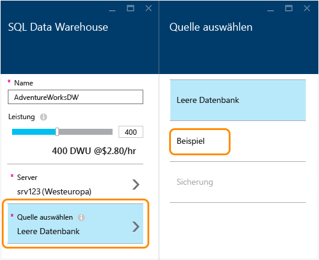
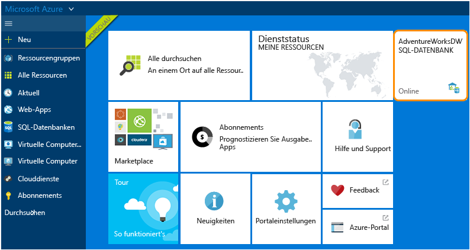
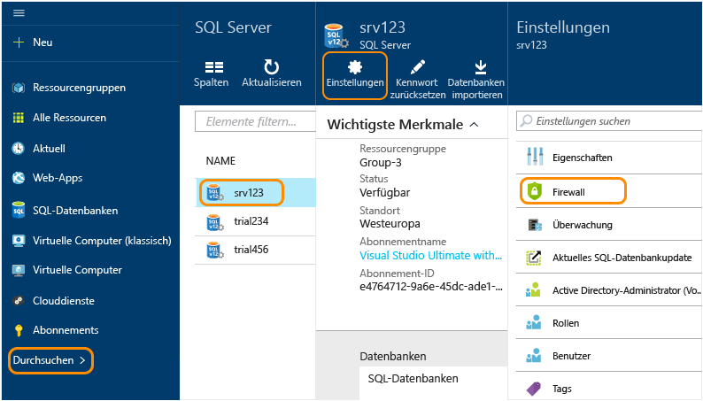
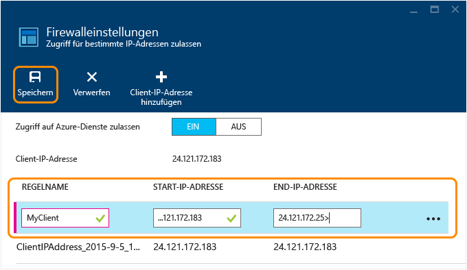

<properties
	pageTitle="Erstellen einer SQL Data Warehouse-Datenbank im Azure-Portal | Microsoft Azure"
	description="Erfahren Sie, wie Sie ein Azure SQL Data Warehouse im Azure-Portal erstellen."
	services="sql-data-warehouse"
	documentationCenter="NA"
	authors="barbkess"
	manager="jhubbard"
	editor=""
	tags="azure-sql-data-warehouse"/>
<tags
   ms.service="sql-data-warehouse"
   ms.devlang="NA"
   ms.topic="get-started-article"
   ms.tgt_pltfrm="NA"
   ms.workload="data-services"
   ms.date="12/15/2015"
   ms.author="lodipalm;barbkess"/>

# Erstellen eines SQL Data Warehouse

> [AZURE.SELECTOR]
- [Azure Portal](sql-data-warehouse-get-started-provision.md)
- [TSQL](sql-data-warehouse-get-started-create-database-tsql.md)
- [PowerShell](sql-data-warehouse-get-started-provision-powershell.md)

In diesem Tutorial wird das Erstellen einer Azure SQL Data Warehouse-Datenbank veranschaulicht, was im Azure-Portal nur wenige Minuten dauert.

In diesem Lernprogramm führen Sie folgende Schritte aus:

- Erstellen eines Servers, der die Datenbank hostet
- Erstellen einer Datenbank, die die AdventureWorksDW-Beispieldatenbank enthält

Wenn Sie versuchen, eine vorhandene Datenbank zu SQL Data Warehouse zu migrieren, lesen Sie die [Übersicht über die Migration](./sql-data-warehouse-get-started-overview-migrate.md), oder verwenden Sie das [Migrationshilfsprogramm ](./sql-data-warehouse-migrate-migration-utility.md).

Um Daten in SQL Data Warehouse zu laden, lesen Sie [Laden von Daten in SQL Data Warehouse](./sql-data-warehouse-overview-load.md).

[AZURE.INCLUDE [free-trial-note](../../includes/free-trial-note.md)]

## Schritt 1: Anmelden und erste Schritte

1. Melden Sie sich beim [Azure-Portal](https://portal.azure.com) an.

2. Klicken Sie auf **Neu** > **Daten + Speicher** > **SQL Data Warehouse**.

    

1. Geben Sie auf dem Blatt "SQL Data Warehouse-Datenbank" einen Namen für Ihre Datenbank ein. In diesem Beispiel nennen wir die Datenbank "AdventureWorksDW".

    

## Schritt 2: Konfigurieren und Erstellen eines Servers

In Azure SQL-Datenbank und SQL Data Warehouse wird jede Datenbank einem Server und jeder Server einem geografischen Standort zugewiesen. Der Server wird als logischer SQL Server bezeichnet.

> [AZURE.NOTE]Ein logischer SQL Server:
  >
  > + Bietet ein einheitliches Verfahren zum Konfigurieren mehrerer Datenbanken innerhalb des gleichen geografischen Standorts.
  > + Ist keine physische Hardware wie bei einem lokalen Server. sondern Teil der Dienstsoftware. Aus diesem Grund sprechen wird von einem *logischen Server*.
  > + Kann mehrere Datenbanken ohne Beeinträchtigung der Leistung hosten.
  > + Enthält im Namen ein kleingeschriebenes *s*. "SQL **s**erver" ist ein logischer Azure-Server, während "SQL **S**erver" der Name eines lokalen Datenbankprodukts von Microsoft ist.

1. Klicken Sie auf **Server** > **Neuen Server erstellen**. Es fallen keine Gebühren für den Server ein. Wenn Sie einen bereits vorhandenen logischen V12-Server verwenden möchten, wählen Sie den vorhandenen Server aus und fahren mit dem nächsten Schritt fort. 

    

3. Geben Sie die Informationen in **Neuer Server** ein.
    
	- **Servername**. Geben Sie einen Namen für den logischen Server ein. Dieser ist für jeden geografischen Standort eindeutig.
	- **Name des Serveradministrators**. Geben Sie einen Benutzernamen für das Serveradministratorkonto ein.
	- **Kennwort**. Geben Sie das Kennwort des Serveradministrators ein. 
	- **Standort**. Wählen Sie einen geografischen Standort für den Server. Um die Datenübertragungszeit zu verkürzen, empfiehlt es sich, den Server in geografischer Nähe zu anderen Datenressourcen zu platzieren, auf die diese Datenbank zugreift.
	- **V12-Server erstellen**. "JA" ist für "SQL Data Warehouse" die einzige Option. 
	- **Azure-Diensten den Zugriff auf Server gestatten**. Diese Option ist für "SQL Data Warehouse" stets aktiviert.

    >[AZURE.NOTE]Stellen Sie sicher, dass Sie den Servernamen, den Serveradministratornamen und das Kennwort notieren und aufbewahren. Sie benötigen diese Informationen, um sich beim Server anzumelden.

1. Klicken Sie auf **OK**, um die Einstellungen zu speichern und zum Blatt "SQL Data Warehouse" zurückzukehren.

    

## Schritt 3: Konfigurieren und Erstellen einer Datenbank

Nachdem Sie Ihren logischen SQL-Server ausgewählt haben, können Sie die Erstellung der Datenbank abschließen.
 
2. Füllen Sie auf dem Blatt **SQL Data Warehouse** die restlichen Felder aus. 

    
    
    - **Leistung**: Es wird empfohlen, mit 400 DWUs zu beginnen. Sie können den Schieberegler nach links oder rechts bewegen, um die Leistungsstufe Ihrer Datenbank anzupassen, was sowohl jetzt als auch nach Erstellen der Datenbank möglich ist. 

        > [AZURE.NOTE]Die Leistung wird in SQL Data Warehouse-Einheiten (Data Warehouse Units, DWUs) gemessen. Wenn Sie die Anzahl der DWUs erhöhen, erhöht SQL Data Warehouse die Computerressourcen, die für Ihre Datenbankvorgänge verfügbar sind. Wie Sie Ihren Workload ausführen, werden Sie erkennen, in welchem Verhältnis DWUs zur Workloadleistung stehen.
        > 
        > Sie können die Leistungsstufe schnell und einfach ändern, nachdem die Datenbank erstellt wurde. Wenn Sie z. B. die Datenbank nicht verwenden, ziehen Sie den Schieberegler nach links, um Kosten zu senken. Oder erhöhen Sie die Leistung, wenn mehr Ressourcen benötigt werden. Damit keine Kosten anfallen, können Sie die Datenbank anhalten. Dies ist die skalierbare Leistung von SQL Data Warehouse.

    - **Quelle auswählen**. Klicken Sie auf **Quelle auswählen** > **Beispiel**. Da derzeit nur eine Beispieldatenbank verfügbar ist, füllt Azure bei Wählen von "Beispiel" automatisch die Option **Beispiel auswählen** mit "AdventureWorksDW" aus.
  
        

    - **Ressourcengruppe**. Sie können die Standardwerte beibehalten. Ressourcengruppen sind Container, die zum Verwalten einer Azure-Ressourcensammlung entwickelt wurden. Weitere Informationen zu [Ressourcengruppen](../azure-portal/resource-group-portal.md).
    
    - **Abonnement**. Wählen Sie das Abonnement für die Abrechnung dieser Datenbank aus.

1. Klicken Sie auf **Erstellen**, um die SQL Data Warehouse-Datenbank zu erstellen.

1. Warten Sie einige Minuten, bis die Datenbank bereit ist. Im Anschluss sollten Sie sich wieder im [Azure-Portal](https://portal.azure.com) befinden. Beachten Sie, dass die SQL Data Warehouse-Datenbank Ihrem Dashboard hinzugefügt wurde.

    

## Schritt 4: Konfigurieren des Serverfirewall-Zugriffs für Ihre Client-IP-Adresse

Um über Ihre aktuelle IP-Adresse auf den Server zuzugreifen, fügen Sie Ihre Client-IP-Adresse den Firewallregeln hinzu. Dies wird im folgenden Schritt gezeigt.

1. Klicken Sie auf **Durchsuchen** > **SQL Server** > Server wählen> **Einstellungen** > **Firewall**.

    

4. Klicken Sie auf **Client-IP-Adresse hinzufügen**, damit Azure eine Regel für Ihre Client-IP-Adresse erstellt. Klicken Sie auf **Speichern**.

	

1. Erstellen Sie eine Firewallregel mit einem Bereich von IP-Adressen. Sie können dies jetzt oder später tun.

	>[AZURE.IMPORTANT]Die IP-Adresse kann sich von Zeit zu Zeit ändern, und Sie können dann möglicherweise nicht auf den Server zugreifen, bis Sie eine neue Firewallregel erstellt haben. Um konsistenten Zugriff zu gewährleisten, wird empfohlen, einen Bereich von IP-Adressen hinzuzufügen. Weitere Einzelheiten finden Sie unter [Konfigurieren der Firewalleinstellungen](../sql-database/sql-database-configure-firewall-settings.md).

    Um eine Regel zu erstellen, geben Sie einen Namen und den IP-Adressbereich ein. Klicken Sie dann auf **Speichern**.

    

Da Sie jetzt die Firewall konfiguriert haben, können Sie Verbindungen zwischen dem Desktop und der gerade erstellten Azure SQL Data Warehouse-Datenbank herstellen.

## Nächste Schritte

Nachdem Sie eine Beispieldatenbank für SQL Data Warehouse erstellt haben, sind Sie bereit, eine [Verbindung](./sql-data-warehouse-get-started-connect.md) mit der Datenbank herzustellen.

<!---HONumber=AcomDC_1217_2015-->