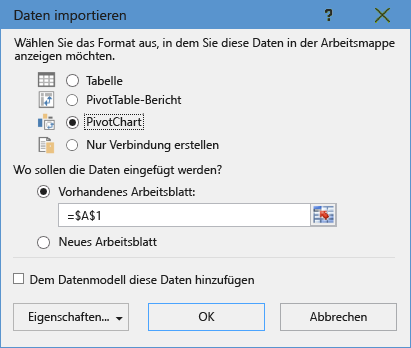
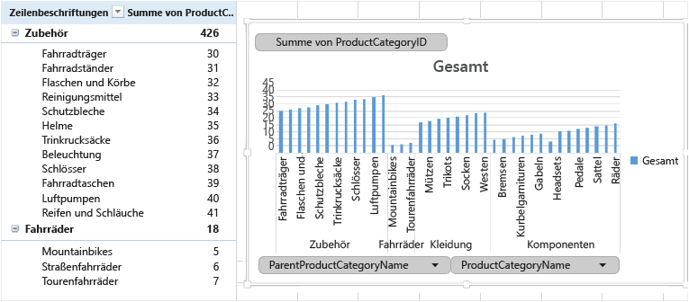

<properties
	pageTitle="Verbinden von Excel mit SQL-Datenbank | Microsoft Azure"
	description="Erfahren Sie, wie Sie Microsoft Excel mit Azure SQL-Datenbank in der Cloud verbinden. Importieren Sie Daten zwecks Berichterstellung und Untersuchung in Excel."
	services="sql-database"
	keywords="Verbinden von Excel mit SQL, Importieren von Daten in Excel"
	documentationCenter=""
	authors="joseidz"
	manager="jeffreyg"
	editor="jeffreyg"/>

<tags
	ms.service="sql-database"
	ms.workload="data-management"
	ms.tgt_pltfrm="na"
	ms.devlang="na"
	ms.topic="get-started-article"
	ms.date="03/25/2016"
	ms.author="joseidz"/>

# Tutorial zu SQL-Datenbank: Verbinden von Excel mit einer Azure SQL-Datenbank und Erstellen eines Berichts

> [AZURE.SELECTOR]
- [C#](sql-database-connect-query.md)
- [SSMS](sql-database-connect-query-ssms.md)
- [Excel](sql-database-connect-excel.md)

Erfahren Sie, wie Sie für Excel eine Verbindung mit einer SQL-Datenbank in der Cloud herstellen, damit Sie Daten importieren und Tabellen und Diagramme basierend auf den Werten in der Datenbank erstellen können. In diesem Tutorial richten Sie die Verbindung zwischen Excel und einer Datenbanktabelle ein, speichern die Datei, in der die Daten und Verbindungsinformationen für Excel vorgehalten werden, und erstellen aus den Datenbankwerten dann ein PivotChart.

Bevor Sie beginnen können, benötigen Sie eine SQL-Datenbank in Azure. Wenn Sie keine haben, finden Sie unter [Erstellen Ihrer ersten SQL-Datenbank](sql-database-get-started.md) eine Datenbank mit Beispieldaten, die in wenigen Minuten startklar ist. In diesem Artikel importieren Sie Beispieldaten aus diesem Artikel in Excel, doch Sie können ähnliche Schritte auch mit Ihren eigenen Daten befolgen.

Sie benötigen auch eine Kopie von Excel. In diesem Artikel wird [Microsoft Excel 2016](https://products.office.com/de-DE/) verwendet.

## Verbinden von Excel mit einer SQL-Datenbank und Erstellen einer ODC-Datei

1.	Um Excel mit einer SQL-Datenbank zu verbinden, öffnen Sie Excel und erstellen dann eine neue Arbeitsmappe oder öffnen eine vorhandene Excel-Arbeitsmappe.

2.	Klicken Sie auf der Menüleiste am oberen Rand der Seite auf **Daten**. Klicken Sie auf **Aus anderen Quellen**, und klicken Sie dann auf **Von SQL Server**.

	

	Der Datenverbindungs-Assistent wird geöffnet.

3.	Geben Sie im Dialogfeld **Zum Datenbankserver verbinden** den **Servernamen** der SQL-Datenbank, mit der Sie die Verbindung herstellen möchten, im Format <*Servername*>**.database.windows.net** ein. Beispiel: **adworkserver.database.windows.net**.

4.	Klicken Sie unter **Anmeldeinformationen** auf **Benutzername und Kennwort verwenden**. Geben Sie den **Benutzernamen** und das **Kennwort** wie beim Erstellen des Azure SQL-Datenbank-Servers ein, und klicken Sie dann auf **Weiter**.

    

	> [AZURE.TIP] Je nach Netzwerkumgebung kann es sein, dass Sie keine Verbindung herstellen können, oder die Verbindung geht verloren, wenn der SQL-Datenbank-Server keinen Datenverkehr von Ihrer Client-IP-Adresse zulässt. Navigieren Sie zum [Azure-Portal](https://portal.azure.com/), klicken Sie nacheinander auf „Server mit SQL Server“, Ihren Server und unter „Einstellungen“ auf „Firewall“, und fügen Sie Ihre Client-IP-Adresse hinzu. Weitere Einzelheiten finden Sie unter [Konfigurieren von Firewalleinstellungen](sql-database-configure-firewall-settings.md).

5. Wählen Sie im Dialogfeld **Datenbank und Tabelle wählen** in der Liste die gewünschte Datenbank aus, und klicken Sie dann auf die gewünschten Tabellen oder Ansichten (hier wurde **vGetAllCategories** gewählt). Klicken Sie anschließend auf **Weiter**.

	

    Das Dialogfeld **Datenverbindungsdatei speichern und fertig stellen** wird geöffnet. Hier können Sie Informationen zu der Office Database Connection-Datei (*.odc) angeben, die von Excel verwendet wird. Sie können die Standardeinstellungen übernehmen oder die Auswahl anpassen.

6. Es ist in Ordnung, die Standardeinstellungen beizubehalten, aber beachten Sie vor allem den **Dateinamen**. Die **Beschreibung**, der **Anzeigename** und die **Schlüsselwörter für Suche** dienen Ihnen und anderen Benutzern als Hilfe. Sie sehen, womit die Verbindung hergestellt wird, und Sie können die Verbindung schnell finden. Klicken Sie auf **Wenn möglich, immer diese Datei zum Aktualisieren der Daten verwenden**, wenn Verbindungsinformationen in der ODC-Datei gespeichert werden sollen, damit sie aktualisiert werden kann, wenn Sie die Verbindung herstellen. Klicken Sie anschließend auf **Fertig stellen**.

    

    Das Dialogfeld **Daten importieren** wird angezeigt.

## Importieren der Daten in Excel und Erstellen eines PivotChart
Nachdem Sie die Verbindung hergestellt und die Datei mit Daten und Verbindungsinformationen erstellt haben, sind Sie bereit für den Import der Daten.

1. Klicken Sie im Dialogfeld **Daten importieren** auf die Option, die Sie zum Darstellen der Daten im Arbeitsblatt auswählen möchten, und klicken Sie dann auf **OK**. Wir haben hier **PivotChart** gewählt. Sie können auch ein **Neues Arbeitsblatt** erstellen oder die Option **Dem Datenmodell diese Daten hinzufügen** wählen. Weitere Informationen zu Datenmodellen finden Sie unter [Erstellen eines Datenmodells in Excel](https://support.office.com/article/Create-a-Data-Model-in-Excel-87E7A54C-87DC-488E-9410-5C75DBCB0F7B). Klicken Sie auf **Eigenschaften**, um Informationen zur ODC-Datei zu untersuchen, die Sie im vorherigen Schritt erstellt haben, und Optionen zum Aktualisieren der Daten auszuwählen.

	

    Das Arbeitsblatt enthält jetzt eine leere PivotTable und ein leeres PivotChart.

8. Aktivieren Sie unter **PivotTable-Felder** alle Kontrollkästchen für die Felder, die Sie anzeigen möchten.

	

> [AZURE.TIP] Gehen Sie wie folgt vor, wenn Sie für andere Excel-Arbeitsmappen und -Arbeitsblätter eine Verbindung mit der Datenbank herstellen möchten: Klicken Sie nacheinander auf **Daten**, **Verbindungen** und **Hinzufügen**, wählen Sie die von Ihnen erstellte Verbindung in der Liste aus, und klicken Sie dann auf **Öffnen**. 

## Nächste Schritte

- Erfahren Sie, wie Sie das [Herstellen einer Verbindung mit einer Azure SQL-Datenbank mit SQL Server Management Studio](sql-database-connect-query-ssms.md) durchführen, um erweiterte Abfragen und Analysen zu ermöglichen.
- Erfahren Sie mehr über die Vorteile von [elastischen Pools](sql-database-elastic-pool.md).
- Erfahren Sie, wie Sie [eine Webanwendung erstellen, die eine Verbindung mit SQL-Datenbank auf dem Back-End herstellt](../app-service-web/web-sites-dotnet-deploy-aspnet-mvc-app-membership-oauth-sql-database.md).

<!---HONumber=AcomDC_0330_2016-->