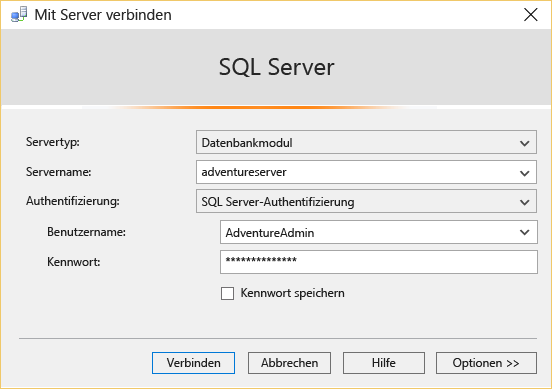
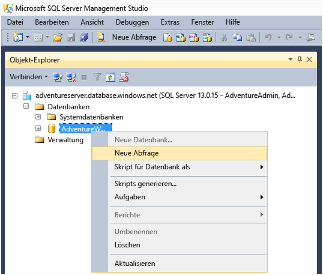
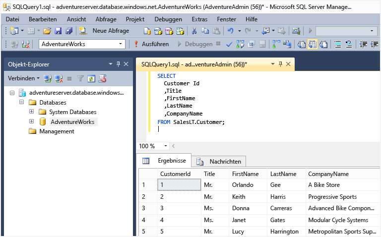

<properties
	pageTitle="Verbinden mit der SQL-Datenbank – SQL Server Management Studio | Microsoft Azure"
	description="Erfahren Sie, wie Sie über SQL Server Management Studio (SSMS) eine Verbindung mit einer SQL-Datenbank in Azure herstellen. Führen Sie dann eine Beispielabfrage mithilfe von Transact-SQL (T-SQL) aus."
	metaCanonical=""
	keywords="Verbinden mit SQL-Datenbank, SQL Server Management Studio"
	services="sql-database"
	documentationCenter=""
	authors="stevestein"
	manager="jeffreyg"
	editor="" />

<tags
	ms.service="sql-database"
	ms.workload="data-management"
	ms.tgt_pltfrm="na"
	ms.devlang="na"
	ms.topic="get-started-article"
	ms.date="03/25/2016"
	ms.author="sstein" />

# Herstellen einer Verbindung mit einer Azure SQL-Datenbank mit SQL Server Management Studio und Ausführen einer T-SQL-Beispielabfrage

> [AZURE.SELECTOR]
- [C#](sql-database-connect-query.md)
- [SSMS](sql-database-connect-query-ssms.md)
- [Excel](sql-database-connect-excel.md)

In diesem Artikel wird das Herstellen einer Verbindung mit einer Azure SQL-Datenbank und anschließende Durchführen einer einfachen Abfrage mithilfe von Transact-SQL-Anweisungen (T-SQL) veranschaulicht.

Sie benötigen zuerst eine SQL-­Datenbank in Azure. Mithilfe der Anweisungen unter [Erste Schritte mit Microsoft Azure SQL-Datenbank](sql-database-get-started.md) können Sie schnell eine erstellen. Die hier aufgeführten Beispiele basieren auf der AdventureWorks-Beispieldatenbank, die Sie in diesem Artikel erstellen. Bis zur Durchführung der Abfrage gelten jedoch für jede SQL-Datenbank die gleichen Schritte.

## Installieren und Starten von SQL Server Management Studio (SSMS)

Bei der Arbeit mit SQL-Datenbank sollten Sie die aktuelle Version von SSMS verwenden. Informationen dazu finden Sie unter [Herunterladen von SQL Server Management Studio](https://msdn.microsoft.com/library/mt238290.aspx). Mit der aktuellen Version informiert SSMS Sie automatisch darüber, wenn das aktuelle Update verfügbar ist.

## Starten von SSMS und Herstellen einer Verbindung mit dem SQL-Datenbankserver

1. Geben Sie im Windows-Suchfeld „Microsoft SQL Server Management Studio“ ein, und klicken Sie dann auf die Desktop-App, um SSMS zu starten.
2. Geben Sie im Dialogfeld **Verbindung mit Server herstellen** im Feld **Servername** den Namen des Servers, der Ihre SQL-Datenbank hostet, im Format *&lt;Servername>*.**database.windows.net** ein.
3. Wählen Sie in der Liste **Authentifizierung** den Eintrag **SQL Server-Authentifizierung** aus.
4. Geben Sie den **Anmeldenamen** und das **Kennwort** ein, den/das Sie beim Erstellen des Servers eingerichtet haben, und klicken Sie dann auf **Verbinden**, um eine Verbindung mit der SQL-Datenbank herzustellen.

	

5. Wenn Sie nicht bereits eine Verbindung mit Azure hergestellt haben, werden Sie von SSMS zur Eingabe Ihrer Azure-Anmeldeinformationen aufgefordert.

### Bei Verbindungsfehlern

Die häufigste Ursache für Verbindungsfehler sind Unregelmäßigkeiten beim Servernamen (Erinnerung: <*servername*> ist der Name des logischen Servers, nicht der Datenbank), Benutzernamen oder Kennwort sowie das Verbieten der Verbindung durch den Server aus Sicherheitsgründen. Wenn Sie die Verbindung zum ersten Mal herstellen oder die Verbindung aufgrund einer geänderten IP-Konfiguration fehlschlägt, werden Sie von der [aktuellen SSMS-Version](https://msdn.microsoft.com/library/mt238290.aspx) nach Ihren Azure-Anmeldedaten gefragt. Anschließend wird die Firewallregel für Sie in Azure erstellt. Wenn Sie eine frühere Version verwenden, wird Ihnen die IP-Adresse in einer Fehlermeldung mitgeteilt, und Sie müssen diese IP-Adresse der Firewallregel des Servers in Azure hinzufügen. Stellen Sie sicher, dass die Firewalleinstellungen des Servers Verbindungen von der IP-Adresse Ihres lokalen Computers und der vom SSMS-Client verwendeten IP-Adresse zulassen. Diese unterscheiden sich bisweilen. Weitere Informationen finden Sie unter [Vorgehensweise: Konfigurieren von Firewalleinstellungen (Azure SQL-Datenbank)](sql-database-configure-firewall-settings.md).

## Durchführen von Beispielabfragen

Nachdem Sie eine Verbindung mit Ihrem logischen Server hergestellt haben, können Sie eine Verbindung mit einer Datenbank herstellen und eine Beispielabfrage ausführen. Wenn Sie die Datenbank nicht mithilfe des AdventureWorks-Beispiels in [Erste Schritte mit Microsoft Azure SQL-Datenbank](sql-database-get-started.md) erstellt haben, funktioniert diese Abfrage nicht. Fahren Sie direkt mit den nächsten Schritten fort, um mehr zu erfahren.

1. Navigieren Sie im **Objekt-Explorer** zur Datenbank **AdventureWorks**.
2. Klicken Sie mit der rechten Maustaste auf die Datenbank, und wählen Sie dann **Neue Abfrage** aus.

	

3. Kopieren Sie den folgenden Code, und fügen Sie ihn im Abfragefenster ein.

		SELECT
		CustomerId
		,Title
		,FirstName
		,LastName
		,CompanyName
		FROM SalesLT.Customer;

4. Klicken Sie auf die Schaltfläche **Ausführen**. Der folgende Screenshot zeigt eine erfolgreiche Abfrage.

	

## Nächste Schritte

Mit T-SQL-Anweisungen können Sie Datenbanken in Azure auf gleiche Weise wie mit SQL Server erstellen und verwalten. Wenn Sie mit der Verwendung von T-SQL mit SQL Server vertraut sind, finden Sie unter [Azure SQL-Datenbank – Transact-SQL-Informationen](sql-database-transact-sql-information.md) eine Zusammenfassung der Unterschiede.

Wenn Sie mit T-SQL nicht vertraut sind, siehe [Tutorial: Schreiben von Transact-SQL-Anweisungen](https://msdn.microsoft.com/library/ms365303.aspx) und [Transact-SQL-Referenz (Datenbankmodul)](https://msdn.microsoft.com/library/bb510741.aspx).

<!---HONumber=AcomDC_0330_2016-->