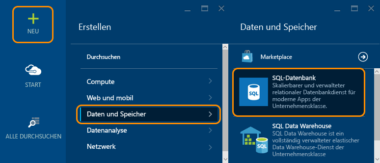
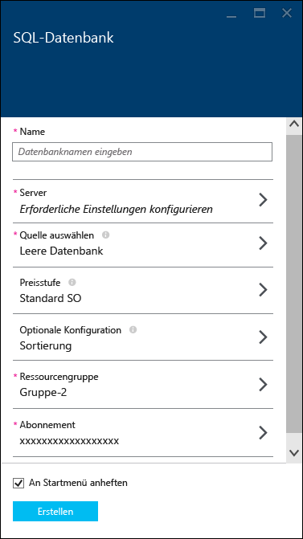
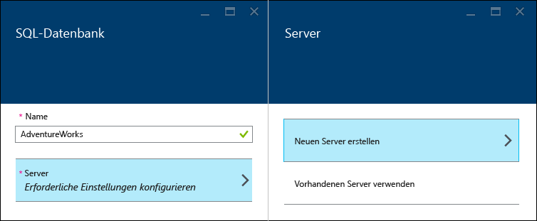
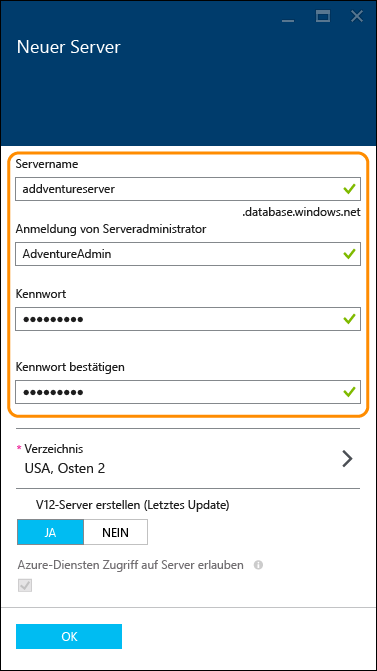
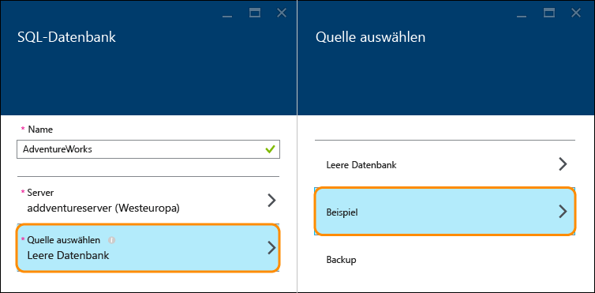
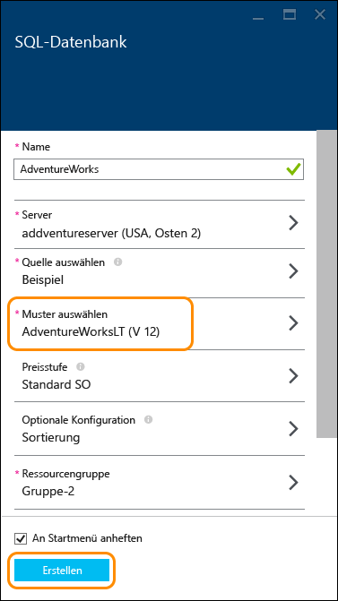
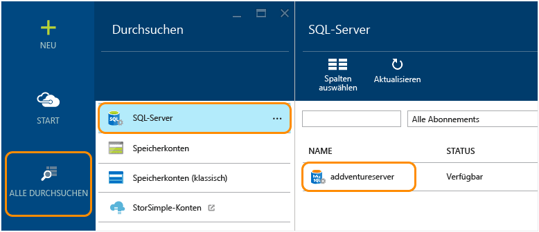
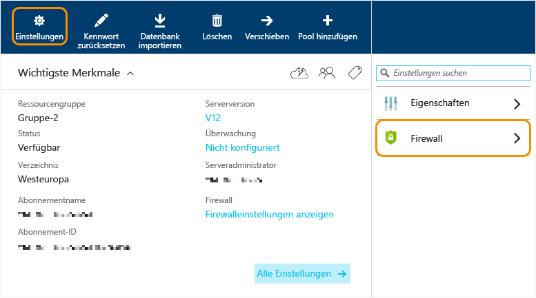
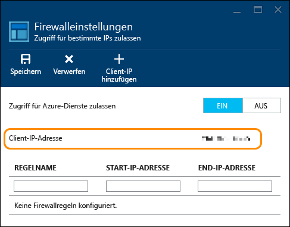
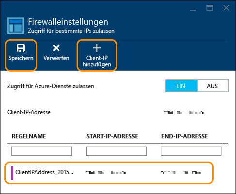

<properties
	pageTitle="Tutorial zu SQL-Datenbank: Erstellen einer Datenbank | Microsoft Azure"
	description="SQL-Datenbank-Tutorial: Erstellen einer ersten SQL-Datenbank im Azure-Portal mithilfe von Beispieldaten in nur wenigen Minuten. Erfahren Sie mehr über das Einrichten eines Hostservers und einer Firewallregel."
	keywords="Tutorial zu SQL-Datenbank, Erstellen einer SQL­Datenbank"
	services="sql-database"
	documentationCenter=""
	authors="jeffgoll"
	manager="jeffreyg"
	editor="cgronlun"/>

<tags
	ms.service="sql-database"
	ms.workload="data-management"
	ms.tgt_pltfrm="na"
	ms.devlang="na"
	ms.topic="hero-article"
	ms.date="12/01/2015"
	ms.author="jeffreyg"/>

# SQL-Datenbank-Tutorial: Erstellen eine SQL-Datenbank in Minuten mithilfe von Beispieldaten und Azure-Portal

**Einzeldatenbank**

> [AZURE.SELECTOR]
- [Azure portal](sql-database-get-started.md)
- [C#](sql-database-get-started-csharp.md)
- [PowerShell](sql-database-get-started-powershell.md)

In diesem Tutorial zu SQL-Datenbanken wird gezeigt, wie Sie Ihre erste SQL-Datenbank mithilfe von Beispieldaten und dem Azure-Portal in wenigen Minuten erstellen. Sie lernen Folgendes:

- Erstellen eines Servers zum Hosten der erstellten Datenbank und Einrichten einer dazugehörigen Firewallregel
- Erstellen Sie eine SQL-Datenbank anhand eines AdventureWorks-Beispiels mit Daten zum Experimentieren.

Sie benötigen vor Beginn ein Azure-Konto und ein Azure-Abonnement. Falls Sie diese benötigen, können Sie sich für eine [kostenlose Testversion](https://azure.microsoft.com/pricing/free-trial/) registrieren.

> [AZURE.NOTE] In diesem Tutorial zu SQL-Datenbank wird das Einrichten einer Datenbank mithilfe des Managementsystems für relationale Datenbanken (Relational Database Management System, RDBMS) von Microsoft in der Cloud, Azure SQL-Datenbank, behandelt. Eine weitere Option ist das Ausführen von SQL Server auf einem virtuellen Azure-Computer. Unter [Grundlegendes zur Azure SQL-Datenbank und SQL Server in Azure VMs](data-management-azure-sql-database-and-sql-server-iaas.md) finden Sie einen Schnellvergleich oder unter [Bereitstellen eines virtuellen SQL Server-Computers](virtual-machines-provision-sql-server.md) die erste Schritte mit einem virtuellen Computer.

## Schritt 1: Anmelden und Starten der Einrichtung der SQL-Datenbank
1. Melden Sie sich beim [Azure-Portal](https://portal.azure.com/) an.
2. Klicken Sie auf **Neu** > **Daten + Speicher** > **SQL-Datenbank**.

	

	Im angezeigten Blatt mit den Einstellungen für **SQL-Datenbank** legen Sie die Informationen für Server und Datenbank fest.

	

## Schritt 2: Wählen der Servereinstellungen
Eine SQL-­Datenbank befindet sich in Azure auf einem Datenbankserver. Ein Server kann mehrere Datenbanken hosten. Beim Einrichten einer Datenbank können Sie auch einen Server erstellen und einrichten, der als Host fungieren soll, oder Sie können eine zuvor erstellte Datenbank verwenden. Wir werden eine neue einrichten.

1. Geben Sie einen **Namen** für die Datenbank ein (wir verwenden **AdventureWorks**). Die anderen Datenbankeinstellungen werden später noch behandelt.
2. Klicken Sie unter **Server** auf **Erforderliche Einstellungen konfigurieren** und dann auf **Neuen Server erstellen**.

	

3. Geben Sie auf dem Blatt **Neuer Server** einen **Servernamen** ein, der in Azure eindeutig sein muss und leicht zu merken sein sollte. Sie benötigen diesen Namen später, wenn Sie eine Verbindung herstellen und mit der Datenbank arbeiten.
4. Geben Sie einen **Anmeldenamen für den Serveradministrator** ein, der leicht zu merken ist (wir verwenden **AdventureAdmin**). Geben Sie ein sicheres **Kennwort** ein, und wiederholen Sie die Eingabe in **Kennwort bestätigen**.

	

	 Belassen Sie für **V12-Server (neuestes Update) erstellen** die Einstellung **Ja**, um die neuesten Features zu verwenden. Der **Standort** bestimmt die Region des Datencenters, in dem der Server erstellt wird.

	>[AZURE.TIP] Erstellen Sie Datenbankserver an einem Ort in der Nähe der Anwendungen, die die Datenbank verwenden werden. Wenn Sie den Standort ändern möchten, klicken Sie einfach auf **Standort**, wählen einen anderen Standort aus und klicken dann auf **OK**.

5. Klicken Sie auf **OK**, um zurück zum Blatt **SQL-Datenbank** zu wechseln.

Die Datenbank und der Server wurden bisher noch nicht erstellt. Dies erfolgt erst nach dem nächsten Schritt, in dem Sie auswählen, die Datenbank aus dem AdventureWorks-Beispiel zu erstellen, und die Einstellungen bestätigen.

## Schritt 3: Einrichten und Erstellen einer SQL-Datenbank
1. Klicken Sie auf dem Blatt **SQL-Datenbank** auf **Quelle auswählen** und dann auf **Beispiel**.

	

2. Wechseln Sie zurück zum Blatt **SQL-Datenbank**. Dort wird unter **Beispiel auswählen** jetzt **AdventureWorks LT [V12]** angezeigt. Klicken Sie auf **Erstellen**, um das Erstellen von Server und Datenbank zu starten.

	

	>[AZURE.NOTE] Für diese Kurzanleitung haben wir die Einstellungen für **Tarif**, **Sortierung** und **Ressourcengruppe** nicht geändert. Sie können den Tarif einer Datenbank jederzeit ändern diese schnell und ohne Ausfallzeiten zentral hoch oder herunter skalieren. Weitere Informationen finden Sie unter [SQL-Datenbank Preise](https://azure.microsoft.com/pricing/details/sql-database/) und [SQL-Datenbank-Tarife](sql-database-service-tiers.md). Die Sortierung einer Datenbank kann nach der Einrichtung nicht mehr geändert werden. Weitere Informationen zur Sortierung finden Sie unter [Sortierung und Unicode-Unterstützung](https://msdn.microsoft.com/library/ms143726.aspx). Weitere Informationen zu Azure-Ressourcengruppen finden Sie unter [Übersicht über den Azure-Ressourcen-Manager](resource-group-overview.md).

Wechseln Sie zurück zum Azure-Startmenü, in dem eine Kachel den Fortschritt anzeigt, bis die Datenbank erstellt wurde und online ist. Sie können auch auf **Alle durchsuchen** und dann auf **SQL-Datenbanken** klicken, um zu überprüfen, ob die Datenbank online ist.

Glückwunsch! Sie verfügen nun über eine SQL-Datenbank, die in der Cloud ausgeführt wird. Sie sind fast fertig. Es ist noch ein wichtiger Schritt zu erledigen. Sie müssen auf dem Datenbankserver eine Regel erstellen, damit Sie Verbindungen mit der Datenbank herstellen können.

## Schritt 4: Konfigurieren der Firewall

Sie müssen eine Firewallregel auf dem Server einrichten, die Verbindungen von der IP-Adresse des Clientcomputers ermöglicht, sodass Sie mit der Datenbank arbeiten können. Damit stellen Sie nicht nur sicher, dass Sie eine Verbindung herstellen können, sondern Sie können so auch weitere Details zu den SQL-Servers in Azure erhalten.

1. Klicken Sie auf **Alle durchsuchen**, führen Sie einen Bildlauf nach unten durch, und klicken Sie auf **SQL-Server**. Klicken Sie dann in der Liste der **SQL-Server** auf den Namen des zuvor erstellten Servers.

	

3. Klicken Sie auf dem rechts angezeigten Blatt mit den Datenbankeigenschaften auf **Einstellungen** und dann in der Liste auf **Firewall**.

	

	In den **Firewalleinstellungen** wird die aktuelle **Client-IP-Adresse** angezeigt.

	

4. Klicken Sie auf **Client-IP-Adresse hinzufügen**, damit Azure eine Regel für diese IP-Adresse erstellt, und klicken Sie dann auf **Speichern**.

	

	>[AZURE.IMPORTANT] Die Client-IP-Adresse kann sich von Zeit zu Zeit ändern, und Sie können dann möglicherweise nicht auf den Server zugreifen, bis Sie eine neue Firewallregel erstellt haben. Überprüfen Sie die IP-Adresse mit [Bing](http://www.bing.com/search?q=my%20ip%20address), und fügen Sie dann eine einzelne IP-Adresse oder einen Bereich von IP-Adressen hinzu. Weitere Einzelheiten finden Sie unter [Konfigurieren von Firewalleinstellungen](sql-database-configure-firewall-settings.md).

## Nächste Schritte
Nachdem Sie dieses Tutorial zu SQL-Datenbank ausgeführt und eine Datenbank mit Beispieldaten erstellt haben, können Sie nun das Experimentieren mit Ihren Lieblingstools beginnen.

- Wenn Sie mit Transact-SQL und SQL Server Management Studio vertraut sind, informieren Sie sich über das [Herstellen von Verbindungen mit einer SQL-Datenbank und das Abfragen dieser mit SSMS](sql-database-connect-query-ssms.md).

- Wenn Sie mit Excel vertraut sind, informieren Sie sich über das [Herstellen von Verbindungen mit SQL-Datenbank mit Excel](sql-database-connect-excel.md).

- Wenn Sie mit der Programmierung beginnen möchten, finden Sie weitere Informationen unter [Herstellen von Verbindungen mit einer SQL-Datenbank und das Abfragen dieser mit C#](sql-database-connect-query.md) und [Verwenden von SQL-Datenbank mit .NET (C#)](sql-database-develop-dotnet-simple.md). Unter [Clientcodebeispiele für die ersten Schritte mit SQL-Datenbank](sql-database-develop-quick-start-client-code-samples.md) finden Sie auch Beispiele und Anleitungen zu Node.js, Python, Ruby, Java, PHP und C++ neben C#.

- Wenn Sie lokale SQL Server-Datenbanken in Azure verschieben möchten, finden Sie unter [Migrieren von Datenbanken zu Azure SQL-Datenbank](sql-database-cloud-migrate.md) weitere Informationen.

<!---HONumber=AcomDC_0128_2016-->