<properties
			pageTitle="Erste Schritte mit Azure File Storage unter Windows | Microsoft Azure"
    		description="Speichern Sie Dateidaten mit Azure File Storage in der Cloud, und stellen Sie Ihre Clouddateifreigabe über eine virtuelle Azure-Maschine (VM) oder eine lokale Anwendung mit Windows bereit."
            services="storage"
            documentationCenter=".net"
            authors="robinsh"
            manager="carmonm"
            editor="" />

<tags ms.service="storage"
      ms.workload="storage"
      ms.tgt_pltfrm="na"
      ms.devlang="dotnet"
      ms.topic="hero-article"
      ms.date="02/19/2016"
      ms.author="robinsh" />

# Erste Schritte mit Azure File Storage unter Windows

[AZURE.INCLUDE [storage-selector-file-include](../../includes/storage-selector-file-include.md)]

## Übersicht

Azure File Storage ist ein Dienst, bei dem Dateifreigaben in der Cloud unter Verwendung des standardmäßigen Server Message Block-Protokolls bereitgestellt werden können (siehe [Microsoft SMB Protocol and CIFS Protocol Overview](https://msdn.microsoft.com/library/windows/desktop/aa365233.aspx) (Microsoft SMB-Protokoll und CIFS-Protokoll – Übersicht)). Sowohl SMB 2.1 als auch SMB 3.0 werden unterstützt. Mit Azure File Storage können Sie Legacyanwendungen, für die Dateifreigaben benötigt werden, schnell und ohne teures Umschreiben zu Azure migrieren. Anwendungen, die auf virtuellen Azure-Maschinen, in Clouddiensten oder auf lokalen Clients ausgeführt werden, können eine Dateifreigabe genauso in der Cloud bereitstellen, wie eine Desktopanwendung eine normale SMB-Freigabe bereitstellt. Die Dateispeicher-Freigaben können dann von beliebig vielen Anwendungskomponenten gleichzeitig eingebunden und abgerufen werden.

Da es sich bei Dateispeicher-Freigaben um gewöhnliche SMB-Freigaben handelt, können Anwendungen in Azure über die E/A-System-APIs auf die Freigaben zugreifen. Entwickler können daher ihren vorhandenen Code und bereits erlernte Fertigkeiten für die Migration vorhandener Anwendungen verwenden. IT-Fachkräfte können PowerShell-Cmdlets verwenden, um Dateispeicher-Freigaben im Rahmen der Administration von Azure-Anwendungen zu erstellen, einzubinden und zu verwalten.

Sie können Azure-Dateifreigaben mit dem [Azure-Portal](https://portal.azure.com), den Azure Storage-PowerShell-Cmdlets, den Azure Storage-Clientbibliotheken oder der Azure Storage-REST-API erstellen. Da es sich bei diesen Dateifreigaben um SMB-Freigaben handelt, können Sie darauf außerdem über standardmäßige und vertraute Dateisystem-APIs zugreifen.

Informationen zur Verwendung des Dateispeichers unter Linux finden Sie unter [Verwenden des Azure-Dateispeichers mit Linux](storage-how-to-use-files-linux.md).

Informationen zu Skalierbarkeits- und Leistungszielen von File Storage finden Sie unter [Skalierbarkeits- und Leistungsziele für Azure Storage](storage-scalability-targets.md#scalability-targets-for-blobs-queues-tables-and-files).

[AZURE.INCLUDE [storage-dotnet-client-library-version-include](../../includes/storage-dotnet-client-library-version-include.md)]

[AZURE.INCLUDE [storage-file-concepts-include](../../includes/storage-file-concepts-include.md)]

## Video: Verwenden des Azure-Dateispeichers unter Windows

Dieses Video veranschaulicht das Erstellen und Verwenden von Azure-Dateifreigaben unter Windows.

> [AZURE.VIDEO azure-file-storage-with-windows]

## Informationen zu diesem Lernprogramm

In diesem Lernprogramm für die ersten Schritte veranschaulichen wir die Grundlagen der Verwendung des Microsoft Azure-Dateispeichers. In diesem Lernprogramm wird Folgendes beschrieben:

- Verwenden des Azure-Portals oder von PowerShell, um die Erstellung einer neuen Azure-Dateifreigabe, das Hinzufügen eines Verzeichnisses, das Hochladen einer lokalen Datei in die Freigabe und das Auflisten der Dateien in dem Verzeichnis zu veranschaulichen
- Bereitstellen der Dateifreigabe. Dabei wird genau wie bei der Bereitstellung einer SMB-Freigabe vorgegangen.
- Verwenden Sie die Azure Storage-Clientbibliothek für .NET, um aus einer lokalen Anwendung auf die Dateifreigabe zuzugreifen. Sie erstellen eine Konsolenanwendung und führen diese Aktionen mit der Dateifreigabe aus:
	- Schreiben Sie den Inhalt einer Datei in der Freigabe in das Konsolenfenster.
	- Legen Sie das Kontingent (maximale Größe) für die Dateifreigabe fest.
	- Erstellen Sie eine SAS (Shared Access Signature) für eine Datei, für die eine SAS-Richtlinie verwendet wird, die für die Freigabe definiert ist.
	- Kopieren Sie eine Datei in eine andere Datei im selben Speicherkonto.
	- Kopieren Sie eine Datei in ein Blob im selben Speicherkonto.
- Verwenden von Azure-Speichermetriken für die Problembehandlung

Der Dateispeicher wird jetzt für alle Speicherkonten unterstützt, sodass Sie entweder ein vorhandenes Speicherkonto verwenden oder ein neues Speicherkonto erstellen können. Informationen zum Erstellen eines neuen Speicherkontos finden Sie unter [Erstellen eines Speicherkontos](storage-create-storage-account.md#create-a-storage-account).

## Verwenden des Azure-Portals zum Verwalten einer Dateifreigabe

Das [Azure-Portal](https://portal.azure.com) bietet eine Benutzeroberfläche, über die Kunden Dateifreigaben verwalten können. Im Portal können Sie folgende Aktionen ausführen:

- Erstellen der Dateifreigabe
- Hoch- und Herunterladen von Dateien für die Dateifreigabe
- Überwachen der tatsächlichen Nutzung der einzelnen Dateifreigaben
- Anpassen des Kontingents für die Freigabegröße
- Verwenden des Befehls `net use` zum Bereitstellen der Dateifreigabe über einen Windows-Client 

### Erstellen einer Dateifreigabe

1. Melden Sie sich beim Azure-Portal an.

2. Klicken Sie im Navigationsbereich auf **Speicherkonten** oder **Speicherkonten (klassisch)**.

	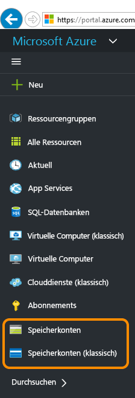

3. Wählen Sie Ihr Speicherkonto aus.

	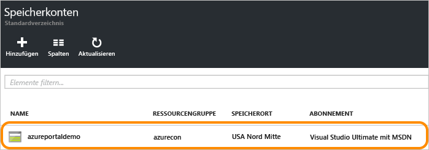

4. Wählen Sie den Dienst „Dateien“.

	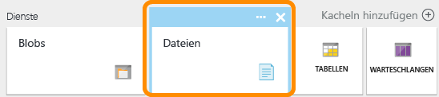

5. Klicken Sie auf „Dateifreigaben“, und folgen Sie dem Link, um Ihre erste Dateifreigabe zu erstellen.

	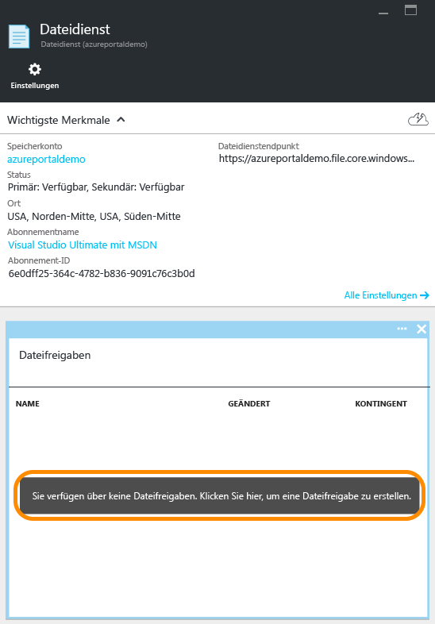

6. Geben Sie den Namen und die Größe der Dateifreigabe (bis zu 5.120 GB) ein, um Ihre erste Dateifreigabe zu erstellen. Sobald die Dateifreigabe erstellt wurde, können Sie sie von einem beliebigen Dateisystem aus einbinden, das SMB 2.1 oder SMB 3.0 unterstützt.

	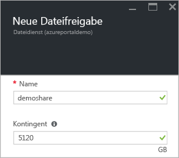

### Hochladen und Herunterladen von Dateien

1. Wählen Sie eine bereits erstellte Dateifreigabe aus.

	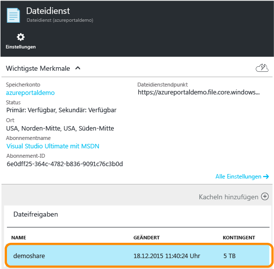

2. Klicken Sie auf **Hochladen**, um die Benutzeroberfläche zum Hochladen von Dateien zu öffnen.

	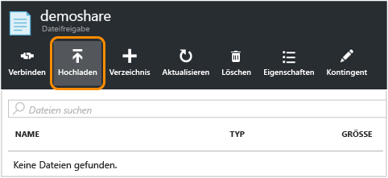

3. Klicken Sie mit der rechten Maustaste auf eine Datei, und wählen Sie **Herunterladen**, um die Datei in ein lokales Verzeichnis herunterzuladen.

	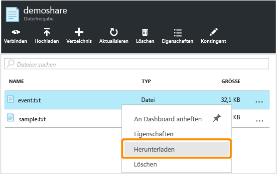

### Verwalten von Dateifreigaben

1. Klicken Sie auf **Kontingent**, um die Größe der Dateifreigabe (bis zu 5.120 GB) zu ändern.

	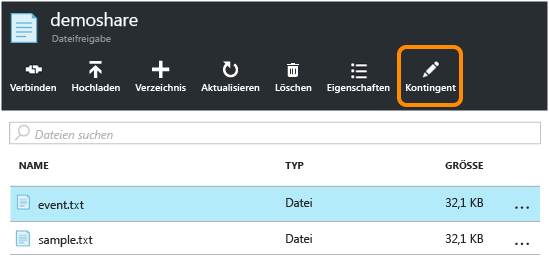

2. Klicken Sie auf **Verbinden**, um die Befehlszeile zum Bereitstellen der Dateifreigabe aus Windows abzurufen.

	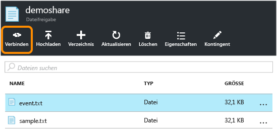

	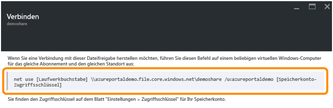

	>[AZURE.TIP] Klicken Sie zum Abrufen des Zugriffsschlüssels für das Speicherkonto auf die **Einstellungen** Ihres Speicherkontos und anschließend auf **Zugriffsschlüssel**.

	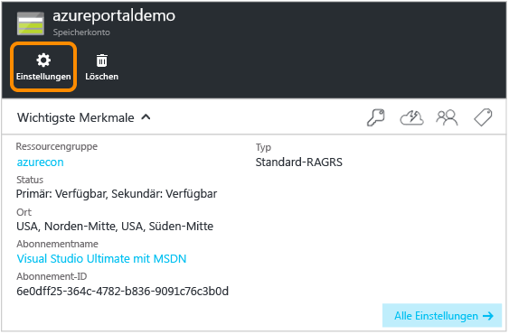

	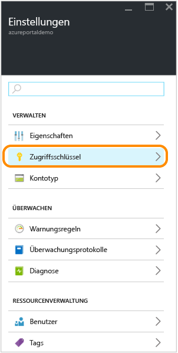

## Verwalten einer Dateifreigabe mithilfe von PowerShell

Alternativ können Sie Azure PowerShell zum Erstellen und Verwalten von Dateifreigaben verwenden.

### Installieren der PowerShell-Cmdlets für den Azure-Speicher

Laden Sie die Azure PowerShell-Cmdlets herunter und installieren Sie diese anschließend, um die Verwendung von PowerShell vorzubereiten. Informationen zum Installationspunkt und zu Installationsanweisungen finden Sie unter [Installieren und Konfigurieren von Azure PowerShell](../powershell-install-configure.md).

> [AZURE.NOTE] Sie sollten daher das neueste Azure PowerShell-Modul herunterladen und installieren bzw. ein Upgrade durchführen.

Öffnen Sie ein Azure PowerShell-Fenster, indem Sie auf **Start** klicken und **Windows PowerShell** eingeben. Im PowerShell-Fenster wird das Azure Powershell-Modul geladen.

### Erstellen von Kontexten für Speicherkonten und -schlüssel

Erstellen Sie nun den Speicherkonto-Kontext. Der Kontext kapselt den Speicherkontonamen und den Kontoschlüssel. Anweisungen zum Kopieren Ihres Kontoschlüssels aus dem [Azure-Portal](https://portal.azure.com) finden Sie unter [Anzeigen und Kopieren von Speicherzugriffsschlüsseln](storage-create-storage-account.md#view-and-copy-storage-access-keys).

Ersetzen Sie im folgenden Beispiel `storage-account-name` und `storage-account-key` durch Ihren Speicherkontonamen und -schlüssel.

	# create a context for account and key
	$ctx=New-AzureStorageContext storage-account-name storage-account-key

### Erstellen einer neuen Dateifreigabe

Erstellen Sie anschließend die neue Freigabe mit dem Namen `logs`.

	# create a new share
	$s = New-AzureStorageShare logs -Context $ctx

Nun haben Sie eine Dateifreigabe im Dateispeicher. Als Nächstes fügen Sie ein Verzeichnis und eine Datei hinzu.

> [AZURE.IMPORTANT] Der Name der Dateifreigabe darf nur Kleinbuchstaben enthalten. Ausführliche Informationen zur Benennung von Dateifreigaben und Dateien finden Sie unter [Benennen und Referenzieren von Freigaben, Verzeichnissen, Dateien und Metadaten](https://msdn.microsoft.com/library/azure/dn167011.aspx).

### Erstellen eines Verzeichnisses in der Dateifreigabe

Erstellen Sie als Nächstes ein Verzeichnis in der Freigabe. Im folgenden Beispiel lautet der Verzeichnisname `CustomLogs`.

    # create a directory in the share
    New-AzureStorageDirectory -Share $s -Path CustomLogs

### Hochladen einer lokalen Datei in das Verzeichnis

Laden Sie nun eine lokale Datei in das Verzeichnis hoch. Im folgenden Beispiel wird eine Datei aus `C:\temp\Log1.txt` hochgeladen. Bearbeiten Sie den Dateipfad so, dass er auf eine gültige Datei auf Ihrem lokalen Computer verweist.

    # upload a local file to the new directory
    Set-AzureStorageFileContent -Share $s -Source C:\temp\Log1.txt -Path CustomLogs

### Auflisten der Dateien im Verzeichnis

Sie können die Dateien im Verzeichnis auflisten, um die Datei im Verzeichnis anzuzeigen. Mit diesem Befehl werden außerdem die Unterverzeichnisse aufgelistet, in diesem Beispiel ist jedoch kein Unterverzeichnis vorhanden, daher wird nur die Datei angezeigt.

	# list files in the new directory
	Get-AzureStorageFile -Share $s -Path CustomLogs

### Kopieren von Dateien

Ab Version 0.9.7 von Azure PowerShell können Sie eine Datei in eine andere Datei, eine Datei in ein Blob oder ein Blob in eine Datei kopieren. Im Folgenden wird demonstriert, wie diese Kopiervorgänge mit PowerShell-Cmdlets ausgeführt werden.

	# copy a file to the new directory
    Start-AzureStorageFileCopy -SrcShareName srcshare -SrcFilePath srcdir/hello.txt -DestShareName destshare -DestFilePath destdir/hellocopy.txt -Context $srcCtx -DestContext $destCtx

    # copy a blob to a file directory
    Start-AzureStorageFileCopy -SrcContainerName srcctn -SrcBlobName hello2.txt -DestShareName hello -DestFilePath hellodir/hello2copy.txt -DestContext $ctx -Context $ctx

## Bereitstellen der Dateifreigabe 

Dank der Unterstützung von SMB 3.0 unterstützt der Dateispeicher jetzt die Verschlüsselung und beständige Handles von SMB 3.0-Clients. Unterstützung der Verschlüsselung bedeutet, dass SMB 3.0-Clients eine Dateifreigabe von überall aus bereitstellen können, z. B.:

- Einem virtuellen Azure-Computer in derselben Region (wird auch von SMB 2.1 unterstützt)
- Einem virtuellen Azure-Computer in einer anderen Region (nur SMB 3.0)
- Einer lokalen Clientanwendung (nur SMB 3.0) 

Wenn ein Client auf den Dateispeicher zugreift, richtet sich die verwendete SMB-Version nach der SMB-Version, die vom Betriebssystem unterstützt wird. Die folgende Tabelle enthält eine Zusammenfassung der Unterstützung für Windows-Clients. In diesem Blog finden Sie ausführlichere Informationen zu [SMB-Versionen](http://blogs.technet.com/b/josebda/archive/2013/10/02/windows-server-2012-r2-which-version-of-the-smb-protocol-smb-1-0-smb-2-0-smb-2-1-smb-3-0-or-smb-3-02-you-are-using.aspx).

| Windows-Client | SMB-Version unterstützt |
|------------------------|----------------------|
| Windows 7 | SMB 2.1 |
| Windows Server 2008 R2 | SMB 2.1 |
| Windows 8 | SMB 3.0 |
| Windows Server 2012 | SMB 3.0 |
| Windows Server 2012 R2 | SMB 3.0 |
| Windows 10 | SMB 3.0 |

### Einbinden der Dateifreigabe über einen virtuellen Azure-Computer unter Windows

Um zu veranschaulichen, wie eine Azure-Dateifreigabe eingebunden wird, erstellen wir nun einen virtuellen Azure-Computer unter Windows und greifen zum Einbinden der Freigabe remote darauf zu.

1. Erstellen Sie zunächst eine neue virtuelle Azure-Maschine, indem Sie die Anweisungen in [Erstellen einer virtuellen Windows-Maschine im Azure-Portal](../virtual-machines/virtual-machines-windows-tutorial.md) befolgen.
2. Erstellen Sie als nächstes eine neue virtuelle Maschine, indem Sie die Anweisungen in [Anmelden bei einer virtuellen Windows-Maschine über das Azure-Portal](../virtual-machines/virtual-machines-arm-log-on-windows-vm.md) befolgen.
3. Öffnen Sie ein PowerShell-Fenster auf dem virtuellen Computer.

### Fortbestehen der Anmeldeinformationen Ihres Speicherkontos für den virtuellen Computer

Bevor die Bereitstellung für die Dateifreigabe erfolgt, bestätigen Sie zunächst die Anmeldeinformationen für Ihr Speicherkonto auf dem virtuellen Computer. Durch diesen Schritt kann Windows bei einem Neustart des virtuellen Computers automatisch erneut eine Verbindung zur Dateifreigabe herstellen. Um Ihre Anmeldeinformationen beizubehalten, führen Sie im PowerShell-Fenster auf dem virtuellen Computer den Befehl `cmdkey` aus. Ersetzen Sie `<storage-account-name>` durch den Namen Ihres Speicherkontos und `<storage-account-key>` durch den Schlüssel des Speicherkontos.

	cmdkey /add:<storage-account-name>.file.core.windows.net /user:<storage-account-name> /pass:<storage-account-key>

Windows stellt nun bei einem Neustart des virtuellen Computers erneut eine Verbindung zur Dateifreigabe her. Sie können überprüfen, ob die Freigabe erneut verbunden wurde, indem Sie den Befehl `net use` in einem PowerShell-Fenster ausführen.

Beachten Sie, dass die Anmeldeinformationen nur für den Kontext beibehalten werden, unter dem `cmdkey` ausgeführt wird. Wenn Sie eine Anwendung entwickeln, die als Dienst ausgeführt wird, müssen Sie Ihre Anmeldeinformationen auch für diesen Kontext beibehalten.

### Bereitstellen der Dateifreigabe mithilfe der dauerhaften Anmeldeinformationen

Nachdem Sie eine Remoteverbindung zu dem virtuellen Computer hergestellt haben, können Sie den Befehl `net use` mit folgender Syntax ausführen, um die Dateifreigabe bereitzustellen. Ersetzen Sie `<storage-account-name>` durch den Namen Ihres Speicherkontos und `<share-name>` durch den Namen Ihrer Dateispeicher-Freigabe:

    net use <drive-letter>: \<storage-account-name>.file.core.windows.net<share-name>

	example :
	net use z: \\samples.file.core.windows.net\logs

Da Sie die Speicherkonto-Anmeldeinformationen im vorherigen Schritt dauerhaft gespeichert haben, müssen Sie diese nicht mit dem Befehl `net use` angeben. Wenn Sie Ihre Anmeldeinformationen noch nicht dauerhaft gespeichert haben, fügen Sie sie als Parameter hinzu, der an den Befehl `net use` übergeben wird, wie im folgenden Beispiel gezeigt.

    net use <drive-letter>: \<storage-account-name>.file.core.windows.net<share-name> /u:<storage-account-name> <storage-account-key>

	example :
	net use z: \\samples.file.core.windows.net\logs /u:samples <storage-account-key>

Sie können nun mit der Dateispeicher-Freigabe vom virtuellen Computer aus arbeiten, wie von jedem anderen Laufwerk auch. Sie können die Standarddateibefehle über die Eingabeaufforderung eingeben oder die bereitgestellte Freigabe und deren Inhalt im Datei-Explorer anzeigen. Sie können auf dem virtuellen Computer auch Code ausführen, der mithilfe der standardmäßigen Datei-E/A-APIs von Windows (z. B. die von [System.IO-Namespaces](http://msdn.microsoft.com/library/gg145019.aspx) im .NET Framework bereitgestellten APIs) auf die Dateifreigabe zugreift.

Sie können die Dateifreigabe auch über eine im Azure-Clouddienst ausgeführte Rolle bereitstellen, indem Sie eine Remoteverbindung zur Rolle herstellen.

### Einbinden der Dateifreigabe über einen lokalen Client mit Windows 

Um die Dateifreigabe über einen lokalen Client bereitzustellen, müssen Sie zuerst die folgenden Schritte ausführen:

- Installieren Sie eine Version von Windows, die SMB 3.0 unterstützt. Windows nutzt die SMB 3.0-Verschlüsselung zum sicheren Übertragen von Daten zwischen Ihrem lokalen Client und der Azure-Dateifreigabe in der Cloud. 
- Öffnen Sie den Internetzugriff für Port 445 (TCP ausgehend) im lokalen Netzwerk, wie dies für das SMB-Protokoll erforderlich ist. 

> [AZURE.NOTE] Von einigen Internet Service Providern wird Port 445 unter Umständen blockiert. Erfragen Sie dies, falls erforderlich, bei Ihrem Service Provider.

## Entwickeln mit Dateispeicher

Zum programmgesteuerten Verwenden des Dateispeichers können Sie Speicherclientbibliotheken für .NET und Java oder die Azure Storage-REST-API verwenden. Mit dem Beispiel in diesem Abschnitt wird veranschaulicht, wie Sie mit einer Dateifreigabe arbeiten, indem Sie die [Azure .NET-Speicherclientbibliothek](http://go.microsoft.com/fwlink/?LinkID=390731&clcid=0x409) über eine einfache Konsolenanwendung verwenden, die auf dem Desktop ausgeführt wird.

### Erstellen der Konsolenanwendung und Abrufen der Assembly

So erstellen Sie eine neue Konsolenanwendung in Visual Studio und installieren das Azure Storage NuGet-Paket:

1. Wählen Sie in Visual Studio **Datei -> Neues Projekt**, und wählen Sie dann **Windows -> Konsolenanwendung** aus der Liste der Visual C#-Vorlagen aus.
2. Stellen Sie einen Namen für die Konsolenanwendung bereit, und klicken Sie dann auf **OK**.
3. Nachdem Ihr Projekt erstellt wurde, klicken Sie mit der rechten Maustaste im Projektmappen-Explorer auf das Projekt und wählen **NuGet-Pakete verwalten** aus. Suchen Sie online nach "WindowsAzure.Storage", und klicken Sie auf **Installieren**, um das Azure-Speicherpaket und die zugehörigen Abhängigkeiten zu installieren.

### Speichern Ihrer Speicherkonto-Anmeldeinformationen in der Datei „app.config“

Als Nächstes speichern Sie Ihre Anmeldeinformationen in der Datei „app.config“ des Projekts. Bearbeiten Sie die Datei „app.config“ ähnlich wie im folgenden Beispiel, indem Sie `myaccount` durch den Namen Ihres Speicherkontos und `mykey` durch den Schlüssel Ihres Speicherkontos ersetzen.

	<?xml version="1.0" encoding="utf-8" ?>
	<configuration>
	    <startup>
	        <supportedRuntime version="v4.0" sku=".NETFramework,Version=v4.5" />
	    </startup>
	    <appSettings>
	        <add key="StorageConnectionString" value="DefaultEndpointsProtocol=https;AccountName=myaccount;AccountKey=StorageAccountKeyEndingIn==" />
	    </appSettings>
	</configuration>

> [AZURE.NOTE] Die neueste Version des Azure-Speicheremulators bietet keine Unterstützung für Dateispeicher. Die Verbindungszeichenfolge muss auf ein Azure-Speicherkonto in der Cloud verweisen, um mit Dateispeicher arbeiten zu können.

### Hinzufügen von Namespace-Deklarationen

Öffnen Sie die Datei „program.cs“ über den Projektmappen-Explorer, und fügen Sie die folgenden Namespace-Deklarationen am Anfang der Datei hinzu.

	using Microsoft.WindowsAzure;
	using Microsoft.WindowsAzure.Storage;
	using Microsoft.WindowsAzure.Storage.Blob;
	using Microsoft.WindowsAzure.Storage.File;

### Programmgesteuertes Abrufen der Verbindungszeichenfolge

Sie können Ihre gespeicherten Anmeldeinformationen aus der Datei „app.config“ entweder mit der Klasse `Microsoft.WindowsAzure.CloudConfigurationManager` oder der Klasse `System.Configuration.ConfigurationManager ` abrufen. Das Microsoft Azure Configuration Manager-Paket, das die `Microsoft.WindowsAzure.CloudConfigurationManager`-Klasse enthält, steht auf [Nuget](https://www.nuget.org/packages/Microsoft.WindowsAzure.ConfigurationManager) zur Verfügung.

In diesem Beispiel wird dargestellt, wie Sie Ihre Anmeldeinformationen mithilfe der Klasse `CloudConfigurationManager` abrufen und dann mit der Klasse `CloudStorageAccount` kapseln. Fügen Sie den folgenden Code der `Main()`-Methode in „program.cs“ hinzu.

    CloudStorageAccount storageAccount = CloudStorageAccount.Parse(
    	CloudConfigurationManager.GetSetting("StorageConnectionString")); 

### Programmgesteuertes Zugreifen auf die Dateifreigabe

Fügen Sie als Nächstes den folgenden Code der `Main()`-Methode (nach dem oben angegebenen Code) hinzu, um die Verbindungszeichenfolge abzurufen. Dieser Code ruft einen Verweis auf die zuvor erstellte Datei ab und gibt dessen Inhalt im Konsolenfenster an.

	// Create a CloudFileClient object for credentialed access to File storage.
	CloudFileClient fileClient = storageAccount.CreateCloudFileClient();

	// Get a reference to the file share we created previously.
	CloudFileShare share = fileClient.GetShareReference("logs");

	// Ensure that the share exists.
	if (share.Exists())
	{
	    // Get a reference to the root directory for the share.
	    CloudFileDirectory rootDir = share.GetRootDirectoryReference();

	    // Get a reference to the directory we created previously.
	    CloudFileDirectory sampleDir = rootDir.GetDirectoryReference("CustomLogs");

	    // Ensure that the directory exists.
	    if (sampleDir.Exists())
	    {
	        // Get a reference to the file we created previously.
	        CloudFile file = sampleDir.GetFileReference("Log1.txt");

	        // Ensure that the file exists.
	        if (file.Exists())
	        {
	            // Write the contents of the file to the console window.
	            Console.WriteLine(file.DownloadTextAsync().Result);
	        }
	    }
	}

Führen Sie die Konsolenanwendung aus, um die Ausgabe zu sehen.

### Festlegen der maximalen Größe für eine Dateifreigabe

Ab Version 5.x der Azure Storage-Clientbibliothek können Sie das Kontingent (oder die maximale Größe) für eine Dateifreigabe in Gigabyte festlegen. Sie können auch überprüfen, wie viele Daten sich aktuell auf der Freigabe befinden.

Durch Festlegen des Kontingents für eine Freigabe können Sie die Gesamtgröße der Dateien einschränken, die in der Freigabe gespeichert werden. Überschreitet die Gesamtgröße der Dateien in der Freigabe das für die Freigabe festgelegte Kontingent, können die Clients weder die Größe von vorhandenen Dateien ändern noch neue Dateien erstellen – es sei denn, diese sind leer.

Das folgende Beispiel zeigt, wie Sie die aktuelle Nutzung einer Freigabe überprüfen und das Kontingent für die Freigabe festlegen.

    // Parse the connection string for the storage account.
    CloudStorageAccount storageAccount = CloudStorageAccount.Parse(
        Microsoft.Azure.CloudConfigurationManager.GetSetting("StorageConnectionString"));

    // Create a CloudFileClient object for credentialed access to File storage.
    CloudFileClient fileClient = storageAccount.CreateCloudFileClient();

    // Get a reference to the file share we created previously.
    CloudFileShare share = fileClient.GetShareReference("logs");

    // Ensure that the share exists.
    if (share.Exists())
    {
        // Check current usage stats for the share.
		// Note that the ShareStats object is part of the protocol layer for the File service.
        Microsoft.WindowsAzure.Storage.File.Protocol.ShareStats stats = share.GetStats();
        Console.WriteLine("Current share usage: {0} GB", stats.Usage.ToString());

        // Specify the maximum size of the share, in GB.
        // This line sets the quota to be 10 GB greater than the current usage of the share.
        share.Properties.Quota = 10 + stats.Usage;
        share.SetProperties();

        // Now check the quota for the share. Call FetchAttributes() to populate the share's properties.
        share.FetchAttributes();
        Console.WriteLine("Current share quota: {0} GB", share.Properties.Quota);
    }

### Generieren einer SAS für eine Datei oder Dateifreigabe

Ab Version 5.x der Azure Storage-Clientbibliothek können Sie eine SAS (Shared Access Signature) für eine Dateifreigabe oder für eine einzelne Datei generieren. Sie können auch eine SAS-Richtlinie für eine Dateifreigabe erstellen, um Shared Access Signatures zu verwalten. Erstellen einer SAS-Richtlinie wird empfohlen, weil sie eine Möglichkeit bietet, die SAS zu widerrufen, wenn diese gefährdet sein sollte.

Im folgenden Beispiel wird eine SAS-Richtlinie für eine Freigabe erstellt und die Richtlinie dann dazu verwendet, die Einschränkungen für eine SAS für eine Datei in der Freigabe bereitzustellen.

    // Parse the connection string for the storage account.
    CloudStorageAccount storageAccount = CloudStorageAccount.Parse(
        Microsoft.Azure.CloudConfigurationManager.GetSetting("StorageConnectionString"));

    // Create a CloudFileClient object for credentialed access to File storage.
    CloudFileClient fileClient = storageAccount.CreateCloudFileClient();

    // Get a reference to the file share we created previously.
    CloudFileShare share = fileClient.GetShareReference("logs");

    // Ensure that the share exists.
    if (share.Exists())
    {
        string policyName = "sampleSharePolicy" + DateTime.UtcNow.Ticks;

        // Create a new shared access policy and define its constraints.
        SharedAccessFilePolicy sharedPolicy = new SharedAccessFilePolicy()
            {
                SharedAccessExpiryTime = DateTime.UtcNow.AddHours(24),
                Permissions = SharedAccessFilePermissions.Read | SharedAccessFilePermissions.Write
            };

        // Get existing permissions for the share.
        FileSharePermissions permissions = share.GetPermissions();

        // Add the shared access policy to the share's policies. Note that each policy must have a unique name.
        permissions.SharedAccessPolicies.Add(policyName, sharedPolicy);
        share.SetPermissions(permissions);

        // Generate a SAS for a file in the share and associate this access policy with it.
        CloudFileDirectory rootDir = share.GetRootDirectoryReference();
        CloudFileDirectory sampleDir = rootDir.GetDirectoryReference("CustomLogs");
        CloudFile file = sampleDir.GetFileReference("Log1.txt");
        string sasToken = file.GetSharedAccessSignature(null, policyName);
        Uri fileSasUri = new Uri(file.StorageUri.PrimaryUri.ToString() + sasToken);

        // Create a new CloudFile object from the SAS, and write some text to the file.
        CloudFile fileSas = new CloudFile(fileSasUri);
        fileSas.UploadText("This write operation is authenticated via SAS.");
        Console.WriteLine(fileSas.DownloadText());
    }

Weitere Informationen zum Erstellen und Verwenden von Shared Access Signatures finden Sie unter [Shared Access Signatures: Grundlagen zum SAS-Modell](storage-dotnet-shared-access-signature-part-1.md) und [Erstellen und Verwenden einer SAS mit Blob Storage](storage-dotnet-shared-access-signature-part-2.md).

### Kopieren von Dateien

Ab Version 5.x der Azure Storage-Clientbibliothek können Sie eine Datei in eine andere Datei, eine Datei in ein Blob oder ein Blob in eine Datei kopieren. In den nächsten Abschnitten wird demonstriert, wie diese Kopiervorgänge programmgesteuert ausgeführt werden.

Sie können auch AzCopy verwenden, um eine Datei in eine andere oder ein BLOB in eine Datei oder umgekehrt zu kopieren. Siehe [Kopieren von Dateien im Azure-Dateispeicher mit AzCopy](storage-use-azcopy.md#copy-files-in-azure-file-storage-with-azcopy).

> [AZURE.NOTE] Wenn Sie ein BLOB in eine Datei oder eine Datei in ein BLOB kopieren, müssen Sie eine SAS verwenden, um das Quellobjekt zu authentifizieren. Dies gilt selbst dann, wenn Sie innerhalb desselben Speicherkontos kopieren.

**Kopieren einer Datei in eine andere Datei**

Im folgenden Beispiel wird eine Datei in eine andere Datei in derselben Freigabe kopiert. Weil bei diesem Kopiervorgang zwischen Dateien im selben Speicherkonto kopiert wird, können Sie die Gemeinsam verwendeter Schlüssel-Authentifizierung verwenden, um den Kopiervorgang auszuführen.

    // Parse the connection string for the storage account.
    CloudStorageAccount storageAccount = CloudStorageAccount.Parse(
        Microsoft.Azure.CloudConfigurationManager.GetSetting("StorageConnectionString"));

    // Create a CloudFileClient object for credentialed access to File storage.
    CloudFileClient fileClient = storageAccount.CreateCloudFileClient();

    // Get a reference to the file share we created previously.
    CloudFileShare share = fileClient.GetShareReference("logs");

    // Ensure that the share exists.
    if (share.Exists())
    {
        // Get a reference to the root directory for the share.
        CloudFileDirectory rootDir = share.GetRootDirectoryReference();

        // Get a reference to the directory we created previously.
        CloudFileDirectory sampleDir = rootDir.GetDirectoryReference("CustomLogs");

        // Ensure that the directory exists.
        if (sampleDir.Exists())
        {
            // Get a reference to the file we created previously.
            CloudFile sourceFile = sampleDir.GetFileReference("Log1.txt");

            // Ensure that the source file exists.
            if (sourceFile.Exists())
            {
                // Get a reference to the destination file.
                CloudFile destFile = sampleDir.GetFileReference("Log1Copy.txt");

                // Start the copy operation.
                destFile.StartCopy(sourceFile);

                // Write the contents of the destination file to the console window.
                Console.WriteLine(destFile.DownloadText());
            }
        }
    }

**Kopieren einer Datei in ein BLOB**

Im folgenden Beispiel wird eine Datei erstellt und in ein Blob im selben Speicherkonto kopiert. In dem Beispiel wird für die Quelldatei eine SAS erstellt, die der Dienst dazu verwendet, während des Kopiervorgangs den Zugriff auf die Quelldatei zu authentifizieren.

    // Parse the connection string for the storage account.
    CloudStorageAccount storageAccount = CloudStorageAccount.Parse(
        Microsoft.Azure.CloudConfigurationManager.GetSetting("StorageConnectionString"));

    // Create a CloudFileClient object for credentialed access to File storage.
    CloudFileClient fileClient = storageAccount.CreateCloudFileClient();

    // Create a new file share, if it does not already exist.
    CloudFileShare share = fileClient.GetShareReference("sample-share");
    share.CreateIfNotExists();

    // Create a new file in the root directory.
    CloudFile sourceFile = share.GetRootDirectoryReference().GetFileReference("sample-file.txt");
    sourceFile.UploadText("A sample file in the root directory.");

    // Get a reference to the blob to which the file will be copied.
    CloudBlobClient blobClient = storageAccount.CreateCloudBlobClient();
    CloudBlobContainer container = blobClient.GetContainerReference("sample-container");
    container.CreateIfNotExists();
    CloudBlockBlob destBlob = container.GetBlockBlobReference("sample-blob.txt");

    // Create a SAS for the file that's valid for 24 hours.
    // Note that when you are copying a file to a blob, or a blob to a file, you must use a SAS
    // to authenticate access to the source object, even if you are copying within the same
    // storage account.
    string fileSas = sourceFile.GetSharedAccessSignature(new SharedAccessFilePolicy()
    {
        // Only read permissions are required for the source file.
        Permissions = SharedAccessFilePermissions.Read,
        SharedAccessExpiryTime = DateTime.UtcNow.AddHours(24)
    });

    // Construct the URI to the source file, including the SAS token.
    Uri fileSasUri = new Uri(sourceFile.StorageUri.PrimaryUri.ToString() + fileSas);

    // Copy the file to the blob.
    destBlob.StartCopy(fileSasUri);

    // Write the contents of the file to the console window.
    Console.WriteLine("Source file contents: {0}", sourceFile.DownloadText());
    Console.WriteLine("Destination blob contents: {0}", destBlob.DownloadText());

Auf gleiche Weise können Sie ein BLOB in eine Datei kopieren. Wenn das Quellobjekt ein BLOB ist, erstellen Sie eine SAS, um den Zugriff auf dieses BLOB während des Kopiervorgangs zu authentifizieren.

## Problembehandlung für Dateispeicher mit Metriken

Azure Storage Analytics unterstützt jetzt Metriken für Dateispeicher. Mit Metrikdaten können Sie Anforderungen verfolgen und Probleme diagnostizieren.

Sie können Metriken für Dateispeicher über das [Azure-Portal](https://portal.azure.com) aktivieren. Sie können Metriken auch programmgesteuert aktivieren, indem Sie den Vorgang „Set File Service Properties“ über die REST API oder einen analogen Vorgang in der Speicherclientbibliothek aufrufen.

## Dateispeicher – Häufig gestellte Fragen

1. **Wird die auf Active Directory basierende Authentifizierung von Dateispeicher unterstützt?** 

	Derzeit ist keine Unterstützung für die AD-basierte Authentifizierung oder Zugriffssteuerungslisten (ACLs) vorhanden, aber wir haben es in die Liste mit den angeforderten Features aufgenommen. Vorläufig werden die Azure Storage-Kontoschlüssel für die Authentifizierung gegenüber der Dateifreigabe genutzt. Als Alternative bieten wir die Verwendung von Shared Access Signatures (SAS) über die REST-API oder die Clientbibliotheken an. Mit SAS können Sie Token mit bestimmten Berechtigungen generieren, die für ein bestimmtes Zeitintervall gültig sind. Beispielsweise können Sie ein Token mit Lesezugriff für eine bestimmte Datei generieren. Jeder Benutzer, der dieses Token während des Gültigkeitszeitraums besitzt, hat Lesezugriff auf die Datei.

	SAS wird nur über die REST-API oder Clientbibliotheken unterstützt. Wenn Sie die Dateifreigabe per SMB-Protokoll bereitstellen, können Sie keine SAS verwenden, um den Zugriff auf ihren Inhalt zu delegieren.

2. **Sind Azure-Dateifreigaben allgemein über das Internet sichtbar, oder sind sie nur über Azure erreichbar?**
 
	Solange Port 445 (TCP ausgehend) geöffnet ist und Ihr Client das SMB 3.0-Protokoll unterstützt (*z. B.* Windows 8 oder Windows Server 2012), ist Ihre Dateifreigabe über das Internet erreichbar.

3. **Zählt der Netzwerkdatenverkehr zwischen einem virtuellen Azure-Computer und einer Dateifreigabe als externe Bandbreite, die für das Abonnement berechnet wird?**

	Wenn sich die Dateifreigabe und der virtuelle Computer in verschiedenen Regionen befinden, wird der dazwischen ausgetauschte Datenverkehr als externe Bandbreite berechnet.
 
4. **Ist Netzwerkdatenverkehr kostenlos, wenn er zwischen einem virtuellen Computer und einer Dateifreigabe in derselben Region auftritt?**

	Ja. Er ist kostenlos, wenn der Datenverkehr in derselben Region auftritt.

5. **Ist das Verbinden von lokalen virtuellen Computern mit Azure-Dateispeicher von Azure ExpressRoute abhängig?**

	Nein. Auch wenn Sie nicht über ExpressRoute verfügen, können Sie auf die Dateifreigabe trotzdem lokal zugreifen, solange Port 445 (TCP ausgehend) für den Internetzugriff geöffnet ist. Sie können aber auch ExpressRoute mit Dateispeicher verwenden, wenn Sie möchten.

6. **Ist ein „Dateifreigabenzeuge“ für einen Failovercluster einer der Anwendungsfälle für Azure-Dateispeicher?**

	Dies wird derzeit nicht unterstützt.
 
7. **Wird der Dateispeicher derzeit nur per LRS oder GRS repliziert?**

	Die Unterstützung von RA-GRS ist geplant, aber es liegt noch keine Zeitplanung vor.

8. **Wann kann ich vorhandene Speicherkonten für Azure-Dateispeicher verwenden?**

	Azure-Dateispeicher ist jetzt für alle Speicherkonten aktiviert.

9. **Wird ein Umbenennungsvorgang auch der REST-API hinzugefügt?**

	Das Umbenennen wird für unsere REST-API noch nicht unterstützt.

10. **Können Freigaben geschachtelt werden? Kann eine Freigabe also einer anderen Freigabe untergeordnet sein?**

	Nein. Die Dateifreigabe ist der virtuelle Treiber, den Sie bereitstellen können. Geschachtelte Freigaben werden nicht unterstützt.

11. **Ist es möglich, Lese- oder Schreibberechtigungen für Ordner der Freigabe anzugeben?**

	Sie verfügen nicht über dieses Maß an Kontrolle über Berechtigungen, wenn Sie die Dateifreigabe per SMB bereitstellen. Sie können dies aber erreichen, indem Sie über die REST-API oder Clientbibliotheken eine Shared Access Signature (SAS) erstellen.

12. **Beim Versuch, Dateien in den Dateispeicher zu entzippen, war die Leistung schlecht. Wie soll ich vorgehen?**

	Für die Übertragung größerer Mengen von Dateien in den Dateispeicher empfehlen wir die Verwendung von AzCopy, Azure Powershell (Windows) oder der Azure CLI (Linux/Unix), da diese Tools für die Netzwerkübertragung optimiert sind.

## Nächste Schritte

Weitere Informationen zum Azure-Dateispeicher erhalten Sie über diese Links.

### Konzeptionelle Artikel und Videos

- [Azure-Dateispeicher: ein reibungsloses Cloud-SMB-Dateisystem für Windows und Linux](https://azure.microsoft.com/documentation/videos/azurecon-2015-azure-files-storage-a-frictionless-cloud-smb-file-system-for-windows-and-linux/)
- [Verwenden des Azure-Dateispeichers unter Linux](storage-how-to-use-files-linux.md)

### Toolunterstützung für Dateispeicher

- [Verwenden von Azure PowerShell mit Azure Storage](storage-powershell-guide-full.md)
- [Verwenden von AzCopy mit Microsoft Azure Storage](storage-use-azcopy.md)
- [Verwenden der Azure-Befehlszeilenschnittstelle mit Azure-Speicher](storage-azure-cli.md#create-and-manage-file-shares)

### Referenz

- [Referenz zur Storage-Clientbibliothek für .NET](https://msdn.microsoft.com/library/azure/dn261237.aspx)
- [Referenz zur REST-API des Dateidiensts](http://msdn.microsoft.com/library/azure/dn167006.aspx)

### Blogbeiträge

- [Azure-Dateispeicher ist jetzt allgemein verfügbar](https://azure.microsoft.com/blog/azure-file-storage-now-generally-available/)
- [Azure-Dateispeicher](https://azure.microsoft.com/blog/inside-azure-file-storage/) 
- [Einführung in den Microsoft Azure-Dateidienst](http://blogs.msdn.com/b/windowsazurestorage/archive/2014/05/12/introducing-microsoft-azure-file-service.aspx)
- [Beibehalten von Verbindungen zu Microsoft Azure-Dateien](http://blogs.msdn.com/b/windowsazurestorage/archive/2014/05/27/persisting-connections-to-microsoft-azure-files.aspx)

<!---HONumber=AcomDC_0224_2016-->