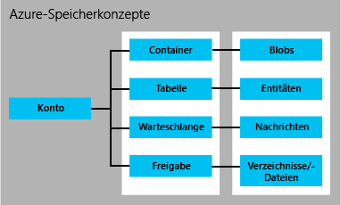

<properties
	pageTitle="Einführung in Storage | Microsoft Azure"
	description="Eine Übersicht über Azure Storage, dem Onlinedatenspeicher von Microsoft in der Cloud. Erfahren Sie, wie Sie die beste verfügbare Cloudspeicherlösung in Ihren Anwendungen einsetzen."
	services="storage"
	documentationCenter=""
	authors="tamram"
	manager="carmonm"
	editor="tysonn"/>

<tags
	ms.service="storage"
	ms.workload="storage"
	ms.tgt_pltfrm="na"
	ms.devlang="na"
	ms.topic="get-started-article"
	ms.date="02/24/2016"
	ms.author="tamram"/>

# Einführung in Microsoft Azure Storage

## Übersicht

Azure Storage ist eine Cloudspeicherlösung für moderne Anwendungen, die eine Kombination aus Zuverlässigkeit, Verfügbarkeit und Skalierbarkeit bietet, um die Anforderungen Ihrer Kunden zu erfüllen. In diesem Artikel erfahren Entwickler, IT-Experten und Entscheidungsträger Folgendes:

- Was Azure Storage ist und wie Sie in Ihren Cloud-, Mobilgerät-, Server- und Desktop-Anwendungen davon profitieren können
- Welche Arten von Daten Sie mithilfe folgender Azure Storage-Dienste speichern können: Blobdaten (Objektdaten), NoSQL-Tabellendaten, Warteschlangennachrichten und Dateifreigaben
- Wie der Zugriff auf Ihre Daten in Azure Storage verwaltet wird
- Wie Ihre Azure Storage-Daten durch Redundanz und Replikation gesichert werden
- Welche Schritte erforderlich ist, um Ihre erste Azure Storage-Anwendung zu erstellen

Informationen zum Einrichten und Starten von Azure Storage finden Sie unter [Erste Schritte mit Azure Storage – Einstieg in fünf Minuten](storage-getting-started-guide.md).

Informationen zu Tools, Bibliotheken und weiteren Ressourcen für die Arbeit mit Azure Storage finden Sie unter [Nächste Schritte](#next-steps) weiter unten.

## Was ist Azure Storage?

Cloud Computing ermöglicht neue Szenarien für Anwendungen, die skalierbaren, haltbaren und hochverfügbaren Speicher für ihre Daten benötigen. Genau aus diesem Grund hat Microsoft den Azure-Speicher entwickelt. Mit dem Azure-Speicher können Entwickler umfangreiche Anwendungen für neue Szenarien entwickeln. Außerdem dient der Speicher als Grundlage für virtuelle Azure-Computer, ein weiteres Zeugnis für dessen Robustheit.

Azure Storage ist in hohem Maße skalierbar. Sie können also Hunderte Terabytes von Daten speichern und verarbeiten, um die "Big Data"-Szenarios zu verwirklichen, die für Anwendungen in der Wissenschaft, in der Finanzbranche und in der Medienwelt erforderlich sind. Oder Sie können geringe Datenmengen einer kleinen Geschäftswebsite speichern. Sie bezahlen in jedem Fall nur für die Daten, die Sie tatsächlich gespeichert haben. Azure Storage speichert aktuell Billionen einzigartiger Kundenobjekte und bearbeitet durchschnittlich mehrere Millionen Anfragen pro Sekunde.

Der Azure-Speicher ist elastisch. Sie können Anwendungen für ein breites globales Publikum entwickeln und anschließend nach Bedarf skalieren - sowohl im Hinblick auf die gespeicherten Daten als auch auf die gestellten Abfragen. Sie zahlen nur für das, was Sie verwenden, und nur dann, wenn Sie es verwenden.

Azure Storage verwendet ein automatisches Partitionierungssystem, das einen automatischen Lastenausgleich Ihrer Daten auf Grundlage des Datenverkehrs durchführt. Dies bedeutet, dass Azure Storage immer automatisch die nötigen Ressourcen zuordnet, um die wachsenden Anforderungen Ihrer Anwendung zu erfüllen.

Der Azure-Speicher ist weltweit und von jeder Art von Anwendung erreichbar, egal ob diese in der Cloud, auf dem Desktop, auf einem lokalen Server oder einem mobilen oder Tabletgerät läuft. Sie können Azure Storage in mobilen Szenarios verwenden, in denen eine Anwendung eine Datenteilmenge auf einem Gerät speichert und sie mit der vollständigen Datenmenge in der Cloud synchronisiert.

Azure Storage unterstützt Kunden mit verschiedenen Betriebssystemen (z. B. Windows und Linux) und einer Vielzahl von Programmiersprachen (darunter .NET, Java und C++) für eine problemlose Entwicklung. Azure Storage macht auch Datenressourcen über einfache REST-APIs verfügbar, die auf jedem Client ausgeführt werden können, der Daten über HTTP/HTTPS senden und empfangen kann.

Azure Premium Storage bietet eine leistungsstarke Datenträgerunterstützung mit niedriger Latenz für E/A-intensive Workloads, die auf virtuellen Azure-Computern ausgeführt werden. Mit Azure Premium Storage können Sie mehrere persistente Datenträger an einen virtuellen Computer anfügen und diese gemäß Ihren Leistungsanforderungen konfigurieren. Jeder Datenträger wird für maximale E/A-Leistung von einer SSD-Festplatte in Azure Premium Storage unterstützt. Weitere Informationen finden Sie unter [Premium-Speicher: Hochleistungsspeicher für Workloads auf virtuellen Azure-Computern](../storage-premium-storage-preview-portal).

## Anwenden der Azure Storage-Dienste

Ein Azure-Speicherkonto ist ein sicheres Konto, mit dem Sie Zugriff auf Dienste in Azure-Speicher erhalten. Ihr Speicherkonto stellt den eindeutigen Namespace für Ihre Speicherressourcen bereit. Zwei Typen von Speicherkonten stehen zur Verfügung:

- Ein Standardspeicherkonto umfasst Blob-, Tabellen- und Warteschlangenspeicher.
- Ein Premium-Speicherkonto unterstützt aktuell ausschließlich Festplatten virtueller Azure-Computer.

Um ein Speicherkonto erstellen zu können, müssen Sie über ein Azure-Abonnement verfügen. Dies ist ein Plan, der Ihnen Zugriff auf eine Vielzahl von Azure-Diensten verschafft. Sie können bis zu 100 eindeutig benannte Speicherkonten unter einem einzigen Abonnement erstellen. Weitere Informationen zu den Begrenzungen von Speicherkonten finden Sie unter [Skalierbarkeits- und Leistungsziele für Azure Storage](storage-scalability-targets.md). Informationen zu Volumenpreisen finden Sie unter [Preise für Azure Storage](https://azure.microsoft.com/pricing/details/storage/).

Sie können die Verwendung von Azure mit einem [kostenlosen Konto](https://azure.microsoft.com/pricing/free-trial/) beginnen. Wenn Sie sich entscheiden, einen Abonnementplan zu kaufen, können Sie zwischen einer Vielzahl von [Kaufoptionen](https://azure.microsoft.com/pricing/purchase-options/) auswählen. [MSDN-Abonnenten](https://azure.microsoft.com/pricing/member-offers/msdn-benefits-details/) erhalten ein monatliches Gratis-Guthaben für Azure-Dienste, inklusive Azure-Speicher.

### Standardspeicherkonten

Mit einem Standardspeicherkonto erhalten Sie Zugriff auf die verschiedenen Azure Storage-Datendienste, d. h. Blob Storage, Table Storage, Queue Storage und File Storage:

- Im **Blob Storage** werden Dateidaten gespeichert. Ein Blob kann jede Art von Text- oder binären Daten sein, z. B. ein Dokument, eine Mediendatei oder ein Anwendungs-Installer. Der Blobspeicher wird auch als Objektspeicher bezeichnet.
- Im **Tabellenspeicher** werden strukturierte Datensätze gespeichert. Der Tabellenspeicher ist ein NoSQL-Schlüssel-/Attribut-Datenspeicher, der eine rasche Entwicklung und schnellen Zugriff auf große Datenmengen erlaubt.
- **Queue Storage** bietet eine zuverlässige Nachrichtenfunktion zur Workflowverarbeitung und zur Kommunikation zwischen Komponenten von Clouddiensten.
- **File Storage** bietet einen gemeinsam genutzten Speicher für Legacyanwendungen unter Verwendung des standardmäßige SMB-Protokolls. Virtuelle Azure-Computer und Clouddienste können Dateidaten in verschiedenen Anwendungskomponenten über eingebundene Freigaben teilen, und lokale Anwendungen können über die REST-API des Dateidiensts auf freigegebene Dateien zugreifen.

Jedes Standardspeicherkonto kann bis zu 500 TB an kombinierten Blob-, Warteschlangen-, Tabellen- und Dateidaten enthalten. Unter [Ziele für Skalierbarkeit und Leistung des Azure-Speichers](storage-scalability-targets.md) finden Sie weitere Details zur Kapazität von Standardspeicherkonten.

Die folgende Abbildung zeigt die Beziehungen zwischen Azure-Speicherressourcen in einem Standardspeicherkonto:

Informationen zum Erstellen eines Standardspeicherkontos finden Sie unter [Erstellen eines Speicherkontos](storage-create-storage-account.md#create-a-storage-account).

### Premium-Speicherkonten

Azure Premium Storage unterstützt derzeit nur Datenträger in virtuellen Azure-Computern. Eine ausführliche Übersicht über Azure Premium-Speicher finden Sie unter [Premium-Speicher: Hochleistungsspeicher für Workloads auf virtuellen Azure-Computern](storage-premium-storage.md).

[AZURE.INCLUDE [storage-versions-include](../../includes/storage-versions-include.md)]

## Blob-Speicher

Für Benutzer mit großen Mengen unstrukturierter Daten, die in einer Cloud gespeichert werden sollen, bietet der Blob-Speicher eine kostengünstige und skalierbare Lösung. Der Blob-Speicher dient zur Speicherung der folgenden Inhalte:

- Dokumente
- Daten aus sozialen Netzwerken wie Fotos, Videos, Musik und Blogs
- Sicherungskopien von Dateien, Computern, Datenbanken und Geräten
- Bilder und Texte für Webanwendungen
- Konfigurationsdaten für Cloudanwendungen
- Große Datenmengen wie Protokolle und andere große Datensätze

Jedes Blob ist in einem Container organisiert. Container bieten auch eine praktische Methode, um Gruppen von Objekten Sicherheitsrichtlinien zuzuordnen. Ein Speicherkonto kann eine beliebige Anzahl von Containern enthalten, und ein Container kann eine beliebige Anzahl von Blobs enthalten. Die Speicherkapazität eines Speicherkontos beträgt 500 TB.

Der Blob-Speicher bietet drei Arten von Blobs: Block-Blobs, Anfüge-Blobs und Seiten-Blobs (Festplatten). Block-Blobs sind für das Streaming und die Speicherung von Cloudobjekten optimiert und stellen eine gute Wahl zur Speicherung von Dokumenten, Mediendateien, Sicherungskopien usw. dar. Anfüge-Blobs sind mit Block-Blobs vergleichbar, sind allerdings für Anfügevorgänge optimiert. Ein Anfüge-Blob kann nur durch Hinzufügen eines neuen Blocks an dessen Ende aktualisiert werden. Anfüge-Blobs sind eine gute Wahl für Szenarios wie die Protokollierung, bei denen neue Daten nur ans Ende des Blobs geschrieben werden müssen.

Seiten-Blobs sind für die Darstellung von IaaS-Festplatten und für die Unterstützung von Schreibzugriffen optimiert und können bis zu 1 TB groß sein. Eine an ein Netzwerk angehängte IaaS-Festplatte auf einem virtuellen Azure-Computer ist eine als Seiten-Blob gespeicherte virtuelle Festplatte.

Für sehr große Datensätze, bei denen Netzwerkbeschränkungen das Hochladen oder Herunterladen von Daten in Blob Storage über eine Kabelverbindung erschweren, können Sie wie folgt vorgehen: Schicken Sie eine Festplatte an Microsoft, um Ihre Daten direkt aus dem oder in das Rechenzentrum importieren bzw. exportieren zu lassen. Siehe [Verwenden des Microsoft Azure Import/Export-Diensts zum Übertragen von Daten in den Blob-Speicher](storage-import-export-service.md).

## Tabellenspeicher

Moderne Anwendungen erfordern oft Datenspeicher mit höherer Skalierbarkeit und Flexibilität als in früheren Software-Generationen. Der Tabellenspeicher bietet eine hoch verfügbare, in hohem Maße skalierbare Speicherung, so dass Ihre Anwendung automatisch an die Bedürfnisse der Benutzer angepasst werden kann. Der Tabellenspeicher ist ein NoSQL-Speicher im Schlüssel-/Attributformat von Microsoft und unterscheidet sich durch das schemalose Design von herkömmlichen relationalen Datenbanken. Mit einer schemalosen Datenspeicherung ist es einfach, Ihre Daten an die Entwicklung Ihrer Anwendungen anzupassen. Der Tabellenspeicher ist so benutzerfreundlich, dass Entwickler problemlos Anwendungen erstellen können. Der Datenzugriff ist für alle Arten von Anwendungen schnell und kostengünstig. Der Tabellenspeicher ist deutlich kostengünstiger als herkömmliches SQL für ähnliche Datenmengen.

Der Tabellenspeicher verwendet ein Schlüssel-/Attributformat, d. h. jeder Wert in einer Tabelle wird mit einem typisierten Eigenschaftennamen gespeichert. Der Eigenschaftenname kann für Filter und Auswahlkriterien verwendet werden. Eine Auflistung von Eigenschaften und deren Werten bilden eine Entität. Da der Tabellenspeicher schemalos ist, können zwei Entitäten in derselben Tabelle unterschiedliche Sammlungen von Eigenschaften enthalten, und diese Eigenschaften können unterschiedliche Typen haben.

Sie können den Tabellenspeicher zur Speicherung von flexiblen Datensätzen wie Benutzerdaten für Webanwendungen, Adressbüchern, Geräteinformationen und jeder Art von Metadaten verwenden, die Ihr Dienst erfordert. Sie können eine beliebige Anzahl von Entitäten in einer Tabelle speichern, und ein Speicherkonto kann eine beliebige Anzahl von Tabellen enthalten, bis zur Speicherkapazitätsgrenze eines Speicherkontos.

Wie bei Blobs und Warteschlangen können Entwickler Table Storage mit Standard-REST-Protokollen aufrufen und verwalten. Table Storage unterstützt allerdings auch eine Untergruppe des OData-Protokolls. Dies vereinfacht erweiterte Abfragefunktionen und ermöglicht die Verwendung der Formate JSON und AtomPub (XML-basiert).

NoSQL-Datenbanken wie der Tabellenspeicher bieten für heutige internetbasierte Anwendungen eine beliebte Alternative zu herkömmlichen relationalen Datenbanken.

## Warteschlangenspeicher

Bei der Entwicklung von Anwendungen für Skalierungszwecke werden einzelne Anwendungskomponenten oft entkoppelt, damit sie unabhängig skaliert werden können. Der Warteschlangenspeicher bietet eine zuverlässige Messaginglösung für die asynchrone Kommunikation zwischen Anwendungskomponenten, egal ob diese in der Cloud, auf dem Desktop, auf einem lokalen Server oder einem mobilen Gerät ausgeführt werden. Der Warteschlangenspeicher unterstützt auch die Verwaltung asynchroner Aufgaben und den Aufbau von Prozessworkflows.

Ein Speicherkonto kann eine beliebige Anzahl von Warteschlangen enthalten. Eine Warteschlange kann eine beliebige Anzahl von Nachrichten enthalten, bis zur Kapazitätsgrenze des Speicherkontos. Einzelne Nachrichten können bis zu 64 KB groß sein.

## Dateispeicher

Der Azure-Dateispeicher bietet cloudbasierte SMB-Dateifreigaben, mit denen Sie ältere Anwendungen, die auf Dateifreigaben an Azure angewiesen sind, schnell und ohne kostspielige Neuentwicklungen umziehen können. Mit dem Azure-Dateispeicher können Anwendungen in virtuellen Azure-Computern oder Clouddiensten eine Dateifreigabe in der Cloud einbinden, ebenso wie eine Desktopanwendung eine typische SMB-Freigabe einbindet. Die Dateispeicher-Freigaben können dann von beliebig vielen Anwendungskomponenten gleichzeitig eingebunden und abgerufen werden.

Da es sich bei Dateispeicher-Freigaben um gewöhnliche SMB-Freigaben handelt, können Anwendungen in Azure über die E/A-System-APIs auf die Freigaben zugreifen. Entwickler können daher ihren vorhandenen Code und bereits erlernte Fertigkeiten für die Migration vorhandener Anwendungen verwenden. IT-Fachkräfte können PowerShell-Cmdlets verwenden, um Dateispeicher-Freigaben im Rahmen der Administration von Azure-Anwendungen zu erstellen, einzubinden und zu verwalten.

Wie auch die anderen Azure-Speicherdienste stellt der Dateispeicher eine REST-API für den Zugriff auf Daten in Freigaben bereit. Lokale Anwendungen können die REST-API des Dateispeichers aufrufen, um auf Daten in Dateifreigaben zuzugreifen. Auf diese Weise können Unternehmen einen Teil der älteren Anwendungen nach Azure migrieren und andere Anwendungen weiterhin intern ausführen. Die Einbindung von Dateifreigaben ist nur für Anwendungen möglich, die in Azure ausgeführt werden. Lokale Anwendungen müssen über die REST-API auf die Dateifreigaben zugreifen.

Verteilte Anwendungen können den Dateispeicher für die Speicherung und Weitergabe von Anwendungsdaten sowie für Entwicklungs- und Testtools verwenden. Eine Anwendung kann z. B. Konfigurationsdateien und Diagnosedaten wie Protokolle, Metriken und Absturzabbilder in einer Dateispeicher-Freigabe ablegen, um diese Daten anderen virtuellen Computern oder Rollen zur Verfügung zu stellen. Entwickler und Administratoren können Hilfsprogramme für die Erstellung oder Verwaltung einer Anwendung in einer Dateispeicher-Freigabe ablegen, die für alle Komponenten verfügbar ist, anstatt diese Hilfsprogramme auf allen virtuellen Computern oder Rolleninstanzen einzeln zu installieren.

## Zugriff auf Blob-, Tabellen-, Warteschlangen- und Dateispeicherressourcen

Standardmäßig kann nur der Besitzer eines Speicherkontos auf Ressourcen in diesem Konto zugreifen. Für die Sicherheit Ihrer Daten muss jede Abfrage über Ressourcen in Ihrem Konto authentifiziert werden. Die Authentifizierung beruht auf einem Modell mit gemeinsam verwendeten Schlüsseln. Blobs können auch für die Unterstützung anonymer Authentifizierungen konfiguriert werden.

Ihr Speicherkonto wird bei der Erstellung zwei privaten Zugangsschlüsseln zugeordnet, die zur Authentifizierung verwendet werden. Die Verwendung von zwei Schlüsseln stellt sicher, dass Ihre Anwendung auch dann verfügbar bleibt, wenn Sie die Schlüssel im Rahmen der regelmäßigen Sicherheitsverwaltung regelmäßig erneuern.

Wenn Sie anderen Benutzern kontrollierten Zugriff zu Ihren Speicherressourcen gewähren müssen, können Sie eine Shared Access Signature erstellen. Eine Shared Access Signature (SAS) ist ein Token, das an eine URL angehängt werden kann und delegierten Zugriff auf eine Speicherressource erlaubt. Jeder Benutzer, der dieses Token besitzt, kann mit festgelegten Berechtigungen und während der Gültigkeitsdauer auf die Ressource zugreifen, auf die das Token verweist. Ab Version 05.04.2015 unterstützt Azure Storage zwei Arten von SAS: Dienst-SAS und Konto-SAS.

Die Dienst-SAS delegiert den Zugriff auf eine Ressource in nur einem der Speicherdienste: Blob-, Warteschlangen-, Tabellen- oder Dateidienst.

Eine Konto-SAS delegiert den Zugriff auf Ressourcen in einem oder mehreren der Speicherdienste. Sie können den Zugriff auf Vorgänge auf Dienstebene delegieren, die nicht mit einer Dienst-SAS verfügbar sind. Sie können auch den Zugriff auf Lese-, Schreib- und Löschvorgänge in Blob-Containern, Tabellen, Warteschlangen und Dateifreigaben delegieren, die mit einer Dienst-SAS nicht zulässig sind.

Abschließend können Sie noch einen Container und seine Blobs – oder ein spezielles Blob – öffentlich verfügbar machen. Wenn Sie einen Container oder ein Blob zu einer öffentlichen Ressource erklären, kann jeder Benutzer anonym drauf zugreifen, ohne eine Authentifizierung zu benötigen. Öffentliche Container und Blobs sind hilfreich zur Verfügbarmachung von Ressourcen wie Medien und Dokumenten, die auf Websites gehostet werden. Um die Netzwerklatenz für ein globales Publikum zu reduzieren, können Sie Blob-Daten, die von Websites verwendet werden, in einem Cache zwischenspeichern.

Weitere Informationen zu Shared Access Signatures finden Sie unter [Shared Access Signatures: Grundlagen zum SAS-Modell](storage-dotnet-shared-access-signature-part-1.md). Weitere Informationen zum sicheren Zugriff auf Ihr Speicherkonto finden Sie unter [Verwalten des anonymen Lesezugriffs auf Container und Blobs](storage-manage-access-to-resources.md) und [Authentifizierung für die Azure-Speicherdienste](https://msdn.microsoft.com/library/azure/dd179428.aspx).

## Replikation für Dauerhaftigkeit und hohe Verfügbarkeit

[AZURE.INCLUDE [storage-replication-options-include](../../includes/storage-replication-options-include.md)]

## Übertragen von Daten in und aus Azure Storage

Über das Befehlszeilenprogramm AzCopy können Sie Blob-, Datei- und Tabellendaten innerhalb Ihres Speicherkontos oder zwischen mehreren Speicherkonten kopieren. Weitere Informationen finden Sie unter [Übertragen von Daten mit dem Befehlszeilenprogramm AzCopy](storage-use-azcopy.md).

AzCopy baut auf der [Azure Storage Data Movement Library](https://www.nuget.org/packages/Microsoft.Azure.Storage.DataMovement/) auf, die derzeit in der Vorschau verfügbar ist.

Der Azure Import/Export-Dienst bietet eine Möglichkeit zum Importieren von Blobdaten in Ihr Speicherkonto oder zum Exportieren von Blobdaten aus Ihrem Speicherkonto über eine an das Azure-Rechenzentrum gesendete Festplatte. Weitere Informationen zu diesem Dienst finden Sie unter [Verwenden des Microsoft Azure Import/Export-Diensts zum Übertragen von Daten in Blob Storage](storage-import-export-service.md).

## Preise

Kunden werden Azure-Speicherdienste auf der Basis der folgenden vier Faktoren in Rechnung gestellt: verwendete Speicherkapazität, ausgewählte Replikationsoption, Anzahl der Abfragen an den Dienst und Datenausgang.

Speicherkapazität bezieht sich darauf, wie viel von Ihrer Speicherkontozuweisung zum Speichern von Daten verwendet wird. Die Kosten des einfachen Speicherns von Daten wird dadurch bestimmt, wie viele Daten Sie speichern und wie diese Daten repliziert werden. Für jede Lese- und Schreiboperation auf dem Azure-Speicher wird außerdem eine Anfrage an den Dienst ausgeführt. Datenausgang bezieht sich auf die Daten, die aus einer Microsoft Azure-Region heraus übertragen werden. Wenn eine Anwendung, die nicht in der gleichen Region ausgeführt wird und entweder ein Clouddienst oder ein anderer Anwendungstyp ist, auf die Daten in Ihrem Speicherkonto zugreift, fallen Gebühren für den Datenausgang an. (Für Microsoft Azure-Dienste können Sie Maßnahmen ergreifen, um Ihre Daten und Dienste in den gleichen Datencentern zu gruppieren und auf diese Weise Prozess- und Datenausgangsgebühren zu senken oder komplett einzusparen.)

Die Seite [Preise für Azure Storage](https://azure.microsoft.com/pricing/details/storage/) enthält detaillierte Preisinformationen zu Speicherkapazität, Replikation und Transaktionen. In der [Datenübertragungs-Preisübersicht](https://azure.microsoft.com/pricing/details/data-transfers/) finden Sie detaillierte Preisinformationen für den Datenausgang. Sie können den [Azure Storage-Preisrechner](https://azure.microsoft.com/pricing/calculator/?scenario=data-management) verwenden, um Ihre Kosten zu bestimmen.

## APIs, Bibliotheken und Tools in Azure Storage

Auf Azure Storage-Ressourcen kann über jede Sprache zugegriffen werden, die HTTP/HTTPS-Anforderungen ausgeben kann. Zusätzlich bietet Azure Storage Programmierbibliotheken für einige beliebte Sprachen. Diese Bibliotheken vereinfachen viele Aspekte der Arbeit mit Azure Storage durch Verarbeitung von Details wie synchronen und asynchronen Aufrufen, der Zusammenfassung von Vorgängen, Ausnahmeverwaltung, automatischen Neuversuchen, Betriebsverhalten usw. Bibliotheken sind aktuell für die folgenden Sprachen und Plattformen erhältlich. Weitere sind in Planung.

### Azure Storage Data Services

- [REST-API für Speicherdienste](http://msdn.microsoft.com/library/azure/dd179355.aspx)
- [Speicherclientbibliothek für .NET, Windows Phone und Windows-Runtime ](https://www.nuget.org/packages/WindowsAzure.Storage/)
- [Speicherclientbibliothek für C++](https://github.com/Azure/azure-storage-cpp)
- [Speicherclientbibliothek für Java/Android](/develop/java/)
- [Speicherclientbibliothek für Node.js](http://dl.windowsazure.com/nodestoragedocs/index.html)
- [Speicherclientbibliothek für PHP](/develop/php/)
- [Speicherclientbibliothek für Ruby](/develop/ruby/)
- [Speicherclientbibliothek für Python](/develop/python/)
- [Azure Storage-Cmdlets für PowerShell 1.0](https://msdn.microsoft.com/library/azure/mt269418.aspx)

### Azure Storage-Verwaltungsdienste

- [Referenz für REST-API „Azure Storage Resource Provider“](https://msdn.microsoft.com/library/azure/mt163683.aspx)
- [Storage Resource Provider-Clientbibliothek für .NET](https://msdn.microsoft.com/library/azure/mt131037.aspx)
- [Storage Resource Provider-Cmdlets für PowerShell 1.0](https://msdn.microsoft.com/library/azure/mt607151.aspx)
- [Storage-Dienstverwaltungs-REST-API (klassisch)](https://msdn.microsoft.com/library/azure/ee460790.aspx)

### Azure Storage-Datenverschiebungsdienste 

- [REST-API für Import/Export-Dienst](https://msdn.microsoft.com/library/azure/dn529096.aspx)
- [Storage Data Movement-Clientbibliothek für .NET](https://www.nuget.org/packages/Microsoft.Azure.Storage.DataMovement/)

### Tools und Dienstprogramme

- [Azure-SDKs und -Tools](https://azure.microsoft.com/downloads/)
- [Azure-Speicheremulator](http://www.microsoft.com/download/details.aspx?id=43709)
- [Azure PowerShell](../powershell-install-configure.md)
- [Befehlszeilenprogramm AzCopy](http://aka.ms/downloadazcopy)

## Nächste Schritte

Weitere Informationen zu Azure Storage finden Sie in den folgenden Ressourcen:

### Dokumentation

- [Azure-Speicherdokumentation](https://azure.microsoft.com/documentation/services/storage/)

### Für PowerShell-Benutzer

- [Verwenden von Azure PowerShell mit Azure Storage](storage-powershell-guide-full.md)

### Für .NET-Entwickler

- [Erste Schritte mit Azure Blob Storage mit .NET](storage-dotnet-how-to-use-blobs.md)
- [Erste Schritte mit Azure Table Storage mit .NET](storage-dotnet-how-to-use-tables.md)
- [Erste Schritte mit Azure Queue Storage mit .NET](storage-dotnet-how-to-use-queues.md)
- [Erste Schritte mit Azure File Storage unter Windows](storage-dotnet-how-to-use-files.md)

### Für Java-/Android-Entwickler

- [Verwenden des Blob-Speichers mit Java](storage-java-how-to-use-blob-storage.md)
- [Verwenden des Tabellenspeichers mit Java](storage-java-how-to-use-table-storage.md)
- [Verwenden des Warteschlangenspeichers mit Java](storage-java-how-to-use-queue-storage.md)
- [Gewusst wie: Verwenden von File Storage mit Java](storage-java-how-to-use-file-storage.md) 

### Für Node.js-Entwickler

- [Verwenden des Blob-Speichers mit Node.js](storage-nodejs-how-to-use-blob-storage.md)
- [Verwenden des Tabellenspeichers mit Node.js](storage-nodejs-how-to-use-table-storage.md)
- [Verwenden des Warteschlangenspeichers mit Node.js](storage-nodejs-how-to-use-queues.md)

### Für PHP-Entwickler

- [Verwenden des Blob-Speichers mit PHP](storage-php-how-to-use-blobs.md)
- [Verwenden des Tabellenspeichers mit PHP](storage-php-how-to-use-table-storage.md)
- [Verwenden des Warteschlangenspeichers mit PHP](storage-php-how-to-use-queues.md)

### Für Ruby-Entwickler

- [Verwenden des Blob-Speichers mit Ruby](storage-ruby-how-to-use-blob-storage.md)
- [Verwenden des Tabellenspeichers mit Ruby](storage-ruby-how-to-use-table-storage.md)
- [Verwenden des Warteschlangenspeichers mit Ruby](storage-ruby-how-to-use-queue-storage.md)

### Für Python-Entwickler

- [Verwenden des Blob-Speichers mit Python](storage-python-how-to-use-blob-storage.md)
- [Verwenden des Tabellenspeichers mit Python](storage-python-how-to-use-table-storage.md)
- [Verwenden des Warteschlangenspeichers mit Python](storage-python-how-to-use-queue-storage.md)
- [Gewusst wie: Verwenden von Azure File Storage mit Python](storage-python-how-to-use-file-storage.md)

<!---HONumber=AcomDC_0309_2016-->