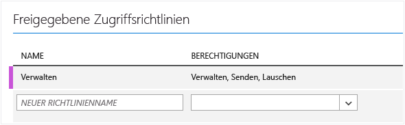
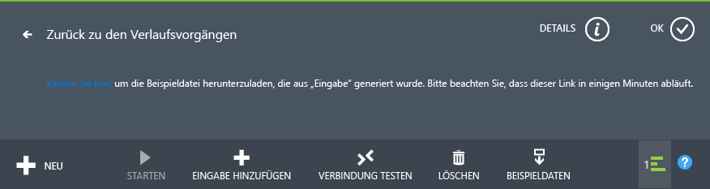
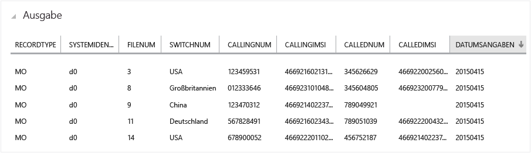
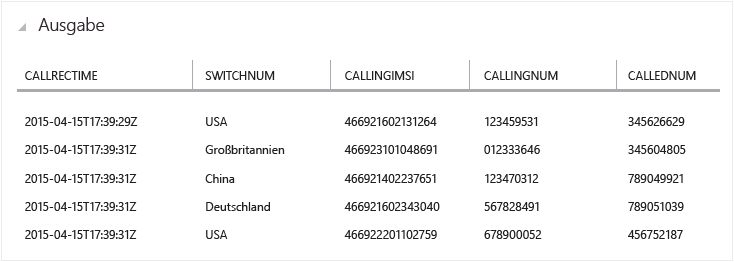
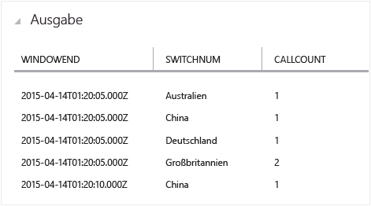
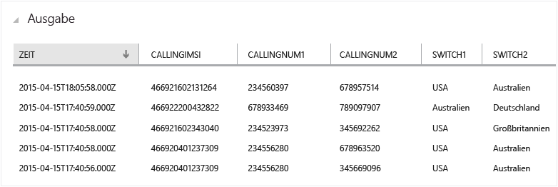
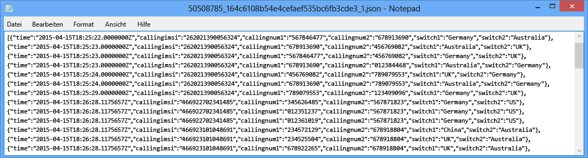

<properties
	pageTitle="Erste Schritte mit Azure Stream Analytics: Betrugserkennung in Echtzeit | Microsoft Azure"
	description="Erfahren Sie, wie Sie mit Stream Analytics eine Lösung zur Betrugserkennung in Echtzeit erstellen können. Verwenden Sie einen Event Hub für die Ereignisverarbeitung in Echtzeit."
	keywords="Event Hub,Betrugserkennung,Echtzeit,Echtzeitverarbeitung"
	services="stream-analytics"
	documentationCenter=""
	authors="jeffstokes72"
	manager="paulettm"
	editor="cgronlun" />

<tags
	ms.service="stream-analytics"
	ms.devlang="na"
	ms.topic="hero-article"
	ms.tgt_pltfrm="na"
	ms.workload="data-services"
	ms.date="11/06/2015"
	ms.author="jeffstok" />

# Erste Schritte mit Azure Stream Analytics: Betrugserkennung in Echtzeit

Erfahren Sie, wie Sie mit Azure Stream Analytics eine End-to-End-Lösung zur Betrugserkennung in Echtzeit erstellen können. Binden Sie Ereignisse in Azure Event Hubs ein, schreiben Sie Stream Analytics-Abfragen für das Erfassen von Daten oder für Warnungen, und senden Sie das Ergebnis an eine Ausgabesenke, um in Echtzeit einen Dateneinblick zu erhalten.

Stream Analytics ist ein vollständig verwalteter Dienst, der eine geringe Latenz, Hochverfügbarkeit und eine skalierbare komplexe Ereignisverarbeitung für das Streaming von Daten in der Cloud bietet. Weitere Informationen finden Sie unter [Einführung in Azure Stream Analytics](stream-analytics-introduction.md).

## Szenario: Telekommunikation und SIM-Betrugserkennung in Echtzeit

Ein Telekommunikationsunternehmen hat eine große Datenmenge durch eingehende Anrufe. Im Hinblick auf diese Daten ist für das Unternehmen Folgendes wichtig: * Die Daten sollen auf eine verwaltbare Menge reduziert werden, und es sollen Erkenntnisse über die Kundennutzung anhand der geografischen Regionen und der Zeit gewonnen werden. * Zudem möchte das Unternehmen SIM-Betrug (mehrere mehr oder weniger gleichzeitige Anrufe derselben Person von geografisch unterschiedlichen Standorten) in Echtzeit erkennen, damit es problemlos reagieren und die Kunden benachrichtigen oder den Dienst einstellen kann.

In typischen Szenarien des Internet der Dinge (IoT) werden unzählige Telemetrie- oder Sensordaten generiert, die die Kunden erfassen möchten oder über die bei Abweichungen Benachrichtigungen in Echtzeit erstellt werden sollen.

## Voraussetzungen

Für dieses Szenario wird ein Ereignisgenerator verwendet, der sich auf GitHub befindet. Laden Sie ihn [hier](https://github.com/Azure/azure-stream-analytics/tree/master/DataGenerators/TelcoGenerator) herunter, und befolgen Sie die Schritte dieses Lernprogramms, um Ihre Lösung einzurichten.

## Erstellen einer Azure Event Hub-Eingabe und einer Consumergruppe

Die Beispielanwendung generiert Ereignisse und überträgt sie mithilfe von Push an eine Event Hub-Instanz für die Echtzeitverarbeitung. Service Bus Event Hubs sind in Stream Analytics die bevorzugte Methode für das Ereignis "Ingestion". Weitere Informationen zu den Event Hubs finden Sie in der [Azure Service Bus-Dokumentation](/documentation/services/service-bus/).

So erstellen Sie ein Event Hub

1.	Klicken Sie im [Azure-Portal](https://manage.windowsazure.com/) auf **Neu** > **App Services** > **Service Bus** > **Event Hub** > **Schnellerfassung**. Geben Sie einen Namen, eine Region und den neuen oder vorhandenen Namespace an, um einen neuen Ereignis-Hub zu erstellen.  
2.	Als bewährte Methode sollte jeder Stream Analytics-Auftrag eine einzelne Event Hub-Verbrauchergruppe lesen. Im Folgenden werden Sie durch den Prozess des Erstellens einer Verbrauchergruppe geführt. Zudem können Sie [mehr über Verbrauchergruppen erfahren](https://msdn.microsoft.com/library/azure/dn836025.aspx). Um eine Verbrauchergruppe zu erstellen, wechseln Sie zu dem neu erstellten Event Hub, klicken Sie auf die Registerkarte **Verbrauchergruppen** und anschließend auf **Erstellen** am unteren Rand der Seite. Geben Sie einen Namen für die Verbrauchergruppe ein.
3.	Um Zugriff auf den Event Hub zu gewähren, müssen wir eine Richtlinie für gemeinsamen Zugriff erstellen. Klicken Sie auf die Registerkarte **Konfigurieren** des Event Hubs.
4.	Erstellen Sie unter **Freigegebene Zugriffsrichtlinien** eine neue Richtlinie mit Berechtigungen zum **Verwalten**.

	

5.	Klicken Sie unten auf der Seite auf **Speichern**.
6.	Wechseln Sie zum **Dashboard**, klicken Sie unten auf der Seite auf **Verbindungsinformationen**, und kopieren und speichern Sie dann die Verbindungsinformationen.

## Konfigurieren und starten der Ereignisgenerator-Anwendung

Wir haben eine Clientanwendung bereitgestellt, die Beispielmetadaten für eingehende Anrufe generiert und diese per Push an den Event Hub übermittelt. Gehen Sie folgendermaßen vor, um diese Anwendung einzurichten.

1.	Laden Sie TelcoGenerator unter [https://github.com/Azure/azure-stream-analytics/tree/master/DataGenerators/TelcoGenerator](https://github.com/Azure/azure-stream-analytics/tree/master/DataGenerators/TelcoGenerator) herunter.
2.	Ersetzen Sie die Werte "EventHubConnectionString" und "EventHubName" in "App.config" mit der Verbindungszeichenfolge und dem Namen Ihres Event Hubs.
3.	Erstellen Sie die Projektmappe, um den Download der erforderlichen NuGet-Pakete auszulösen.
4.	Starten Sie die Anwendung. Die Nutzung lautet wie folgt:

    	telcodatagen [#NumCDRsPerHour] [SIM Card Fraud Probability] [#DurationHours]

Im folgenden Beispiel werden im Lauf von zwei Stunden 1000 Ereignisse mit einer Betrugswahrscheinlichkeit von 20 Prozent generiert:

    TelcoDataGen.exe 1000 .2 2

Sie sehen, dass Datensätze an Ihren Event Hub gesendet werden. Einige wichtige Felder dieser Anwendung zur Betrugserkennung in Echtzeit werden hier definiert:

| Datensatz | Definition |
| ------------- | ------------- |
| CallrecTime | Zeitstempel für die Startzeit des Anrufs. |
| SwitchNum | Die für die Anrufverbindung verwendete Vermittlungsstelle. |
| CallingNum | Die Rufnummer des Anrufers. |
| CallingIMSI | International Mobile Subscriber Identity (IMSI). Die eindeutige ID des Anrufers. |
| CalledNum | Die Rufnummer des Empfängers. |
| CalledIMSI | International Mobile Subscriber Identity (IMSI). Die eindeutige ID des Empfängers. |

## Erstellen eines Stream Analytics-Auftrags
Nun, da wir einen Datenstrom von Telekommunikationsereignissen haben, können wir einen Stream Analytics-Auftrag einrichten, um diese Ereignisse in Echtzeit zu analysieren.

### Bereitstellen eines Stream Analytics-Auftrags

1.	Klicken Sie im Azure-Portal auf **Neu > Datendienste > Stream Analytics > Schnellerfassung**.
2.	Geben Sie die folgenden Werte an, und klicken Sie dann auf **Create Stream Analytics Job**:

	* **Auftragsname**: Geben Sie einen Auftragsnamen ein.

	* **Region**: Wählen Sie die Region aus, in der der Auftrag ausgeführt werden soll. Ziehen Sie es in Betracht, den Auftrag und das Event Hub in derselben Region zu platzieren, um für eine bessere Leistung zu sorgen und sicherzustellen, dass Sie nicht für die Übertragung von Daten zwischen Regionen bezahlen.

	* **Speicherkonto**: Wählen Sie das Azure-Speicherkonto aus, das Sie zum Speichern von Überwachungsdaten für alle Stream Analytics-Aufträge verwenden möchten, die innerhalb dieser Region ausgeführt werden. Sie haben die Möglichkeit, ein vorhandenes Speicherkonto auszuwählen oder ein neues zu erstellen.

3.	Klicken Sie im linken Bereich auf **Stream Analytics**, um die Stream Analytics-Aufträge aufzulisten.

	

4.	Der neue Auftrag wird mit dem Status **Erstellt** aufgeführt. Beachten Sie, dass die Schaltfläche **Start** am unteren Seitenrand deaktiviert ist. Sie müssen die Auftragseingabe, -ausgabe und -abfrage konfigurieren, bevor Sie den Auftrag starten können.

### Festlegen der Auftragseingabe
1.	Klicken Sie im Stream Analytics-Auftrag am oberen Seitenrand auf **Eingaben** und dann auf **Eingabe hinzufügen**. Das aufgerufene Dialogfeld führt Sie durch eine Reihe von Schritten, um Ihre Eingabe einzurichten.
2.	Wählen Sie **Datenstrom**, und klicken Sie dann mit der rechten Maustaste.
3.	Wählen Sie **Event Hub**, und klicken Sie dann mit der rechten Maustaste.
4.	Geben Sie die folgenden Werte auf der dritten Seite ein, oder wählen Sie sie aus:

	* **Input Alias**: Geben Sie einen Anzeigenamen für diese Auftragseingabe ein, z. B. *CallStream*. Beachten Sie, dass Sie diesen Namen später in der Abfrage verwenden werden.
	* **Event Hub**: Wenn der Event Hub, den Sie erstellt haben, sich in demselben Abonnement wie der Stream Analytics-Auftrag befindet, wählen Sie den Namespace aus, in dem sich der Event Hub befindet.

	Wenn sich Ihr Event Hub in einem anderen Abonnement befindet, wählen Sie **Event Hub aus anderem Abonnement verwenden**, und geben Sie manuell den **Service Bus-Namespace**, **Event Hub-Namen**, **Event Hub-Richtliniennamen**, **Event Hub-Richtlinienschlüssel** und die **Event Hub-Partitionsanzahl** ein.

	* **Event Hub-Name**: Wählen Sie den Namen des Event Hubs aus.

	* **Event Hub Policy Name**: Wählen Sie die Event Hub-Richtlinie aus, die Sie zuvor in diesem Lernprogramm erstellt haben.

	* **Event Hub-Consumergruppe**: Geben Sie die Consumergruppe ein, die Sie zuvor in diesem Tutorial erstellt haben.
5.	Klicken Sie auf die rechte Taste.
6.	Geben Sie die folgenden Werte an:

	* **Event Serializer Format**: JSON
	* **Codierung**: UTF8
7.	Aktivieren Sie das Kontrollkästchen, um diese Quelle hinzuzufügen und zu überprüfen, ob Stream Analytics erfolgreich mit dem Event Hub verbunden werden kann.

### Festlegen der Auftragsabfrage

Stream Analytics unterstützt ein einfaches, deklaratives Abfragemodell zum Beschreiben der Transformationen für Echtzeitverarbeitung. Weitere Informationen zur Sprache finden Sie in der [Stream Analytics Query Language Reference](https://msdn.microsoft.com/library/dn834998.aspx) (in englischer Sprache). Dieses Lernprogramm hilft Ihnen beim Erstellen und Testen mehrerer Abfragen über Ihren Anrufdatenstrom in Echtzeit.

#### Optional: Beispieleingabedaten
Um die Abfrage mit den tatsächlichen Auftragsdaten zu überprüfen, können Sie die **Beispieldaten**-Funktion verwenden, um Ereignisse aus Ihrem Datenstrom zu extrahieren und eine JSON-Datei der Ereignisse zum Testen zu erstellen. Die folgenden Schritte veranschaulichen die Vorgehensweise. Zudem finden Sie die Beispieldatei [Telco.json](https://github.com/Azure/azure-stream-analytics/blob/master/Sample%20Data/telco.json) für Testzwecke.

1.	Wählen Sie Ihre Event Hub-Eingabe aus, und klicken Sie am unteren Seitenrand auf **Beispieldaten**.
2.	Geben Sie im daraufhin angezeigten Dialogfeld eine **Startzeit** für das Sammeln der Daten und die **Dauer** ein, während der zusätzliche Daten verarbeitet werden sollen.
3.	Klicken Sie auf das Häkchen, um mit dem Erfassen der Eingabedaten zu beginnen. Das Erstellen der Datendatei kann ein oder zwei Minuten dauern. Wenn der Prozess abgeschlossen wurde, klicken Sie auf **Details**, und speichern Sie die generierte JSON-Datei.

	

#### Pass-Through-Abfrage

Wenn Sie alle Ereignisse archivieren möchten, können Sie eine Pass-Through-Abfrage verwenden, um alle Felder der Ereignis- oder Nachrichtennutzlast abzufragen. Führen Sie zunächst eine einfache Pass-Through-Abfrage durch, die alle Felder in einem Ereignis projiziert.

1.	Klicken Sie oben auf der Seite des Stream Analytics-Auftrags auf **Abfrage**.
2.	Fügen Sie dem Code-Editor Folgendes hinzu:

		SELECT * FROM CallStream

	> Stellen Sie sicher, dass der Name der Eingabequelle dem Namen der Eingabe entspricht, die Sie zuvor angegeben haben.

3.	Klicken Sie im Abfrage-Editor auf **Test**.
4.	Geben Sie eine Testdatei an. Hierbei kann es sich um die im Rahmen der angeführten Schritte von Ihnen erstellte Datei oder um die Datei [Telco.json](https://github.com/Azure/azure-stream-analytics/blob/master/Sample%20Data/telco.json) handeln.
5.	Klicken Sie auf die Schaltfläche „Prüfen“. Die Ergebnisse werden unterhalb der Abfragedefinition angezeigt.

	

### Spaltenprojektion

Nun reduzieren wir die zurückgegebenen Felder auf eine kleinere Menge.

1.	Ändern Sie die Abfrage im Code-Editor in:

		SELECT CallRecTime, SwitchNum, CallingIMSI, CallingNum, CalledNum
		FROM CallStream

2.	Klicken Sie im Abfrage-Editor auf **Erneut ausführen**, um die Ergebnisse der Abfrage anzuzeigen.

	

### Anzahl der eingehenden Aufrufe pro Region: Rollierendes Fenster mit Aggregation

Um die Anzahl der eingehenden Anrufe pro Region zu vergleichen, rufen wir alle fünf Sekunden die Anzahl der eingehenden Anrufe im [TumblingWindow](https://msdn.microsoft.com/library/azure/dn835055.aspx) gruppiert nach "SwitchNum" ab.

1.	Ändern Sie die Abfrage im Code-Editor in:

		SELECT System.Timestamp as WindowEnd, SwitchNum, COUNT(*) as CallCount
		FROM CallStream TIMESTAMP BY CallRecTime
		GROUP BY TUMBLINGWINDOW(s, 5), SwitchNum

	Diese Abfrage gibt mit dem Schlüsselwort **Timestamp By** ein Zeitstempelfeld für die Nutzlast an, das für die zeitliche Berechnung verwendet wird. Wird dieses Feld nicht angegeben, wird die Zeit verwendet, zu der jedes Ereignis beim Event Hub eingeht. Weitere Informationen erhalten Sie unter ["Arrival Time Vs Application Time" in der Stream Analytics Query Language Reference](https://msdn.microsoft.com/library/azure/dn834998.aspx) (in englischer Sprache).

	Beachten Sie, dass Sie mit der Eigenschaft **System.Timestamp** jeweils auf einen Zeitstempel für das Ende der einzelnen Fenster zugreifen können.

2.	Klicken Sie im Abfrage-Editor auf **Erneut ausführen**, um die Ergebnisse der Abfrage anzuzeigen.

	

### SIM-Betrugserkennung mit einem Self-Join

Um eine potenziell betrügerische Verwendung erkennen zu können, betrachten wir Anrufe, die in weniger als fünf Sekunden von einem Benutzer von unterschiedlichen Standorten aus eingegangen sind. Wir [verknüpfen](https://msdn.microsoft.com/library/azure/dn835026.aspx) den Strom der Anrufereignisse mit sich selbst, um diese Fälle zu überprüfen.

1.	Ändern Sie die Abfrage im Code-Editor in:

		SELECT System.Timestamp as Time, CS1.CallingIMSI, CS1.CallingNum as CallingNum1,
		CS2.CallingNum as CallingNum2, CS1.SwitchNum as Switch1, CS2.SwitchNum as Switch2
		FROM CallStream CS1 TIMESTAMP BY CallRecTime
		JOIN CallStream CS2 TIMESTAMP BY CallRecTime
		ON CS1.CallingIMSI = CS2.CallingIMSI
		AND DATEDIFF(ss, CS1, CS2) BETWEEN 1 AND 5
		WHERE CS1.SwitchNum != CS2.SwitchNum

2.	Klicken Sie im Abfrage-Editor auf **Erneut ausführen**, um die Ergebnisse der Abfrage anzuzeigen.

	

### Erstellen der Ausgabetabelle

Nun, da wir einen Datenstrom, eine Event Hub-Eingabe zum Erfassen von Ereignissen und eine Abfrage zur Ausführung einer Umwandlung über den Stream definiert haben, ist der letzte Schritt die Definition einer Ausgabetabelle für den Auftrag. Die Ereignisse im Zusammenhang mit betrügerischem Verhalten werden in den Blobspeicher geschrieben.

Befolgen Sie die nachstehenden Schritte, um (sofern noch nicht erfolgt) einen Container für den Blob-Speicher zu erstellen.

1.	Verwenden Sie ein vorhandenes Speicherkonto, oder erstellen Sie ein neues, indem Sie auf **NEU > DATENDIENSTE > SPEICHER > SCHNELLERFASSUNG** klicken und die Anweisungen befolgen.
2.	Wählen Sie das Speicherkonto aus, klicken Sie oben auf der Seite auf **CONTAINER**, und klicken Sie dann auf **HINZUFÜGEN**.
3.	Geben Sie den Wert **NAME** für den Container an, und legen Sie **ZUGRIFF** auf "Öffentliches Blob" fest.

## Festlegen der Auftragsausgabe

1.	Klicken Sie in Ihrem Stream Analytics-Auftrag am oberen Rand der Seite auf **AUSGABE**, und klicken Sie dann auf **AUSGABE HINZUFÜGEN**. Das aufgerufene Dialogfeld führt Sie durch eine Reihe von Schritten, um Ihre Ausgabe einzurichten.
2.	Wählen Sie **BLOB-SPEICHER**, und klicken Sie dann mit der rechten Maustaste.
3.	Geben Sie die folgenden Werte auf der dritten Seite ein, oder wählen Sie sie aus:

	* **AUSGABEALIAS**: Geben Sie einen Anzeigenamen für diese Auftragsausgabe ein.
	* **ABONNEMENT**: Befindet sich der Blobspeicher, den Sie erstellt haben, in demselben Abonnement wie der Stream Analytics-Auftrag, wählen Sie **Speicherkonto aus dem aktuellen Abonnement verwenden**. Wenn sich der Speicher in einem anderen Abonnement befindet, wählen Sie **Use Storage Account from Another Subscription** aus, und geben Sie manuell **SPEICHERKONTO**, **SPEICHERKONTOSCHLÜSSEL** und **CONTAINER** ein.
	* **SPEICHERKONTO**: Wählen Sie den Namen des Speicherkontos aus.
	* **CONTAINER**: Wählen Sie den Namen des Containers aus.
	* **DATEINAMENPRÄFIX**: Geben Sie ein Präfix ein, das beim Schreiben von Blob-Ausgaben verwendet wird.

4.	Klicken Sie auf die rechte Taste.
5.	Geben Sie die folgenden Werte an:

	* **EVENT SERIALIZER FORMAT**: JSON
	* **CODIERUNG**: UTF8

6.	Klicken Sie auf das Häkchen, um diese Quelle hinzuzufügen und zu überprüfen, ob Stream Analytics erfolgreich mit dem Speicherkonto verbunden werden kann.

## Starten des Auftrags für Echtzeitverarbeitung

Nachdem wir Eingabe, Abfrage und Ausgabe für den Auftrag angegeben haben, können wir den Stream Analytics-Auftrag für die Betrugserkennung in Echtzeit starten.

1.	Klicken Sie im **DASHBOARD** des Auftrags auf **STARTEN** am unteren Rand der Seite.
2.	Wählen Sie im daraufhin angezeigten Dialogfeld **AUFTRAGSSTARTZEIT** aus, und klicken Sie dann auf das Häkchen am unteren Rand des Dialogfelds. Der Status ändert sich in **Starten** und wechselt nach kurzer Zeit zu **Ausführen**.

## Anzeigen der Ausgabe zur Betrugserkennung

Verwenden Sie ein Tool wie [Azure-Speicher-Explorer](https://azurestorageexplorer.codeplex.com/) oder [Azure Explorer](http://www.cerebrata.com/products/azure-explorer/introduction), um betrügerische Ereignisse beim Schreiben in die Ausgabe in Echtzeit anzuzeigen.

## Support
Um Hilfe zu erhalten, nutzen Sie unser [Azure Stream Analytics-Forum](https://social.msdn.microsoft.com/Forums/de-DE/home?forum=AzureStreamAnalytics).

## Nächste Schritte

- [Einführung in Azure Stream Analytics](stream-analytics-introduction.md)
- [Erste Schritte mit Azure Stream Analytics](stream-analytics-get-started.md)
- [Skalieren von Azure Stream Analytics-Aufträgen](stream-analytics-scale-jobs.md)
- [Stream Analytics Query Language Reference (in englischer Sprache)](https://msdn.microsoft.com/library/azure/dn834998.aspx)
- [Referenz zur Azure Stream Analytics-Verwaltungs-REST-API](https://msdn.microsoft.com/library/azure/dn835031.aspx)

<!---HONumber=Nov15_HO3-->