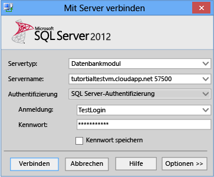

<properties linkid="manage-windows-commontask-install-sql-server" urlDisplayName="Install SQL Server" pageTitle="Provision a SQL Server virtual machine in Azure " metaKeywords="Azure tutorial creating SQL Server, SQL Server vm, configuring SQL Server" description="A tutorial that teaches you how to create and configure a SQL Server virtual machine on Azure." metaCanonical="" services="virtual-machines" documentationCenter="" title="Provisioning a SQL Server Virtual Machine on Azure" authors="selcint" solutions="" manager="clairt" editor="tyson" />

Bereitstellen eines virtuellen Computers mit SQL Server auf Azure
=================================================================

In der Galerie der virtuellen Computer von Azure sind verschiedene Images zu finden, die Microsoft SQL Server enthalten. Sie können eines der Images virtueller Computer aus der Galerie auswählen, und mit wenigen Klicks können Sie den virtuellen Computer auf Ihrer Azure-Umgebung bereitstellen.

In diesem Lernprogramm lernen Sie Folgendes:

-   [Verbinden mit dem Azure-Verwaltungsportal und Bereitstellen eines virtuellen Computers aus der Galerie](#Provision)
-   [Öffnen des virtuellen Computers mithilfe von Remotedesktop und vollständige Einrichtung](#RemoteDesktop)
-   [Fertigstellen der Konfigurationsschritte, um mithilfe von SQL Server Management Studio auf einem anderen Computer eine Verbindung zum virtuellen Computer herzustellen](#SSMS)
-   [Nächste Schritte](#Optional)

Verbinden mit dem Azure-Verwaltungsportal und Bereitstellen eines virtuellen Computers aus der Galerie
------------------------------------------------------------------------------------------------------

1.  Melden Sie sich auf dem [Azure-Verwaltungsportal](http://manage.windowsazure.com) bei Ihrem Konto an. Wenn Sie kein Azure-Konto haben, sollten Sie die Seite [Kostenlose einmonatige Testversion](http://www.windowsazure.com/en-us/pricing/free-trial/) besuchen.

2.  Klicken Sie im Azure-Verwaltungsportal unten links auf der Webseite auf **+NEU**, klicken Sie auf **COMPUTE**, klicken Sie auf **VIRTUELLER COMPUTER** und dann auf **AUS GALERIE**.

3.  Wählen Sie auf der Seite **Virtuellen Computer erstellen** ein Image eines virtuellen Computers aus, das SQL Server enthält, und klicken Sie dann unten rechts auf den Pfeil für die nächste Seite. Die aktuellsten Informationen zu den unterstützen SQL Server-Images auf Azure finden Sie unter [Erste Schritte mit SQL Server auf Windows Azure-Virtuellen Computern](http://go.microsoft.com/fwlink/p/?LinkId=294720) in der Dokumentation [SQL Server auf Windows Azure Virtual Machines](http://go.microsoft.com/fwlink/p/?LinkId=294719).

    > [WACOM.NOTE] Wenn Sie einen virtuellen Computer haben, der mithilfe der Plattform-Image-Edition SQL Server 2012 Evaluation erstellt wurde, die während des Vorschauzeitraums verfügbar war, können Sie dieses nicht zu einem stündlich bezahlten Editions-Image in der Galerie upgraden. Sie haben zwei Möglichkeiten:
    > - Sie können einen neuen virtuellen Computer erstellen, indem Sie die stündlich bezahlte SQL Server-Edition aus der Galerie verwenden und die Datenbankdateien zu diesem neuen virtuellen Computer migrieren, wobei Sie den Schritten unter [Migrieren von SQL Server-Datenbankdateien und -Schema zwischen virtuellen Windows Azure-Computern mit Datenträgern](http://go.microsoft.com/fwlink/p/?LinkId=294738) folgen. **Oder**,

    > -   Sie können eine vorhandene Instanz der SQL Server 2012 Evaluation-Edition zu einer anderen Edition von SQL Server 2012 entsprechend der Vereinbarung [Lizenzmobilität durch Software Assurance für Azure](http://www.windowsazure.com/en-us/pricing/license-mobility/) upgraden, indem Sie die Schritte unter [Upgrade zu einer anderen Edition von SQL Server 2012](http://msdn.microsoft.com/library/cc707783.aspx) befolgen. Informationen zum Erwerb der lizenzierten Kopie von SQL Server finden Sie unter [So kaufen Sie SQL Server](http://www.microsoft.com/en-us/sqlserver/get-sql-server/how-to-buy.aspx).

4.  Geben Sie auf der Seite **Konfiguration des virtuellen Computers** die folgenden Informationen ein:

    -   Geben Sie einen **NAMEN DES VIRTUELLEN COMPUTERS** ein.
    -   Geben Sie im Feld **NEUER BENUTZERNAME** einen eindeutigen Benutzernamen für das lokale Administratorkonto für den virtuellen Computer ein.
    -   Geben Sie in das Feld **NEUES KENNWORT** ein sicheres Kennwort ein. Weitere Informationen finden Sie unter [Sichere Kennwörter](http://msdn.microsoft.com/library/ms161962.aspx).
    -   Geben Sie das Kennwort im Feld **KENNWORT BESTÄTIGEN** nochmals ein.
    -   Wählen Sie in der Dropdownliste die geeignete **GRÖSSE** aus.

    > [WACOM.NOTE] Die Größe des virtuellen Computers wird während der Bereitstellung angegeben: 
    >- Mittel ist die kleinste empfohlene Größe für Produktionsarbeitsauslastungen. 
    >- Die empfohlene Minimalgröße für einen virtuellen Computer ist Groß, wenn SQL Server Enterprise Edition verwendet wird. 
    >- Wählen Sie Groß oder höher aus, wenn Sie SQL Server Enterprise Edition verwenden. 
    >- Wählen Sie A6, wenn Sie SQL Server 2012 Enterprise für Data Warehouse-Images verwenden. 
    >- Wählen Sie A7, wenn Sie SQL Server 2014 Evaluation für Data Warehouse-Images verwenden. 
    >- Die ausgewählte Größe beschränkt die Anzahl an Datenträgern, die Sie konfigurieren können. Die aktuellsten Informationen zu verfügbaren Größen virtueller Computer und der Anzahl an Datenträgern, die Sie zu einem virtuellen Computer hinzufügen können, finden Sie unter [Größen virtueller Computer für Azure](http://go.microsoft.com/fwlink/p/?LinkId=294819).

    Klicken Sie unten rechts auf den Pfeil für die nächste Seite, um fortzufahren.

    

5.  Geben Sie auf der Seite **Virtual machine mode** die folgenden Informationen ein:
    -   Wählen Sie **Standalone Virtual Machine**.
    -   Geben Sie im Feld **DNS-NAME** den ersten Teil eines DNS-Namens Ihrer Wahl ein, sodass insgesamt ein Name des Formats **TESTNAME.cloudapp.net** entsteht.
    -   Wählen Sie im Feld **REGION/AFFINITY GROUP/VIRTUAL NETWORK** eine Region aus, in der dieses virtuelle Image gehostet wird.

    Klicken Sie auf den Pfeil zum Aufrufen der nächsten Seite, um fortzufahren.

    

6.  Auf der Seite **Virtual machine options**:
    -   Wählen Sie im Feld **AVAILABILITY SET** den Eintrag **(none)**.
    -   Lesen Sie sich die Bedingungen durch, und bestätigen Sie diese.

    

7.  Klicken Sie auf das Häkchen unten rechts, um fortzufahren.

8.  Warten Sie, während Azure den virtuellen Computer vorbereitet. Der virtuelle Computer wird folgende Phasen durchlaufen:

    -   Wird gestartet (Bereitstellung)
    -   Beendet
    -   Wird gestartet (Bereitstellung)
    -   Wird ausgeführt (Bereitstellung)
    -   Wird ausgeführt

Öffnen des virtuellen Computers mithilfe von Remotedesktop und vollständige Einrichtung
---------------------------------------------------------------------------------------

1.  Wenn die Bereitstellung abgeschlossen ist, klicken Sie auf den Namen des virtuellen Computers, um zur Seite DASHBOARD zu gelangen. Klicken Sie unten auf der Seite auf **Verbinden**.

    
2.  Öffnen Sie die RPD-Datei mit dem Windows-Remotedesktop-Programm (`%windir%\system32\mstsc.exe`).

3.  Geben Sie im Dialogfeld **Windows-Sicherheit** das Kennwort für das lokale Administratorkonto an, das Sie zuvor festgelegt haben. (Sie werden möglicherweise dazu aufgefordert, die Anmeldedaten des virtuellen Computers zu überprüfen.)

4.  Beim ersten Anmelden auf dem virtuellen Computer müssen eventuell einige Prozesse ausgeführt werden, darunter die Einrichtung Ihres Desktops, Windows-Updates und die Fertigstellung der ersten Windows-Konfigurationsaufgaben (sysprep). Nachdem Windows-Sysprep abgeschlossen ist, stellt die SQL Server-Einrichtung die Konfigurationsaufgaben fertig. Diese Aufgaben können während der Ausführung zu einer kurzen Verzögerung führen. `SELECT @@SERVERNAME` gibt möglicherweise nicht den korrekten Namen aus, bis die SQL Server-Einrichtung abgeschlossen ist.

Nachdem Sie über Windows Remotedesktop mit dem virtuellen Computer verbunden sind, funktioniert der virtuelle Computer wie jeder andere Computer. Stellen Sie ganz normal eine Verbindung zur Standardinstanz von SQL Server mit SQL Server Management Studio, das auf dem virtuellen Computer ausgeführt wird, her.

Fertigstellen der Konfigurationsschritte, um mithilfe von SQL Server Management Studio auf einem anderen Computer eine Verbindung zum virtuellen Computer herzustellen
----------------------------------------------------------------------------------------------------------------------------------------------------------------------

Bevor Sie eine Verbindung mit der Instanz von SQL Server über das Internet herstellen können, müssen Sie folgende Aufgaben abschließen, die in den nächsten Abschnitten beschrieben werden:

-   [Erstellen eines TCP-Endpunkts für den virtuellen Computer](#Endpoint)
-   [Öffnen der TCP-Ports in der Windows-Firewall](#FW)
-   [Konfigurieren von SQL Server für das Lauschen des TCP-Protokolls](#TCP)
-   [Konfigurieren von SQL Server für die Authentifizierung mit gemischtem Modus](#Mixed)
-   [Erstellen von Anmeldenamen für die SQL Server-Authentifizierung](#Logins)
-   [Bestimmen des DNS-Namens des virtuellen Computers](#DNS)
-   [Verbinden mit dem Datenbankmodul von einem anderen Computer aus](#cde)
-   [Verbinden mit dem Datenbankmodul von Ihrer Anwendung aus] (\#cdea)

Der Verbindungspfad wird von folgendem Diagramm zusammengefasst:

### Erstellen eines TCP-Endpunkts für den virtuellen Computer

Der virtuelle Computer benötigt einen Endpunkt, um nach eingehender TCP-Kommunikation zu lauschen. Dieser Azure-Konfigurationsschritt leitet den eingehenden Datenverkehr des TCP-Ports zu einem TCP-Port, auf den der virtuelle Computer zugreifen kann.

1.  Klicken Sie im Azure-Verwaltungsportal auf **VIRTUELLE COMPUTER**.

2.  Klicken Sie auf den neu erstellten virtuellen Computer. Informationen zu Ihrem virtuellen Computer werden angezeigt.

3.  Wählen Sie oben auf der Seite die Seite **ENDPUNKTE** aus, und klicken Sie dann unten auf **ENDPUNKT HINZUFÜGEN**.

    

4.  Klicken Sie auf der Seite zum Hinzufügen des Endpunkts zum virtuellen Computer auf **ENDPUNKT HINZUFÜGEN**, und klicken Sie dann auf Neu, um fortzufahren.

    

5.  Geben Sie auf der Seite zum Angeben der Details des Endpunkts folgende Informationen ein:

    -   Geben Sie unter **NAME** einen Namen für den Endpunkt ein.
    -   Wählen Sie im Feld **PROTOKOLL** den Eintrag **TCP**. Sie können den Standardlauschport von SQL Server, **1433**, im Feld **Privater Port** eingeben. Sie können zudem **57500** im Feld **ÖFFENTLICHER PORT** eingeben. Viele Organisationen verwenden unterschiedliche Portnummern, um böswillige Sicherheitsangriffe zu vermeiden.

    

6.  Klicken Sie auf das Häkchen, um fortzufahren. Der Endpunkt wurde erstellt.

    

### Öffnen der TCP-Ports in der Windows-Firewall für die Standardinstanz des Datenbankmoduls

1.  Stellen Sie mit Windows Remotedesktop eine Verbindung zum virtuellen Computer her. Klicken Sie nach der Anmeldung im Startmenü auf **Ausführen**, geben Sie **WF.msc** ein, und klicken Sie dann auf **OK**.

    
2.  Klicken Sie in **Windows-Firewall mit erweiterter Sicherheit** im linken Bereich mit der rechten Maustaste auf **Eingehende Regeln**, und klicken Sie dann im Aktionsbereich auf **Neue Regel**.

    

3.  Klicken Sie im Dialogfeld **Regeltyp** auf **Port** und anschließend auf **Weiter**.

4.  Wählen Sie im Feld **Protokolle und Ports** den Eintrag **TCP**. Wählen Sie **Bestimmte lokale Ports**, und geben Sie dann die Portnummer der Instanz des Datenbankmoduls ein (**1433** für die Standardinstanz oder die von Ihnen ausgewählte Nummer für den privaten Port im Endpunktschritt).

    

5.  Klicken Sie auf **Weiter**.

6.  Klicken Sie im Dialogfeld **Aktion** auf **Verbindung zulassen** und anschließend auf **Weiter**.

    **Sicherheitshinweis:** Die Auswahl von **Verbindung zulassen, wenn sie sicher ist** kann für zusätzliche Sicherheit sorgen. Wählen Sie diese Option, wenn Sie zusätzliche Sicherheitsoptionen in Ihrer Umgebung konfigurieren möchten.

    

7.  Klicken Sie im Dialogfeld **Profil** auf **Öffentlich** und anschließend auf **Weiter**.

    **Sicherheitshinweis:** Die Auswahl von **Öffentlich** ermöglicht den Zugriff über das Internet. Sie sollten möglichst ein restriktiveres Profil auswählen.

    

8.  Geben Sie im Dialogfeld **Name** einen Namen und eine Beschreibung für diese Regel ein, und klicken Sie dann auf **Fertig stellen**.

    

Öffnen Sie gegebenenfalls zusätzliche Ports für andere Komponenten. Weitere Informationen finden Sie unter [Konfigurieren der Windows-Firewall für den SQL Server-Zugriff](http://msdn.microsoft.com/en-us/library/cc646023.aspx).

### Konfigurieren von SQL Server für das Lauschen des TCP-Protokolls

1.  Klicken Sie, wenn Sie mit dem virtuellen Computer über Remotedesktop verbunden sind, auf das Startmenü, klicken Sie auf **Alle Programme**, klicken Sie auf **Microsoft SQL Server** *Version*, klicken Sie auf **Konfigurationstools**, und klicken Sie dann auf **SQL Server-Konfigurations-Manager**.

    

2.  Erweitern Sie im SQL Server-Konfigurationsmanager im Konsolenbereich **SQL Server-Netzwerkkonfiguration**.

3.  Klicken Sie im Konsolenbereich auf **Protokolle für *Instanzenname***. (Die Standardinstanz ist **Protokolle für MSSQLSERVER**.)

4.  Klicken Sie im Detailbereich mit der rechten Maustaste auf **TCP**, dies sollte standardmäßig für Galerie-Images aktiviert sein. Klicken Sie für eigene Images auf **Aktivieren**, falls der Status Deaktivert ist.

    

5.  Klicken Sie im linken Bereich auf **SQL Server-Dienste**. (Der Neustart des Datenbankmoduls kann bis zur Fertigstellung des nächsten Schritts verschoben werden.)

6.  Klicken Sie im Detailsbereich mit der rechten Maustaste auf **SQL Server (*Instanzenname*)** (die Standardinstanz ist **SQL Server (MSSQLSERVER)**), und klicken Sie dann auf **Neu starten**, um die Instanz von SQL Server zu stoppen und neu zu starten.

    

7.  Schließen Sie den SQL Server-Konfigurations-Manager.

Weitere Informationen zur Aktivierung von Protokollen für SQL Server-Datenbankmodule finden Sie unter [Aktivieren oder Deaktivieren eines Servernetzwerkprotokolls](http://msdn.microsoft.com/en-us/library/ms191294.aspx).

### Konfigurieren von SQL Server für die Authentifizierung mit gemischtem Modus

Das SQL Server-Datenbankmodul kann ohne Domänenumgebung keine Windows-Authentifizierung nutzen. Um eine Verbindung zum Datenbankmodul von einem anderen Computer aus herzustellen, konfigurieren Sie SQL Server für die Authentifizierung mit gemischtem Modus. Die Authentifizierung mit gemischtem Modus ermöglicht sowohl die SQL Server-Authentifizierung als auch die Windows-Authentifizierung. (Die Konfiguration der Authentifizierung mit gemischtem Modus ist möglicherweise nicht notwendig, wenn Sie ein Azure Virtual Network konfiguriert haben. Weitere Informationen erhalten Sie unter [Connectivity Considerations for SQL Server in Azure Virtual Machines](http://go.microsoft.com/fwlink/?LinkId=294723) (Konnektivitätsüberlegungen für SQL Server in virtuellen Azure-Computern, in englischer Sprache) in der Dokumentation [SQL Server in Azure Virtual Machines](http://go.microsoft.com/fwlink/?LinkId=294719).

1.  Klicken Sie, wenn Sie mit dem virtuellen Computer über Remotedesktop verbunden sind, auf das Startmenü, klicken Sie auf **Alle Programme**, klicken Sie auf **Microsoft SQL Server *Version***, und klicken Sie dann auf **SQL Server Management Studio**.

    

    Wenn Sie Management Studio erstmalig öffnen, muss dieses eine Management Studio-Benutzerumgebung erstellen. Dies kann einige Zeit dauern.

2.  Beim Öffnen wird in Management Studio das Dialogfeld **Verbindung mit Server herstellen** angezeigt. Geben Sie im Feld **Servername** den Namen des virtuellen Computers ein, um das Datenbankmodul mit dem Objekt-Explorer zu verbinden. (Anstelle des Namen des virtuellen Computers können Sie auch **(lokal)** oder einen einzigen Punkt als **Servername** verwenden. Wählen Sie **Windows-Authentifizierung**, und lassen Sie ***your\_VM\_name*\\your\_local\_administrator** im Feld **Benutzername**. Klicken Sie auf **Verbinden**.

    

3.  Klicken Sie im Objekt-Explorer von SQL Server Management Studio mit der rechten Maustaste auf die Instanz von SQL Server (den Namen des virtuellen Computers), und klicken Sie dann auf **Eigenschaften**.

    

4.  Wählen Sie auf der Seite **Sicherheit**, unter **Serverauthentifizierung**, die Option **SQL Server- und Windows-Authentifizierungsmodus**, und klicken Sie dann auf **OK**.

    

5.  Klicken Sie im Dialogfeld von SQL Server Management Studio auf **OK**, um zu bestätigen, dass es erforderlich ist, SQL Server neu zu starten.

6.  Klicken Sie im Objekt-Explorer mit der rechten Maustaste auf den Server, und klicken Sie dann auf **Neu starten**. (Wenn SQL Server-Agent ausgeführt wird, muss dieser ebenfalls neugestartet werden.)

    

7.  Klicken Sie im Dialogfeld von SQL Server Management Studio auf **Ja**, um zu bestätigen, dass SQL Server neu gestartet werden soll.

### Erstellen von Anmeldenamen für die SQL Server-Authentifizierung

Um von einem anderen Computer aus eine Verbindung zum Datenbankmodul herzustellen, müssen Sie mindestens einen Anmeldenamen für die SQL Server-Authentifizierung erstellen.

1.  Erweitern Sie in SQL Server Management Studio-Objekt-Explorer den Ordner der Serverinstanz, in der der neue Anmeldename erstellt werden soll.

2.  Klicken Sie mit der rechten Maustaste auf den Ordner **Sicherheit**, zeigen Sie auf **Neu**, und wählen Sie **Anmeldung...** aus.

    

3.  Geben Sie im Dialogfeld **Anmeldung – Neu** auf der Seite **Allgemein** im Feld **Anmeldename** den Namen des neuen Benutzers ein.

4.  Wählen Sie **SQL Server-Authentifizierung**.

5.  Geben Sie im Feld **Kennwort** ein Kennwort für den neuen Benutzer ein. Geben Sie dieses Kennwort erneut im Feld **Kennwort bestätigen** ein.

6.  Wählen Sie **Kennwortrichtlinie erzwingen** (empfohlen) aus, um die Kennwortrichtlinienoptionen bezüglich Komplexität und Durchführung durchzusetzen. Dies ist eine Standardoption, wenn die SQL Server-Authentifizierung ausgewählt wurde.

7.  Wählen Sie **Ablauf des Kennwortes erzwingen** (empfohlen) aus, um die Kennwortrichtlinienoptionen bezüglich des Ablaufs durchzusetzen. Kennwortrichtlinie erzwingen muss ausgewählt werden, um dieses Kontrollkästchen zu aktivieren. Dies ist eine Standardoption, wenn die SQL Server-Authentifizierung ausgewählt wurde.

8.  Wählen Sie **Benutzer muss das Kennwort bei der nächsten Anmeldung ändern**, damit der Benutzer gezwungen wird, ein neues Kennwort nach der erstmaligen Verwendung des Anmeldenamens zu erstellen (Wird empfohlen, falls dieser Anmeldenamen von einer anderen Person verwendet wird. Wenn Sie den Anmeldenamen selbst verwenden werden, sollten Sie diese Option nicht auswählen). Ablauf des Kennwortes erzwingen muss ausgewählt werden, um dieses Kontrollkästchen zu aktivieren. Dies ist eine Standardoption, wenn die SQL Server-Authentifizierung ausgewählt wurde.

9.  Wählen Sie aus der Liste **Standarddatenbank** eine Standarddatenbank für den Anmeldenamen aus. **master** ist die Standardoption. Falls Sie noch keine Benutzerdatenbank erstellt haben, lassen Sie diese Einstellung auf **master**.

10. Belassen Sie in der Liste **Standardsprache** den Wert **Standard**.

    

11. Falls es sich um den ersten Anmeldenamen handelt, den Sie erstellen, werden Sie diesen Anmeldenamen wahrscheinlich als SQL Server-Administrator bezeichnen. Prüfen Sie in diesem Fall **sysadmin** auf der Seite **Serverrollen**.

    **Sicherheitshinweis:** Mitglieder der festen Serverrolle sysadmin haben vollständige Kontrolle über das Datenbankmodul. Sie sollten die Mitgliedschaft zu dieser Rolle sorgfältig beschränken.

    

12. Klicken Sie auf OK.

Weitere Informationen zu Anmeldenamen für SQL Server finden Sie unter [Erstellen eines Anmeldenamens](http://msdn.microsoft.com/en-us/library/aa337562.aspx).

### Bestimmen des DNS-Namens des virtuellen Computers

Um sich von einem anderen Computer aus mit dem SQL Server-Datenbankmodul zu verbinden, müssen Sie den DNS-Namen (Domain Name System) des virtuellen Computers kennen. (Dies ist der Name, den das Internet verwendet, um den virtuellen Computer zu identifizieren. Sie können die IP-Adresse verwenden, aber die IP-Adresse ändert sich möglicherweise, wenn Azure aufgrund von Redundanz oder Wartungsarbeiten Ressourcen verschiebt. Der DNS-Name bleibt bestehen, da er zu einer neuen IP-Adresse weitergeleitet werden kann.)

1.  Wählen Sie im Azure-Verwaltungsportal (oder aus dem vorherigen Schritt) **VIRTUELLE COMPUTER**.

2.  Kopieren Sie auf der Seite **INSTANZEN VIRTUELLER COMPUTER** in der Spalte **DNS-NAME** den DNS-Namen für den virtuellen Computer, der nach **http://** steht. (In der Benutzeroberfläche wird möglicherweise nicht der gesamte Name angezeigt, aber Sie können mit der rechten Maustaste darauf klicken und diese kopieren.)

    

### Verbinden mit dem Datenbankmodul von einem anderen Computer aus

1.  Öffnen Sie auf einem mit dem Internet verbundenen Computer SQL Server Management Studio.

2.  Geben Sie im Dialogfeld **Verbindung mit Server herstellen** oder **Verbindung mit Datenbankmodul herstellen** im Feld **Servername** den DNS-Namen des virtuellen Computers ein (in vorherigen Aufgabe festgelegt) sowie die Portnummer eines öffentlichen Endpunkts im Format *DNSName,Portnummer* wie etwa **tutorialtestVM.cloudapp.net,57500**.

3.  Wählen Sie im Feld **Authentifizierung** den Eintrag **SQL Server-Authentifizierung**.

4.  Geben Sie im Feld **Anmeldename** den Anmeldenamen ein, den Sie vorher erstellt haben.

5.  Geben Sie im Feld **Kennwort** das Kennwort des Anmeldenamens ein, den Sie vorher erstellt haben.

6.  Klicken Sie auf **Verbinden**.

    

### Verbinden mit dem Datenbankmodul von Ihrer Anwendung aus

Wenn Sie eine Verbindung zu einer Instanz von SQL Server, die auf einem virtuellen Azure-Computer ausgeführt wird, mithilfe von Management Studio herstellen können, sollten Sie in der Lage sein, eine Verbindung mithilfe einer Verbindungszeichenfolge wie unten herzustellen.

    connectionString="Server=<DNS data-morhtml="true"_Name>;Integrated Security=false;User ID=<login data-morhtml="true"_name>;Password=<your data-morhtml="true"_password>;"providerName="System.Data.SqlClient"

Weitere Informationen finden Sie unter [How to Troubleshoot Connecting to the SQL Server Database Engine](http://social.technet.microsoft.com/wiki/contents/articles/how-to-troubleshoot-connecting-to-the-sql-server-database-engine.aspx) (So beheben Sie Fehler bei der Verbindung zum SQL Server-Datenbankmodul, in englischer Sprache).

Nächste Schritte
----------------
Sie haben jetzt erfahren, wie Sie einen SQL Server auf einem virtuellen Azure-Computer mithilfe des Plattform-Image erstellen und konfigurieren. Wenn Sie SQL Server auf Azure Virtual Machines verwenden, empfehlen wir, der detaillierten Anleitung zu folgen, die Sie in der Dokumentation zu [SQL Server auf Windows Azure Virtual Machines](http://go.microsoft.com/fwlink/p/?LinkId=294719) in der Bibliothek finden. Diese Dokumentation enthält zahlreiche Artikel und Lernprogramme mit detaillierten Anleitungen. Diese behandeln die folgenden Themen:

[SQL Server auf Azure Virtual Machines](http://go.microsoft.com/fwlink/p/?LinkId=294719)

[Erste Schritte mit SQL Server auf Azure-Virtuellen Computern](http://go.microsoft.com/fwlink/p/?LinkId=294720)

[Bereit für die Migration zu SQL Server auf Azure-Virtuellen Computern](http://go.microsoft.com/fwlink/p/?LinkId=294721)

-   Migrieren von SQL Server-Datenbankdateien und -Schema zwischen virtuellen Azure-Computern mit Datenträgern

[Implementierung von SQL Server auf Azure-Virtuellen Computern](http://go.microsoft.com/fwlink/p/?LinkId=294722)

-   Kopieren von SQL Server-Daten- und Setupdateien auf einem Datenträger mit dem CSUpload-Tool von einem lokalen Speicherort nach Azure
-   Erstellen eines lokalen virtuellen Basiscomputers mit Hyper-V
-   Erstellen eines virtuellen SQL Server-Computers in Azure mithilfe des vorhandenen lokalen SQL Server-Datenträgers
-   Erstellen eines virtuellen SQL Server-Computers in Azure mithilfe des vorhandenen lokalen SQL Server-Computers
-   Verwenden von PowerShell zum Einrichten eines virtuellen SQL Server-Computers in Azure
-   Verwenden eines angefügten Datenträgers zum Speichern von Datenbankdateien

[Konnektivitätsüberlegungen für SQL Server auf virtuellen Azure-Computern](http://go.microsoft.com/fwlink/p/?LinkId=294723)

-   Lernprogramm: Verbinden mit SQL Server im selben Cloud-Dienst
-   Lernprogramm: Verbinden mit SQL Server in einem anderen Cloud-Dienst
-   Lernprogramm: Herstellen einer Verbindung zwischen ASP.NET-Anwendung und SQL Server in Azure über das virtuelle Netzwerk

[White paper: Leitfaden zur Leistung für SQL Server auf virtuellen Azure-Computern](http://msdn.microsoft.com/library/windowsazure/dn248436.aspx)

[Leistungsüberlegungen zu SQL Server auf virtuellen Computern in Azure](http://go.microsoft.com/fwlink/?LinkId=294724)

[Sicherheitsüberlegungen für SQL Server auf virtuellen Azure-Computern](http://go.microsoft.com/fwlink/p/?LinkId=294725)

[Problembehandlung und Überwachung für SQL Server auf virtuellen Azure-Computern](http://go.microsoft.com/fwlink/p/?LinkId=294726)

[Hochverfügbarkeit und Notfallwiederherstellung für SQL Server auf virtuellen Azure-Computern](http://go.microsoft.com/fwlink/p/?LinkId=294727)

-   Lernprogramm: AlwaysOn-Verfügbarkeitsgruppen in Azure (GUI)
-   Lernprogramm: AlwaysOn-Verfügbarkeitsgruppen in Azure (PowerShell)
-   Lernprogramm: AlwaysOn-Verfügbarkeitsgruppen in Hybrid-IT
-   Lernprogramm: Datenbankspiegelung für hohe Verfügbarkeit in Azure
-   Lernprogramm: Datenbankspiegelung für die Notfallwiederherstellung in Azure
-   Lernprogramm: Datenbankspiegelung für die Notfallwiederherstellung in Hybrid-IT
-   Lernprogramm: Protokollversand für die Notfallwiederherstellung in einer hybriden IT-Umgebung

[Sicherung und Wiederherstellung für SQL Server auf virtuellen Azure-Computern](http://go.microsoft.com/fwlink/p/?LinkId=294728)

[SQL Server-Business Intelligence auf virtuellen Azure-Computern](http://go.microsoft.com/fwlink/p/?LinkId=294729)

-   Verwenden von PowerShell zum Erstellen einer Azure-VM mit SQL Server BI und SharePoint 2010
-   Verwenden von PowerShell zum Erstellen einer Azure-VM mit SQL Server BI und SharePoint 2013
-   Verwenden von PowerShell zum Erstellen einer Azure-VM mit einem Berichtsserver im einheitlichen Modus
-   [White paper: Bereitstellen von SQL Server Business Intelligence auf virtuellen Azure-Computern](http://msdn.microsoft.com/library/windowsazure/dn321998.aspx)

[SQL Server Data Warehousing auf virtuellen Azure-Computern](http://msdn.microsoft.com/library/windowsazure/dn387396.aspx)

[Image5]: ./media/virtual-machines-provision-sql-server/5VM-Mode.png
[Image5b]: ./media/virtual-machines-provision-sql-server/5VM-Connect.png
[Image6]: ./media/virtual-machines-provision-sql-server/6VM-Options.png
[Image8b]: ./media/virtual-machines-provision-sql-server/SQLVMConnectionsOnAzure.GIF
[Image9]: ./media/virtual-machines-provision-sql-server/9Click-SSCM.png
[Image10]: ./media/virtual-machines-provision-sql-server/10Enable-TCP.png
[Image11]: ./media/virtual-machines-provision-sql-server/11Restart.png
[Image12]: ./media/virtual-machines-provision-sql-server/12Open-WF.png
[Image13]: ./media/virtual-machines-provision-sql-server/13New-FW-Rule.png
[Image14]: ./media/virtual-machines-provision-sql-server/14Port-1433.png
[Image15]: ./media/virtual-machines-provision-sql-server/15Allow-Connection.png
[Image16]: ./media/virtual-machines-provision-sql-server/16Public-Profile.png
[Image17]: ./media/virtual-machines-provision-sql-server/17Rule-Name.png
[Image18]: ./media/virtual-machines-provision-sql-server/18Start-SSMS.png
[Image19]: ./media/virtual-machines-provision-sql-server/19Connect-to-Server.png
[Image20]: ./media/virtual-machines-provision-sql-server/20Server-Properties.png
[Image21]: ./media/virtual-machines-provision-sql-server/21Mixed-Mode.png
[Image22]: ./media/virtual-machines-provision-sql-server/22Restart2.png
[Image23]: ./media/virtual-machines-provision-sql-server/23New-Login.png
[Image24]: ./media/virtual-machines-provision-sql-server/24Test-Login.png
[Image25]: ./media/virtual-machines-provision-sql-server/25sysadmin.png
[Image28]: ./media/virtual-machines-provision-sql-server/28Add-Endpoint.png
[Image29]: ./media/virtual-machines-provision-sql-server/29Add-Endpoint-to-VM.png
[Image30]: ./media/virtual-machines-provision-sql-server/30Endpoint-Details.png
[Image31]: ./media/virtual-machines-provision-sql-server/31VM-Connect.png
[Image32]: ./media/virtual-machines-provision-sql-server/32DNS-Name.png
[Image33]: ./media/virtual-machines-provision-sql-server/33Connect-SSMS.png