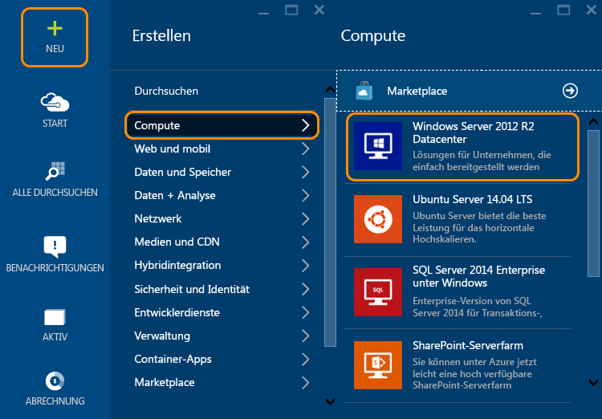
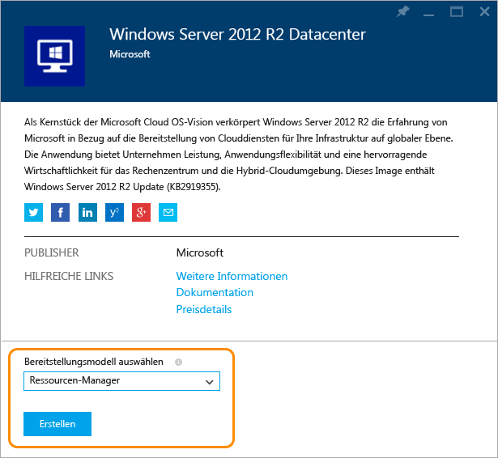
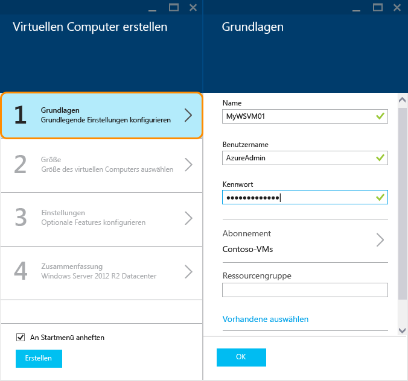
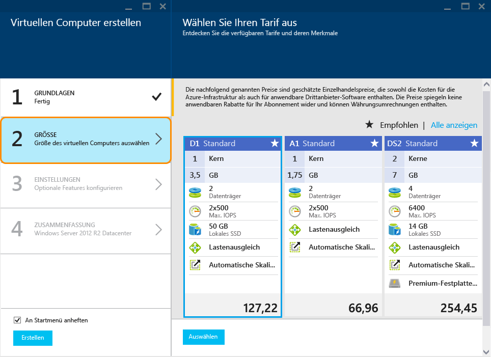
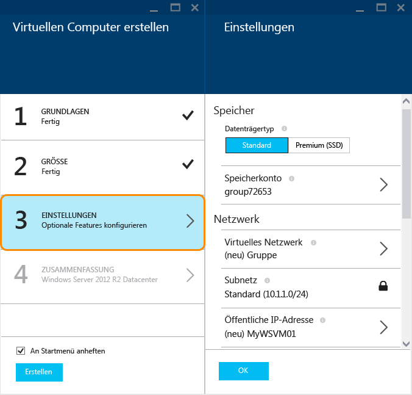
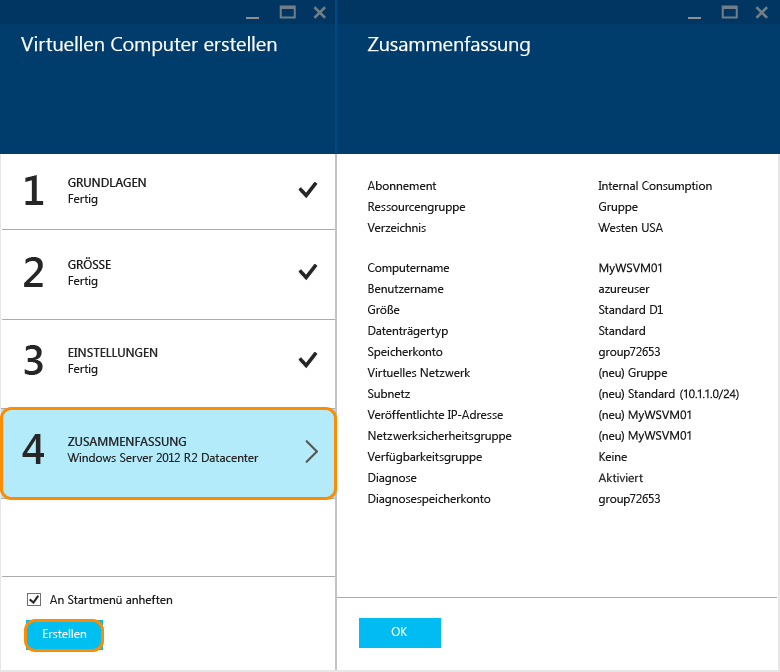
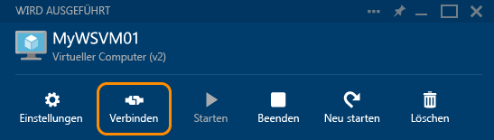

<properties
	pageTitle="Erstellen einer virtuellen Windows-Maschine im Azure-Portal | Microsoft Azure"
	description="Erfahren Sie, wie Sie mithilfe von Azure Marketplace im Azure-Portal eine virtuelle Windows-Maschine oder einen virtuellen Computer erstellen."
	keywords="virtuelle Windows-Maschine, Erstellen einer virtuellen Maschine, virtueller Computer, Einrichten einer virtuellen Maschine"
	services="virtual-machines"
	documentationCenter=""
	authors="cynthn"
	manager="timlt"
	editor=""
	tags="azure-resource-manager"/>
<tags
	ms.service="virtual-machines"
	ms.workload="infrastructure-services"
	ms.tgt_pltfrm="vm-windows"
	ms.devlang="na"
	ms.topic="hero-article"
	ms.date="01/07/2016"
	ms.author="cynthn"/>

# Erstellen einer virtuellen Windows-Maschine im Azure-Portal#

> [AZURE.SELECTOR]
- [Portal - Windows](virtual-machines-windows-tutorial.md)
- [PowerShell](virtual-machines-ps-create-preconfigure-windows-resource-manager-vms.md)
- [PowerShell - Template](virtual-machines-create-windows-powershell-resource-manager-template.md)
- [Portal - Linux](virtual-machines-linux-tutorial-portal-rm.md)
- [CLI](virtual-machines-linux-tutorial.md)

In diesem Tutorial erfahren Sie, wie einfach es ist, in wenigen Minuten eine virtuelle Windows-Maschine im Azure-Portal zu erstellen. Wir verwenden ein Windows Server 2012 R2 Datacenter-Image als Beispiel für das Erstellen des virtuellen Computers, aber dies ist nur eines von vielen in Azure bereitgestellten Images. Ihre Imageauswahl hängt von Ihrem Abonnement ab. Beispielsweise können Desktop-Images für MSDN-Abonnenten verfügbar sein.

[AZURE.INCLUDE [learn-about-deployment-models](../../includes/learn-about-deployment-models-rm-include.md)]klassisches Bereitstellungsmodell.

 

>[AZURE.TIP] Soll Ihre VM Mitglied einer Verfügbarkeitsgruppe sein, müssen Sie bei Verwendung des Portals die Verfügbarkeitsgruppe vor oder während der Erstellung der ersten VM in der Gruppe erstellen. Weitere Information zum Erstellen und Verwenden von Verfügbarkeitsgruppen finden Sie unter [Verwalten der Verfügbarkeit virtueller Computer](virtual-machines-manage-availability.md).

Sie können virtuelle Computer auch unter Verwendung eigener Images, mithilfe von Ressourcen-Manager-Vorlagen oder mit Automatisierungstools erstellen. Informationen zu den verschiedenen Methoden finden Sie unter [Verschiedene Möglichkeiten zum Erstellen eines virtuellen Windows-Computers](virtual-machines-windows-choices-create-vm.md).

[AZURE.INCLUDE [free-trial-note](../../includes/free-trial-note.md)]

## Exemplarische Vorgehensweise per Video

Hier finden Sie eine exemplarische Vorgehensweise für dieses Lernprogramm.

[AZURE.VIDEO create-a-virtual-machine-running-windows-in-the-azure-preview-portal]

## Auswählen des Image der virtuellen Windows-Maschine

1. Melden Sie sich beim Azure-Portal an.

2. Klicken Sie im Menü „Hub“ auf **Neu** > **Compute** > **Windows Server 2012 R2 Datacenter**.

	

	>[AZURE.TIP] Um weitere Images zu suchen, klicken Sie auf **Marketplace**, und durchsuchen oder filtern Sie dann die verfügbaren Elemente.

3. Wählen Sie auf der Seite **Windows Server 2012 R2 Datacenter** unter **Bereitstellungsmodell auswählen** die Option **Ressourcen-Manager** aus. Klicken Sie auf **Erstellen**.

	

## Erstellen des virtuellen Windows-Computers

Nachdem Sie das Image ausgewählt haben, können Sie für den Großteil der Konfiguration die Azure-Standardeinstellungen verwenden und den virtuellen Computer rasch erstellen.

1. Klicken Sie auf dem Blatt **Virtuellen Computer erstellen** auf **Grundlagen**.

2. Geben Sie bei **Name** den gewünschten Namen für die virtuelle Maschine ein. Der Name darf keine Sonderzeichen enthalten.

3. Geben Sie einen **Benutzernamen** für die Verwaltung und ein sicheres **Kennwort** ein. Das Kennwort muss 8 bis 123 Zeichen lang sein und mindestens drei der folgenden Elemente enthalten: einen Kleinbuchstaben, einen Großbuchstaben, eine Zahl und ein Sonderzeichen. **Sie brauchen den Benutzernamen und das Passwort, um sich am virtuellen Computer anzumelden**.

4. Wenn Sie über mehr als ein Abonnement verfügen, geben Sie das für den neuen virtuellen Computer geltende Abonnement sowie eine neue oder vorhandene **Ressourcengruppe** und den **Standort** eines Azure-Datencenters an.

	

	
2. Klicken Sie auf **Größe**, und wählen Sie eine für Ihre Anforderungen geeignete Größe für den virtuellen Computer aus. Für jede Größe ist die Anzahl von Prozessorkernen, den Arbeitsspeicher und andere Features angegeben, wie z. B. Unterstützung für Storage Premium, die sich auf den Preis auswirken. Azure empfiehlt anhand des gewählten Images automatisch bestimmte Größen.

	

	>[AZURE.NOTE] Storage Premium steht für virtuelle Computer der DS-Reihe in bestimmten Regionen zur Verfügung. Storage Premium ist die beste Speicheroption für datenintensive Workloads wie Datenbanken. Nähere Informationen finden Sie unter [Premium-Speicher: Hochleistungsspeicher für Arbeitslasten auf virtuellen Azure-Computern](storage-premium-storage-preview-portal.md).

3. Klicken Sie auf **Einstellungen**, um die Speicher- und Netzwerkeinstellungen des neuen virtuellen Computers anzuzeigen. Für einen ersten virtuellen Computer können Sie i. Allg. die Standardeinstellungen übernehmen. Wenn Sie eine geeignete Größe für den virtuellen Computer ausgewählt haben, können Sie durch Auswahl von **Premium (SSD)** unter **Datenträgertyp** Storage Premium testen.

	

6. Klicken Sie auf **Zusammenfassung**, um Ihre Konfigurationsoptionen zu überprüfen. Wenn Sie die Einstellungen überprüft oder aktualisiert haben, klicken Sie auf **Erstellen**.

	

8. Während Azure die virtuelle Maschine erstellt, können Sie den Status im Menü „Hub“ unter **Virtuelle Maschinen** nachverfolgen.

## Anmelden bei einer virtuellen Windows-Maschine

Nachdem Sie den virtuellen Computer erstellt haben, sollten Sie sich bei diesem anmelden, um die Einstellungen und Anwendungen zu verwalten, die darauf ausgeführt werden.

>[AZURE.NOTE] Tipps zu den Voraussetzungen und zur Problembehandlung finden Sie unter [Verbinden mit einem virtuellen Azure-Computer mit RDP oder SSH](https://msdn.microsoft.com/library/azure/dn535788.aspx).

1. Melden Sie sich beim Azure-Portal an, falls Sie dies noch nicht getan haben.

2. Klicken Sie im Dashboard auf Ihren virtuellen Computer, oder klicken Sie auf „Virtuelle Computer“, und wählen Sie ihn in der Liste aus.

3. Klicken Sie auf dem Blatt des virtuellen Computers auf **Verbinden**.

	

4. Klicken Sie auf **Öffnen**, um die Remotedesktop-Protokolldatei zu verwenden, die automatisch für den virtuellen Windows Server-Computer erstellt wurde.

5. Klicken Sie auf **Verbinden**.

6. Geben Sie den Benutzernamen und das Kennwort ein, die Sie beim Erstellen des virtuellen Computers festgelegt haben, und klicken Sie dann auf **OK**.

7. Klicken Sie auf **Ja**, um die Identität des virtuellen Computers zu bestätigen.

Sie können jetzt mit dem virtuellen Computer wie mit jedem anderen Server arbeiten.

## Nächste Schritte

* Verwenden Sie Azure PowerShell und die Azure-Befehlszeilenschnittstelle zum [Suchen und Auswählen von Images für virtuelle Computer](resource-groups-vm-searching.md).
* Automatisieren Sie die Bereitstellung und Verwaltung von virtuellen Maschinen und Workloads mithilfe von [Azure-Ressourcen-Manager-Vorlagen](https://azure.microsoft.com/documentation/templates/).

<!---HONumber=AcomDC_0128_2016-->