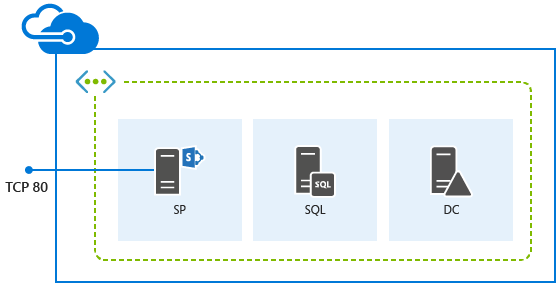
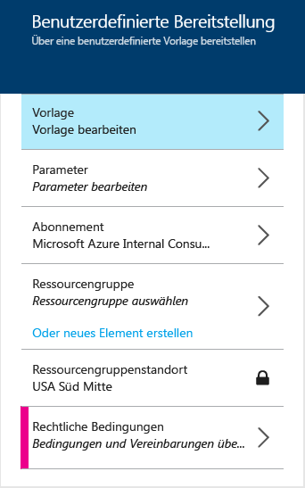
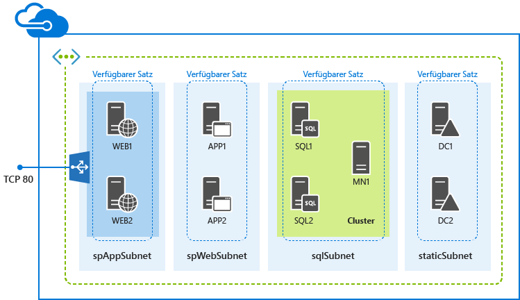

<properties
	pageTitle="Bereitstellen von SharePoint-Farmen mit ARM-Vorlagen | Microsoft Azure"
	description="Mit Ressourcen-Manager-Vorlagen und dem Azure-Portal, Azure PowerShell oder der Azure-Befehlszeilenschnittstelle können Sie ganz einfach eine SharePoint-Farm mit 3 oder 9 Servern bereitstellen."
	services="virtual-machines"
	documentationCenter=""
	authors="JoeDavies-MSFT"
	manager="timlt"
	editor=""
	tags="azure-resource-manager"/>

<tags
	ms.service="virtual-machines"
	ms.workload="infrastructure-services"
	ms.tgt_pltfrm="vm-windows-sharepoint"
	ms.devlang="na"
	ms.topic="hero-article"
	ms.date="10/20/2015"
	ms.author="josephd"/>

# Bereitstellen von SharePoint-Farmen mit Azure-Ressourcen-Manager-Vorlagen

[AZURE.INCLUDE [learn-about-deployment-models](../../includes/learn-about-deployment-models-rm-include.md)]Klassisches Bereitstellungsmodell. Sie können diese Ressource nicht mit dem klassischen Bereitstellungsmodell erstellen.

Folgen Sie den Anweisungen in diesem Artikel, um mithilfe von Ressourcen-Manager-Vorlagen eine neue SharePoint Server 2013-Farm mit drei oder neun Servern bereitzustellen.

## Bereitstellen einer SharePoint-Farm mit drei Servern

Bei einer einfachen SharePoint Server 2013-Farm werden mit einer Ressourcen-Manager-Vorlage drei virtuelle Computer in einem neuen virtuellen Netzwerk in drei unterschiedlichen Subnetzen erstellt.

Sie können die Vorlage mit dem Azure-Vorschauportal, mit Azure PowerShell oder der Azure-Befehlszeilenschnittstelle ausführen.

> [AZURE.NOTE]Sie können diese Konfiguration auch mit dem Element [SharePoint 2013 non-HA Farm](https://azure.microsoft.com/marketplace/partners/sharepoint2013/sharepoint2013farmsharepoint2013-nonha/) im Azure Marketplace des Azure-Vorschauportals erstellen.

### Azure-Vorschauportal

Wenn Sie diese Workload mit einer Ressourcen-Manager-Vorlage und dem Azure-Vorschauportal bereitstellen möchten, klicken Sie [hier](https://portal.azure.com/#create/Microsoft.Template/uri/https%3A%2F%2Fraw.githubusercontent.com%2FAzure%2Fazure-quickstart-templates%2Fmaster%2Fsharepoint-three-vm%2Fazuredeploy.json).

1.	Klicken Sie auf **Parameter**. Geben Sie im Bereich **Parameter** neue Werte ein, wählen Sie aus den zulässigen Werten aus, oder übernehmen Sie die Standardwerte. Klicken Sie dann auf **OK**.
2.	Klicken Sie bei Bedarf auf **Abonnement**, und wählen Sie das richtige Azure-Abonnement aus.
3.	Klicken Sie auf **Ressourcengruppe**, und wählen Sie eine vorhandene Ressourcengruppe aus. Sie können auch auf **Oder neu erstellen** klicken, um eine neue Ressourcengruppe für diese Workload zu erstellen.
4.	Sofern erforderlich, klicken Sie auf **Ressourcengruppenstandort**, und wählen Sie den richtigen Azure-Standort aus.
6.	Klicken Sie ggf. auf **Rechtliche Bedingungen**, um die Nutzungsbedingungen für die Vorlage zu lesen, und klicken Sie dann auf **Kaufen**.
7.	Klicken Sie auf **Erstellen**.

Je nach Vorlage kann es einige Zeit dauern, bis der Workload in Azure erstellt ist. Nach Abschluss dieses Vorgangs verfügen Sie über eine neue SharePoint-Farm mit drei Servern in der vorhandenen oder neuen Ressourcengruppe.

### Azure PowerShell

> [AZURE.NOTE]Dieser Artikel enthält Befehle für die Vorschau für Azure PowerShell 1.0. Ersetzen Sie zum Ausführen dieser Befehle in Azure PowerShell 0.9.8 und früheren Versionen **New-AzureRMResourceGroup** durch **New-AzureResourceGroup** und **New-AzureResourceGroupDeployment** durch **New-AzureResourceGroupDeployment**. Fügen Sie zudem den Befehl **Switch-AzureMode AzureResourceManager** vor dem Befehl **New-AzureResourceGroup** hinzu. Weitere Informationen finden Sie unter [Vorschau für Azure PowerShell 1.0](https://azure.microsoft.com/blog/azps-1-0-pre/).

Geben Sie einen Namen für die Azure-Bereitstellung, einen Namen für die neue Ressourcengruppe und den Standort eines Azure-Rechenzentrums in die folgenden Befehle ein. Entfernen Sie alles innerhalb der Anführungszeichen, einschließlich der Zeichen < and >.

	$deployName="<deployment name>"
	$RGName="<resource group name>"
	$locName="<Azure location, such as West US>"
	$templateURI="https://raw.githubusercontent.com/Azure/azure-quickstart-templates/master/sharepoint-three-vm/azuredeploy.json"
	New-AzureRMResourceGroup -Name $RGName -Location $locName
	New-AzureRMResourceGroupDeployment -Name $deployName -ResourceGroupName $RGName -TemplateUri $templateURI

Beispiel:

	$deployName="TestDeployment"
	$RGName="TestRG"
	$locname="West US"
	$templateURI="https://raw.githubusercontent.com/Azure/azure-quickstart-templates/master/sharepoint-three-vm/azuredeploy.json"
	New-AzureRMResourceGroup -Name $RGName -Location $locName
	New-AzureRMResourceGroupDeployment -Name $deployName -ResourceGroupName $RGName -TemplateUri $templateURI

Führen Sie anschließend den Befehlsblock in der Azure PowerShell-Eingabeaufforderung aus.

Beim Ausführen des Befehls **New-AzureRMResourceGroupDeployment** werden Sie aufgefordert, die Werte für eine Reihe von Parametern anzugeben. Sobald Sie alle Parameterwerte angegeben haben, werden die virtuellen Computer von **New-AzureRMResourceGroupDeployment** erstellt und konfiguriert.

Nachdem die Vorlage vollständig ausgeführt wurde, verfügen Sie über eine neue SharePoint-Farm mit drei Servern in der neuen Ressourcengruppe.

### Azure-Befehlszeilenschnittstelle

Stellen Sie zunächst sicher, dass die richtige Version von Azure-Befehlszeilenschnittstelle installiert ist, dass Sie angemeldet sind und zum neuen Ressourcen-Manager-Modus gewechselt sind. Nähere Informationen finden Sie [hier](virtual-machines-deploy-rmtemplates-azure-cli.md#getting-ready).

Erstellen Sie zunächst eine neue Ressourcengruppe. Geben Sie mit dem folgenden Befehl den Namen der Gruppe und den Standort des Azure-Rechenzentrums für die Bereitstellung an.

	azure group create <group name> <location>

Als Nächstes verwenden Sie den folgenden Befehl, um den Namen der neuen Ressourcengruppe und den Namen einer Azure-Bereitstellung anzugeben.

	azure group deployment create --template-uri https://raw.githubusercontent.com/Azure/azure-quickstart-templates/master/sharepoint-three-vm/azuredeploy.json <group name> <deployment name>

Beispiel:

	azure group create sp3serverfarm eastus2
	azure group deployment create --template-uri https://raw.githubusercontent.com/Azure/azure-quickstart-templates/master/sharepoint-three-vm/azuredeploy.json sp3serverfarm spdevtest

Beim Ausführen des Befehls **azure group deployment create** werden Sie aufgefordert, die Werte für eine Reihe von Parametern anzugeben. Sobald Sie alle Parameterwerte angegeben haben, werden die virtuellen Computer von Azure erstellt und konfiguriert.

Sie verfügen nun über eine neue SharePoint-Farm mit drei Servern in der neuen Ressourcengruppe.

## Bereitstellen einer SharePoint-Farm mit neun Servern

Bei einer SharePoint Server 2013-Farm mit hoher Verfügbarkeit werden mit einer Ressourcen-Manager-Vorlage neun virtuelle Computer in einem neuen virtuellen Netzwerk in vier unterschiedlichen Subnetzen erstellt.

> [AZURE.NOTE]Sie können diese Konfiguration auch mit dem Element [SharePoint 2013 HA Farm](https://azure.microsoft.com/marketplace/partners/sharepoint2013/sharepoint2013farmsharepoint2013-ha/) im Azure Marketplace des Azure-Vorschauportals erstellen.

### Azure-Vorschauportal

Wenn Sie diese Workload mit einer Ressourcen-Manager-Vorlage und dem Azure-Vorschauportal bereitstellen möchten, klicken Sie [hier](https://portal.azure.com/#create/Microsoft.Template/uri/https%3A%2F%2Fraw.githubusercontent.com%2FAzure%2Fazure-quickstart-templates%2Fmaster%2Fsharepoint-server-farm-ha%2Fazuredeploy.json).

1.	Klicken Sie auf **Parameter**. Geben Sie im Bereich **Parameter** neue Werte ein, wählen Sie aus den zulässigen Werten aus, oder übernehmen Sie die Standardwerte. Klicken Sie dann auf **OK**.
2.	Klicken Sie bei Bedarf auf **Abonnement**, und wählen Sie das richtige Azure-Abonnement aus.
3.	Klicken Sie auf **Ressourcengruppe**, und wählen Sie eine vorhandene Ressourcengruppe aus. Sie können auch auf **Oder neu erstellen** klicken, um eine neue Ressourcengruppe für diese Workload zu erstellen.
4.	Sofern erforderlich, klicken Sie auf **Ressourcengruppenstandort**, und wählen Sie den richtigen Azure-Standort aus.
5.	Klicken Sie ggf. auf **Rechtliche Bedingungen**, um die Nutzungsbedingungen für die Vorlage zu lesen, und klicken Sie dann auf **Kaufen**.
6.	Klicken Sie auf **Erstellen**.

Je nach Vorlage kann es einige Zeit dauern, bis der Workload in Azure erstellt ist. Nach Abschluss dieses Vorgangs verfügen Sie über eine neue SharePoint-Farm mit neun Servern in der vorhandenen oder neuen Ressourcengruppe.

### Azure PowerShell

> [AZURE.NOTE]Dieser Artikel enthält Befehle für die Vorschau für Azure PowerShell 1.0. Ersetzen Sie zum Ausführen dieser Befehle in Azure PowerShell 0.9.8 und früheren Versionen **New-AzureRMResourceGroup** durch **New-AzureResourceGroup** und **New-AzureResourceGroupDeployment** durch **New-AzureResourceGroupDeployment**. Fügen Sie zudem den Befehl **Switch-AzureMode AzureResourceManager** vor dem Befehl **New-AzureResourceGroup** hinzu. Weitere Informationen finden Sie unter [Vorschau für Azure PowerShell 1.0](https://azure.microsoft.com/blog/azps-1-0-pre/).

Geben Sie einen Namen für die Azure-Bereitstellung, einen Namen für die neue Ressourcengruppe und den Standort eines Azure-Rechenzentrums in die folgenden Befehle ein. Entfernen Sie alles innerhalb der Anführungszeichen, einschließlich der Zeichen < and >.

	$deployName="<deployment name>"
	$RGName="<resource group name>"
	$locName="<Azure location, such as West US>"
	$templateURI="https://raw.githubusercontent.com/Azure/azure-quickstart-templates/master/sharepoint-server-farm-ha/azuredeploy.json"
	New-AzureRMResourceGroup -Name $RGName -Location $locName
	New-AzureRMResourceGroupDeployment -Name $deployName -ResourceGroupName $RGName -TemplateUri $templateURI

Beispiel:

	$deployName="TestDeployment"
	$RGName="TestRG"
	$locname="West US"
	$templateURI="https://raw.githubusercontent.com/Azure/azure-quickstart-templates/master/sharepoint-server-farm-ha/azuredeploy.json"
	New-AzureRMResourceGroup -Name $RGName -Location $locName
	New-AzureRMResourceGroupDeployment -Name $deployName -ResourceGroupName $RGName -TemplateUri $templateURI

Führen Sie anschließend den Befehlsblock in der Azure PowerShell-Eingabeaufforderung aus.

Beim Ausführen des Befehls **New-AzureRMResourceGroupDeployment** werden Sie aufgefordert, die Werte für eine Reihe von Parametern anzugeben. Sobald Sie alle Parameterwerte angegeben haben, werden die virtuellen Computer von **New-AzureRMResourceGroupDeployment** erstellt und konfiguriert.

Nachdem die Vorlage vollständig ausgeführt wurde, verfügen Sie über eine neue SharePoint-Farm mit neun Servern in der neuen Ressourcengruppe.

### Azure-Befehlszeilenschnittstelle

Stellen Sie zunächst sicher, dass die richtige Version von Azure-Befehlszeilenschnittstelle installiert ist, dass Sie angemeldet sind und zum neuen Ressourcen-Manager-Modus gewechselt sind. Nähere Informationen finden Sie [hier](virtual-machines-deploy-rmtemplates-azure-cli.md#getting-ready).

Erstellen Sie zunächst eine neue Ressourcengruppe: Geben Sie mit dem folgenden Befehl den Namen der Gruppe und den Standort des Azure-Rechenzentrums für die Bereitstellung an.

	azure group create <group name> <location>

Als Nächstes verwenden Sie den folgenden Befehl, um den Namen der neuen Ressourcengruppe und den Namen einer Azure-Bereitstellung anzugeben.

	azure group deployment create --template-uri https://raw.githubusercontent.com/Azure/azure-quickstart-templates/master/sharepoint-server-farm-ha/azuredeploy.json <group name> <deployment name>

Beispiel:

	azure group create sphaserverfarm eastus2
	azure group deployment create --template-uri https://raw.githubusercontent.com/Azure/azure-quickstart-templates/master/sharepoint-server-farm-ha/azuredeploy.json sphaserverfarm spdevtest

Beim Ausführen des Befehls **azure group deployment create** werden Sie aufgefordert, die Werte für eine Reihe von Parametern anzugeben. Sobald Sie alle Parameterwerte angegeben haben, werden die virtuellen Computer von Azure erstellt und konfiguriert.

Nachdem die Vorlage vollständig ausgeführt wurde, verfügen Sie über eine neue SharePoint Server 2013-Farm mit neun Servern in der neuen Ressourcengruppe.

## Zusätzliche Ressourcen

[In Azure-Infrastrukturdiensten gehostete SharePoint-Farmen](virtual-machines-sharepoint-infrastructure-services.md)

[Bereitstellen und Verwalten von virtuellen Computern mit Azure-Ressourcen-Manager-Vorlagen und Azure PowerShell](virtual-machines-deploy-rmtemplates-powershell.md)

[Azure Compute-, Network- und Storage-Anbieter unter dem Azure-Ressourcen-Manager](virtual-machines-azurerm-versus-azuresm.md)

[Übersicht über den Azure-Ressourcen-Manager](../resource-group-overview.md)

[Bereitstellen und Verwalten von virtuellen Computern mit Azure Resource Manager-Vorlagen und der Azure-CLI](virtual-machines-deploy-rmtemplates-azure-cli.md)

[Dokumentation zu virtuellen Computern](http://azure.microsoft.com/documentation/services/virtual-machines/)

[Installieren und Konfigurieren von Azure PowerShell](../install-configure-powershell.md)

<!---HONumber=Oct15_HO4-->