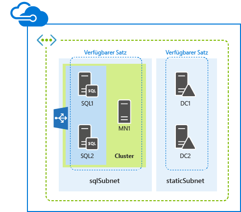
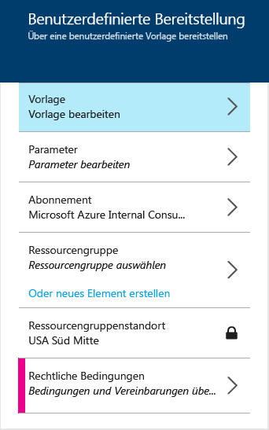

<properties
	pageTitle="SQL Server AlwaysOn mit einer Azure-Ressourcen-Manager-Vorlage | Microsoft Azure"
	description="Mit einer Ressourcen-Manager-Vorlage und dem Azure-Vorschauportal, Azure PowerShell oder der Azure-Befehlszeilenschnittstelle können Sie ganz einfach fünf Server für die Unterstützung von SQL Server AlwaysOn bereitstellen."
	services="virtual-machines"
	documentationCenter=""
	authors="davidmu1"
	manager="timlt"
	editor=""
	tags="azure-resource-manager"/>

<tags
	ms.service="virtual-machines"
	ms.workload="infrastructure-services"
	ms.tgt_pltfrm="vm-windows-sql-server"
	ms.devlang="na"
	ms.topic="hero-article"
	ms.date="10/08/2015"
	ms.author="davidmu"/>

# Bereitstellen von SQL Server AlwaysOn mit einer Azure-Ressourcen-Manager-Vorlage

[AZURE.INCLUDE [learn-about-deployment-models](../../includes/learn-about-deployment-models-rm-include.md)]Klassisches Bereitstellungsmodell. Sie können diese Ressource nicht mit dem klassischen Bereitstellungsmodell erstellen.

Folgen Sie den Anweisungen in diesem Artikel, um SQL Server AlwaysOn mit einer Azure-Ressourcen-Manager-Vorlage bereitzustellen. Mit dieser Vorlage werden fünf virtuelle Computer in einem neuen virtuellen Netzwerk in zwei verschiedenen Subnetzen erstellt.

Sie können die Vorlage mit dem Azure-Vorschauportal, mit Azure PowerShell oder der Azure-Befehlszeilenschnittstelle ausführen.

## Azure-Vorschauportal

Wenn Sie diesen Workload mit einer Azure-Ressourcen-Manager-Vorlage und dem Azure-Vorschauportal bereitstellen möchten, klicken Sie [hier](https://portal.azure.com/#create/Microsoft.Template/uri/https%3A%2F%2Fraw.githubusercontent.com%2FAzure%2Fazure-quickstart-templates%2Fmaster%2Fsql-server-2014-alwayson-dsc%2Fazuredeploy.json).

1.	Klicken Sie im Bereich **Vorlage** auf **Speichern**.
2.	Klicken Sie auf **Parameter**. Geben Sie im Bereich **Parameter** neue Werte ein, wählen Sie aus den zulässigen Werten aus, oder übernehmen Sie die Standardwerte. Klicken Sie dann auf **OK**.
3.	Klicken Sie bei Bedarf auf **Abonnement**, und wählen Sie das richtige Azure-Abonnement aus.
4.	Klicken Sie auf **Ressourcengruppe**, und wählen Sie eine vorhandene Ressourcengruppe aus. Sie können auch auf **Oder neu erstellen** klicken, um einen neuen Trigger für diesen Workload zu erstellen.
5.	Sofern erforderlich, klicken Sie auf **Ressourcengruppenstandort**, und wählen Sie den richtigen Azure-Standort aus.
6.	Klicken Sie ggf. auf **Rechtliche Bedingungen**, um die Nutzungsbedingungen für die Vorlage zu lesen.
7.	Klicken Sie auf **Erstellen**.

Je nach Vorlage kann es einige Zeit dauern, bis der Workload in Azure erstellt ist. Wenn die Ausführung der Vorlage abgeschlossen ist, verfügen Sie über eine neue SQL Server AlwaysOn-Konfiguration mit fünf Servern in der vorhandenen oder neuen Ressourcengruppe.

## Azure PowerShell

[AZURE.INCLUDE [powershell-preview](../../includes/powershell-preview-inline-include.md)]

Geben Sie einen Namen für die Azure-Bereitstellung, einen Namen für die neue Ressourcengruppe und den Standort eines Azure-Rechenzentrums in die folgenden Befehle ein. Entfernen Sie alles innerhalb der Anführungszeichen, einschließlich der Zeichen < and >.

	$deployName="<deployment name>"
	$RGName="<resource group name>"
	$locName="<Azure location, such as West US>"
	$templateURI="https://raw.githubusercontent.com/Azure/azure-quickstart-templates/master/sql-server-2014-alwayson-dsc/azuredeploy.json"
	New-AzureRmResourceGroup -Name $RGName -Location $locName
	New-AzureRmResourceGroupDeployment -Name $deployName -ResourceGroupName $RGName -TemplateUri $templateURI

Beispiel:

	$deployName="TestDeployment"
	$RGName="TestRG"
	$locname="West US"
	$templateURI="https://raw.githubusercontent.com/Azure/azure-quickstart-templates/master/sql-server-2014-alwayson-dsc/azuredeploy.json"
	New-AzureRmResourceGroup -Name $RGName -Location $locName
	New-AzureRmResourceGroupDeployment -Name $deployName -ResourceGroupName $RGName -TemplateUri $templateURI

Führen Sie anschließend den Befehlsblock in der Azure PowerShell-Eingabeaufforderung aus.

Beim Ausführen des Befehls **New-AzureRmResourceGroupDeployment** werden Sie aufgefordert, die Werte für eine Reihe von Parametern anzugeben. Sobald Sie alle Parameterwerte angegeben haben, werden die virtuellen Computer von **New-AzureRmResourceGroupDeployment** erstellt und konfiguriert.

Wenn die Ausführung der Vorlage abgeschlossen ist, verfügen Sie über eine neue SQL Server AlwaysOn-Konfiguration mit fünf Servern in der neuen Ressourcengruppe.

## Azure-Befehlszeilenschnittstelle

Stellen Sie zunächst sicher, dass die richtige Version von Azure-Befehlszeilenschnittstelle installiert ist, dass Sie angemeldet sind und zum neuen Ressourcen-Manager-Modus gewechselt sind. Nähere Informationen finden Sie [hier](virtual-machines-deploy-rmtemplates-azure-cli.md#getting-ready).

Erstellen Sie zunächst eine neue Ressourcengruppe. Geben Sie mit dem folgenden Befehl den Namen der Gruppe und den Standort des Azure-Rechenzentrums für die Bereitstellung an.

	azure group create <group name> <location>

Als Nächstes verwenden Sie den folgenden Befehl, um den Namen der neuen Ressourcengruppe und den Namen einer Azure-Bereitstellung anzugeben.

	azure group deployment create --template-uri https://raw.githubusercontent.com/Azure/azure-quickstart-templates/master/sql-server-2014-alwayson-dsc/azuredeploy.json <group name> <deployment name>

Beispiel:

	azure group create sqlao eastus2
	azure group deployment create --template-uri https://raw.githubusercontent.com/Azure/azure-quickstart-templates/master/sql-server-2014-alwayson-dsc/azuredeploy.json sqlao sqldevtest

Beim Ausführen des Befehls **azure group deployment create** werden Sie aufgefordert, die Werte für eine Reihe von Parametern anzugeben. Sobald Sie alle Parameterwerte angegeben haben, werden die virtuellen Computer von Azure erstellt und konfiguriert.

Wenn die Ausführung der Vorlage abgeschlossen ist, verfügen Sie über eine neue SQL Server AlwaysOn-Konfiguration mit fünf Servern in der neuen Ressourcengruppe.

## Zusätzliche Ressourcen

[Bereitstellen und Verwalten von virtuellen Computern mit Azure-Ressourcen-Manager-Vorlagen und Azure PowerShell](virtual-machines-deploy-rmtemplates-powershell.md)

[Azure Compute-, Network- und Storage-Anbieter unter dem Azure-Ressourcen-Manager](virtual-machines-azurerm-versus-azuresm.md)

[Übersicht über den Azure-Ressourcen-Manager](../resource-group-overview.md)

[Bereitstellen und Verwalten von virtuellen Computern mit Azure-Ressourcen-Manager-Vorlagen und der Azure-CLI](virtual-machines-deploy-rmtemplates-azure-cli.md)

[Dokumentation zu virtuellen Computern](http://azure.microsoft.com/documentation/services/virtual-machines/)

[Installieren und Konfigurieren von Azure PowerShell](../install-configure-powershell.md)

<!---HONumber=Oct15_HO4-->