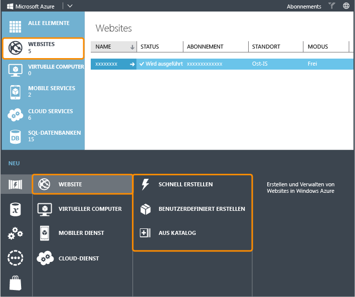
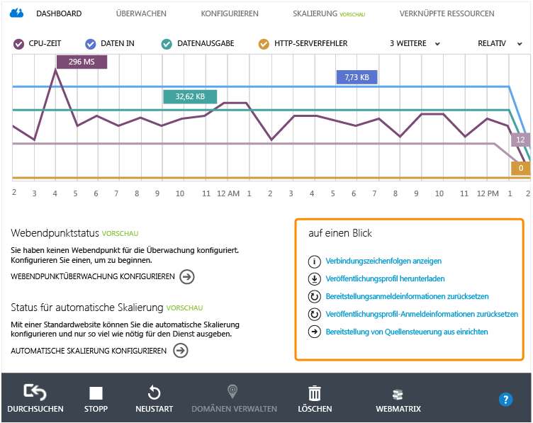
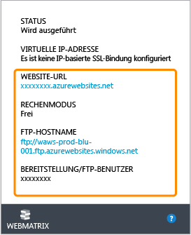
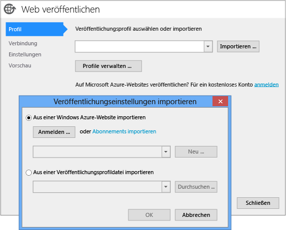
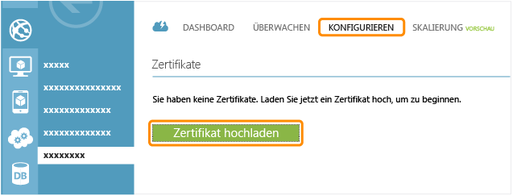
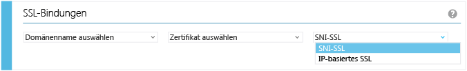
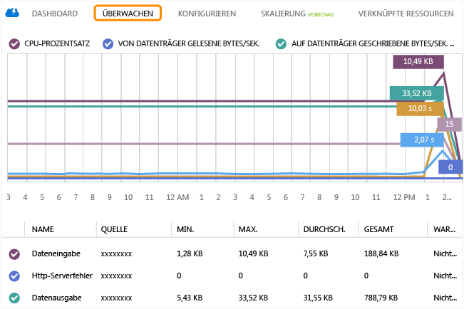
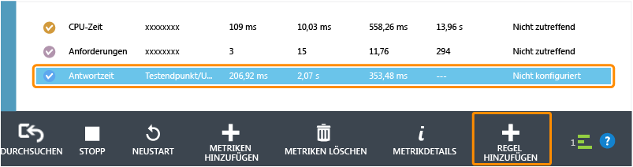
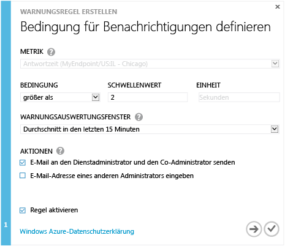

<properties linkid="websites-global-web-presence" urlDisplayName="Create a Global Web Presence on Azure Web Sites" pageTitle="Create a Global Web Presence on Azure Web Sites" metaKeywords="" description="This guide provides a technical overview of how to host your organization's (.COM) site on Azure Web Sites. This includes deployment, custom domains, SSL, and monitoring." metaCanonical="http://www.windowsazure.com/en-us/documentation/articles/web-sites-global-web-presence-solution-overview/" services="" documentationCenter="" title="Create a Global Web Presence on Azure Web Sites" authors="jroth" solutions="" manager="paulettm" editor="mollybos" />

Erstellen einer globalen Webpräsenz auf Azure-Websites
======================================================

Dieser Leitfaden bietet einen technischen Überblick über das Hosten der Organisationswebsite (.com) auf Azure. Ein solches Szenario wird auch als globale Webpräsenz bezeichnet. In diesem Leitfaden steht der Einsatz von [Azure-Websites](/en-us/documentation/services/web-sites/) im Vordergrund, da Websites der einfachste und schnellste Weg sind, um eine Webanwendung auf Azure zu erstellen, zu migrieren, zu skalieren und zu verwalten. Einige Anwendungsanforderungen sind jedoch besser für [Azure Cloud Services](/en-us/documentation/services/cloud-services/) oder [Azure Virtual Machines](/en-us/documentation/services/virtual-machines/) mit IIS geeignet. Diese Anwendungen sind ebenfalls gut zum Hosten von Webanwendungen geeignet. Wenn Sie sich noch in der anfänglichen Planungsphase befinden, lesen Sie das Dokument [Azure-Websites, Cloud Services und VMs: Wann eignet sich welche Komponente?](/en-us/manage/services/web-sites/choose-web-app-service). Wenn nicht die Notwendigkeit besteht, Cloud Services oder Virtual Machines zu verwenden, empfehlen wir zum Hosten der globalen Webpräsenz den Einsatz von Websites. In diesem Dokument erhalten Sie Anweisungen für das Verwenden von Websites in einem solchen Szenario.

In diesem Leitfaden werden die folgenden Themen behandelt:

-   [Erstellen einer Azure-Website](#createwebsite)
-   [Bereitstellen der Website](#deploywebsite)
-   [Hinzufügen einer benutzerdefinierten Domäne](#customdomain)
-   [Sichern der Website mit SSL](#ssl)
-   [Überwachen der Website](#monitor)

**Hinweis**

In diesem Leitfaden werden einige der häufigsten Themen und Aufgaben vorgestellt, die mit der öffentlichen .COM-Websiteentwicklung abgestimmt werden. Azure-Websites bieten jedoch noch weitere Funktionen, die Sie in Ihrer speziellen Implementierung nutzen können. Diese Funktionen werden in den Leitfäden zu [digitalen Marketingkampagnen](http://www.windowsazure.com/en-us/manage/services/web-sites/digital-marketing-campaign-solution-overview) und [Geschäftsanwendungen](http://www.windowsazure.com/en-us/manage/services/web-sites/business-application-solution-overview) beschrieben.

Erstellen einer Azure-Website
-----------------------------

Über das Azure-Verwaltungsportal können Sie auf verschiedene Weise eine neue Azure-Website erstellen. Wenn Sie am unteren Rand des Portals auf **Neu** klicken, wird das folgende Dialogfeld angezeigt:

Es gibt drei Möglichkeiten, um eine neue Website zu erstellen: **Schnellerfassung**, **Benutzerdefiniert erstellen** und **From Gallery**. Bei jeder dieser Option sollten Sie eine Azure-Region wählen, der die Mehrheit Ihrer Benutzerbasis angehört.

Wenn Sie eine bestehende Website migrieren, können Sie mit der Option **Benutzerdefiniert erstellen** eine SQL-Datenbank oder MySQL-Datenbank erstellen oder zuweisen. Diese Option bietet Ihnen auch die Möglichkeit, verschiedene Quellcodeverwaltungsoptionen für die Bereitstellung anzugeben, z. B. GitHub oder Team Foundation Server (TFS). Wenn Sie Ihre Website mit einer Quellcodeverwaltungsmethode verwalten, ist dies ein schneller Weg, um Ihre Azure-Website für die Bereitstellung einzurichten.

Mit der Option **From Gallery** können Sie eine neue Website mit einem von verschiedenen Frameworks, wie Drupal oder WordPress, einrichten. Dies ist z. B. nützlich, um eine neue Website schnell einzurichten, die Sie dann im gewählten Framework anpassen können.

Wie bei den meisten Services in Azure müssen Sie auch für die neue Website eine Azure-Region auswählen. Azure verfügt über mehrere Regionen rund auf der ganzen Welt. Sobald Sie Ihre Website in einer Region bereitgestellt haben, kann sie global im Internet aufgerufen werden. Mehrere Regionen bieten jedoch eine größere Flexibilität. Ein naheliegender Vorteil ist die Bereitstellung von Websites in Regionen, die Ihren Benutzern am nächsten sind.

Detaillierte Schritte zum Erstellen einer neuen Website finden Sie unter [Erstellen und Bereitstellen einer Website](/en-us/manage/services/web-sites/how-to-create-websites/).

Bereitstellen der Website
-------------------------

Es gibt verschiedene Wege, um Ihre Website auf Azure bereitstellen. Wenn Sie ein Framework aus der Galerie ausgewählt haben, wurde bereits eine Starter-Site bereitgestellt. Um jedoch Fortschritte verzeichnen zu können, müssen Sie einen Bearbeitungs- und Bereitstellungsablauf aufstellen. Zu den Bereitstellungsoptionen gehören u. a. folgende:

-   Verwenden eines FTP-Clients
-   Bereitstellen aus der Quellcodeverwaltung
-   Veröffentlichen mit Visual Studio
-   Veröffentlichen mit [WebMatrix](http://www.microsoft.com/web/webmatrix/)

Jede dieser Option hat ihre eigenen Stärken. Die Möglichkeit, neue Dateien von einem FTP-Client aus mittels Push auf Ihrer Website zu veröffentlichen, ist eine einfache und direkte Lösung. Das bedeutet auch, dass alle vorhandenen Veröffentlichungstools und -prozesse, die FTP nutzen, weiterhin mit Azure-Websites arbeiten können. Die Quellcodeverwaltung bietet optimale Kontrolle über Veröffentlichungen von Websiteinhalten, da Änderungen verfolgt, veröffentlicht und bei Bedarf auf frühere Versionen zurückgesetzt werden können. Die Optionen für eine direkte Veröffentlichung mit Visual Studio oder WebMatrix erleichtern die Arbeit für Entwickler, die mit diesen Tools arbeiten. Diese Funktion ist u. a. in der Anfangsphase eines Projekts oder für die Prototyperstellung nützlich. In beiden Fällen lassen sich häufige Veröffentlichungs- und Testvorgänge potenziell leichter aus der Entwicklungsumgebung heraus durchführen.

Viele der hier aufgeführten Bereitstellungsaufgaben beinhalten die Nutzung von Informationen im Azure-Verwaltungsportal. Gehen Sie zur Website, wählen Sie die Registerkarte **Dashboard**, und gehen Sie dann zum Abschnitt **Auf einen Blick**. Der folgende Screenshot zeigt verschiedene Optionen.

Einige Quellcodeverwaltungstools und FTP-Clients erfordern für den Zugriff einen Benutzernamen und ein Kennwort. Für eine neue Website werden nicht automatisch Anmeldeinformationen erstellt. Sie können sie jedoch mühelos anlegen. Klicken Sie dazu auf **Anmeldeinformationen für die Bereitstellung zurücksetzen**. Danach können Sie jeden FTP-Client verwenden, um Ihre Website mit diesen Anmeldeinformationen zusammen mit dem **FTP-Hostname** auf der gleichen **Dashboard**-Seite bereitzustellen.

Beachten Sie, dass der Bereitstellungs-/FTP-Benutzername eine Kombination aus Websitename und dem von Ihnen angegebenen Benutzernamen ist. Bei der Website "http://contoso.azurewebsite.net" und dem Benutzernamen "eigenerBenutzer" lautet der Benutzername für die Bereitstellung und das FTP "contoso\\eigenerBenutzer".

Sie können sich auch dazu entschließen, die Website über einen Quellcodeverwaltungsservice wie GitHub oder TFS Online bereitzustellen. Klicken Sie auf die Option **Bereitstellung über Quellcodeverwaltung einrichten**. Befolgen Sie dann die Anweisungen des gewählten Quellcodeverwaltungssystems oder -services. Schrittweise Anweisungen für die Veröffentlichung von einem lokalen Git-Repository finden Sie unter [Veröffentlichen aus der Quellcodeverwaltung auf Azure-Websites](/en-us/develop/net/common-tasks/publishing-with-git/).

Wenn Sie Ihre Website mit Visual Studio erstellen und verwalten möchten, können Sie Inhalte auch direkt aus Visual Studio heraus veröffentlichen. Eine Methode besteht darin, auf die Option **Veröffentlichungsprofil herunterladen** zu klicken. Auf diese Weise, können Sie eine publishsettings-Datei speichern, die für das Webpublishing in Visual Studio importiert werden kann.

**Hinweis**

Bewahren Sie die Datei *publishsettings* sicher und außerhalb der Quellcodeverwaltung auf, denn sie enthält die Benutzernamen und Kennwörter für die Bereitstellung sowie für verknüpfte Datenbank-Verbindungszeichenfolgen.

Sie können die Abonnementinformationen auch direkt in Visual Studio importieren. Nehmen Sie beispielsweise ein lokales ASP.NET-Projekt in Visual Studio. Klicken Sie mit der rechten Maustaste auf das Webprojekt, und wählen Sie **Veröffentlichen** aus. Mithilfe der Schaltfläche **Importieren** im Dialogfeld **Web veröffentlichen** können Sie eine Datei, die Ihre Azure-Abonnementeinstellungen enthält, oder die publishsettings-Datei importieren, die Sie vom Websites-Dashboard heruntergeladen haben. Der folgende Screenshot zeigt diese Optionen.

Weitere Informationen über das Veröffentlichen auf Azure aus Visual Studio finden Sie unter "Bereitstellen einer ASP.NET-Webanwendung für eine Azure-Website".

Eine weitere Option, mit der Sie Websites aus dem Azure-Verwaltungsportal entwickeln und bereitstellen können, ist WebMatrix.

Weitere Informationen über diese Option finden Sie unter [Entwickeln und Bereitstellen einer Website mit Microsoft WebMatrix](/en-us/develop/net/tutorials/get-started/).

Auch wenn diese Schritte Ihnen das zur Hand geben, was Sie zum Bereitstellung Ihrer .COM-Website benötigen, sollten Sie dennoch einen Plan für die Verwaltung des laufenden Zyklus zur Inhaltsveröffentlichung aufstellen. Die Optionen können vom Bereitstellen einer benutzerdefinierten Lösung, über die regelmäßige erneute Bereitstellung für eine sich häufig ändernde Website bis hin zu einem Content Management System (CMS) mit vollem Funktionsumfang reichen. Wenn Sie eine neue Website erstellen, sollten Sie beachten, dass es Optionen in der Galerie gibt, um bestehende CMS-Frameworks zu verwenden, z. B. [Drupal](https://drupal.org/) oder [Umbraco](http://umbraco.com/).

Hinzufügen einer benutzerdefinierten Domäne
-------------------------------------------

Wenn dies Ihre globale Webpräsenz ist, bietet es sich an, den registrierten Domänennamen der Website zuzuweisen. Es gibt viele Drittanbieter, die Domänenregistrierungsservices bieten. Jeder dieser Anbieter unterstützt die Erstellung von verschiedenen Arten an DNS-Datensätzen, um Ihre Domäne zu verwalten. Ein DNS-Datensatz hilft bei der Zuweisung einer benutzerfreundlichen URL, z. B. "www.contoso.com", zur tatsächlichen URL oder IP-Adresse, auf der die Website gehostet wird.

**Hinweis**

In der nachfolgenden Diskussion stehen zwei DNS-Datensatztypen im Mittelpunkt. Erstens, ein CNAME-Datensatz, der eine Umleitung von einer URL, z. B. "www.contoso.com", zu einer anderen URL, wie "contoso.azurewebsites.net", durchführen kann. Zweitens, ein A-Datensatz, der eine URL, wie "www.contoso.com", einer IP-Adresse, z. B. 172.16.48.1, zuweisen kann.

Für Azure-Websites müssen Sie zuerst einen CNAME-Datensatz zur Azure-Website erstellen. Diese Einstellung wird über die Registrierungsstellen-Website des Drittanbieters vorgenommen. Im Folgenden sehen Sie einen CNAME-Beispielsdatensatz.

<table data-morhtml="true" cellspacing="0" border="1">
<tr data-morhtml="true">
   <th data-morhtml="true" align="left" valign="top">Typ</th>
   <th data-morhtml="true" align="left" valign="top">Host</th>
   <th data-morhtml="true" align="left" valign="top">Antwort</th>
   <th data-morhtml="true" align="left" valign="top">TTL</th>
</tr>
<tr data-morhtml="true">
   <td data-morhtml="true" valign="top"><strong data-morhtml="true">CNAME</strong></td>
   <td data-morhtml="true" valign="top">www.contoso.com</td>
   <td data-morhtml="true" valign="top">contoso.azurewebsites.net</td>
   <td data-morhtml="true" valign="top">8000</td>
</tr>
</table>

Wenn Ihre Domäne neu registriert ist, kann es einen Tag oder länger dauern, bis die Domäne auf allen DNS-Server aufgelöst wird, die mit zwischengespeicherten DNS-Einträgen betrieben werden. Wenn Ihre Domäne jedoch bereits existiert, sollte die CNAME-Änderung innerhalb einer Minute durchgeführt werden. Beachten Sie, dass der CNAME-Datensatz eine Zuweisung zwischen Ihrer Domäne (die mit einem Unterdomänenalias wie "www" qualifiziert sein muss) und der Azure-Website-URL bietet. Der CNAME-Datensatz enthält weder am Anfang noch am Ende das Präfix "http://".

Überprüfen Sie im Azure-Verwaltungsportal auf der Registerkarte **Skalieren**, dass Sie den Modus **Freigegeben** oder **Standard** verwenden (benutzerdefinierte Domänen werden für **kostenlose** Websites nicht unterstützt). Gehen Sie dann zur Registerkarte **Konfigurieren**, und klicken Sie auf **Domänen verwalten**. Auf diese Weise können Sie die Website mit dem benutzerdefinierten Domänennamen verbinden.

Bevor Sie Ihre benutzerdefinierte Domäne in die Liste setzen, müssen Sie sich zuerst an Ihren DNS-Anbieter wenden und einen CNAME-Datensatz für Ihre benutzerdefinierte Domäne (www.contoso.com) erstellen, der auf die URL für Ihre Azure-Website (contoso.azurewebsites.net) verweist. Nach der Weitergabe können Sie die benutzerdefinierte Domäne in das im vorherigen Screenshot gezeigte Dialogfeld eingeben. Mit einem CNAME-Datensatz für www.contoso.com, der auf diese Website verweist, wird sichergestellt, dass Sie berechtigt sind, diesen Domänennamen mit dieser Website zu nutzen. Dann können Sie einen A-Datensatz mit der IP-Adresse am unteren Rand des Dialogfelds erstellen.

<table data-morhtml="true" cellspacing="0" border="1">
<tr data-morhtml="true">
   <th data-morhtml="true" align="left" valign="top">Typ</th>
   <th data-morhtml="true" align="left" valign="top">Host</th>
   <th data-morhtml="true" align="left" valign="top">Antwort</th>
   <th data-morhtml="true" align="left" valign="top">TTL</th>
</tr>
<tr data-morhtml="true">
   <td data-morhtml="true" valign="top"><strong data-morhtml="true">A</strong></td>
   <td data-morhtml="true" valign="top">contoso.com</td>
   <td data-morhtml="true" valign="top">172.16.48.1</td>
   <td data-morhtml="true" valign="top">8000</td>
</tr>
</table>

Weitere Informationen finden Sie unter [Konfigurieren eines benutzerdefinierten Domänennamens für eine Azure-Website](/en-us/develop/net/common-tasks/custom-dns-web-site/).

Sichern der Website mit SSL
---------------------------

Wenn Ihre Website schreibgeschützte Informationen enthält, müssen Sie keinen sicheren Zugriff zur Website einrichten. Wenn Sie jedoch Benutzerinformationen erfassen, E-Commerce betreiben oder andere vertrauliche Daten verwalten, sollten Sie die Website sichern. Sicherheit ist wichtiges Thema, doch in diesem Artikel können nicht alle bewährten Methoden und Techniken beschrieben werden. Der Vorgang zum Aktivieren von Secure Sockets Layer (SSL) für Ihre Website verdient jedoch besonderer Aufmerksamkeit. Mit SSL können Benutzer verschlüsselt und über HTTPS- anstelle von HTTP-Adressen eine Verbindung zu Ihrer Website herstellen. Für die Nutzung von SSL mit Azure-Website sind bestimmte Schritte erforderlich.

Azure-Websites stellen automatisch eine sichere Verbindung zur tatsächlichen Website-URL her. Bei der Website http://contoso.azurewebsites.net können Sie beispielsweise über SSL eine Verbindung herstellen, indem Sie "http" einfach in "https" ändern, d. h. **https**://contoso.azurewebsites.net.

Wenn Sie jedoch einen benutzerdefinierten Domänennamen verwenden, müssen Sie einige Schritte durchführen, um über das Azure-Verwaltungsportal Ihrer Website ein Zertifikat hochzuladen und SSL zu aktivieren. Die folgenden Schritte stellen eine Zusammenfassung dieses Verfahrens dar. Detaillierte Anweisungen finden Sie unter [Configuring an SSL certificate for an Azure web site](/en-us/develop/net/common-tasks/enable-ssl-web-site/) (Konfigurieren eines SSL-Zertifikats für eine Azure-Website, in englischer Sprache).

Besorgen Sie sich zuerst ein SSL-Zertifikat von einer Zertifizierungsstelle. Wenn Sie Ihre Domäne mit mehreren Unterdomänen sichern möchten (z. B. www.contoso.com und staging.contoso.com), müssen Sie ein Platzhalterzertifikat (\*.contoso.com) anfordern. Diese können etwas teurer sein, daher müssen Sie entscheiden, ob die Flexibilität dieses Zertifikatstyps die Kosten rechtfertigt.

Wenn Sie das Zertifikat von der Zertifizierungsstelle erhalten, können Sie es nicht einfach in demselben Format in Azure hochladen. Sie müssen mit dem Befehl "openssl" eine PFX-Datei generieren. Der Befehl "openssl" ist Teil des OpenSSL-Projekts. Der Quellcode wird über die [OpenSSL-Website](http://www.openssl.org/) verteilt; im Internet können Sie aber auch eine vorab kompilierte Version des Tools finden. Im folgenden Beispiel werden ein Zertifikat, myserver.crt, und die Datei mit privatem Schlüssel, myserver.key, verwendet, um eine PFX-Datei zu erstellen.

    openssl pkcs12 -export -out myserver.pfx -inkey myserver.key -in myserver.crt

Gehen Sie zum Hochladen des Zertifikats in Azure zur Registerkarte **Skalieren**, und überprüfen Sie, ob Sie den **Standard**-Modus verwenden. SSL für benutzerdefinierte Domänen wird nicht in den Modi **Kostenlos** oder **Freigegeben** unterstützt. Klicken Sie auf der Registerkarte **Konfigurieren** auf **Zertifikat hochladen**.

Weisen Sie dann im Abschnitt **SSL-Bindungen** das Zertifikat dem Domänennamen zu, den es sichert. Es gibt zwei Optionen für diese Zuweisung: "SNI SSL" und "IP-basierte SSL".

Die Option **IP-basierte SSL** ist der herkömmliche Weg, um die öffentliche dedizierte IP-Adresse dem Domänennamen zuzuweisen. Diese Option funktioniert mit allen Browsern. Die Option **SNI SSL** lässt es zu, dass mehrere Domänen sich die gleiche IP-Adresse teilen und doch unterschiedliche zugewiesene SSL-Zertifikate für jede Domäne haben. SNI SSL funktioniert nicht mit einigen älteren Browsern. (Weitere Informationen zur Kompatibilität finden Sie im [Wikipedia-Eintrag zu SNI SSL](http://en.wikipedia.org/wiki/Server_Name_Indication)). Für jedes SSL-Zertifikat fallen monatliche Gebühren (auf Stundenbasis) an, und die Preise variieren je nach Wahl von "IP-basierte SSL" oder "SNI SSL". Preisinformationen finden Sie in der [Websites-Preisübersicht](/en-us/pricing/details/web-sites/#service-ssl). Weitere Informationen zu diesem Prozess finden Sie unter [Configuring an SSL certificate for an Azure web site](/en-us/develop/net/common-tasks/enable-ssl-web-site/) (Konfigurieren eines SSL-Zertifikats für eine Azure-Website, in englischer Sprache).

Überwachen der Website
----------------------

Da Ihre Website Benutzeranforderungen aktiv verarbeitet, müssen Sie Überwachungsfunktionen verwenden. So ist es zum Beispiel wichtig zu wissen, ob die Benutzerauslastung eine hohe CPU-Zeit verursacht, was darauf hinweisen könnte, dass die Website skaliert werden muss. Leistungsschwächen der Anwendung können die Reaktionszeit verlängern oder zu Fehlern führen. Dieser Abschnitt befasst sich mit einigen der integrierten Überwachungsfunktionen des Azure-Verwaltungsportals.

Die Registerkarte **Überwachen** enthält einige wichtige Metriken für Ihre Website in Form von Diagrammen.

Sie können die Metriken in diesem Diagramm über die Schaltfläche "Metriken hinzufügen" anpassen.

Für Websites im **Standard**-Modus können Sie auch die Endpunktüberwachung und Warnungen aktivieren. Gehen Sie auf der Registerkarte **Konfigurieren** zum Abschnitt **Überwachung**, und konfigurieren Sie einen Endpunkt. Dieser Endpunkt wird von einem oder mehreren Standorten aus ausgeführt, die Sie festlegen, und versucht regelmäßig auf Ihre Website zuzugreifen. Dabei werden sowohl Zeit- als auch Fehlerinformationen erfasst.

Auf der Registerkarte **Überwachen** wird dieser Endpunkt mit Reaktionszeiten angezeigt. Wenn Sie die Endpunktmetrik auswählen, können Sie eine Warnungsregel hinzufügen, indem Sie auf das Symbol **Regel hinzufügen** klicken.

Dank dieser Regel werden Administratoren oder andere Verantwortliche per E-Mail darüber informiert, wenn die Reaktionszeit den festgelegten Schwellenwert überschreitet.

Wenn Sie feststellen, dass die Website skaliert werden muss, können Sie dies auf der Registerkarte **Skalieren** manuell oder mithilfe der Vorschau "Automatisch skalieren" durchführen. Die Registerkarte "Skalieren" bietet Optionen für eine Skalierung nach oben (größere dedizierte Computer) oder eine horizontale Skalierung (zusätzliche gemeinsam verwendete oder dedizierte Instanzen der gleichen Größe). Die Vorschau "Automatisch skalieren" unterstützt jedoch nur die horizontale Skalierung. Weitere Informationen zu dieser Option finden Sie im Abschnitt "Skalieren mit Benutzernachfrage" im Szenario [Digitale Marketingkampagne](/en-us/manage/services/web-sites/digital-marketing-campaign-solution-overview). Siehe auch [Überwachen von Websites](/en-us/manage/services/web-sites/how-to-monitor-websites/).

Zusammenfassung
---------------

Beim Erstellen der .COM-Website Ihrer Organisation bestehen die Standardaufgaben darin, ein Entwicklungs-Framework zu wählen, die Website zu erstellen und bereitzustellen, benutzerdefinierte Domänen zuzuweisen und die Website zu überwachen. Für Websites, die Benutzerdaten sichern müssen, wird SSL dringend empfohlen. Dieser Artikel bietet einen Überblick über diese Aufgaben mit Azure-Websites. Weitere Informationen finden Sie in den folgenden technischen Artikeln, auf die in diesem Artikel Bezug genommen wurde.

<table data-morhtml="true" cellspacing="0" border="1">
<tr data-morhtml="true">
   <th data-morhtml="true" align="left" valign="top">Bereich</th>
   <th data-morhtml="true" align="left" valign="top">Ressourcen</th>
</tr>
<tr data-morhtml="true">
   <td data-morhtml="true" valign="middle"><strong data-morhtml="true">Planen</strong></td>
   <td data-morhtml="true" valign="top">- <a data-morhtml="true" href="http://www.windowsazure.com/en-us/manage/services/web-sites/choose-web-app-service">Azure-Websites, Clouddienste und virtuelle Computer: Wann eignet sich welche Komponente?</a></td>
</tr>
<tr data-morhtml="true">
   <td data-morhtml="true" valign="middle"><strong data-morhtml="true">Erstellen</strong></td>
   <td data-morhtml="true" valign="top">- <a data-morhtml="true" href="http://www.windowsazure.com/en-us/manage/services/web-sites/how-to-create-websites/">Erstellen und Bereitstellen einer Website</a></td>
</tr>
<tr data-morhtml="true">
   <td data-morhtml="true" valign="middle"><strong data-morhtml="true">Bereitstellen</strong></td>
   <td data-morhtml="true" valign="top">- <a data-morhtml="true" href="http://www.windowsazure.com/en-us/develop/net/common-tasks/publishing-with-git/">Veröffentlichen aus der Quellcodeverwaltung auf Azure-Websites</a> - <a data-morhtml="true" href="http://www.windowsazure.com/en-us/develop/net/tutorials/get-started/">Bereitstellen einer ASP.NET-Webanwendung für eine Azure-Website</a> - <a data-morhtml="true" href="http://www.windowsazure.com/en-us/develop/net/tutorials/website-with-webmatrix/">Entwickeln und Bereitstellen einer Website mit Microsoft WebMatrix</a></td>
</tr>
<tr data-morhtml="true">
   <td data-morhtml="true" valign="middle"><strong data-morhtml="true">Benutzerdefinierte Domänen</strong></td>
   <td data-morhtml="true" valign="top">- <a data-morhtml="true" href="http://www.windowsazure.com/en-us/develop/net/common-tasks/custom-dns-web-site/">Konfigurieren eines benutzerdefinierten Domänennamens für eine Azure-Website</a></td>
</tr>
<tr data-morhtml="true">
   <td data-morhtml="true" valign="middle"><strong data-morhtml="true">SSL</strong></td>
   <td data-morhtml="true" valign="top">- <a data-morhtml="true" href="http://www.windowsazure.com/en-us/develop/net/common-tasks/enable-ssl-web-site/">Konfigurieren eines SSL-Zertifikats für eine Azure-Website</a></td>
</tr>
<tr data-morhtml="true">
   <td data-morhtml="true" valign="middle"><strong data-morhtml="true">Überwachen</strong></td>
   <td data-morhtml="true" valign="top">- <a data-morhtml="true" href="http://www.windowsazure.com/en-us/manage/services/web-sites/how-to-monitor-websites/">Überwachen von Websites</a></td>
</tr>
</table>

