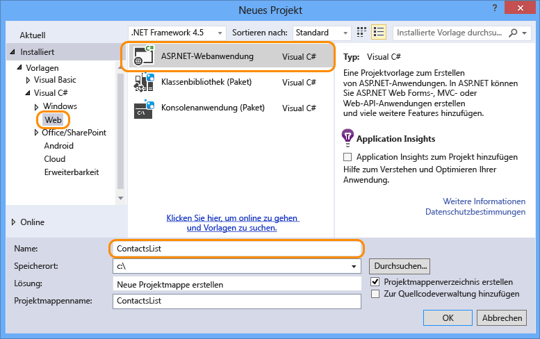
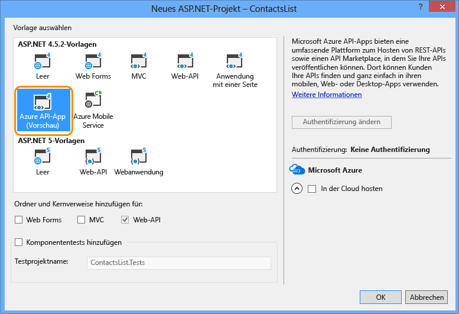

1. Öffnen Sie Visual Studio 2015 oder Visual Studio 2013.

2. Wählen Sie **Datei > Neu > Projekt** aus.

3. Wählen Sie die Vorlage **ASP.NET-Webanwendung**.

4. Stellen Sie sicher, dass das Kontrollkästchen **Application Insights zu Projekt hinzufügen** deaktiviert ist.

4. Geben Sie einen Namen für das Projekt ein.

	

5. Klicken Sie auf **OK**.

6. Wählen Sie im Dialogfeld **Neues ASP.NET-Projekt** die Projektvorlage **Azure API-App** aus.

	

7. Klicken Sie auf **OK**, um das Projekt zu generieren.

Visual Studio erstellt ein Web-API-Projekt, das zur Bereitstellung als API-App konfiguriert ist.

<!---HONumber=August15_HO8-->