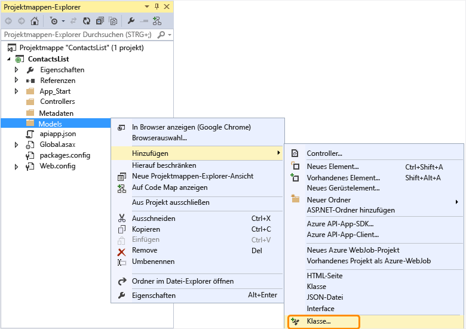
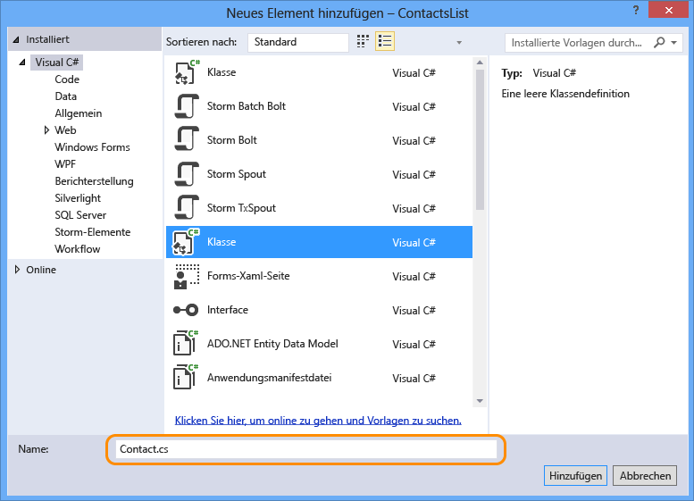
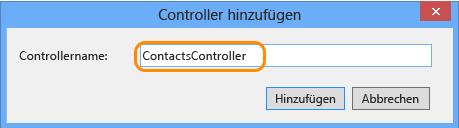

## Hinzufügen von Web-API-Code

In den folgenden Schritten fügen Sie Code für eine einfache HTTP-Get-Methode hinzu, die eine hartcodierte Liste mit Kontakten zurückgibt.

1. Klicken Sie im Projektmappen-Explorer mit der rechten Maustaste auf den Ordner **Modelle**, und wählen Sie **Hinzufügen > Klasse**. 

	

2. Geben Sie der neuen Datei den Namen *Contact.cs*.

	

3. Klicken Sie auf **Hinzufügen**.

4. Ersetzen Sie den gesamten Inhalt der Datei *Contact.cs* durch den folgenden Code:

		namespace ContactsList.Models
		{
			public class Contact
			{
				public int Id { get; set; }
				public string Name { get; set; }
				public string EmailAddress { get; set; }
			}
		}

5. Klicken Sie mit der rechten Maustaste auf den Ordner **Controller**, und wählen Sie dann im Kontextmenü **Hinzufügen > Controller**.

	

6. Wählen Sie im Dialogfeld **Gerüst hinzufügen** die Option **Web API 2-Controller – Leer** aus, und klicken Sie auf **Hinzufügen**.

	

7. Nennen Sie den Controller **ContactsController**, und klicken Sie auf **Hinzufügen**.

	

8. Ersetzen Sie den gesamten Inhalt der Datei "ContactsController.cs" durch den folgenden Code:

		using ContactsList.Models;
		using System;
		using System.Collections.Generic;
		using System.Linq;
		using System.Net;
		using System.Net.Http;
		using System.Threading.Tasks;
		using System.Web.Http;
		
		namespace ContactsList.Controllers
		{
		    public class ContactsController : ApiController
		    {
		        [HttpGet]
		        public IEnumerable<Contact> Get()
		        {
		            return new Contact[]{
						new Contact { Id = 1, EmailAddress = "barney@contoso.com", Name = "Barney Poland"},
						new Contact { Id = 2, EmailAddress = "lacy@contoso.com", Name = "Lacy Barrera"},
	                	new Contact { Id = 3, EmailAddress = "lora@microsoft.com", Name = "Lora Riggs"}
		            };
		        }
		    }
		}

## Aktivieren der Swagger-Benutzeroberfläche

Für API-App-Projekte wird standardmäßig das automatische Generieren von [Swagger](http://swagger.io/ "Offizielle Swagger-Informationen")-Metadaten aktiviert, und wenn Sie den Menüeintrag **Add API App SDK** verwendet haben, um ein Web-API-Projekt zu konvertieren, wird per Voreinstellung auch eine API-Testseite aktiviert.

Die API-Testseite wird jedoch durch die Vorlage für neue Azure API-App-Projekte deaktiviert. Wenn Sie Ihr API-Projekt mithilfe der API-App-Projektvorlage erstellt haben, müssen Sie die folgenden Schritte ausführen, um die Testseite zu aktivieren.

**Hinweis:** Wenn Sie die API-App als *Öffentlich (anonym)* und mit aktivierter Swagger-Benutzeroberfläche bereitstellen, kann praktisch jeder die Swagger-Benutzeroberfläche zum Ermitteln und Aufrufen Ihrer APIs verwenden.

1. Öffnen Sie die Datei *App\_Start/SwaggerConfig.cs*, und suchen Sie nach **EnableSwaggerUI**:

	

2. Entfernen Sie die Kommentare in den folgenden Codezeilen:

	        })
	    .EnableSwaggerUi(c =>
	        {

3. Nach Ausführung dieser Schritte sollte die Datei so aussehen:

	

## Testen der Web-API

Führen Sie die folgenden Schritte aus, um die API-Testseite anzuzeigen.

1. Führen Sie die App lokal aus (STRG+F5).

	Der Browser wird geöffnet und zeigt einen HTTP 403-Fehler an, da die Basis-URL keine gültige URL einer Webseite oder API-Methode für dieses Projekt ist.
 
3.  Navigieren Sie zur Swagger-Webseite, indem Sie `/swagger` an das Ende der Basis-URL anfügen.

	

2. Klicken Sie auf **Contacts > Abrufen > Jetzt testen**. Sie sehen, dass die API funktioniert und das erwartete Ergebnis zurückgibt.

	

3. Klicken Sie in Visual Studio auf **Debuggen > Debuggen beenden**.

<!---HONumber=Oct15_HO3-->