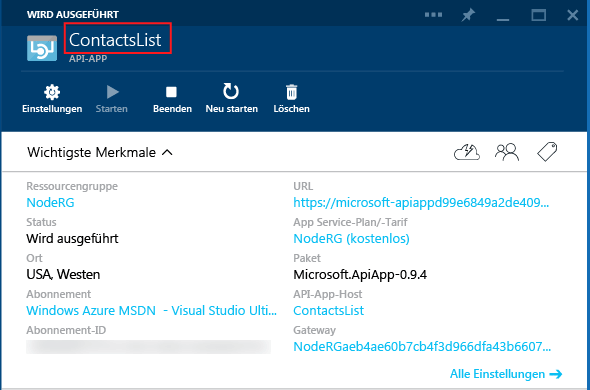

## API-App-Metadaten

In diesem Abschnitt werden zusätzliche Informationen zu API-App-Metadaten bereitgestellt, die Sie anpassen können.

Die meisten Eigenschaften in der Datei *apiapp.json* und die Dateien im Ordner *Metadata* wirken sich darauf aus, wie ein API-App-Paket im Azure Marketplace präsentiert wird. In den folgenden Abschnitten wird erläutert, welche Eigenschaften und Dateien sich auf API-Apps auswirken, wenn Sie Ihren Code in einer API-App für Ihr Azure-Abonnement bereitstellen.

### API-App-ID 

Die `id`-Eigenschaft legt den Namen der API-App fest. Zum Beispiel:

		"id": "ContactsList",

### Namespace

Legen Sie die `namespace`-Eigenschaft auf die Domäne Ihres Azure Active Directory-Mandanten fest. Wechseln Sie zum Auffinden Ihrer Domäne zum [klassischen Azure-Portal](https://manage.windowsazure.com/), wechseln Sie zu **Active Directory**, und wählen Sie die Registerkarte **Domänen**. Beispiel:

		"namespace": "contoso.onmicrosoft.com",

### Dynamische Swagger-API-Definition

Wenn Sie einen URL-Endpunkt für eine dynamische [Swagger](http://swagger.io/)-API-Definition bereitstellen möchten, speichern Sie die relative URL einer von der API-App verfügbar gemachten API in der Eigenschaft `endpoints.apiDefinition`. Die API-App gibt als Antwort auf eine GET-Anforderung eine Swagger 2.0-API-Definition zurück. Zum Beispiel:

		"endpoints": {
		    "apiDefinition": "/swagger/docs/v1"
		}

### Statische Swagger-API-Definition

Wenn Sie eine statische [Swagger](http://swagger.io/) 2.0-API-Definition bereitstellen möchten, speichern Sie die Definitionsdatei im Ordner *Metadata*, und geben Sie der Datei den Namen *apiDefinition.swagger.json*.

Lassen Sie `endpoints.apiDefinition` in der Datei *apiapp.json* weg, oder setzen Sie den zugehörigen Wert auf "null". Wenn Sie sowohl eine `endpoints.apiDefinition`-URL als auch eine Datei *apiDefinition.swagger.json* einschließen, hat die URL Vorrang, und die Datei wird ignoriert.
 
### Weitere API-App-Metadaten

Weitere Informationen zur Datei *apiapp.json* und dem Ordner *Metadata* finden Sie unter [Erstellen eines API-App-Pakets](app-service-api-create-package.md).

<!--HONumber=54-->