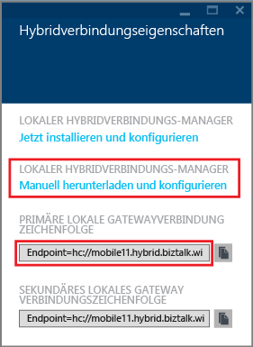
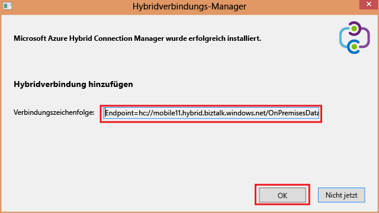
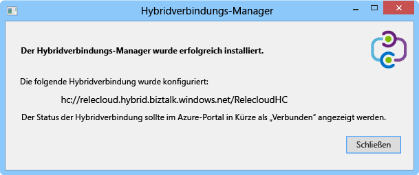
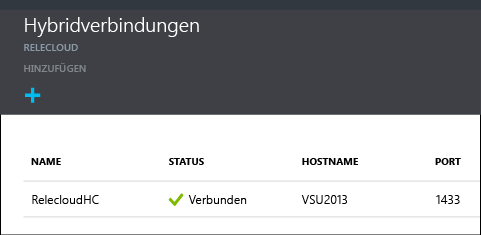

1. Klicken Sie auf dem Blatt **Hybridverbindungen** auf die Hybridverbindung, die Sie gerade erstellt haben, und klicken Sie dann auf **Listenereinrichtung**.
	
	
	
4. Das Blatt **Hybridverbindungseigenschaften** wird geöffnet. Wählen Sie unter **Lokaler Hybrid Connection Manager** die Option **Manuell herunterladen und konfigurieren**, speichern Sie das heruntergeladene HybridConnectionManager.msi-Paket, und kopieren Sie die Gatewayverbindungszeichenfolge.
	
	
	
5. Geben Sie an der Administratoreingabeaufforderung den folgenden Befehl ein, um das Installationsprogramm zu starten:

		start HybridConnectionManager.msi
 
7. Klicken Sie nach Ausführung des Installationsprogramms auf **Nicht jetzt**, navigieren Sie zum Ordner "%ProgramFiles%\\Microsoft\\HybridConnectionManager", führen Sie die Datei "HCMConfigWizard.exe" aus, und klicken Sie im Dialogfeld **Benutzerkontensteuerung** auf **Ja**.
		
7. Fügen Sie die Hybridverbindungszeichenfolge ein, die Sie zuvor kopiert haben, und klicken Sie auf **OK**.
	
	
	
8. Sobald die Installation abgeschlossen ist, klicken Sie auf **Close**.
	
	
	
	Im Fensterbereich **Hybrid connections** zeigt die Spalte **Status** jetzt **Connected** an.
	
	

<!---HONumber=Oct15_HO3-->