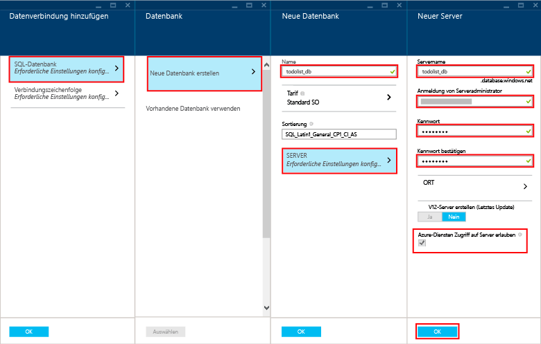

Führen Sie die folgenden Schritte aus, um eine neue mobile App zu erstellen.

1. Melden Sie sich beim [Azure-Portal] an. Klicken Sie unten links im Fenster auf **+NEU**. Führen Sie einen Bildlauf aus bis Sie das Element **Mobile App** angezeigt wird.

    

    Dies zeigt das Blatt **Neue Mobile App** an.

2. Geben Sie einen Namen für die mobile App ein. Er muss mindestens 8 Zeichen lang sein und die Kleinbuchstaben (a bis z) enthalten.

7. Wählen Sie eine Region aus. In diesem Lernprogramm verwenden wir **USA, Süden-Mitte**.

    > [AZURE.NOTE]Im Rahmen dieses Lernprogramms erstellen Sie eine neue SQL-Datenbankinstanz und einen neuen SQL-Datenbankserver. Sie können diese neue Datenbank wiederverwenden und wie jede andere SQL-Datenbankinstanz verwalten. Wenn Sie bereits über eine Datenbank in derselben Region wie der des neuen mobilen App-Back-Ends verfügen, können Sie stattdessen **Vorhandene Datenbank verwenden** wählen und dann diese Datenbank auswählen. Die Verwendung einer Datenbank in einer anderen Region wird nicht empfohlen, da zusätzliche Kosten für Bandbreite anfallen können und es zu höherer Latenz kommen kann.

3. Wählen Sie Ihr Abonnement aus.

4. Erstellen Sie eine neue Ressourcengruppe mit demselben Namen wie Ihre mobile App.

5. Wählen Sie in **Paketeinstellungen** die Option **USERDATABASE** aus. Sie können eine vorhandene Datenbank auswählen oder eine neue erstellen. Für das Erstellen einer neuen Datenbank geben Sie den Namen der neuen **Datenbank** ein, erstellen einen neuen **Server**, geben den Namen des Servers ein und wählen dann einen **Anmeldenamen** aus. Dies ist der Administratoranmeldename für den neuen SQL-Datenbankserver. Geben Sie das Kennwort ein, und bestätigen Sie es, und klicken Sie auf die Schaltfläche "OK", um den Vorgang abzuschließen. Wenn Sie eine vorhandene Datenbank auswählen, müssen Sie ein **Kennwort für den Serveradministrator** angeben.

    

6. Erstellen Sie einen neuen Webhostingplan mit demselben Namen wie Ihre mobile App.

    > [AZURE.NOTE]Geben Sie den Namen Ihres Webhostingplans ein. Verwenden Sie hierzu nicht das Kopieren und Einfügen. Es erfolgt eine Überprüfung des Namens in diesem Feld, die fehlschlägt, wenn Sie den Namen nicht eingeben. Er muss nicht mit dem Namen der Website übereinstimmen (es müssen jedoch dieselben Regeln befolgt werden).

8. Wählen Sie einen Tarif. In diesem Lernprogramm verwenden wir **Standard 1**.

    Die Einstellungsseite Ihrer neuen mobilen App wird in etwa wie folgt aussehen:

    

9. Klicken Sie auf die Schaltfläche **Erstellen** am unteren Rand des Blatts. Dort sollte im Benachrichtigungsfenster der Start der Bereitstellung angezeigt werden.

Sie haben nun ein neues mobiles App-Back-End erstellt, das Sie mit Ihren mobilen Apps verwenden können.

> [AZURE.NOTE]Nachdem die mobile App erstellt wurde, navigieren Sie im Portal zum gerade erstellten SQL-Server (wählen Sie unbedingt den Server aus, nicht die Azure SQL-Datenbank). Klicken Sie dort auf den Einstellungsabschnitt, erweitern Sie den Firewall-Bereich, und ändern Sie "Zugriff auf Azure-Dienste zulassen". Wenn Sie dies nicht tun, funktioniert die App nicht.

<!-- URLs. -->
[Azure-Portal]: https://portal.azure.com/

<!---HONumber=July15_HO3-->