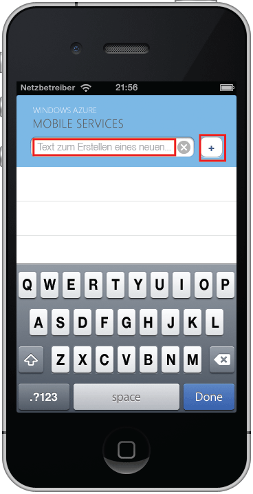

Der letzte Schritt dieses Lernprogramms besteht im Erstellen und Ausführen der neuen App.

1. Navigieren Sie zu dem Verzeichnis, in dem Sie die komprimierten Projektdateien gespeichert haben, erweitern Sie die Dateien auf Ihrem Computer, und öffnen Sie die Projektdatei mithilfe von Xcode.

2. Klicken Sie auf die Schaltfläche **Ausführen**, um das Projekt zu erstellen und die App im iPhone-Simulator zu starten.

3. Geben Sie in der App einen sinnvollen Text ein, wie z. B. _Lernprogramm abschließen_, und klicken Sie dann auf das Plus-Symbol (**+**).

   	

   	Dadurch wird eine POST-Anforderung an die neue, in Azure gehostete mobile App gesendet. Daten von der Anforderung werden in die TodoItem-Tabelle eingefügt. In der Tabelle gespeicherte Einträge werden von der mobilen App zurückgegeben, und die Daten werden in der Liste angezeigt.

 	

<!---HONumber=58-->