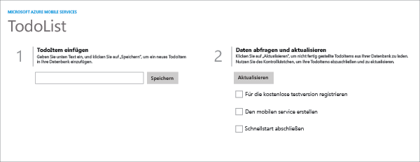

Im Folgenden sehen Sie Screenshots aus der fertigen App:

  Windows Store-App

  Windows Phone Store-App

Das Abschließen dieses Lernprogramms ist eine Voraussetzung für alle anderen Mobile Apps-Lernprogramme für Windows Store- und Windows Phone Store-Apps.

<!-----HONumber=Nov15_HO1-->