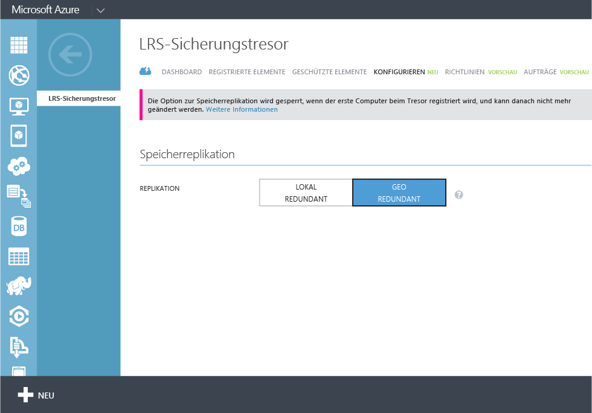
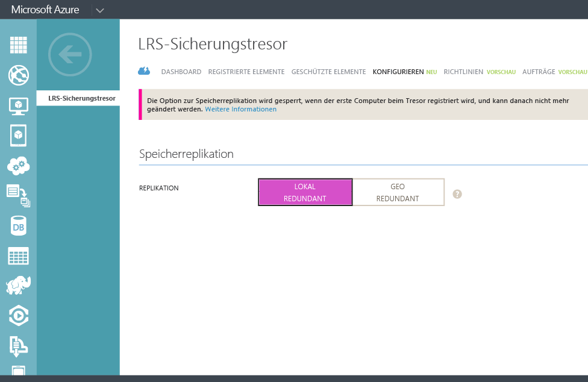

## Erstellen eines Sicherungstresors
Zum Sichern von Dateien und Daten von Windows Server oder Data Protection Manager (DPM) in Azure oder beim Sichern von IaaS-VMs in Azure müssen Sie einen Sicherungstresor in der geografischen Region erstellen, in der die Daten gespeichert werden sollen.

Mit den folgenden Schritten erstellen Sie den zum Speichern von Sicherungen verwendeten Tresor.

1. Melden Sie sich beim [Verwaltungsportal](https://manage.windowsazure.com/) an.
2. Klicken Sie auf **Neu** > **Data Services** > **Recovery Services** > **Sicherungstresor**, und wählen Sie **Schnellerfassung** aus.

    

3. Geben Sie für den Parameter **Name** einen benutzerfreundlichen Namen zur Identifizierung des Sicherungstresors ein. Dieser muss für jedes Abonnement eindeutig sein.

4. Wählen Sie für den Parameter **Region** die geografische Region für den Sicherungstresor aus. Die Auswahl bestimmt die geografische Region, an die Ihre Sicherungsdaten gesendet werden. Wenn Sie eine geografische Region in der Nähe Ihres eigenen Standorts auswählen, können Sie dadurch die Netzwerklatenz beim Sichern in Azure reduzieren.

5. Klicken Sie auf **Tresor erstellen**, um den Workflow abzuschließen. Es kann eine Weile dauern, bis der Sicherungstresor fertiggestellt wird. Sie können die Benachrichtigungen unten im Portal überwachen, um den Status zu überprüfen.

    

6. Nach dem erfolgreichen Erstellen des Sicherungstresors wird dies in einer entsprechenden Meldung angezeigt. Der Tresor wird zudem in den Ressourcen für Recovery Services als **Aktiv** aufgeführt.

    

### Azure Backup – Speicherredundanzoptionen

Der beste Zeitpunkt zum Identifizieren von Speicherredundanzoptionen ist unmittelbar nach der Erstellung des Tresors, bevor Computer beim Tresor registriert werden. Sobald ein Element beim Tresor registriert wurde, wird die Speicherredundanzoption gesperrt und kann nicht mehr geändert werden.

Die Speicherredundanz des Back-End-Speichers von Azure Backup wird durch Ihre geschäftlichen Anforderungen bestimmt. Wenn Sie Azure als primären Speicherendpunkt für die Sicherung verwenden (wenn Sie beispielsweise von einem Windows Server in Azure sichern), sollten Sie die Option "Georedundanter Speicher" in Betracht ziehen (Standardeinstellung). Diese finden Sie unter der Option **Konfigurieren** Ihres Sicherungstresors.

#### Georedundanter Speicher (GRS)
GRS bewahrt sechs Kopien Ihrer Daten auf. Mit GRS werden Ihre Daten dreimal innerhalb der primären Region und dreimal in einer sekundären Region Hunderte von Kilometern von der primären Region entfernt repliziert, wodurch höchste Beständigkeit erreicht wird. Im Fall eines Fehlers in der primären Region stellt Azure Backup durch das Speichern von Daten in GRS sicher, dass Ihre Daten dauerhaft in zwei verschiedenen Regionen aufbewahrt werden.

#### Lokal redundanter Speicher (LRS)
Lokal redundanter Speicher (LRS) verwaltet drei Kopien Ihrer Daten. LRS wird innerhalb eines einzelnen Standorts dreimal in einer einzelnen Region repliziert. LRS schützt Ihre Daten vor normalen Hardwareausfällen, jedoch nicht vor dem Ausfall einer ganzen Azure-Einrichtung.

Bei Verwendung von Azure als tertiären Speicherendpunkt (Sie verwenden beispielsweise SCDPM, um eine lokale Sicherungskopie vor Ort zu haben, und Azure für Ihre langfristigen Aufbewahrungsanforderungen), sollten Sie unter der Option **Konfigurieren** Ihres Sicherungstresors die Option "Lokal redundanter Speicher" auswählen. Dadurch werden die Kosten zum Speichern von Daten in Azure gesenkt, und es wird eine geringere Dauerhaftigkeit für Ihre Daten bereitgestellt, die möglicherweise für tertiäre Kopien ausreicht.

<!---HONumber=July15_HO3-->