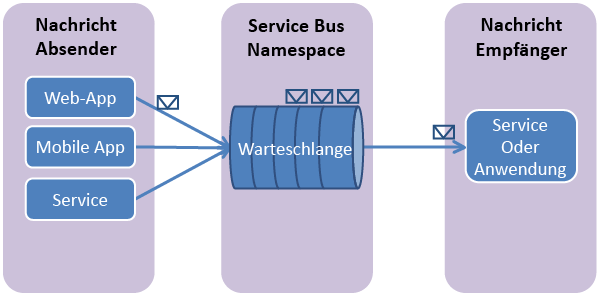

## Was sind Service Bus-Warteschlangen?

Service Bus-Warteschlangen unterstützen ein Kommunikationsmodell namens **Brokermessaging**. Bei der Verwendung von Warteschlangen kommunizieren die Komponenten einer verteilten Anwendung nicht direkt miteinander, sondern tauschen Nachrichten über eine Warteschlange aus, die als Zwischenstufe (Broker) fungiert. Ein Nachrichtenproducer (Absender) übergibt eine Nachricht an die Warteschlange und setzt seine Funktion fort. Ein Nachrichtenconsumer (Empfänger) ruft die Nachricht asynchron aus der Warteschlange ab und verarbeitet sie. Der Producer muss nicht auf eine Antwort vom Consumer warten, um seine Funktion fortzusetzen und weitere Nachrichten zu schicken. Warteschlangen liefern die Nachrichten im **First In, First Out (FIFO)**-Verfahren an einen oder mehrere Consumer. Die Nachrichten werden also normalerweise in der gleichen Reihenfolge von den Consumern empfangen und verarbeitet, wie sie in die Warteschlange übergeben wurden, und jede Nachricht wird nur von einem Consumer verarbeitet.

Service Bus-Warteschlangen sind eine Allzwecktechnologie für viele unterschiedliche Szenarien:

-   Kommunikation zwischen Web- und Workerrollen in Azure-Anwendungen mit mehreren Ebenen
-   Kommunikation zwischen lokalen Apps und von Azure gehosteten Apps in einer Hybridlösung
-   Kommunikation zwischen Komponenten einer verteilten lokalen Anwendung, die in verschiedenen Organisationen oder Abteilungen einer Organisation laufen

Warteschlangen unterstützen Sie bei der einfacheren Skalierung Ihrer Anwendungen und führen zu einer robusteren Architektur.

## Erstellen eines Dienstnamespaces

Um mit der Verwendung von Service Bus-Warteschlangen in Azure beginnen zu können, müssen Sie zuerst einen Dienstnamespace erstellen. Ein Namespace ist ein Bereichscontainer für die Adressierung von Service Bus-Ressourcen innerhalb Ihrer Anwendung.

So erstellen Sie einen Dienstnamespace:

1.  Melden Sie sich beim [Azure-Portal][] an.

2.  Klicken Sie im linken Navigationsbereich des Portals auf **Service Bus**.

3.  Klicken Sie im unteren Bereich des Portals auf **Erstellen**.
	

4.  Geben Sie im Dialogfeld **Add a new namespace** einen Namen für den Namespace ein. Das System prüft sofort, ob dieser Name verfügbar ist.
	

5.  Wählen Sie nach der Bestätigung, dass der Name für den Namespace verfügbar ist, das Land oder die Region, wo dieser Namespace gehostet werden soll. (Stellen Sie sicher, dass dies dasselbe Land/dieselbe Region ist, in dem/der sie Ihre Rechnerressourcen einsetzen.)

	 >[AZURE.IMPORTANT]Wählen Sie **dieselbe Region**, in der Sie auch Ihre Anwendung einsetzen möchten. Dies sorgt für die beste Leistung.

6. 	Übernehmen Sie für die weiteren Felder im Dialogfeld die Standardwerte (**Messaging** und **Standardstufe**), und klicken Sie anschließend auf das Häkchen für "OK". Ihr Dienstnamespace wird nun erstellt und aktiviert. Ggf. müssen Sie einige Minuten warten, bis die Ressourcen für Ihr Konto durch das System bereitgestellt werden.

	

Der neue Namespace wird innerhalb kurzer Zeit aktiviert und anschließend im Azure-Portal angezeigt. Fahren Sie erst fort, wenn der Status als **Aktiv** angezeigt wird.

## Abrufen der Standard-Anmeldeinformationen für den Namespace

Wenn Sie Verwaltungsvorgänge ausführen möchten, z. B. die Erstellung einer Warteschlange im neuen Namespace, müssen Sie die Anmeldeinformationen für den Namespace abrufen. Diese Anmeldeinformation erhalten Sie im Azure-Portal.

###So rufen Sie die Anmeldeinformationen im Verwaltungsportal ab

1.  Klicken Sie im linken Navigationsbereich auf den Knoten **Service Bus**, um die Liste verfügbarer Namespaces anzuzeigen:
	

2.  Wählen Sie in der angezeigten Liste den Namespace, den Sie gerade erstellt haben:
	

3.  Klicken Sie auf **Verbindungsinformationen**.
	

4.  Im Bereich **Zugriff auf die Verbindungsinformationen** finden Sie die Verbindungszeichenfolge, die den SAS-Schlüssel und den Schlüsselnamen enthält.

	
    
5.  Notieren Sie den Schlüssel oder kopieren Sie ihn in die Zwischenablage.

  [Azure-Portal]: http://manage.windowsazure.com

<!----HONumber=Oct15_HO3-->