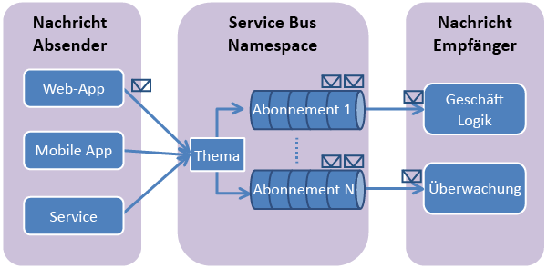

## Was sind Service Bus-Themen und -Abonnements?

Service Bus-Themen und -Abonnements unterstützen ein Modell der Messagingkommunikation über das *Veröffentlichen/Abonnieren*. Bei der Verwendung von Themen und Abonnements kommunizieren die Komponenten einer verteilten Anwendung nicht direkt miteinander, sondern tauschen Nachrichten über ein Thema aus, das als Zwischenstufe fungiert.

Anders als bei Service Bus-Warteschlangen, bei denen jede Nachricht von einem einzelnen Consumer verarbeitet wird, bieten Themen und Abonnements eine 1:n-Kommunikationsform mit einem Veröffentlichungs- und Abonnementsmuster. Es ist möglich, mehrere Abonnements zu einem Thema anzumelden. Wenn eine Nachricht an ein Thema gesendet wird, steht sie in jedem Abonnement zur Verfügung, wo sie unabhängig von den anderen Abonnements verarbeitet wird.

Ein Themenabonnement ähnelt einer virtuellen Warteschlange, die Kopien der Nachrichten enthält, die an das Thema gesendet wurden. Sie können optional auch Filterregeln für einzelne Abonnements eines Themas anmelden. Auf diese Weise können Sie filtern/einschränken, welche Nachrichten an ein Thema von welchen Themenabonnements empfangen werden.

Mit Service Bus-Themen und -Abonnements können Sie sehr viele Nachrichten an sehr viele Benutzer und Anwendungen verarbeiten.

## Erstellen eines Dienstnamespaces

Um mit der Verwendung von Service Bus-Themen und -Abonnements in Azure beginnen zu können, müssen Sie zuerst einen Dienstnamespace erstellen. Ein Namespace ist ein Bereichscontainer für die Adressierung von Service Bus-Ressourcen innerhalb Ihrer Anwendung.

So erstellen Sie einen Dienstnamespace:

1.  Melden Sie sich beim [Azure-Portal][] an.

2.  Klicken Sie im linken Navigationsbereich des Portals auf **Service Bus**.

3.  Klicken Sie im unteren Bereich des Portals auf **Erstellen**. ![][0]

4.  Geben Sie im Dialogfeld **Add a new namespace** einen Namen für den Namespace ein. Das System prüft sofort, ob dieser Name verfügbar ist.![][2]

5.  Wählen Sie nach der Bestätigung, dass der Name für den Namespace verfügbar ist, das Land oder die Region, wo dieser Namespace gehostet werden soll. (Stellen Sie sicher, dass dies dasselbe Land/dieselbe Region ist, in dem/der sie Ihre Rechnerressourcen einsetzen.)

	> [AZURE.IMPORTANT]Wählen Sie **dieselbe Region**, in der Sie auch Ihre Anwendung einsetzen möchten. Dies sorgt für die beste Leistung.

6. 	Übernehmen Sie für die weiteren Felder im Dialogfeld die Standardwerte (**Messaging** und **Standardstufe**), und klicken Sie anschließend auf das Häkchen. Ihr Dienstnamespace wird nun erstellt und aktiviert. Eventuell müssen Sie einige Minuten warten, bis die Ressourcen für Ihr Konto bereitgestellt werden.

	![][6]

## Abrufen der Standard-Anmeldeinformationen für den Namespace

Wenn Sie Verwaltungsvorgänge ausführen möchten, z. B. die Erstellung eines Themas oder Abonnements im neuen Namespace, müssen Sie die Anmeldeinformationen für den Namespace abrufen. Diese Anmeldeinformation erhalten Sie im Azure-Portal.

### Abrufen der Anmeldeinformationen für die Verwaltung aus dem Portal

1.  Klicken Sie im linken Navigationsbereich auf den Knoten **Service Bus**, um die Liste der verfügbaren Namespaces anzuzeigen: ![][0]

2.  Wählen Sie in der angezeigten Liste den Namespace, den Sie gerade erstellt haben: ![][3]

3.  Klicken Sie auf **Verbindungsinformationen**. ![][4]

4.  Im Bereich **Zugriff auf die Verbindungsinformationen** finden Sie die Verbindungszeichenfolge, die den SAS-Schlüssel und den Schlüsselnamen enthält. Notieren Sie sich diese Werte, da Sie diese Informationen später benötigen, um Vorgänge mit dem Namespace durchzuführen.

  [Azure-Portal]: http://manage.windowsazure.com
  [0]: ./media/howto-service-bus-topics/sb-queues-13.png
  [2]: ./media/howto-service-bus-topics/sb-queues-04.png
  [3]: ./media/howto-service-bus-topics/sb-queues-09.png
  [4]: ./media/howto-service-bus-topics/sb-queues-06.png
  
  [6]: ./media/howto-service-bus-topics/getting-started-multi-tier-27.png

<!---HONumber=Oct15_HO3-->