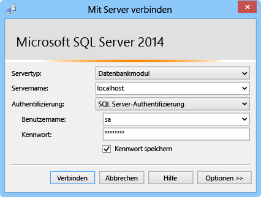

In diesem Abschnitt wird erläutert, wie Sie SQL Server Express installieren, TCP/IP aktivieren, einen statischen Port festlegen und eine Datenbank erstellen, die mit Hybridverbindungen verwendet werden kann.

###SQL Server Express installieren

Um eine lokale SQL Server- oder SQL Server Express-Datenbank mit einer Hybridverbindung verwenden zu können, muss TCP/IP an einem statischen Port aktiviert werden. Standardinstanzen von SQL Server verwenden den statischen Port 1433, benannte Instanzen dagegen nicht. Aus diesem Grund installieren wir die Standardinstanz. Wenn Sie bereits die Standardinstanz von SQL Server Express installiert haben, können Sie diesen Abschnitt überspringen.

1. Um SQL Server Express zu installieren, führen Sie die Datei **SQLEXPRWT\_x64\_ENU.exe** oder **SQLEXPR\_x86\_ENU.exe** aus, die Sie heruntergeladen haben. Der SQL Server-Installationscenter-Assistent wird geöffnet.
	
2. Wählen Sie **Neue eigenständige SQL Server-Installation oder Hinzufügen von Features zu einer vorhandenen Installation** aus, befolgen Sie die Anweisungen, und übernehmen Sie die Standardeinstellungen, bis Sie zur Seite **Instanzkonfiguration** gelangen.
	
3. Wählen Sie auf der Seite **Instanzkonfiguration** die Option **Standardinstanz** aus, und übernehmen Sie dann die Standardeinstellungen auf der Seite **Serverkonfiguration**.

	>[AZURE.NOTE]Wenn Sie bereits eine Standardinstanz von SQL Server installiert haben, können Sie mit dem nächsten Abschnitt fortfahren und diese Instanz mit Hybridverbindungen verwenden.
	
5. Wählen Sie auf der Seite **Datenbankmodulkonfiguration** unter **Authentifizierungsmodus** die Option **Gemischter Modus (SQL Server-Authentifizierung und Windows-Authentifizierung)** aus, und geben Sie ein sicheres Kennwort für das integrierte **sa**-Administratorkonto ein.
	
	In diesem Lernprogramm verwenden Sie die SQL Server-Authentifizierung. Merken Sie sich unbedingt das Kennwort, das Sie angeben, weil Sie es später benötigen werden.
	
6. Beenden Sie den Assistenten, um die Installation abzuschließen.

###Aktivieren von TCP/IP und Festlegen eines statischen Ports

In diesem Abschnitt wird mithilfe des SQL Server-Konfigurations-Managers, der zusammen mit SQL Server Express installiert wurde, TCP/IP aktiviert und eine statische IP-Adresse festgelegt.

1. Führen Sie die unter [Aktivieren des TCP/IP-Netzwerkprotokolls für SQL Server](http://technet.microsoft.com/library/hh231672%28v=sql.110%29.aspx) beschriebenen Schritte aus, um den TCP/IP-Zugriff auf die Instanz zu aktivieren.

2. (Optional:) Wenn Sie die Standardinstanz nicht verwenden können, müssen Sie die unter [Konfigurieren eines Servers zur Überwachung eines bestimmten TCP-Ports](https://msdn.microsoft.com/library/ms177440.aspx) beschriebenen Schritte ausführen, um einen statischen Port für die Instanz festzulegen. Wenn Sie diesen Schritt ausführen, stellen Sie die Verbindung unter Verwendung des neuen definierten Ports und nicht über Port 1433 her.

3. (Optional:) Fügen Sie bei Bedarf Ausnahmen in der Firewall für den Remotezugriff auf den SQL Server-Prozess (sqlservr.exe) hinzu.

###Erstellen einer neuen Datenbank in der lokalen SQL Server-Instanz

1. Stellen Sie in SQL Server Management Studio eine Verbindung mit der SQL Server-Instanz her, die Sie gerade installiert haben. (Wenn das Dialogfeld **Verbindung mit Server herstellen** nicht automatisch angezeigt wird, navigieren Sie im linken Bereich zu **Objekt-Explorer**, und klicken Sie auf **Verbinden** und anschließend auf **Datenbankmodul**.) 	

	
	
	Wählen Sie unter **Servertyp** die Option **Datenbankmodul**. Als **Servername** können Sie **localhost** oder den Namen des Computers verwenden, auf dem Sie SQL Server installiert haben. Wählen Sie **SQL Server-Authentifizierung** aus, und geben Sie dann das Kennwort für die zuvor erstellte sa-Anmeldung ein.
	
2. Um eine neue Datenbank mit SQL Server Management Studio zu erstellen, klicken Sie in Objekt-Explorer mit der rechten Maustaste auf **Datenbanken** und anschließend auf **Neue Datenbank**.
	
3. Geben Sie im Dialogfeld **Neue Datenbank** den Namen `OnPremisesDB` ein, und klicken Sie dann auf **OK**.
	
4. Wenn Sie in Objekt-Explorer den Knoten **Datenbanken** erweitern, können Sie sehen, dass die neue Datenbank erstellt wurde.

###Erstellen einer neuen SQL Server-Anmeldung und Festlegen von Berechtigungen

Schließlich erstellen Sie eine neue SQL Server-Anmeldung mit eingeschränkten Berechtigungen. Der Azure-Dienst stellt eine Verbindung mit dem lokalen SQL Server mit dieser Anmeldung statt mit der integrierten sa-Anmeldung her, die über uneingeschränkte Berechtigungen für den Server verfügt.

1. Klicken Sie im Objekt-Explorer von SQL Server Management Studio mit der rechten Maustaste auf die Datenbank **OnPremisesDB**, und klicken Sie dann auf **Neue Abfrage**.

2.  Fügen Sie die folgende TSQL-Abfrage im Abfragefenster ein.

		USE [master]
		GO
		
		/* Replace the PASSWORD in the following statement with a secure password. 
		   If you save this script, make sure that you secure the file to 
		   securely maintain the password. */ 
		CREATE LOGIN [HybridConnectionLogin] WITH PASSWORD=N'<**secure_password**>', 
			DEFAULT_DATABASE=[OnPremisesDB], DEFAULT_LANGUAGE=[us_english], 
			CHECK_EXPIRATION=OFF, CHECK_POLICY=ON
		GO
	
		USE [OnPremisesDB]
		GO
	
		CREATE USER [HybridConnectionLogin] FOR LOGIN [HybridConnectionLogin] 
		WITH DEFAULT_SCHEMA=[dbo]
		GO

		GRANT CONNECT TO [HybridConnectionLogin]
		GRANT CREATE TABLE TO [HybridConnectionLogin]
		GRANT CREATE SCHEMA TO [HybridConnectionLogin]
		GO  
   
3. Ersetzen Sie im obigen Skript die Zeichenfolge `<**secure_password**>` durch ein sicheres Kennwort für die neue *HybridConnectionsLogin*.

4. **Führen** Sie die Abfrage aus, um die neue Anmeldung zu erstellen und die erforderlichen Berechtigungen für die lokale Datenbank zu erteilen.

<!---HONumber=Oct15_HO3-->