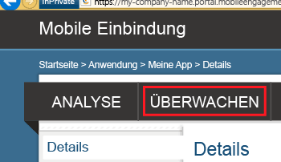
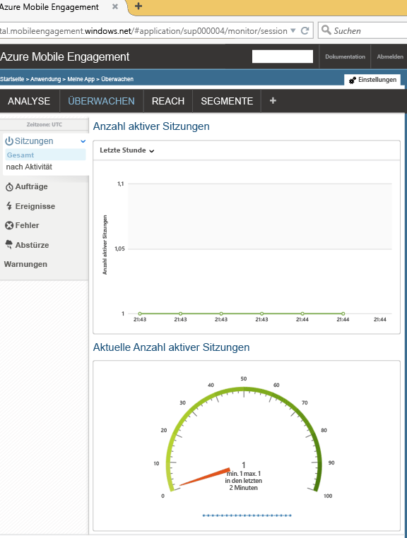

In diesem Abschnitt erfahren Sie, wie Sie sicherstellen, dass Ihre App eine Verbindung mit dem Mobile Engagement-Back-End mithilfe der Echtzeitüberwachungsfunktion von Mobile Engagement herstellt.

1. Navigieren Sie zum Mobile Engagement-Portal. Stellen Sie sicher, dass Sie sich in der App befinden, die für dieses Projekt verwendet wird, und klicken Sie dann unten auf die Schaltfläche **Einbinden**:

	 

2. Sie gelangen zum Mobile Engagement-Portal. Klicken Sie hier auf die Registerkarte **Überwachen**.
	 
	

3. Die Überwachung (Monitor) kann Ihnen ein beliebiges Gerät in Echtzeit anzeigen, das Ihre App startet.
	 
4. Starten Sie Ihre App im Emulator/Simulator oder auf einem angeschlossenen Gerät. Sie sollten eine Sitzung im Monitor sehen, wenn Ihre Integration richtig ist, was bedeutet, dass Ihre App nun mit dem Mobile Engagement-Back-End verbunden ist und Daten an das Back-End sendet.
	
	 

<!---HONumber=Sept15_HO4-->