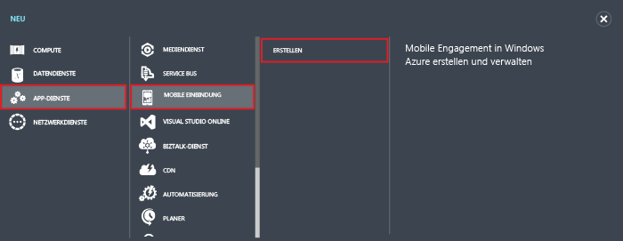
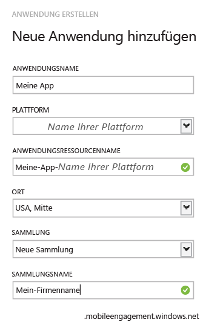

1. Melden Sie sich beim [klassischen Azure-Portal](https://manage.windowsazure.com) an, und klicken Sie im unteren Teil des Bildschirms auf **+NEW**.

2. Klicken Sie auf **App-Dienste**, dann auf **Mobile Engagement** und anschließend auf **Erstellen**.

   	

3. Geben Sie in das Popupfenster, das angezeigt wird, die folgenden Informationen ein:

   	

	- **Anwendungsname**: Der Name der Anwendung. 
	- **Plattform**: Die Zielplattform für die App. Sie müssen eine Mobile Engagement-App für jede Plattform erstellen, für die Ihre mobile Anwendung vorgesehen ist. 
	- **Anwendungsressourcenname**: Der Name, mit dem Sie über APIs und URLs auf diese Anwendung zugreifen können. 
	- **Speicherort**: Region/Rechenzentrum, in dem diese App und die App-Sammlung gehostet werden.
	- **Auflistung**: Wählen Sie eine zuvor erstellte Auflistung oder „Neue Auflistung“ aus.
	- **Auflistungsname**: Stellt die Anwendungsgruppe dar. Hierdurch wird außerdem sichergestellt, dass sich alle Ihre Apps in einer Gruppe befinden, wodurch aggregierte Berechnungen von Metriken möglich sind. Sie sollten hier ggf. Ihren Firmenname oder Ihre Abteilung verwenden.

4. Wählen Sie die Anwendung aus, die Sie soeben in der Registerkarte **Anwendungen** erstellt haben.

5. Klicken Sie auf **VERBINDUNGSINFORMATIONEN**, um die Verbindungseinstellungen für die SDK-Integration Ihrer mobilen App anzuzeigen.

6. Kopieren Sie die **VERBINDUNGSZEICHENFOLGE**, die Sie zum Identifizieren dieser App in Ihrem Anwendungscode und zum Herstellen der Verbindung mit Mobile Engagement in Ihrer App benötigen.

   	

<!---HONumber=AcomDC_0128_2016-->