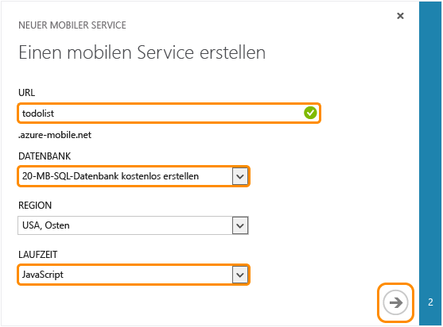
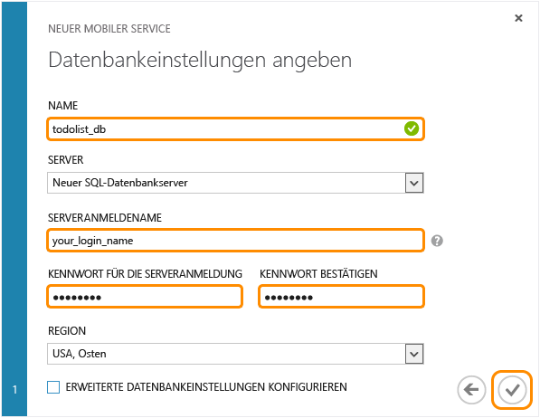

Führen Sie die folgenden Schritte aus, um einen neuen mobilen Dienst zu erstellen.

1.	Melden Sie sich beim [Verwaltungsportal] an. Klicken Sie am unteren Rand des Navigationsbereichs auf **+ NEU**. Erweitern Sie **Compute** und **Mobiler Service**, und klicken Sie dann auf **Erstellen**.
	

	Daraufhin wird das Dialogfeld **Einen mobilen Service erstellen** angezeigt.

2.	Wählen Sie auf der Seite **Einen mobilen Service erstellen** die Option **Eine freie 20 MB-SQL-Datenbank erstellen** und die Laufzeit **.NET** aus. Geben Sie dann einen Unterdomänennamen für den neuen mobilen Service im Textfeld **URL** ein. Klicken Sie auf den Pfeil nach rechts, um die nächste Seite aufzurufen.
	

Daraufhin wird die Seite **Datenbankeinstellungen angeben** angezeigt.

> [AZURE.NOTE] Im Rahmen dieses Lernprogramms erstellen Sie eine neue SQL-Datenbankinstanz und einen neuen SQL-Datenbankserver. Sie können diese neue Datenbank wiederverwenden und wie jede andere SQL-Datenbankinstanz verwalten. Wenn Sie bereits über eine Datenbank in derselben Region wie der des neuen mobilen Service verfügen, können Sie stattdessen **Vorhandene Datenbank verwenden** wählen und dann diese Datenbank auswählen. Die Verwendung einer Datenbank in einer anderen Region wird nicht empfohlen, da zusätzliche Kosten für Bandbreite anfallen können und es zu höherer Latenz kommen kann.

3.	Geben Sie unter **Name** den Namen der neuen Datenbank ein. Geben Sie dann den **Anmeldenamen** ein. Dies ist der Administratoranmeldename für den neuen SQL-Datenbankserver. Geben Sie das Kennwort ein, und bestätigen Sie es, und klicken Sie dann auf die Schaltfläche "Prüfen", um den Vorgang abzuschließen.
	

Sie haben nun einen neuen mobilen Service erstellt, den Sie mit Ihren mobilen Apps verwenden können.

<!-- URLs. -->
[Verwaltungsportal]: https://manage.windowsazure.com/
<!--HONumber=52--> 
