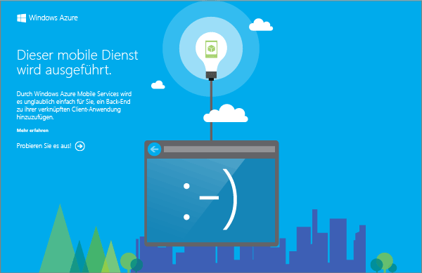

Mit dem mobilen Dienstprojekt, das Sie herunterladen, können Sie Ihren neuen mobilen Dienst direkt auf Ihrem lokalen Computer oder einem virtuellen Computer ausführen. Auf diese Weise ist das Debuggen Ihres Dienstcodes ziemlich einfach, bevor Sie diesen in Azure veröffentlichen.

In diesem Abschnitt testen Sie Ihre neue App für den lokal ausgeführten mobilen Dienst.

1. Navigieren Sie zu dem Verzeichnis, in dem Sie die komprimierten Projektdateien gespeichert haben, erweitern Sie die Dateien auf Ihrem Computer, und öffnen Sie die Projektmappen-Datei in Visual Studio.

2. Klicken Sie im Projektmappen-Explorer in Visual Studio mit der rechten Maustaste auf das Dienstprojekt, klicken Sie auf **Als Startprojekt festlegen**, und drücken Sie dann die **F5**-Taste, um das Projekt zu erstellen und den mobilen Dienst lokal zu starten.

	

	Nachdem der mobile Dienst erfolgreich erstellt wurde, wird eine Webseite angezeigt.

3. Zum Testen der Store-App klicken Sie mit der rechten Maustaste auf das Client-App-Projekt, klicken Sie auf **Als Startprojekt festlegen**, und drücken Sie dann die **F5**-Taste, um das Projekt neu zu erstellen und die App zu starten.

	Auf diese Weise wird die App gestartet, die eine Verbindung mit der lokalen mobilen Dienstinstanz herstellt.

4. Geben Sie in der App einen beschreibenden Text ein, zum Beispiel _Lernprogramm abschließen_, unter **Insert a TodoItem**. Klicken Sie dann auf **Save**.

	Daraufhin wird eine POST-Anforderung an den lokalen mobilen Dienst gesendet. Daten von der Anforderung werden in die TodoItem-Tabelle eingefügt. In der Tabelle gespeicherte Werte werden vom mobilen Dienst zurückgegeben, und die Daten werden in der zweiten Spalte der App angezeigt.

<!---HONumber=August15_HO7-->