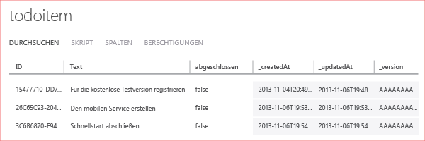

Der letzte Schritt dieses Lernprogramms besteht im Erstellen und Ausführen der neuen App.

1. Navigieren Sie zu dem Verzeichnis, in dem Sie die komprimierten Projektdateien gespeichert haben, erweitern Sie die Dateien auf Ihrem Computer, und öffnen Sie die Projektmappen-Datei in Visual Studio.

2. Drücken Sie die **F5**-Taste, um das Projekt neu zu erstellen und die App zu starten.

3. Geben Sie in der App einen beschreibenden Text ein, zum Beispiel *Lernprogramm abschließen*, unter **TodoItem einfügen**. Klicken Sie dann auf **Speichern**.

   	Dadurch wird eine POST-Anforderung an den neuen, in Azure gehosteten mobilen Dienst gesendet. Daten von der Anforderung werden in die TodoItem-Tabelle eingefügt. In der Tabelle gespeicherte Werte werden vom mobilen Dienst zurückgegeben, und die Daten werden in der zweiten Spalte der App angezeigt.

4. (Optional) Ändern Sie in einer universellen Windows-Lösung das Standard-Startprojekt in die andere App und führen Sie die App erneut aus.

	Beachten Sie, dass nach dem Starten der App im vorhergehenden Schritt gespeicherte Daten aus dem mobilen Dienst geladen werden.
 
4. Zurück im Verwaltungsportal klicken Sie auf die Registerkarte **Daten** und dann auf die Tabelle **TodoItem**.

   	Nun können Sie die von der App in die Tabelle eingefügten Daten durchsuchen.

   	

<!---HONumber=Oct15_HO3-->