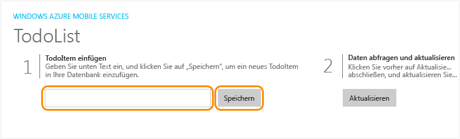

1. Drücken Sie die F5-Taste, um das Projekt neu zu erstellen und die Windows Store-App zu starten.

2. Geben Sie in der App einen sinnvollen Text, z.B. *Complete the tutorial*, in **Ein TodoItem einfügen** ein, und klicken sie anschließend auf **Speichern**.

	

	Dadurch wird eine POST-Anforderung an den neuen, in Azure gehosteten mobilen Dienst gesendet.

3. Stoppen Sie das Debuggen, legen Sie die Windows Phone Store-App als Standard-Startprojekt für die universelle Windows-Lösung fest, und drücken Sie erneut F5.

	
	
	Beachten Sie, dass nach dem Starten der App im vorhergehenden Schritt gespeicherte Daten aus dem mobilen Dienst geladen werden.

<!--HONumber=52--> 
