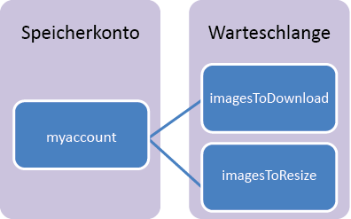

## Was ist der Warteschlangenspeicher?

Die Warteschlangenspeicherung in Azure ist ein Dienst zur Speicherung großer Anzahlen von Nachrichten, auf die von überall auf der Welt mit authentifizierten Anrufen über HTTP oder HTTPS zugegriffen werden kann. Eine einzelne Warteschlangennachricht kann bis zu 64 KB groß sein, und eine Warteschlange kann Millionen von Nachrichten enthalten. Deren Anzahl ist nur durch die Kapazität des Speicherkontos begrenzt. Ein Speicherkonto kann bis zu 500 TB Blob-, Warteschlangen- und Tabellendaten enthalten. Weitere Informationen zur Kapazität der Speicherkonten finden Sie unter [Azure Storage Scalability and Performance Targets](http://msdn.microsoft.com/library/azure/dn249410.aspx) (Skalierbarkeits- und Leistungsziele für Windows Azure-Speicher, in englischer Sprache).

Warteschlangenspeicherungen werden hauptsächlich für folgende Zwecke verwendet:

-   Erstellung eines Arbeits-Backlogs zur asynchronen Verarbeitung
-   Weiterleitung von Nachrichten von einer Azure-Webrolle an eine Azure-Workerrolle

## Konzepte des Warteschlangendiensts

Der Warteschlangendienst umfasst die folgenden Komponenten:

- **URL-Format:** Warteschlangen sind über das folgende URL-Format adressierbar: http://`<storage account>`.queue.core.windows.net/`<queue>` 
      
Mit der folgenden URL kann eine der Warteschlangen im Diagramm adressiert werden: http://myaccount.queue.core.windows.net/imagesToDownload

**Speicherkonto:** Alle Zugriffe auf den Azure-Speicher erfolgen über ein Speicherkonto. Weitere Informationen zur Kapazität der Speicherkonten finden Sie unter [Azure Storage Scalability and Performance Targets](../articles/storage/storage-scalability-targets.md) (Skalierbarkeits- und Leistungsziele für Windows Azure-Speicher, in englischer Sprache).

- **Warteschlange:** Eine Warteschlange enthält einen Satz von Nachrichten. Alle Nachrichten müssen sich in Warteschlangen befinden.

- **Nachricht:** Eine Nachricht in einem beliebigen Format und mit einer Größe von bis zu 64 KB.

<!---HONumber=August15_HO6-->