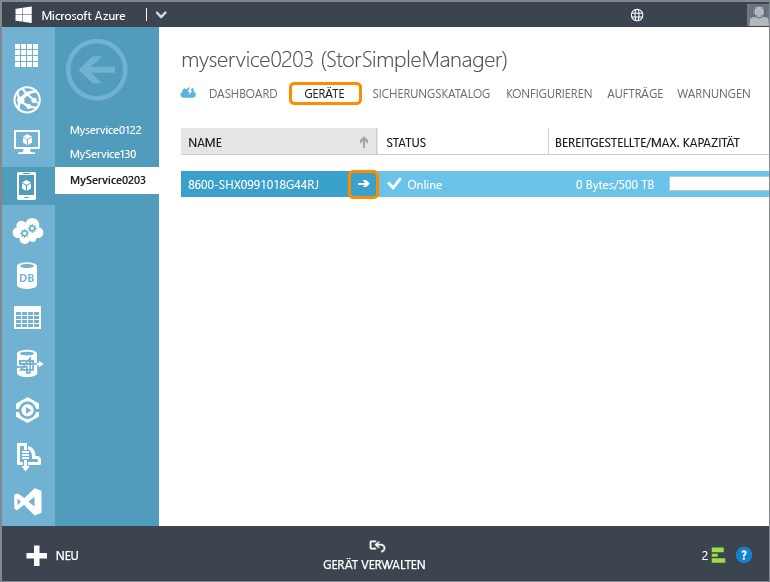
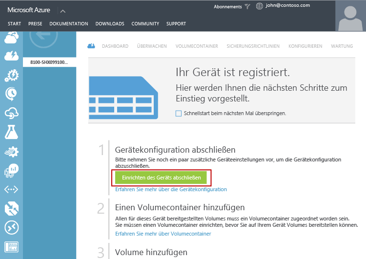
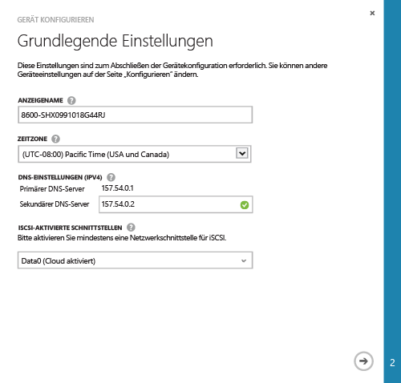
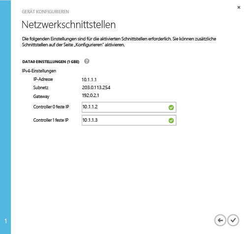

<!--author=alkohli last changed: 9/17/15-->

#### So führen Sie die mindestens erforderliche StorSimple-Gerätekonfiguration aus

1. Wählen Sie auf der Seite **Geräte** das Gerät aus, klicken Sie auf den Pfeil neben dem Gerätenamen, um zur Seite für dieses Gerät zu wechseln. 

	

2. Klicken Sie auf das Schnellstartsymbol , um auf die Schnellstartseite für das Gerät zuzugreifen. Klicken Sie auf **Geräteinstallation abschließen**, um den **Gerät konfigurieren**-Assistenten zu starten.

	

2. Gehen Sie auf der Seite **Grundeinstellungen** folgendermaßen vor:
  1. Geben Sie einen **Anzeigenamen** für Ihr Gerät an. Der Standardgerätename enthält Informationen zum Gerätemodell und zur Seriennummer. Sie können einen Anzeigenamen zuweisen, der bis zu 64 Zeichen lang ist, um Ihr Gerät zu verwalten.
  2. Legen Sie die **Zeitzone** basierend auf dem geografischen Standort fest, an dem das Gerät bereitgestellt wird. Ihr Gerät verwendet diese Zeitzone für alle geplanten Vorgänge.
  3. Geben Sie unter **DNS-Einstellungen** eine Adresse für die Angabe **Sekundärer DNS-Server** an. Wenn Sie IPv6 verwenden, wird das Feld basierend auf dem IPv6-Präfix ausgefüllt, das in der Windows PowerShell-Benutzeroberfläche angegeben wurde. Wenn der sekundäre DNS-Server nicht konfiguriert ist, können Sie Ihre Gerätekonfiguration nicht speichern.
  4. Aktivieren Sie unter "Aktivierte iSCI Schnittstellen" mindestens ein Netzwerk für iSCSI. Mindestens eine Netzwerkschnittstelle muss cloudfähig sein, und eine Schnittstelle muss iSCSI-aktiviert sein. DATA 0 ist automatisch cloudfähig.
 
      

3. Klicken Sie auf das Pfeilsymbol .

4. Geben Sie auf der Seite **Netzwerkschnittstellen** die festen IP-Adressen für Controller 0 und Controller 1 an. Wenn die DATA 0-Schnittstelle für IPv4 konfiguriert wurde, müssen die festen IP-Adressen im IPv4-Format angegeben werden. Wenn Sie ein Präfix für die IPv6-Konfiguration angegeben haben, werden die festen IP-Adressen in diesen Feldern automatisch mit Daten aufgefüllt.

	> [AZURE.NOTE]
 	> 
 	> - Die festen IP-Adressen des Controllers müssen freie IP-Adressen in dem Subnetz sein, auf das die IP-Adresse des Geräts zugreifen kann.
 	> - Die festen IP-Adressen für den Controller werden dazu verwendet, die Updates für das Gerät vorzunehmen. Daher ist es erforderlich, dass die festen IP-Adressen routingfähig und für Verbindungen mit dem Internet geeignet sind.

    

5. Klicken Sie auf das Häkchensymbol . Sie gelangen zurück auf die Seite **Schnellstart** des Geräts.

 >[AZURE.NOTE]Alle anderen Geräteeinstellungen können über die Seite **Konfigurieren** geändert werden.

 **Video verfügbar**

Sie können sich [hier](http://azure.microsoft.com/documentation/videos/minimum-storsimple-device-setup/) ein Video anschauen, in dem die mindestens erforderliche Gerätekonfiguration demonstriert wird.

<!---HONumber=Oct15_HO3-->