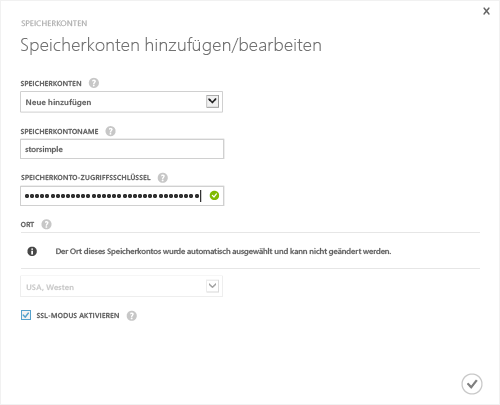

#### So fügen Sie ein neues Speicherkonto in der StorSimple-Version (GA) hinzu

1. Wählen Sie auf der StorSimple-Manager-Dienst-Startseite Ihren Dienst aus, und doppelklicken Sie dann darauf. Damit gelangen Sie auf die Seite **Schnellstart**. Wählen Sie die Seite **Konfigurieren** aus.

2. Klicken Sie auf **Speicherkonto hinzufügen/bearbeiten**.

3. Gehen Sie im Dialogfeld **Speicherkonten hinzufügen/bearbeiten** folgendermaßen vor:

  1. Klicken Sie auf **Neues hinzufügen**.
  2. Geben Sie einen Namen für Ihr Speicherkonto an.
  3. Geben Sie den primären **Zugriffsschlüssel** für Ihr Microsoft Azure-Speicherkonto an.
  4. Aktivieren Sie **SSL-Modus aktivieren**, um einen sicheren Kanal für die Netzwerkkommunikation zwischen Ihrem Gerät und der Cloud zu erstellen. Deaktivieren Sie das Kontrollkästchen **SSL-Modus aktivieren** nur, wenn der Betrieb in einer privaten Cloud stattfindet.
  5. Klicken Sie auf das Häkchensymbol . Sie werden benachrichtigt, nachdem das Speicherkonto erfolgreich erstellt wurde.

    

4. Das neu erstellte Speicherkonto wird auf der Seite **Konfigurieren** unter **Speicherkonten** angezeigt. Klicken Sie auf **Speichern**, um das neu erstellte Speicherkonto zu speichern. Klicken Sie auf **OK**, wenn Sie zur Bestätigung aufgefordert werden.

<!---HONumber=62-->