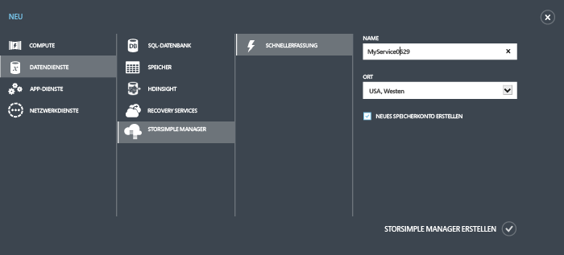
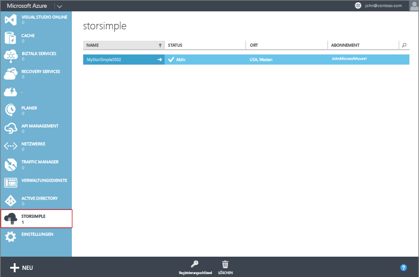

<properties 
   pageTitle="Erstellen eines neuen StorSimple-Manager-Diensts"
   description="Beschreibt das Erstellen einer neuen Instanz des StorSimple-Manager-Diensts."
   services="storsimple"
   documentationCenter="NA"
   authors="SharS"
   manager="adinah"
   editor="tysonn" />
<tags 
   ms.service="storsimple"
   ms.devlang="NA"
   ms.topic="article"
   ms.tgt_pltfrm="NA"
   ms.workload="TBD"
   ms.date="04/28/2015"
   ms.author="v-sharos" />

###So erstellen Sie einen neuen Dienst

1. Melden Sie sich mithilfe Ihrer Microsoft-Kontoanmeldeinformationen beim Microsoft Azure-Verwaltungsportal an: [Azure-Verwaltungsportal](https://manage.windowsazure.com/).

2. Klicken Sie im Verwaltungsportal auf **Neu** \> **Datendienste** \> **StorSimple-Manager** \> **Schnellerfassung**.

3. Gehen Sie im angezeigten Formular folgendermaßen vor:
  1. Geben Sie einen eindeutigen **Namen** für Ihren Dienst an. Dies ist ein Anzeigename, der zum Identifizieren des Diensts verwendet werden kann. Der Name kann zwischen 2 und 50 Zeichen lang sein und darf nur Buchstaben, Zahlen und Bindestriche enthalten. Der Name muss mit einem Buchstaben oder einer Zahl beginnen und enden.
  2. Geben Sie einen **Standort** für Ihren Dienst an. Der Standort bezieht sich auf die geografische Region, in der Ihr Gerät bereitgestellt werden soll.
  3. Wählen Sie ein **Abonnement** aus der Dropdownliste aus. Das Abonnement ist mit Ihrem Abrechnungskonto verknüpft. Dieses Feld wird nicht angezeigt, wenn Sie nur ein Abonnement besitzen.
  4. Aktivieren Sie **Neues Speicherkonto erstellen**, um automatisch ein Speicherkonto mit dem Dienst zu erstellen. Dieses Speicherkonto erhält einen speziellen Namen wie "storsimplebwv8c6dcnf".
  5. Klicken Sie auf **StorSimple-Manager erstellen**, um den Dienst zu erstellen.

       

     Sie werden auf die Startseite **Dienst** weitergeleitet. Die Diensterstellung dauert einige Minuten. Nachdem der Dienst erfolgreich erstellt wurde, werden Sie entsprechend benachrichtigt, und der Status des Diensts ändert sich in **Aktiv**.
 
       

<!--HONumber=52-->
