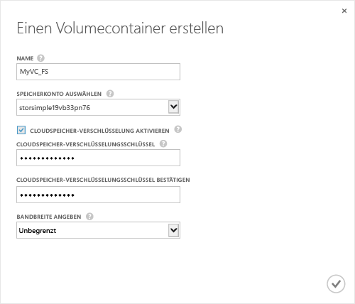

<properties 
   pageTitle="Erstellen eines Volumecontainers"
   description="Beschreibt, wie Sie einen Volumecontainer auf einem StorSimple-Gerät erstellen."
   services="storsimple"
   documentationCenter="NA"
   authors="SharS"
   manager="adinah"
   editor="tysonn" />
<tags 
   ms.service="storsimple"
   ms.devlang="NA"
   ms.topic="article"
   ms.tgt_pltfrm="NA"
   ms.workload="TBD"
   ms.date="09/08/2015"
   ms.author="v-sharos" />

#### So erstellen Sie einen Volumecontainer

1. Klicken Sie auf der Seite **Schnellstart** auf **Volumecontainer hinzufügen**. Das Dialogfeld **Volumecontainer erstellen** wird angezeigt.

    

2. Gehen Sie im Dialogfeld **Volumecontainer erstellen** folgendermaßen vor.
  1. Geben Sie einen **Namen** für den Volumecontainer an. Der Name muss 3 bis 32 Zeichen lang sein.
  2. Wählen Sie ein **Speicherkonto** aus, das diesem Volumecontainer zugeordnet werden soll. Sie können das Standardkonto auswählen, das beim Erstellen des Diensts generiert wird. Sie können auch die Option **Neu hinzufügen** verwenden, um ein Speicherkonto anzugeben, das nicht mit diesem Dienstabonnement verknüpft ist.
  3. Wählen Sie **Cloud-Speicherverschlüsselung aktivieren** aus, um die Verschlüsselung der Daten zu aktivieren, die vom Gerät in die Cloud gesendet werden.
  4. Stellen Sie einen **Verschlüsselungsschlüssel für Cloud-Speicher** bereit, der 8 bis 32 Zeichen lang ist, und bestätigen Sie diesen. Dieser Schlüssel wird vom Gerät für den Zugriff auf verschlüsselte Daten verwendet.
  5. Wählen Sie in der Dropdownliste **Bandbreite angeben** die Option **Unbegrenzt** aus, wenn Sie die gesamte verfügbare Bandbreite nutzen möchten. Sie können diese Option auch auf **Benutzerdefiniert** festlegen, um die Bandbreite zu steuern und einen Wert zwischen 1 und 1.000 MBit/s anzugeben. Wenn Ihnen Informationen zur Bandbreitenauslastung vorliegen, können Sie möglicherweise Bandbreite nach einem Zeitplan zuordnen, indem Sie **Bandbreitenvorlage auswählen** angeben. Eine schrittweise Anleitung finden Sie unter [Hinzufügen einer Bandbreitenvorlage](storsimple-manage-bandwidth-templates.md#add-a-bandwidth-template).
  6. Klicken Sie auf das Häkchensymbol , um diesen Volumecontainer zu speichern und den Assistenten zu beenden. 

  Der neu erstellte Volumecontainer wird auf der Seite **Volumecontainer** aufgeführt.

<!---HONumber=Sept15_HO2-->