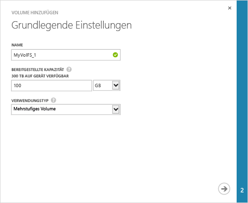
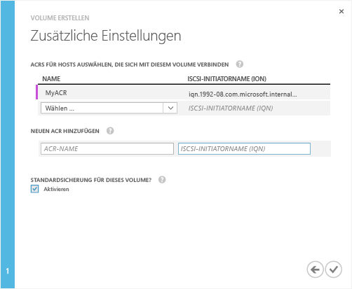

#### So erstellen Sie ein Volume

1. Klicken Sie auf dem Gerät auf der Seite **Schnellstart** auf **Volume hinzufügen**. Dadurch wird der Assistent "Volume hinzufügen" gestartet.

2. Geben Sie im Assistenten "Volume hinzufügen" unter **Grundeinstellungen**
   1. den **Namen** für das Volume ein.
   2. Geben Sie die **Bereitgestellte Kapazität** für das Volume an. **Die Volumekapazität muss zwischen 1 GB und 64 TB betragen.**
   3. Wählen Sie aus der Dropdownliste den **Verwendungstyp** für das Volume aus. Wählen Sie für weniger häufig abgerufene Archivierungsdaten ein **Archivvolume** aus. Wählen Sie für alle anderen Datentypen **Primäres Volume** aus.
   4. Klicken Sie auf den Pfeil , um zur nächsten Seite zu wechseln.

     

3. Fügen Sie im Dialogfeld **Zusätzliche Einstellungen** einen neuen Datensatz für die Zugriffssteuerung (Access Control Record, ACR) hinzu:
   1. Geben Sie einen **Namen** für den ACR ein.
   2. Geben Sie unter **iSCSI-Initiatorname** den qualifizierten iSCSI-Namen (IQN) des Windows-Hosts an. Wenn Sie den IQN nicht kennen, fahren Sie mit [Abrufen des IQNs eines Windows Server-Hosts](#get-the-iqn-of-a-windows-server-host) fort.
   3. Aktivieren Sie unter **Standardsicherung für dieses Volume?** das Kontrollkästchen **Aktivieren**. Die Standardsicherung erstellt eine Richtlinie, die jeden Tag um 22:30 Uhr ausgeführt wird (Uhrzeit des Geräts) und eine Cloud-Momentaufnahme dieses Volumes erstellt.

     >[AZURE.NOTE]Nachdem die Sicherung hier aktiviert wurde, kann sie nicht zurückgesetzt werden. Sie müssen das Volume bearbeiten, um diese Einstellung zu ändern.

     

4. Klicken Sie auf das Häkchensymbol . Ein Volume wird mit den angegebenen Einstellungen erstellt.

<!---HONumber=August15_HO6-->