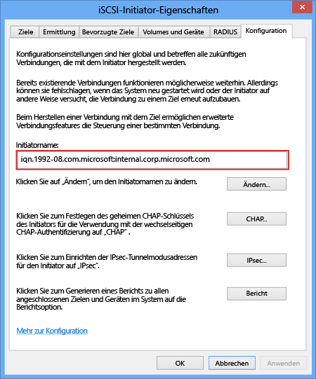

<!--author=SharS last changed: 9/17/15-->

#### So rufen Sie den IQN eines Windows Server-Hosts ab

1. Starten Sie den Microsoft iSCSI-Initiator auf dem Windows-Host. Klicken Sie auf **Start** > **Verwaltungstools** > **iSCSI-Initiator**.

2. Wählen Sie im Fenster **iSCSI Initiator Properties** auf der Registerkarte **Configuration** die Zeichenfolge im Feld **Initiator Name** aus, und kopieren Sie sie.
 
    

3. Speichern Sie diese Zeichenfolge.

<!---HONumber=AcomDC_0218_2016-->