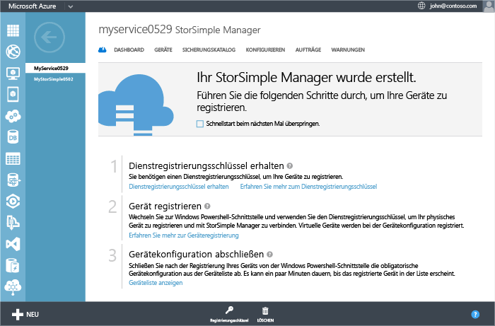
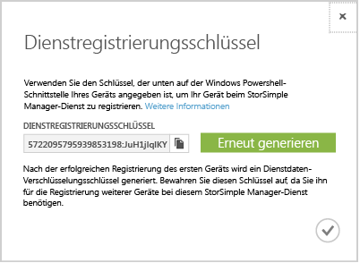

<properties 
   pageTitle="Abrufen des Dienstregistrierungsschlüssels"
   description="Beschreibt das Abrufen des Registrierungsschlüssels, der zum Registrieren aller StorSimple-Geräte verwendet wird."
   services="storsimple"
   documentationCenter="NA"
   authors="SharS"
   manager="adinah"
   editor="tysonn" />
<tags 
   ms.service="storsimple"
   ms.devlang="NA"
   ms.topic="article"
   ms.tgt_pltfrm="NA"
   ms.workload="TBD"
   ms.date="04/01/2015"
   ms.author="v-sharos" />

###So rufen Sie den StorSimple-Dienstregistrierungsschlüssel ab

1. Klicken Sie auf der Seite des Diensts **StorSimple-Manager** auf den Dienst, den Sie erstellt haben. Damit gelangen Sie auf die Seite **Schnellstart**. \(Sie können jederzeit über das Schnellstartsymbol  auf die Seite **Schnellstart** zugreifen.\)

     

2. Klicken Sie auf **Dienstregistrierungsschlüssel abrufen**. Sie können auch am unteren Rand der Seite auf **Registrierungsschlüssel** klicken. Sie müssen einige Minuten warten, während der Schlüssel abgerufen werden. Das Dialogfeld **Dienstregistrierungsschlüssel** wird angezeigt.

     

3. Suchen Sie nach dem Dienstregistrierungsschlüssel.

4. Klicken Sie auf das Kopiersymbol , um den Schlüssel zu kopieren und für die spätere Verwendung zu speichern.

5. Klicken Sie auf das Häkchensymbol , um das Dialogfeld zu schließen und zur Seite **Schnellstart** zurückzukehren.

> [AZURE.NOTE]Der Dienstregistrierungsschlüssel wird zur Registrierung aller Geräte verwendet, die mit dem StorSimple-Manager-Dienst registriert werden müssen.

 
<!--HONumber=52-->
