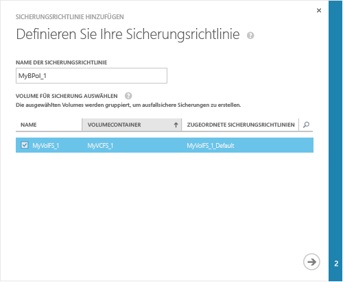
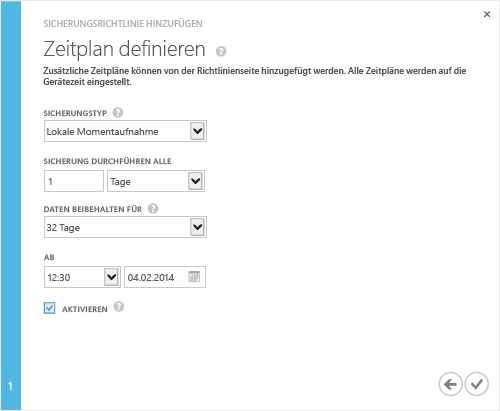

<!--author=alkohli last changed: 9/17/15-->

### So erstellen Sie eine Sicherung

1. Klicken Sie auf der Seite **Schnellstart** des Geräts auf **Sicherungsrichtlinie hinzufügen**. Damit wird der Assistent zum Hinzufügen einer Sicherungsrichtlinie gestartet. 

2. Gehen Sie auf der Seite **Sicherungsrichtlinie definieren** folgendermaßen vor:
  1. Geben Sie für Ihre Sicherungsrichtlinie einen Namen an, der zwischen 3 und 150 Zeichen lang ist.
  2. Wählen Sie die Volumes aus, die gesichert werden sollen. Wenn Sie mehrere Volumes auswählen, werden diese gruppiert, um eine absturzkonsistente Sicherung zu erstellen.
  3. Klicken Sie auf das Pfeilsymbol . 
  
    

3. Gehen Sie auf der Seite **Zeitplan definieren** folgendermaßen vor:
  1. Wählen Sie den Sicherungstyp aus der Dropdownliste aus. Wählen Sie für schnellere Wiederherstellungen **Lokale Momentaufnahme** aus. Wählen Sie für Datenresilienz **Cloud-Momentaufnahme** aus.
  2. Geben Sie die Sicherungshäufigkeit in Minuten, Stunden, Tagen oder Wochen an.
  3. Wählen Sie eine Aufbewahrungsdauer aus. Die Aufbewahrungsdauer hängt von der Sicherungshäufigkeit ab. Für eine tägliche Richtlinie kann die Aufbewahrungsdauer z. B. in Wochen angegeben werden, während die Aufbewahrungsdauer für eine monatliche Richtlinie Monate beträgt.
  4. Wählen Sie die Startzeit und das Datum für die Richtlinie aus.
  5. Aktivieren Sie das Kontrollkästchen **Aktivieren**, um die Sicherungsrichtlinie zu aktivieren. 
  6. Klicken Sie auf das Häkchensymbol , um die Richtlinie zu speichern.

    
 
     Sie verfügen nun über eine Sicherungsrichtlinie, die geplante Sicherungen für Ihre Volumedaten erstellt.

Sie haben die Gerätekonfiguration abgeschlossen.

 **Video verfügbar**

Sie können sich [hier](https://azure.microsoft.com/documentation/videos/take-a-storsimple-backup/) ein Video anschauen, in dem das Erstellen einer StorSimple-Sicherung demonstriert wird.

<!---HONumber=AcomDC_0128_2016-->